## Physician Licensure and Scope-of-Practice Regulation

### Overview

Licensure and scope-of-practice (SOP) regulation are the primary legal mechanisms through which governments restrict entry into the practice of medicine and define which clinical tasks specific provider categories may legally perform. Economically, these regulations function as **quality-signaling and entry-barrier instruments** designed to address the severe information asymmetry between patients and providers described in the foundational market-failure analysis of health care. Because patients typically cannot verify a provider's competence directly — either before treatment or, in many cases, even after observing the outcome — licensure substitutes a credentialing process for the price-and-reputation mechanisms that discipline quality in ordinary competitive markets.

This topic sits at the intersection of health economics, labor economics, and regulatory theory: licensure simultaneously solves an information problem and creates market power for incumbent providers, and much of the applied literature is devoted to weighing these two effects against each other.

### Key Points: Economic Rationale for Licensure

**1. Information Asymmetry as the Core Justification**

The standard efficiency argument for licensure rests on the observation that:

- Patients cannot easily assess clinical competence prior to treatment (a credence good problem — quality is not verifiable even after consumption in many cases)
- Poor-quality care can produce severe, irreversible harm (unlike most consumer goods, where a bad purchase is merely a sunk cost)
- Search and reputation mechanisms that work in ordinary markets (repeated purchase, brand reputation, word of mouth) are weaker in health care because illness episodes are often infrequent, urgent, and heterogeneous across patients

Licensure substitutes government-verified minimum competence for the buyer's own due diligence, in principle raising the average quality floor across the market.

**2. Credence Goods and the "Lemons" Problem**

Medical care is frequently modeled as a **credence good** — a good whose quality cannot be ascertained by the consumer even after consumption, in contrast to search goods (quality known before purchase) and experience goods (quality known after purchase). Akerlof's classic "market for lemons" logic suggests that, absent a credible quality signal, low-quality providers could drive high-quality providers out of the market (adverse selection on the supply side), since patients cannot distinguish between them and are unwilling to pay a premium for unverifiable quality. Licensure functions as the credible signal that prevents this unraveling.

**3. Licensure as a Two-Part Regulatory Structure**

Most jurisdictions combine two distinct regulatory layers:

- **Licensure**: A baseline legal authorization to practice medicine at all, typically requiring completion of accredited medical education, passage of standardized examinations, and supervised residency training
- **Scope-of-practice (SOP) regulation**: A finer-grained specification of which specific clinical tasks a licensed (or licensed-adjacent) provider category — physicians, nurse practitioners (NPs), physician assistants (PAs), pharmacists — may legally perform, often including requirements for physician supervision or collaborative practice agreements

These two layers interact: SOP laws determine the substitutability between physicians and non-physician clinicians (NPCs), which is the central variable in most applied economic analysis of this topic.

### The Economics of Entry Restriction

**4. Licensure as a Barrier to Entry (Regulatory Capture View)**

An alternative, less favorable interpretation — associated with the Chicago-school regulatory economics tradition (Milton Friedman was an early and prominent critic) — treats licensure primarily as a **supply-restriction cartel** enforced through the state, transferring surplus from patients to incumbent providers via:

- Restricting the number of accredited training slots (e.g., residency positions)
- Requiring credentials disproportionate to the actual risk of the task
- Licensing boards often controlled by incumbent practitioners, creating a conflict of interest between public protection and incumbent income protection

[Inference] The relative empirical weight of the "quality assurance" rationale versus the "rent-seeking barrier" rationale for any specific licensure requirement is contested and depends heavily on the clinical task, jurisdiction, and time period studied; neither pure view is fully supported or fully rejected in the literature.

**5. Effects on Physician Supply and Prices**

Standard labor market theory predicts that binding entry restrictions shift the physician labor supply curve inward relative to an unrestricted market, which — holding demand constant — raises equilibrium physician wages/fees and can reduce the total quantity of care supplied.

$$W^{*}_{restricted} > W^{*}_{competitive}, \quad Q^{*}_{restricted} < Q^{*}_{competitive}$$

This is the standard partial-equilibrium prediction; in practice, physician labor markets also feature substantial demand-side third-party payment and insurance effects (see the broader "why health care markets differ" discussion), which complicate simple supply-restriction predictions about final consumer prices.

**6. International Medical Graduates and Cross-Border Licensure Recognition**

Licensure is jurisdiction-specific and generally non-portable across countries (and, in federal systems such as the U.S., often non-portable across states without additional certification steps). This creates:

- Barriers to international medical graduate (IMG) integration, even when training quality is comparable
- Rents accruing to domestically licensed incumbents in markets with physician shortages
- A policy tension between patient safety verification and addressing workforce shortages

### Scope-of-Practice Regulation and Non-Physician Clinicians

**7. The NP/PA Substitution Question**

The most active area of applied research in this space concerns whether nurse practitioners and physician assistants can serve as economic substitutes for physicians in primary care and certain specialty tasks. SOP laws vary substantially by jurisdiction along a spectrum:

- **Full practice authority**: NPs may evaluate, diagnose, treat, and prescribe independently, without mandated physician oversight
- **Reduced practice**: State law requires a collaborative agreement with a physician for at least some aspect of practice
- **Restricted practice**: State law requires direct physician supervision for NPs to provide care

[Inference] Where a given jurisdiction sits on this spectrum, and the exact clinical task boundaries specified, changes over time through ongoing legislative and regulatory action; readers should verify current status for any specific jurisdiction rather than treat a snapshot as permanent.

**8. Empirical Evidence Themes on SOP Liberalization**

The health economics literature on expanding NP/PA scope generally examines three outcome dimensions:

- **Access**: Liberalized SOP laws are associated in many studies with increased NP practice in underserved and rural areas, since NPs are more likely than physicians to locate in areas with fewer physician-supervision requirements
- **Cost**: Substituting NPs/PAs for physicians on tasks within their competence is frequently associated with lower visit costs, though the effect on total system spending is mixed depending on whether it increases overall utilization
- **Quality**: A substantial body of research on primary-care-equivalent tasks finds outcomes for NP-delivered care are often comparable to physician-delivered care for the specific tasks studied. [Unverified] This finding should not be generalized beyond the specific scope of tasks and patient populations studied in any given paper — quality equivalence claims are highly sensitive to case-mix and task complexity, and results vary across studies and specialties.

**9. Physician Opposition and Political Economy**

SOP liberalization is frequently opposed by physician professional associations, which can be modeled economically as an incumbent-protection response to increased competitive substitution rather than solely a patient-safety argument — though physician organizations typically frame opposition in patient-safety terms. This is a canonical example of the **regulatory capture** debate applied to a specific, ongoing legislative fight in most U.S. states and many other countries.

### Illustration: Licensure and Scope-of-Practice Decision Structure

```mermaid
flowchart TD
    A[Information Asymmetry: Patient Cannot Verify Provider Quality] --> B[Licensure Requirement]
    B --> C[Baseline Practice Authorization]
    C --> D[Scope-of-Practice Rules by Provider Type]

    D --> E[Physician: Full Scope]
    D --> F[Nurse Practitioner: Scope Varies by State]
    D --> G[Physician Assistant: Scope Varies by State]

    F --> F1[Full Practice Authority]
    F --> F2[Reduced Practice - Collaborative Agreement]
    F --> F3[Restricted Practice - Physician Supervision]

    B -->|Positive Effect| H[Quality Floor / Reduced Adverse Selection]
    B -->|Negative Effect| I[Entry Barrier / Reduced Supply / Higher Prices]

    H --> J[Net Welfare Effect: Theoretically Ambiguous]
    I --> J
```

### Practical Example

Consider a rural county with a physician shortage and a state law requiring NPs to maintain a collaborative practice agreement with a supervising physician:

1. **Constraint created**: If no physician in the county is willing to sign a collaborative agreement (due to liability concerns or the cost of oversight), NPs cannot practice there even if fully clinically competent for common primary care tasks, effectively creating a supply bottleneck downstream of the NP's own credentials.
2. **Policy lever**: A legislative move to "full practice authority" removes this bottleneck, allowing NP supply to respond directly to local demand.
3. **Predicted economic effect**: Standard theory predicts increased care access and modestly lower per-visit prices in the affected area, though total health spending could rise if increased access also increases total utilization (an ambiguous net effect depending on baseline unmet need versus induced demand).
4. **Competing prediction**: Opponents argue the same policy risks lower average quality for complex or atypical presentations that require physician-level differential diagnosis skill — a claim that is difficult to test cleanly given that patient case-mix is not randomly assigned across provider types in observational data.

This example illustrates why SOP economics cannot be settled by theory alone and depends on jurisdiction-specific empirical evaluation.

### Related Topics

- Credence goods and the Akerlof "market for lemons" framework applied to medical quality
- Regulatory capture theory and professional licensing boards
- Physician workforce supply models and residency slot bottlenecks (GME funding)
- Nurse practitioner and physician assistant labor market substitution studies
- International medical graduate licensure portability
- Telehealth and cross-state licensure compacts
- Certificate-of-need laws and hospital market entry restriction
- Malpractice liability regimes and their interaction with scope-of-practice rules
- Physician-induced demand and payment-model interactions with licensure incentives