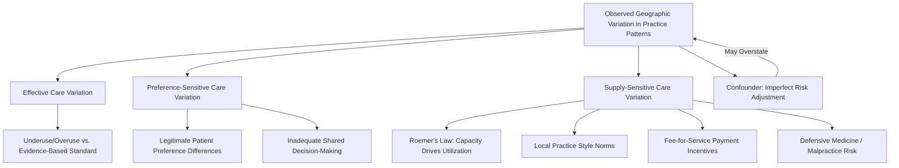

## Geographic Variation in Practice Patterns

### Overview

Geographic variation in practice patterns refers to the well-documented phenomenon that medical treatment intensity, procedure rates, and health care spending differ substantially across regions, hospitals, and even individual physicians treating clinically similar patient populations, in ways not explained by underlying illness burden, patient preferences, or outcomes. This is one of the most extensively studied empirical findings in health economics — most prominently associated with the **Dartmouth Atlas of Health Care** research program — and it directly challenges the standard economic assumption that treatment should converge toward a single clinically optimal response to a given diagnosis. If care markets functioned like standard competitive markets with homogeneous, well-understood "products," similar patients would receive similar treatment regardless of location; the persistence and magnitude of variation is itself evidence of the physician-agency and information-asymmetry features discussed elsewhere in this chapter.

### Key Points: Documenting the Variation

**1. The Dartmouth Atlas Findings**

Beginning in the 1970s–80s with work by John Wennberg and colleagues, and formalized through the Dartmouth Atlas project, researchers documented that Medicare spending per beneficiary, hospital admission rates, and rates of discretionary procedures (e.g., tonsillectomy, prostatectomy, back surgery, cardiac catheterization) vary several-fold across U.S. hospital referral regions (HRRs), even after adjusting for age, sex, race, and underlying illness prevalence.

**2. Two Categories of Variation**

The literature generally distinguishes:

- **Effective care variation**: Variation in the delivery of treatments with strong evidence of benefit (e.g., beta-blockers after myocardial infarction, recommended cancer screenings). Variation here is unambiguously undesirable — it represents underuse or overuse relative to a clinically validated standard.
- **Preference-sensitive care variation**: Variation in treatments where multiple reasonable clinical options exist and the "correct" choice depends on patient values (e.g., surgery vs. watchful waiting for early-stage prostate cancer, elective joint replacement timing). Variation here is not inherently a market failure — it may reflect legitimate differences in patient preference, *if* patients are adequately informed of the trade-offs.
- **Supply-sensitive care variation**: Variation in the frequency of care whose main driver is local health system capacity (e.g., ICU bed availability, specialist density) rather than differences in illness or patient preference. This category is most closely associated with the "flat of the curve" thesis below.

**3. The "Flat of the Curve" Hypothesis**

A central theoretical claim from the Dartmouth research program is that in high-intensity regions, additional health care spending and utilization above a certain threshold produces **no measurable improvement in outcomes** — the marginal product of additional care approaches zero (the "flat of the curve"). This implies allocative inefficiency: resources devoted to high-intensity, low-marginal-value care in some regions could, in principle, be redirected to higher-value uses elsewhere without harming patients.

$$\frac{\partial \text{Outcome}}{\partial \text{Spending}} \approx 0 \quad \text{beyond a regional intensity threshold}$$

[Inference] The strength and generalizability of the flat-of-the-curve finding has been debated in subsequent literature; some studies using different risk-adjustment methods or focusing on specific conditions find a smaller "flat" region or attribute more of the observed variation to unmeasured illness severity than the original Dartmouth work implied. This should be treated as an influential but contested empirical claim rather than settled consensus.

### Economic Explanations for the Variation

**4. Physician Agency and Practice Style Heterogeneity**

Given information asymmetry, physicians act as agents making treatment decisions on behalf of patients. In the absence of a single, universally agreed clinical protocol for many conditions, physicians develop **local practice norms** — informally transmitted through residency training, hospital culture, and peer influence — that persist even when they diverge from evidence-based guidelines. This is sometimes termed "practice style" variation and is treated as a quasi-fixed regional characteristic in empirical models.

**5. Supply-Induced Utilization (Roemer's Law)**

A related empirical regularity, often called **Roemer's Law**, holds that "a built bed is a filled bed" — hospital and specialist capacity in a region tends to generate utilization to match that capacity, rather than utilization being driven purely by underlying population need. This connects geographic variation to the supplier-induced demand mechanism: where physician or hospital capacity is higher relative to population, utilization (admissions, procedures, specialist visits) tends to be higher, even controlling for illness prevalence.

**6. Fee-for-Service Payment Incentives**

Volume-based, fee-for-service (FFS) reimbursement rewards higher utilization directly, and its effects may interact with local capacity and practice norms to amplify variation, whereas capitated or bundled payment models reduce the direct financial incentive for volume and are often empirically associated with narrower practice variation.

**7. Defensive Medicine and Malpractice Environment**

Regional variation in malpractice liability exposure and litigation risk is hypothesized to contribute to variation in diagnostic testing and procedure intensity, as physicians in higher-liability-risk environments may order more tests or procedures partly to mitigate legal risk rather than solely for clinical benefit. [Inference] The magnitude of defensive medicine's contribution to overall geographic variation, relative to practice-style and capacity explanations, remains an actively debated empirical question with a wide range of estimates across studies.

**8. Measurement and Risk-Adjustment Challenges**

A recurring methodological critique of geographic variation research is that apparent "unwarranted" variation may partly reflect **unmeasured case-mix differences** — administrative claims data used in most studies (e.g., Medicare claims) may not fully capture differences in illness severity, socioeconomic risk factors, or comorbidity burden across regions. Studies using richer clinical data sometimes find smaller residual variation than claims-based studies, meaning some (not necessarily all) of the originally documented variation may be attributable to imperfect risk adjustment rather than true differences in physician behavior.

### Illustration: Sources of Geographic Variation

### Practical Example

Consider two Hospital Referral Regions (HRRs), Region A and Region B, with statistically similar age-adjusted Medicare populations:

1. **Observed pattern**: Region A has a per-capita cardiac catheterization rate roughly double that of Region B, and per-beneficiary Medicare spending 40% higher.
2. **Illness-based explanation ruled out**: Age, sex, and coded chronic disease prevalence are statistically similar between regions, suggesting the difference is not primarily driven by underlying population illness burden as captured in claims data.
3. **Supply-side explanation**: Region A has a substantially higher per-capita density of cardiac catheterization labs and cardiologists relative to Region B — consistent with the Roemer's Law mechanism, where available capacity generates its own utilization.
4. **Outcome comparison**: If risk-adjusted mortality and readmission rates are statistically indistinguishable between the two regions despite the spending gap, this is consistent with (though not definitive proof of) the "flat of the curve" hypothesis for this condition and time period.
5. **Policy implication drawn cautiously**: Such a finding is often cited as evidence supporting value-based payment reform (bundled payments, accountable care organizations) intended to decouple physician/hospital revenue from raw procedure volume — though [Inference] the causal link between any single payment reform and reduced unwarranted variation is itself an active area of ongoing empirical evaluation rather than a demonstrated, uniform result across all reform implementations.

### Related Topics

- Dartmouth Atlas methodology and Hospital Referral Region (HRR) construction
- Roemer's Law and hospital bed supply-utilization dynamics
- Supplier-induced demand theory
- Fee-for-service vs. capitation vs. bundled payment incentive structures
- Shared decision-making and preference-sensitive care
- Defensive medicine and malpractice liability reform
- Risk adjustment methodology in claims-based health services research
- Accountable Care Organizations (ACOs) and value-based payment reform
- Small area variation analysis techniques