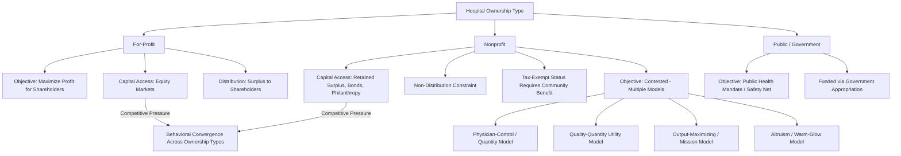

## Objectives of Nonprofit versus For-Profit Hospitals

### Overview

The ownership structure of hospitals — nonprofit, for-profit, and public/government — is a central topic in health economics because it directly challenges the standard theory of the firm, which assumes owners maximize profit. Nonprofit hospitals constitute a substantial share of acute care capacity in the United States and several other health systems, and their behavior cannot be modeled with a simple profit-maximization objective function. Understanding what nonprofit hospitals actually maximize — and whether their behavior differs meaningfully from for-profit competitors in practice — has generated a large theoretical and empirical literature, with implications for tax policy (nonprofit hospitals typically receive tax-exempt status in exchange for community benefit obligations), antitrust analysis, and quality/access regulation.

### Key Points: Theoretical Objective Functions by Ownership Type

**1. For-Profit Hospitals: Standard Profit Maximization**

For-profit (investor-owned) hospitals are generally modeled using the standard neoclassical firm objective:

$$\max_{Q} \; \pi = TR(Q) - TC(Q)$$

where the hospital chooses output (service volume/mix) $Q$ to maximize the gap between total revenue and total cost, subject to the usual constraints of demand, input prices, and regulation. Residual profit accrues to shareholders. This is the benchmark against which nonprofit behavior is typically compared.

**2. Nonprofit Hospitals: The Non-Distribution Constraint**

The defining legal feature of a nonprofit hospital is the **non-distribution constraint**: any operating surplus ("profit," though nonprofits typically avoid this term) cannot be distributed to owners, managers, or shareholders as personal income. Surplus must be reinvested in the organization's stated charitable mission. This constraint does *not* mean nonprofits are indifferent to financial surplus — most theoretical models assume nonprofit hospitals still care about surplus, because surplus funds future capacity expansion, equipment, and mission activities — but it removes the direct personal financial incentive to maximize profit that drives for-profit firm behavior.

**3. Multiple Competing Theoretical Models of Nonprofit Objectives**

Because "what nonprofits maximize" is not directly observable, health economists have proposed several competing utility-function models:

- **Physician-control / quantity-maximizing models** (Pauly and Redisch, 1973): Nonprofit hospitals are modeled as physician cooperatives that maximize net revenue per physician or physician income, treating the hospital as an instrument serving the interests of the medical staff who effectively control admitting and treatment decisions.
- **Quality/quantity maximizing models** (Newhouse, 1970): Nonprofit hospital administrators are modeled as maximizing a utility function over both the quantity of services provided *and* the quality (prestige, technological sophistication) of those services, subject to a break-even or minimum-surplus constraint — producing a tendency toward "medical arms race" behavior (acquiring the latest technology for prestige/quality reasons even without a clear cost-justified volume to support it).
- **Output-maximizing models**: Nonprofit hospitals maximize the quantity of charitable/community services provided subject to a zero-profit or minimum-surplus break-even constraint, reflecting a mission-driven rather than revenue-driven objective.
- **Altruism / "warm glow" models**: Nonprofit behavior partly reflects genuine altruistic preferences of hospital trustees, administrators, and staff for providing community benefit, uncompensated care, and services valued by the community even where they are not profitable.

[Inference] No single one of these models has been established as universally correct; the empirical literature generally treats them as complementary lenses, with different models fitting better in different institutional and competitive contexts rather than one model dominating in all settings.

**4. The Community Benefit / Charitable Mission Requirement**

In the U.S., nonprofit hospitals must qualify for federal tax-exempt status under Internal Revenue Code Section 501(c)(3), which requires demonstrating "community benefit" — historically including a mix of charity care, community health programs, medical education, and research, though the exact quantitative threshold has been a matter of extended regulatory and legal debate. [Inference] The specific compliance requirements and reporting standards (e.g., IRS Schedule H, and any state-level community benefit mandates) are subject to periodic regulatory change; readers should verify current requirements against current IRS guidance rather than treat any specific historical threshold as fixed.

### Empirical Behavioral Differences

**5. Provision of Unprofitable or Uncompensated Services**

Theory predicts, and much empirical work is consistent with, nonprofit hospitals providing more uncompensated/charity care and more unprofitable "safety net" service lines (e.g., psychiatric emergency services, burn units, neonatal intensive care in underserved areas) relative to observationally similar for-profit hospitals, consistent with a mission-driven or altruistic component to the nonprofit objective function. [Inference] The magnitude of this differential varies substantially across studies, regions, and time periods, and has narrowed or widened depending on market competitive pressure and regulatory environment, so specific percentage-point comparisons should not be treated as fixed across contexts.

**6. Convergence Under Competitive Pressure**

A recurring finding in the literature is that as market competition intensifies (e.g., more managed care penetration, more for-profit entry into a local market), nonprofit hospital behavior tends to converge toward for-profit-like behavior on cost control, service line selection (favoring profitable specialties), and pricing — suggesting that the nonprofit/for-profit behavioral gap is not fixed but is moderated by competitive intensity. This is sometimes summarized as evidence that "ownership matters less where competition is strong, and more where competition is weak."

**7. Executive Compensation and Governance**

The non-distribution constraint restricts the distribution of *residual surplus* to owners but does not prevent substantial executive compensation, which has been a source of ongoing public and regulatory scrutiny regarding whether nonprofit hospital governance sufficiently constrains managerial self-interest relative to the stated charitable mission — an application of standard principal-agent theory to the relationship between a nonprofit board (principal) and hospital executives (agent).

**8. Access to Capital**

For-profit hospitals can raise equity capital from investors (a source unavailable to nonprofits), while nonprofits rely on retained surplus, tax-exempt bond financing, philanthropy, and debt. This financing asymmetry has implications for capacity expansion speed and risk tolerance, with for-profits generally able to scale capital-intensive investments (e.g., new facilities, major technology acquisitions) more rapidly through equity markets.

### Illustration: Ownership Type and Objective Function Comparison

### Practical Example

Consider two otherwise similar 300-bed acute care hospitals in the same metropolitan market — Hospital X (for-profit, publicly traded parent company) and Hospital Y (nonprofit, 501(c)(3) status):

1. **Service line selection**: Hospital X is more likely, under a profit-maximizing model, to expand high-margin service lines (e.g., elective orthopedic surgery, cardiac catheterization) and to close or avoid chronically unprofitable service lines (e.g., inpatient psychiatric beds), consistent with standard profit maximization.
2. **Charity care**: Hospital Y, under a mission/altruism-influenced model, is predicted to maintain a higher ratio of charity care and uncompensated care to total revenue, partly because doing so supports its tax-exempt status and partly because of genuine mission-driven preferences among trustees and staff.
3. **Technology acquisition**: Under the Newhouse quality-quantity model, Hospital Y's administrators may pursue acquisition of a new imaging technology partly for prestige and quality-signaling reasons, even if the projected patient volume does not clearly justify the capital cost on a pure profitability basis — a pattern sometimes termed the "medical arms race."
4. **Effect of new competitor entry**: If a new for-profit surgical specialty hospital enters the market and captures a share of Hospital Y's profitable elective surgery volume, standard convergence theory predicts Hospital Y will respond by tightening cost control and potentially reducing charity care or unprofitable service lines to protect its remaining margin — illustrating how competitive pressure narrows the behavioral gap between ownership types.
5. **Regulatory check**: If Hospital Y's charity care level falls below the threshold expected for maintaining tax-exempt status, it faces potential IRS scrutiny or loss of exemption — a constraint with no direct analogue for Hospital X.

### Related Topics

- Pauly-Redisch physician-cooperative model of nonprofit hospitals
- Newhouse quality-quantity utility maximization model
- Medical arms race theory and technology diffusion in hospital markets
- Nonprofit tax exemption and IRS community benefit standards (Schedule H)
- Principal-agent theory applied to nonprofit hospital governance
- Hospital competition and market convergence literature
- Certificate-of-need laws and hospital capital investment regulation
- Charity care and uncompensated care measurement methodology
- Hospital mergers and acquisitions across ownership types
- Public/government hospital objectives and safety-net role