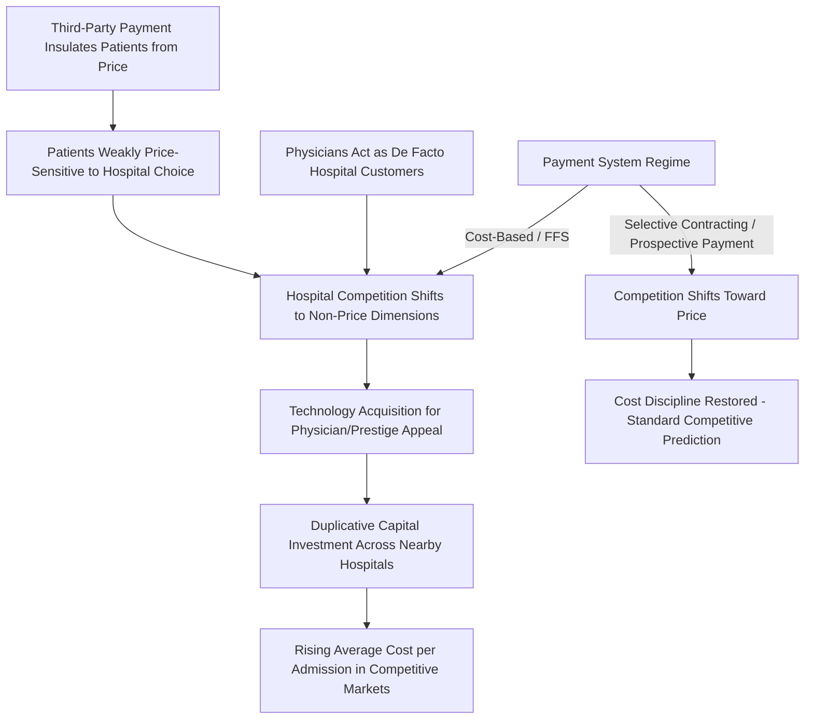

## Hospital Competition and the Medical Arms Race

### Overview

The "medical arms race" (MAR) hypothesis describes a pattern of hospital competitive behavior in which hospitals compete for physician admissions and patient volume primarily through non-price dimensions — acquiring the latest medical technology, expanding service lines, and pursuing prestige — rather than through price competition. This is a striking departure from standard competitive market theory, in which increased competition (more sellers, easier entry) is generally predicted to *lower* prices and improve allocative efficiency. In hospital markets under certain payment regimes, the opposite has been empirically observed: more hospital competition has been associated with *higher* costs, driven by duplicative technology acquisition and capacity expansion rather than price discipline. Understanding why this occurs — and under what payment and regulatory conditions it does or does not occur — is central to hospital industrial organization within health economics.

### Key Points: The Theoretical Foundation

**1. Non-Price Competition as the Core Mechanism**

Standard product-market competition assumes firms compete on price to attract price-sensitive consumers. Hospital competition historically deviated from this model because, under fee-for-service payment with generous insurance coverage, patients are largely insulated from the marginal cost of care at the point of service (via the moral hazard mechanism discussed in the broader health care market failure framework). This weakens patients' price sensitivity and shifts the competitive battleground toward attributes patients (and, critically, referring physicians) *do* respond to: technological sophistication, physician amenities, and perceived quality/prestige.

**2. The Physician as the Actual "Customer"**

Because patients typically do not select a hospital directly but instead are guided by their referring or admitting physician (an application of the physician-agency relationship), hospitals compete significantly for the loyalty and admitting preferences of physicians, not solely for patients directly. Physicians, in turn, often value having access to the newest technology and equipment at their affiliated hospital, both for clinical utility and professional prestige. This creates a distinct competitive dynamic: hospitals invest in technology partly to attract and retain admitting physicians, a mechanism sometimes modeled as a derived-demand competition rather than direct patient-facing competition.

**3. The Robinson-Luft Hypothesis and Foundational Empirical Work**

The classic empirical demonstration of this pattern is associated with economists James Robinson and Harold Luft, whose research in the 1980s found that hospitals located in more competitive (less concentrated) local markets had *higher* costs per admission than hospitals in less competitive markets — the reverse of the standard competition-lowers-price prediction. [Inference] This finding is specific to the regulatory and payment environment of the period and markets studied (largely fee-for-service, cost-based or charge-based reimbursement, limited managed care penetration); it should not be treated as a universal, time-invariant law of hospital competition applicable to all payment regimes.

### The Role of Payment System in Determining Direction of Competition

**4. Cost-Based/Fee-for-Service Reimbursement Environment**

Under payment systems where hospitals are reimbursed based on costs incurred or billed charges (with limited payer pushback on cost growth), the medical arms race mechanism is theoretically strongest:

- Hospitals have little financial incentive to control costs, since costs are passed through to payers
- Competing for physician loyalty and patient volume through technology acquisition becomes the dominant competitive strategy
- Insurance-driven demand insulation means patients rarely "shop" hospitals on price even when nominally given the choice

**5. Managed Care and Selective Contracting Environment**

The MAR pattern is theoretically predicted to weaken or reverse once payers gain negotiating leverage — for example, through selective contracting (managed care organizations directing enrollees to a limited network of hospitals in exchange for negotiated price discounts). Under this regime:

- Hospitals compete for inclusion in insurer networks, which requires competitive *pricing*, not merely technology/prestige
- Empirical work following the rise of managed care in the U.S. in the 1990s generally finds a shift toward more traditional price competition in markets with substantial selective-contracting penetration, though findings on the magnitude of this shift vary across studies and time periods
- Prospective payment systems (e.g., DRG-based reimbursement) further reduce the arms-race incentive by fixing payment per case, forcing hospitals to internalize the cost of unnecessary technology acquisition rather than passing it through

**6. Ambiguous or Reversed Competition Effects Post-Reform**

[Inference] The overall academic consensus is that the direction of hospital competition's effect on cost (arms-race-like non-price competition versus standard price competition) is *conditional on the prevailing payment system and regulatory environment*, rather than a fixed structural feature of hospital markets — meaning the classic 1980s findings should be understood as describing behavior under a specific historical reimbursement regime rather than a timeless economic law.

### Consequences and Related Phenomena

**7. Duplication of Capital-Intensive Technology**

A commonly cited symptom of medical arms race dynamics is geographic clustering of high-cost technology (e.g., multiple hospitals in close proximity each acquiring their own advanced imaging or robotic surgical systems) at a density exceeding what population-based demand alone would justify — connecting this topic directly to the hospital economies-of-scale discussion, since duplicative acquisition below minimum efficient scale for each individual facility raises system-wide average cost.

**8. Interaction with the Newhouse Quality-Quantity Model**

The medical arms race hypothesis is closely linked to Newhouse's (1970) theoretical model of nonprofit hospital behavior (see the nonprofit/for-profit objectives topic), in which administrators derive utility from both quantity *and* quality/prestige of services provided. The arms race can be understood as the market-level, competitive manifestation of this individual-hospital objective function — hospitals pursuing prestige-driven technology investment independently converge into a mutually reinforcing, costly competitive dynamic once several hospitals in a market behave this way simultaneously.

**9. Welfare Implications**

The core welfare concern is that arms-race-driven technology acquisition may occur at a scale exceeding the socially efficient level — i.e., the marginal clinical benefit of the *n*-th duplicative MRI scanner in a market may be minimal relative to its capital cost, especially where the "flat of the curve" phenomenon (discussed in the geographic variation topic) applies. However, [Inference] not all technology diffusion associated with hospital competition is necessarily wasteful — some diffusion reflects genuine improvement in access and reduced travel/wait times for patients, and distinguishing welfare-reducing duplication from welfare-improving access expansion empirically is difficult and context-dependent.

### Illustration: Medical Arms Race Mechanism

### Practical Example

Consider a metropolitan market with four competing hospitals under two different eras of payment policy:

1. **Era 1 - Cost-based reimbursement, low managed care penetration**: Each of the four hospitals independently acquires a new robotic surgical system to attract prestige-conscious surgeons and remain competitive for admitting physician loyalty, despite combined regional demand being sufficient to fully utilize only one or two such systems at efficient volume. Consistent with the MAR hypothesis, average cost per admission across the market rises even as the number of competing hospitals (nominal "competition") stays the same or increases.
2. **Era 2 - Managed care selective contracting introduced**: A large regional insurer begins offering enrollees a narrower network with negotiated price discounts. Hospitals now compete to be included in this network, requiring price concessions rather than solely technology investment. Consistent with the theoretical prediction under selective contracting, at least some of the four hospitals shift strategy toward cost control and price competitiveness to retain network inclusion, and the correlation between market competitiveness and elevated cost weakens relative to Era 1.
3. **Persistent tension**: Even under Era 2 dynamics, a hospital with a uniquely strong physician referral base or must-have specialty service line may retain leverage to resist price concessions, illustrating that the shift from arms-race to price competition is a matter of degree influenced by hospital-specific market power, not a clean universal switch.

### Related Topics

- Robinson-Luft hospital competition and cost studies
- Newhouse quality-quantity model of nonprofit hospital behavior
- Managed care selective contracting and network design
- Diagnosis-Related Group (DRG) prospective payment and cost incentives
- Certificate-of-need laws as a regulatory response to duplicative capacity
- Hospital economies of scale and minimum efficient scale
- Physician-hospital agency relationships and admitting privileges
- Technology diffusion and health care cost growth
- Hospital merger and antitrust analysis