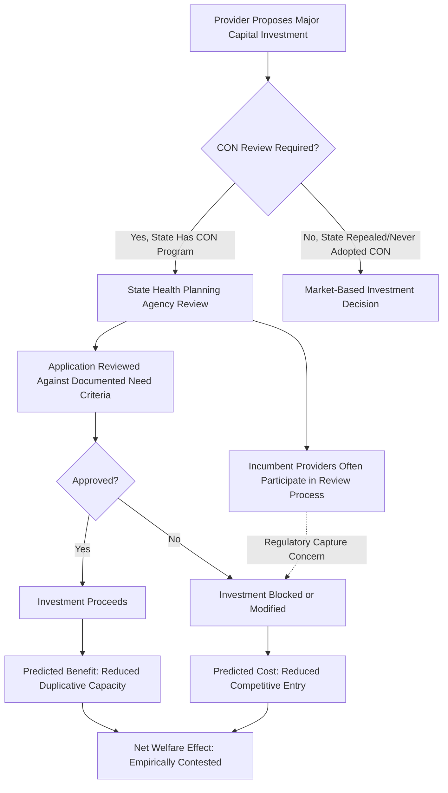

## Certificate-of-Need Regulation

### Overview

Certificate-of-need (CON) laws are state-level regulatory programs, primarily in the United States, that require health care providers to obtain government approval before making major capital investments — such as building new hospital facilities, adding beds, or acquiring specified categories of expensive medical equipment — by demonstrating that the investment meets a documented community "need." CON regulation was originally designed as a direct policy response to the medical arms race and supplier-induced demand phenomena discussed elsewhere in this chapter: if hospitals compete via duplicative, non-price technology and capacity investment rather than price, and if this duplication raises system-wide costs without commensurate benefit, a planning-based regulatory alternative to market allocation was proposed to constrain that investment directly. CON regulation therefore represents one of the most direct real-world policy applications of the hospital cost and competition theory covered in this chapter, and it remains one of the most empirically studied and contested regulatory interventions in U.S. health policy.

### Key Points: Origins and Policy Rationale

**1. Historical Origin**

CON programs began at the state level in the U.S. in the late 1960s (New York is generally credited as an early adopter) and were substantially expanded following the federal Health Planning and Resources Development Act of 1974, which conditioned certain federal health funding on states adopting CON programs. [Inference] The federal mandate was later repealed (in the mid-1980s), after which CON adoption, scope, and stringency became entirely a matter of individual state discretion; current CON status therefore varies significantly by state and is subject to ongoing legislative change, so any specific state-level detail should be verified against current state law rather than assumed static.

**2. Core Regulatory Rationale**

The economic justification for CON regulation rests on the theoretical propositions developed earlier in this chapter:

- Standard market discipline (entry/exit responding to price signals) is weakened in hospital markets by third-party payment, information asymmetry, and physician agency, so unrestricted capital investment may not converge to a socially efficient level
- The medical arms race hypothesis predicts that hospital competition under certain payment regimes drives *cost-increasing* duplicative investment rather than the cost-reducing competition standard theory would predict
- Roemer's Law ("a built bed is a filled bed," covered in the geographic variation topic) suggests that unconstrained capacity expansion generates its own utilization, potentially independent of underlying medical need — making capacity itself a lever regulators could use to constrain overall system spending

CON regulation attempts to substitute an administrative planning process — reviewing a facility's application against documented population need, projected utilization, and existing regional capacity — for market-based capital allocation.

**3. Typical Regulatory Scope**

CON review requirements, where they exist, commonly (though with substantial state-to-state variation) apply to:

- Construction of new hospitals or long-term care facilities
- Addition of licensed beds beyond a threshold
- Acquisition of specified high-cost equipment categories (e.g., certain imaging modalities, radiation therapy equipment)
- Addition of specific service lines (e.g., new cardiac catheterization labs, new nursing home beds, sometimes ambulatory surgical centers)

[Inference] The exact list of regulated services and investment thresholds differs substantially across the subset of states that maintain CON programs, and several U.S. states have repealed or substantially narrowed their CON programs since the 1980s federal mandate lapsed; current applicability to any specific service category and state must be verified against current state statute rather than treated as uniform nationally.

### Economic Analysis: Intended Effects versus Empirical Findings

**4. Theoretical Predicted Benefits**

Proponents' economic argument for CON regulation predicts:

- Reduced duplicative capital investment and excess capacity, lowering system-wide average costs
- Preservation of scale economies by concentrating volume in fewer facilities rather than dispersing it across many under-scale competitors (connecting to the hospital economies-of-scale discussion)
- Protection of cross-subsidization capacity, under the theory that concentrating profitable service lines in incumbent (often safety-net or nonprofit) facilities helps preserve their ability to fund unprofitable community services (e.g., preventing a new entrant from "cream-skimming" only profitable elective procedures and leaving uncompensated care burden concentrated on incumbent providers)

**5. Theoretical Predicted Costs (Regulatory Capture / Entry-Barrier View)**

The competing economic critique, paralleling the licensure entry-barrier debate covered elsewhere in this chapter, treats CON regulation as a **barrier to entry** that:

- Protects incumbent hospitals from new competition, since incumbents can participate in and influence the regulatory approval process (a standard regulatory-capture concern, as incumbent providers are frequently invited stakeholders in state health planning processes)
- Reduces the competitive pressure that would otherwise discipline prices and quality
- May slow adoption of genuinely beneficial new capacity or technology in areas with growing population need, if the approval process is slow or systematically favors incumbents over new entrants

$$\text{Net Welfare Effect of CON} = \underbrace{(\text{Reduced Duplicative Investment})}_{\text{Benefit, if MAR dynamics dominate}} - \underbrace{(\text{Reduced Competitive Entry})}_{\text{Cost, standard entry-barrier effect}}$$

**6. Empirical Evidence on Cost Effects**

[Inference] The empirical literature evaluating whether CON regulation actually reduces health care costs is mixed and has evolved over time; earlier studies from the CON program's peak era produced more heterogeneous findings, while a substantial share of the more recent empirical literature examining state CON repeals versus retention has found CON regulation associated with *higher* prices and reduced availability of certain services (particularly where CON is argued to entrench incumbent market power) rather than clearly demonstrating the cost-containment benefits originally intended. This finding should be treated as a general pattern in a body of contested literature, not a unanimous or methodologically uncontested consensus — study design, state selection, and time period materially affect specific results.

**7. Effects on Specific Service Categories**

CON regulation has been specifically studied regarding its effect on the entry of specialty and ambulatory facilities (e.g., ambulatory surgical centers, freestanding imaging centers) that could compete with incumbent general hospitals for profitable procedure volume. Research in this area frequently finds CON requirements associated with fewer such facilities and correspondingly less competitive pressure on incumbent hospital pricing for the affected services — consistent with the entry-barrier critique rather than the cost-containment rationale.

**8. Rural Access Considerations**

A distinct strand of CON policy debate concerns rural health care access: some proponents argue CON review helps protect financially fragile rural hospitals from having profitable service lines "skimmed" by new urban-adjacent competitors, which could otherwise undermine the rural facility's ability to cross-subsidize unprofitable but essential services (e.g., obstetrics, emergency care) in areas with limited alternative providers. [Speculation] Whether this protective effect empirically outweighs the general entry-barrier cost of CON regulation specifically in rural markets is a narrower and less definitively resolved question than the broader national CON literature, and reasonable analysts disagree on the appropriate policy balance in this specific context.

### Illustration: CON Regulatory Process and Competing Effects

### Practical Example

Consider a metropolitan area in a state with an active CON program, where an independent physician group proposes building a new freestanding ambulatory surgical center offering outpatient orthopedic procedures:

1. **Regulatory step**: The physician group must file a CON application with the state health planning agency, documenting projected patient volume, existing regional capacity for similar procedures, and community need.
2. **Incumbent hospital response**: The area's existing general hospital, which currently performs similar orthopedic procedures on an outpatient basis, may formally oppose the application during the public comment period, arguing existing capacity is sufficient — a standard incumbent-protection dynamic cited in the regulatory-capture critique.
3. **Possible outcome A - Denied**: If the application is denied on grounds of insufficient documented need, the incumbent hospital retains its existing market share and pricing power for these procedures, consistent with the entry-barrier prediction; patients in the area do not gain the option of a potentially lower-cost, focused ambulatory alternative.
4. **Possible outcome B - Approved**: If approved, the new facility may introduce price competition for outpatient orthopedic procedures, potentially lowering costs for this service line (consistent with a "focused factory" economies-of-scope argument), but may also draw profitable procedure volume away from the incumbent hospital, potentially reducing its capacity to cross-subsidize unprofitable service lines — illustrating the genuine underlying trade-off the CON framework attempts (with contested success) to manage.
5. **State without CON regulation for comparison**: In a neighboring state without a CON requirement, the same physician group could open the facility without state approval, subject only to standard licensure and safety requirements — providing a natural comparison point used extensively in the empirical CON literature (states that repealed CON vs. states that retained it).

### Related Topics

- Medical arms race and non-price hospital competition
- Roemer's Law and hospital capacity-utilization dynamics
- Hospital economies of scale and minimum efficient scale
- Regulatory capture theory applied to health planning agencies
- Ambulatory surgical centers and specialty hospital market entry
- Rural hospital financial sustainability and cross-subsidization
- Hospital merger and antitrust analysis
- Physician licensure and scope-of-practice entry restrictions
- State health planning agency governance and stakeholder composition