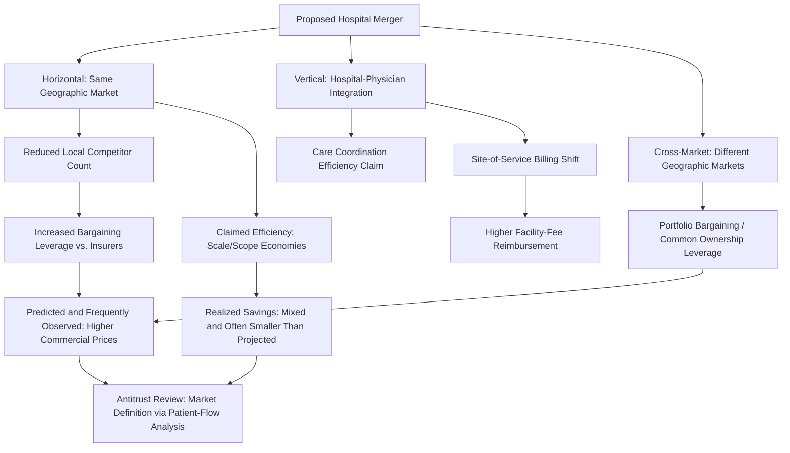

## Hospital Mergers, Consolidation, and Market Power

### Overview

Hospital mergers and broader market consolidation represent one of the most consequential and extensively studied structural trends in hospital economics over the past several decades. Consolidation occurs through several distinct forms — horizontal mergers (combining two or more hospitals), vertical integration (hospital acquisition of physician practices or health plans), and cross-market mergers (systems acquiring hospitals in geographically separate markets) — each raising distinct economic questions about efficiency gains versus market power. This topic connects directly to several concepts developed earlier in this chapter: hospital cost structure and economies of scale (the efficiency-rationale side of merger analysis) and the medical arms race/CON regulation discussion (the market-power and non-price-competition side). Antitrust economists and health economists have developed specialized empirical tools — most notably merger simulation models and event studies of post-merger price effects — specifically to evaluate hospital consolidation, because standard antitrust price-effect analysis must account for hospital markets' distinctive features (third-party payment, geographic differentiation, and the physician-agency relationship).

### Key Points: Forms of Hospital Consolidation

**1. Horizontal Mergers**

The combination of two or more hospitals that would otherwise compete for the same patients within a defined geographic market. This is the primary focus of traditional antitrust merger review, since it most directly reduces the number of independent competitors in a relevant market.

**2. Vertical Integration**

Hospital acquisition of physician practices (creating employed physician groups rather than independent admitting physicians) or, in some cases, hospital-health plan integration. Vertical integration raises distinct economic questions from horizontal mergers:

- **Potential efficiency rationale**: Better care coordination, reduced transaction costs between hospitals and physicians, alignment of incentives under value-based payment arrangements
- **Potential market power concern**: Vertical integration can increase a hospital system's negotiating leverage with insurers by controlling physician referral patterns (directing referrals to owned facilities) and can raise the cost of physician services billed under hospital-based rates rather than independent physician-office rates

**3. Cross-Market ("Multi-Market") Mergers**

Mergers between hospital systems that do not directly compete for the same local patients (i.e., in geographically separate markets) have historically received less antitrust scrutiny than horizontal in-market mergers, since a standard geographic-market-based antitrust framework does not flag an immediate reduction in local competitors. However, a growing body of empirical research examines whether cross-market mergers nonetheless produce price increases through mechanisms such as enhanced negotiating leverage with insurers who operate across the combined system's broader geographic footprint (a "common ownership" or "portfolio bargaining" effect) — a theoretically distinct concern from the traditional horizontal-merger local-market-concentration framework.

### Economic Analysis of Merger Effects

**4. The Core Antitrust Trade-Off**

Merger analysis in hospital markets follows the standard antitrust economics framework of weighing claimed efficiency gains against market power risk:

$$\text{Net Welfare Effect} = \underbrace{\Delta(\text{Cost Reduction from Scale/Scope Economies})}_{\text{Efficiency Rationale}} - \underbrace{\Delta(\text{Price Increase from Reduced Competition})}_{\text{Market Power Concern}}$$

Merging parties typically justify proposed mergers by claiming projected cost savings from economies of scale and scope (see the hospital cost structure topic), while regulatory reviewers and independent economists assess whether the merger would substantially reduce competition in a properly defined relevant geographic and product market.

**5. Empirical Evidence: Price Effects**

A substantial and largely convergent body of empirical hospital merger retrospective studies — using both event-study designs (comparing price trends before and after consummated mergers) and structural merger-simulation models — has found that horizontal hospital mergers in concentrated markets are frequently associated with meaningful post-merger price increases to commercial insurers. [Inference] The specific magnitude of price increases varies substantially across studies, markets, and time periods studied, and should not be treated as a single universal percentage; however, the general directional finding of upward price pressure following horizontal consolidation in already-concentrated markets recurs across a large share of the academic literature using varied methodologies.

**6. Empirical Evidence: Realized Cost Savings**

In contrast to the relatively consistent price-increase findings, empirical evidence on whether projected merger efficiency gains (cost savings from scale/scope economies) are actually realized post-merger is considerably weaker and more mixed. [Inference] A meaningful portion of the merger retrospective literature finds that claimed pre-merger cost-saving projections are not fully realized in practice, or that realized savings are substantially smaller than projected, though this finding is not universal across every studied merger and should be treated as a general pattern rather than an invariant rule — some mergers, particularly among facilities with genuine excess capacity or significant service-line duplication, likely do realize meaningful efficiency gains.

**7. Antitrust Market Definition Challenges**

A recurring technical challenge in hospital merger antitrust analysis is properly defining the relevant geographic market — since patients may be willing to travel varying distances depending on service type (routine versus highly specialized care), and insurer network design interacts with which hospitals are genuine substitutes from a bargaining perspective. Courts and antitrust agencies (in the U.S., the Federal Trade Commission and Department of Justice) have increasingly relied on techniques such as patient-flow/diversion-ratio analysis (examining where patients would go if their preferred hospital were unavailable) rather than simple geographic radius definitions, reflecting the specific bargaining structure of hospital-insurer price negotiation.

**8. The Bargaining Leverage Mechanism**

Unlike standard retail markets where price is set unilaterally by the seller and accepted or rejected by individual consumers, hospital prices to commercial insurers are typically the outcome of a **bilateral negotiation** between the hospital (or system) and the insurer, in which each side's leverage depends on how costly it would be for the insurer to exclude that hospital from its network (given enrollee preferences) versus how costly it would be for the hospital to be excluded (given the insurer's share of the hospital's patient volume). Merger-driven consolidation directly increases hospital-side bargaining leverage by eliminating a substitute the insurer could credibly threaten to use instead, independent of any change in underlying production cost — this is the specific theoretical channel through which horizontal mergers raise prices even absent any change in true cost structure.

**9. Physician Employment and Site-of-Service Billing Effects**

Vertical integration (hospital acquisition of physician practices) has been specifically linked in the literature to increased use of **hospital-based billing** for services previously billed at independent physician-office rates, since many payment systems (including Medicare in the U.S.) historically permitted higher facility-fee reimbursement for services performed in a hospital-owned outpatient setting relative to an independent physician office — a payment-policy-driven incentive for vertical integration distinct from any underlying efficiency or market-power rationale. [Inference] The magnitude of this site-of-service billing effect and the specific payment-policy rules governing it are subject to ongoing regulatory reform (e.g., site-neutral payment policy proposals), so current rules should be verified rather than assumed fixed.

### Illustration: Hospital Merger Effects Pathway

### Practical Example

Consider a proposed merger between two of the three hospital systems operating in a mid-sized metropolitan market:

1. **Merging parties' efficiency claim**: The two systems project significant cost savings from consolidating duplicate administrative functions, closing an underutilized specialty service line at one facility, and achieving better scale in shared procurement — directly invoking the economies-of-scale and scope arguments developed in the hospital cost structure topic.
2. **Antitrust market definition analysis**: The reviewing antitrust agency conducts a patient-flow (diversion ratio) analysis, examining what share of patients currently at Hospital A would switch to Hospital B (the merger partner) versus the remaining third competitor if Hospital A were unavailable — a high diversion ratio between A and B indicates they are close substitutes, strengthening the case that the merger would meaningfully reduce competition.
3. **Predicted insurer response**: If the merger proceeds and substantially reduces the number of credible in-network alternatives for a large regional insurer, standard bargaining-leverage theory predicts the insurer's negotiating position weakens in the next contract cycle, and the combined system can negotiate higher reimbursement rates than the two systems could have achieved independently — consistent with the majority of empirical merger retrospective findings.
4. **Efficiency realization uncertainty**: Even if the merger is approved (potentially subject to a divestiture condition, such as requiring one facility to be sold to a third party to preserve some competition), whether the projected administrative and procurement cost savings are fully realized within the timeframe projected is empirically uncertain and is the type of claim that merger retrospective researchers would later examine using post-merger cost data.
5. **Vertical dimension, if applicable**: If either system also employs a large share of the market's primary care physicians, the antitrust review may separately examine whether the merger strengthens referral-steering toward the combined system's specialty and hospital services, a vertical foreclosure concern distinct from the horizontal price-effect analysis.

### Related Topics

- Hospital economies of scale and cost function estimation
- Medical arms race and non-price competition dynamics
- Certificate-of-need regulation as a capacity-control alternative to antitrust
- Bilateral bargaining models of hospital-insurer price negotiation
- Antitrust merger simulation and patient-flow/diversion-ratio analysis
- Vertical integration and site-of-service payment policy (site-neutral payment reform)
- Nonprofit versus for-profit hospital objectives in merger decision-making
- Managed care network design and selective contracting
- Cross-market hospital system consolidation and portfolio bargaining theory