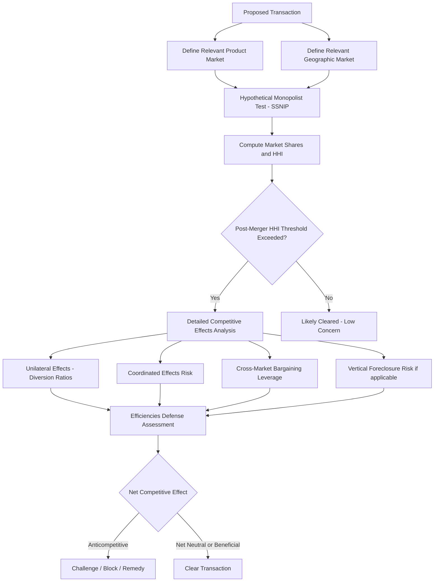

## Antitrust and Competition Policy Across Health Care Markets

### Overview

Antitrust and competition policy in healthcare applies the general framework of competition law — designed to prevent monopolization, anticompetitive mergers, and collusive conduct — to markets with distinctive structural features: information asymmetry between provider and patient, third-party payment that weakens ordinary price sensitivity, licensure-based barriers to entry, and highly localized geographic markets driven by patient travel-time tolerance. This area addresses how competition authorities analyze hospital mergers, physician practice consolidation, insurer market power, and vertical integration between insurers and providers, using tools such as market definition, concentration measures, and merger simulation, while accounting for healthcare-specific complications like the difficulty of directly observing "quality" as a competitive dimension.

### Legal and Institutional Framework

**Key Points**

- In the United States, healthcare antitrust enforcement operates primarily under the Sherman Act (Section 1: agreements in restraint of trade; Section 2: monopolization) and the Clayton Act (Section 7: mergers that may substantially lessen competition), enforced by the Federal Trade Commission (FTC) and the Department of Justice (DOJ) Antitrust Division.
- The FTC and DOJ jointly issue Horizontal Merger Guidelines, which set out the analytical framework (market definition, concentration thresholds, unilateral and coordinated effects analysis) used to evaluate proposed hospital and provider mergers.
- Many jurisdictions outside the U.S. (EU competition law under Articles 101/102 TFEU, and national competition authorities) apply structurally analogous frameworks, though healthcare systems with single-payer or heavily regulated pricing (reducing the role of price competition) can shift the analytical emphasis toward capacity, waiting times, and quality rather than price. [Inference — the general applicability of standard merger-review tools to non-U.S., non-price-competitive health systems is well recognized in the comparative competition-policy literature, though the specific metrics substituted for price vary by country and are not fully standardized.]

### Market Definition in Healthcare

Market definition — identifying the relevant product and geographic market within which competitive effects are assessed — is the foundational and most contested step in healthcare antitrust analysis.

#### Product Market Definition

- Product markets in hospital mergers are commonly defined around clusters of services (e.g., "general acute care inpatient services," or narrower categories like "outpatient cardiac catheterization") based on demand-side substitutability: would a price increase for one service cause enough patients/payers to substitute to another service to make the price increase unprofitable (the logic of the **hypothetical monopolist test**, or SSNIP test — Small but Significant Non-transitory Increase in Price).
- Physician services markets are often segmented by specialty, since a cardiologist and a dermatologist are not substitutes from the standpoint of a patient needing cardiac care.

#### Geographic Market Definition

- Hospital geographic markets are typically defined more narrowly than general retail markets because patients strongly prefer proximate care, especially for emergency and routine services; this preference is empirically captured through patient flow / patient-origin data showing where patients actually travel for care.
- The **Elzinga-Hogarty (E-H) test**, based on inflow/outflow of patients across a candidate geographic area, was historically influential in defining hospital geographic markets but has been substantially criticized and effectively superseded in modern antitrust litigation.
- Modern approaches instead emphasize **critical loss analysis** and structured application of the hypothetical monopolist test directly to patient-flow and diversion data, alongside qualitative evidence (physician referral patterns, insurer network design constraints, employer/payer testimony about substitution options).

### Concentration Measures

The **Herfindahl-Hirschman Index (HHI)** is the standard concentration metric used in merger review:

$$HHI = \sum_{i=1}^{n} s_i^2$$

where $s_i$ is the market share (in percentage points) of firm $i$ in the relevant market, and $n$ is the number of firms.

- $HHI < 1500$: unconcentrated market
- $1500 \leq HHI < 2500$: moderately concentrated market
- $HHI \geq 2500$: highly concentrated market

Under the U.S. Horizontal Merger Guidelines, a merger that increases HHI by more than 200 points in an already highly concentrated market ($HHI \geq 2500$ post-merger) is presumed likely to enhance market power and warrants close scrutiny.

**Application to Hospital Markets**

Empirical studies of U.S. hospital markets have documented substantial and increasing concentration over recent decades, with many metropolitan statistical areas classified as highly concentrated under the HHI thresholds. [Unverified — specific current HHI figures and the proportion of markets classified as highly concentrated change over time as consolidation continues; treat any specific percentage as a point-in-time estimate requiring verification against current source data rather than a fixed fact.]

### Unilateral and Coordinated Effects

**Unilateral Effects**

A merger between close competitors can allow the merged entity to profitably raise prices unilaterally (without needing coordination with rivals) if enough of the sales lost from a price increase at one merging hospital would have been diverted to the other merging hospital absent the merger, rather than lost to a non-merging rival. This is formalized through **diversion ratio** analysis:

$$D_{1\to2} = \frac{\text{Sales diverted from Hospital 1 to Hospital 2 after a price increase at Hospital 1}}{\text{Total sales lost by Hospital 1}}$$

A high diversion ratio between the two merging hospitals indicates they are close substitutes, strengthening the case that the merger would enable a unilateral price increase.

**Coordinated Effects**

Beyond unilateral effects, competition authorities assess whether increased concentration would facilitate tacit or explicit coordination (e.g., parallel pricing, market allocation) among the remaining competitors post-merger — more plausible in markets with few remaining rivals, homogeneous products/services, transparent pricing, and repeated interaction.

### The Hospital Merger Efficiencies Defense and the Clinical Quality Complication

**Key Points**

- Merging parties frequently argue that a merger will generate efficiencies (economies of scale/scope, elimination of duplicated service lines, improved clinical quality through consolidated centers of excellence) sufficient to offset any anticompetitive price effect — the Guidelines permit efficiencies to be weighed as a defense if they are merger-specific, verifiable, and passed through to consumers.
- Courts and agencies have generally applied significant skepticism to efficiency claims in hospital merger litigation, requiring concrete, merger-specific, and verifiable evidence rather than generic claims about scale benefits. [Inference — this pattern of judicial and agency skepticism toward hospital merger efficiency defenses is a well-documented feature of recent U.S. hospital merger enforcement, though the degree of skepticism and case outcomes vary by specific litigation.]
- A structurally distinct challenge in healthcare antitrust is that **price effects are more directly measurable than quality effects**, creating asymmetric evidentiary weight: post-merger price increases are observable in claims data, while quality changes (patient outcomes, wait times, care coordination benefits) are harder to quantify and attribute causally to the merger, complicating a full welfare analysis of hospital consolidation.

### Cross-Market and System Mergers

A growing share of hospital consolidation involves **cross-market mergers** — combinations of hospitals that do not directly compete in the same geographic market (e.g., a system acquiring a hospital in an adjacent, non-overlapping region).

- Traditional unilateral-effects analysis (built around direct geographic overlap) does not directly capture the competitive concern in cross-market deals.
- The primary theory of harm in cross-market mergers is that the combined system gains bargaining leverage over insurers who need broad geographic network coverage to sell commercially viable insurance products — the "**must-have hospital**" or **health-plan bargaining leverage** theory — even without geographic overlap between the merging facilities. [Inference — this cross-market bargaining-leverage theory is an active and increasingly emphasized area of antitrust economics research and enforcement attention, but empirical estimates of its magnitude are less mature than the traditional horizontal-overlap literature and remain an evolving area of the field.]

### Vertical Integration and Antitrust

Vertical mergers combine firms at different levels of the healthcare supply chain (e.g., a hospital acquiring physician practices, or an insurer acquiring a pharmacy benefit manager or a provider group).

**Theories of Harm**

- **Foreclosure**: the merged firm could disadvantage rival providers or insurers by restricting their access to an essential input or downstream channel (e.g., a hospital-owned physician group referring exclusively within-system, foreclosing rival hospitals from referral volume).
- **Raising rivals' costs**: the combined entity may raise input prices or degrade terms of access for competitors that rely on the same upstream or downstream partner.

**Potential Efficiencies**

- Vertical integration can also generate genuine efficiencies (reduced transaction costs, better care coordination, alignment of financial incentives across the care continuum) that horizontal mergers among direct competitors typically cannot offer, making vertical merger review analytically distinct and generally somewhat more permissive than horizontal hospital merger review. [Inference — this relatively more permissive general stance toward vertical healthcare mergers reflects mainstream antitrust economics reasoning about vertical versus horizontal integration, though specific case outcomes depend heavily on the facts of foreclosure risk in each transaction.]

### Physician Practice Consolidation and Private Equity Roll-Ups

- Beyond hospital mergers, a distinct and growing area of enforcement attention involves serial acquisitions of physician practices — often by private-equity-backed platforms — that individually fall below merger-notification thresholds (and thus escape routine premerger antitrust review) but cumulatively produce substantial local market concentration in a specific specialty (e.g., anesthesiology, dermatology, emergency medicine staffing).
- This "**roll-up**" pattern has prompted enforcement and policy interest in whether existing merger-notification thresholds (based on transaction size) adequately capture cumulative competitive harm from a sequence of small acquisitions, an active area of ongoing antitrust policy debate. [Speculation — the appropriate regulatory response to serial physician-practice roll-ups (e.g., lowering notification thresholds, retrospective review authority) remains an unsettled and actively debated policy question rather than a settled feature of current law.]

### Diagrammatic Representation: Healthcare Antitrust Analytical Framework

### Example

Consider two general acute-care hospitals located 12 miles apart in the same metropolitan statistical area, each holding roughly 30% of inpatient discharges in a market otherwise served by several smaller competitors holding the remaining share.

- **Market definition**: Patient-origin data show that over 85% of patients from the surrounding zip codes are treated at one of these two hospitals or a third, more distant facility — suggesting a plausible relevant geographic market roughly coextensive with this patient flow pattern.
- **HHI calculation**: If the two merging hospitals hold 30% and 28% shares respectively, with the remainder split among four smaller rivals, the merger's *increase* in HHI from combining the two firms alone would be $2 \times 30 \times 28 = 1680$ points — a very large increase that would trigger presumptive antitrust concern under the highly-concentrated-market threshold.
- **Diversion ratio evidence**: If claims data show that a substantial share of patients who would leave Hospital 1 after a price increase would go specifically to Hospital 2 (rather than a smaller rival), this directly supports a unilateral-effects theory of harm.
- **Efficiencies defense**: The merging parties might argue consolidation would eliminate duplicated cardiac surgery programs and concentrate volume to improve outcomes (per the volume-outcome relationship) — an argument that would require concrete, verifiable evidence of merger-specific quality improvement to be credited, rather than a generic scale-economies assertion.

### Related Topics

- Cost functions and economies of scale/scope (as an input into merger efficiencies analysis)
- Hospital price and quality competition under administered/regulated pricing
- Certificate-of-Need (CON) laws and their interaction with entry barriers
- Insurer-provider bargaining models (Nash bargaining framework in network negotiations)
- Vertical integration between hospitals and physician practices
- Private equity ownership models in healthcare delivery
- Merger simulation methods (e.g., GUPPI — Gross Upward Pricing Pressure Index)
- Cross-market hospital system mergers and bargaining leverage theories
- Comparative competition policy across single-payer and multi-payer health systems