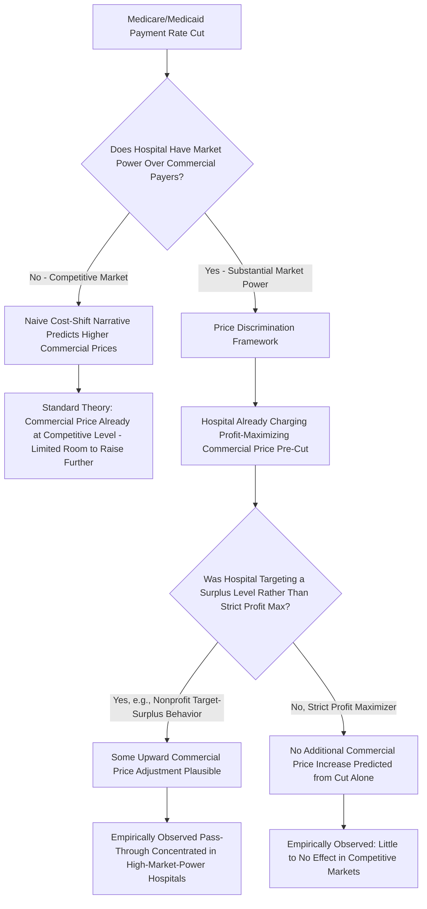

## Cost-Shifting Hypothesis

### Overview

The cost-shifting hypothesis is a long-standing claim in hospital economics that hospitals respond to reduced payment rates from one payer group (typically public payers — Medicare and Medicaid) by raising prices charged to another payer group (typically private, commercial insurers) in order to recoup lost revenue and maintain a target level of overall margin. Often summarized in industry and policy discourse as the "cost shift" or informally described as private payers "subsidizing" public payers, this hypothesis has been one of the most persistently invoked — and most persistently contested — empirical claims in health economics, because it carries direct implications for how public payment policy changes (e.g., Medicare rate cuts) are predicted to ripple through to commercial insurance premiums. This topic connects directly to the hospital cost-structure, hospital competition, and bargaining-leverage concepts developed earlier in this chapter, since the mechanism's plausibility depends critically on assumptions about hospital objective functions and market power that those earlier topics establish.

### Key Points: The Basic Cost-Shifting Claim

**1. The Standard Narrative**

The commonly cited version of the hypothesis proceeds as follows: (1) a hospital has a fixed total cost structure to cover; (2) public payers (Medicare, Medicaid) set administered payment rates that may fall below the hospital's average cost of treating those patients; (3) the hospital responds by raising the prices it charges commercial insurers above what pure cost recovery for commercial patients alone would require, effectively shifting the public-payer shortfall onto the commercial book of business; (4) this drives commercial insurance premiums higher than they would otherwise be.

$$P_{commercial} = AC_{commercial} + \underbrace{(AC_{Medicare} - P_{Medicare}) \times \frac{Q_{Medicare}}{Q_{commercial}}}_{\text{shifted shortfall, under the simple cost-shift narrative}}$$

**2. Why This Framing Is Economically Problematic**

The simple narrative above implicitly assumes hospitals are **not already price-maximizing** with respect to commercial payers before any public rate cut occurs — i.e., that hospitals were leaving profitable pricing opportunity on the table with commercial insurers, which they only exploit once forced to by a public shortfall. This assumption is inconsistent with standard profit-maximizing firm behavior: a textbook profit-maximizing hospital (or one behaving according to the objective-function models developed in the nonprofit/for-profit topic) should already be charging the profit-maximizing price to commercial payers *independent of* what it receives from Medicare, since the two pricing decisions involve different demand elasticities and different payer groups.

### The Competing Theoretical Framework: Cost-Shifting as a Market-Power Phenomenon

**3. The "Price Discrimination" Reframing**

The more rigorous economic treatment of this issue — closely associated with health economist David Dranove and others — reframes the phenomenon not as *cost-shifting* per se but as an instance of **third-degree price discrimination**: a hospital with market power charges different payer groups different prices based on their differing price elasticities of demand (their differing ability to walk away from or negotiate down the hospital's price), consistent with standard price-discrimination theory rather than a compensatory "shift" mechanically tied to public payer shortfalls.

$$\frac{P_i - MC}{P_i} = \frac{1}{|\epsilon_i|}$$

where $P_i$ is the price charged to payer group $i$, $MC$ is marginal cost, and $\epsilon_i$ is that payer group's price elasticity of demand facing the hospital — a standard Lerner-index markup formula applied separately to each payer segment.

**4. When "Cost-Shifting" Can and Cannot Occur**

Under the price-discrimination reframing, whether (and how much) a hospital raises commercial prices in response to a Medicare rate cut depends on:

- **Whether the hospital has market power over commercial payers at all**: A hospital in a highly competitive market with little bargaining leverage cannot simply raise commercial prices at will regardless of its public-payer shortfall, since competitive discipline (or strong insurer bargaining leverage) constrains commercial pricing independent of the Medicare rate
- **Whether the hospital was already charging the profit-maximizing commercial price**: If so, a Medicare shortfall does not create *additional* room to raise commercial prices further — the hospital would already be extracting the maximum sustainable commercial markup regardless of the Medicare rate
- **Financial distress / non-profit-maximizing behavior**: Some theoretical treatments allow that a hospital operating under financial distress, or a nonprofit hospital pursuing a target surplus level (rather than strict profit maximization, consistent with the nonprofit objective-function models discussed earlier), might behave differently — potentially accepting a lower "acceptable" commercial margin when public payer revenue is more generous, and seeking a higher commercial margin when squeezed, producing behavior that superficially resembles cost-shifting even though the underlying mechanism is a change in target surplus rather than mechanical cost recovery

**5. The "70% Solution" / Empirical Estimates of Pass-Through**

A body of empirical health services research and industry-sponsored analysis has attempted to estimate the magnitude of any cost-shifting effect — commonly framed as the share of a public payment shortfall "passed through" to commercial prices. [Inference] Empirical estimates of this pass-through rate vary enormously across studies, ranging from findings of little or no cost-shifting effect once market competitiveness and hospital margin levels are properly controlled for, to industry-affiliated analyses reporting much larger pass-through estimates; specific numeric pass-through estimates cited in the literature or industry materials should be treated as contested and methodology-dependent rather than as an agreed-upon parameter, and any particular estimate should be verified against its underlying study design and funding source before being treated as authoritative.

**6. Market Competitiveness as the Key Moderating Variable**

A recurring finding across the more methodologically rigorous studies in this literature is that any cost-shifting-like behavior, to the extent it is observed, is concentrated in hospitals or markets with **substantial market power** over commercial payers, and is much weaker or absent in more competitive hospital markets — directly consistent with the price-discrimination reframing (mechanism 3 above) rather than the naive mechanical cost-recovery narrative, since market power is a necessary precondition for a hospital to extract additional commercial markup at all.

### Illustration: Two Competing Models of the Cost-Shift Mechanism

### Practical Example

Consider two hospitals in different market conditions, both facing an identical 5% reduction in their state Medicaid payment rate:

1. **Hospital A - highly competitive urban market with several substitute hospitals and strong insurer bargaining leverage**: Under the price-discrimination framework, Hospital A is already constrained in its commercial pricing by the credible threat that a large commercial insurer could exclude it from network and direct patients to a competitor. The Medicaid rate cut does not change this competitive constraint, so standard theory predicts Hospital A has little ability to pass the shortfall through to commercial prices, regardless of the mechanical "need" to recover the lost revenue.
2. **Hospital B - the dominant, geographically isolated hospital in a rural market with no nearby substitute**: Hospital B already possesses substantial bargaining leverage over the one or two commercial insurers operating in its area (as established in the hospital merger and antitrust topics). If Hospital B is a nonprofit operating with a target-surplus objective function (rather than strict profit maximization) and had previously been accepting a lower commercial markup while Medicaid revenue was more generous, it may respond to the rate cut by negotiating harder for a higher commercial rate at the next contract renewal — a pattern *consistent with* observed cost-shifting behavior, but driven by Hospital B's pre-existing market power and target-surplus behavior rather than a mechanical, market-power-independent cost-recovery process.
3. **Policy implication**: This comparison illustrates why the empirical cost-shifting literature finds effects concentrated in high-market-power settings: the mechanism requires market power as a precondition, meaning policy discussions that invoke "cost-shifting" as a generic, universal consequence of any public payment rate cut — without regard to the affected hospital's local market competitiveness — are applying the theory too broadly relative to what the more rigorous economic literature supports.

### Related Topics

- Price discrimination theory and the Lerner index markup formula
- Nonprofit hospital objective functions and target-surplus behavior
- Bilateral bargaining models of hospital-insurer price negotiation
- Hospital market concentration and bargaining leverage
- Medicare and Medicaid administered pricing methodology
- Hospital mergers, consolidation, and market power
- Medical arms race and non-price hospital competition
- Hospital economies of scale and cost structure