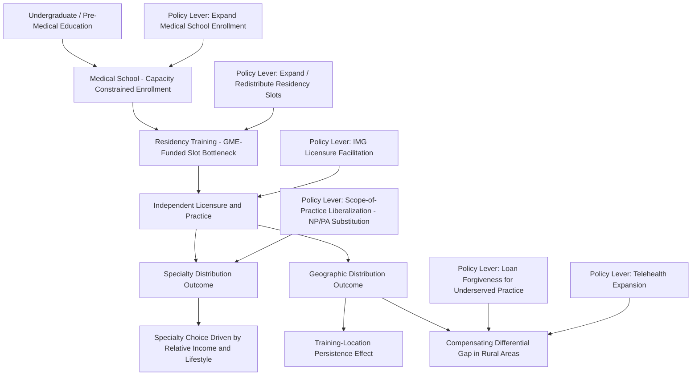

## Physician Workforce Planning and Shortages

### Overview

Physician workforce planning is the applied field concerned with forecasting future physician supply and demand and designing policy levers (medical school capacity, residency funding, immigration/licensure policy, scope-of-practice rules) to address projected imbalances. It sits at the intersection of labor economics and health workforce policy, and it shares significant conceptual overlap with the nursing labor market topic in this chapter — long training pipeline lags, geographic and specialty-specific mismatches, and licensure-driven entry restriction all reappear here — while introducing physician-specific features: an unusually long and inelastic training pipeline (extending a decade or more from undergraduate education through residency), a federally-funded residency-slot bottleneck unique to the U.S. system, and pronounced specialty and geographic maldistribution that is arguably as important a policy concern as any aggregate national shortage figure.

### Key Points: The Structure of Physician Labor Supply

**1. The Multi-Stage Training Pipeline as a Supply Bottleneck**

Physician labor supply is determined by a sequence of capacity-constrained stages: undergraduate pre-medical education, medical school (with limited, accreditation-constrained enrollment slots), and residency training (postgraduate specialty training, required for independent licensure in most specialties). Because residency training in the U.S. is substantially funded through Medicare Graduate Medical Education (GME) payments — with the total number of Medicare-funded residency slots subject to a statutory cap that was essentially fixed for an extended period before more recent incremental expansions — a physician workforce planning constraint exists that is largely independent of medical school output: expanding medical school enrollment alone does not increase the number of practicing physicians unless a correspondingly available residency slot exists for each additional graduate, since completion of residency is generally required for full licensure and independent practice in most specialties. [Inference] The specific statutory residency-slot cap level and any recent legislative expansions are subject to ongoing policy change; current figures should be verified against current legislative and regulatory sources rather than assumed fixed.

**2. Long Adjustment Lags Relative to Demand Shocks**

The full training pipeline from medical school entry to independent practice readiness typically spans roughly a decade or more (varying by specialty, with some subspecialties requiring additional fellowship years beyond core residency). This means physician supply responds to demand or policy signals (e.g., an increase in medical school enrollment in response to a perceived shortage) only after a substantial multi-year lag — a more extreme version of the cobweb-model supply-lag dynamic discussed in the nursing labor market topic, since the physician training pipeline is both longer in duration and more rigidly capacity-constrained at the residency stage.

**3. Forecasting Methodology and Persistent Uncertainty**

Physician workforce projections (produced by government agencies, professional associations, and academic researchers in various countries) typically combine demographic projections (population growth, aging, and associated changes in per-capita care demand) with assumptions about future physician productivity, retirement patterns, and scope-of-practice substitution by non-physician clinicians (NPs, PAs). [Inference] Physician workforce forecasts across the literature have historically shown substantial variation in projected shortage or surplus magnitude depending on the specific assumptions used (particularly assumptions about future NP/PA substitution rates and physician productivity/retirement behavior), and past forecasts in this field have at times proven inaccurate in hindsight; current-year specific numeric shortage projections for any country or specialty should be verified against current source publications rather than treated as a stable, agreed-upon figure.

### Specialty and Geographic Maldistribution

**4. Specialty-Level Imbalances**

A recurring theme in physician workforce economics is that aggregate national physician counts can mask significant **specialty-specific** imbalances — commonly cited concerns include relative shortages in primary care specialties (family medicine, general internal medicine, general pediatrics) relative to some higher-reimbursed subspecialties, driven partly by income differentials across specialties that influence medical student specialty choice during residency selection (the "specialty choice" decision, itself an application of standard human-capital investment theory, where prospective income, lifestyle/hours expectations, and debt-repayment considerations all factor into the specialty selection decision). [Inference] The specific magnitude and current status of any particular specialty shortage is time- and country-specific and evolves with both training-pipeline output and reimbursement-policy changes; specific current shortage estimates should be verified rather than assumed from general priors about specialty-choice economics.

**5. Geographic Maldistribution**

Physicians, and especially certain specialists, are disproportionately concentrated in urban and suburban areas relative to rural areas, a pattern observed across many countries with substantial geographic variation in population density and economic opportunity. Economic explanations include:

- **Compensating differentials in reverse**: Rural practice may involve professional isolation, fewer subspecialist colleagues for consultation/coverage, and reduced amenities for physician households (spousal employment options, schooling), requiring a wage premium to offset these disadvantages that many rural areas' payer mix and patient volume cannot readily support
- **Practice viability and patient volume**: Certain specialties require a minimum local population base to generate sufficient patient volume to sustain a viable practice, meaning some rural areas may be simply too sparsely populated to support certain specialists regardless of wage incentives offered (a demand-side rather than supply-side constraint)
- **Training-location persistence**: Physicians disproportionately tend to establish practice in the geographic region where they completed residency training, making the geographic distribution of residency programs itself a policy lever for influencing eventual practice location, distinct from and complementary to any wage-based incentive

### Policy Levers and Their Economic Logic

**6. Loan Repayment and Direct Financial Incentives**

Programs offering student loan forgiveness or direct financial incentives conditional on practicing in underserved specialties or geographic areas function as a targeted wage subsidy intended to offset the compensating-differential gap described above, directly addressing the geographic/specialty maldistribution problem rather than the aggregate national supply level.

**7. Residency Slot Expansion and Geographic Targeting**

Given the training-location-persistence finding above, policies expanding residency slots specifically in underserved geographic areas (rather than simply expanding the national aggregate slot count) are argued by some workforce economists to be a more targeted lever for addressing rural and underserved-area physician shortages than untargeted national capacity expansion, since national expansion alone does not guarantee the marginal additional physicians will locate in the areas of greatest need.

**8. International Medical Graduate (IMG) Policy**

As discussed in the physician licensure topic, IMGs represent an important supply-augmenting channel in several countries, but their integration is constrained by jurisdiction-specific licensure recognition requirements; IMG-friendly licensure and visa policy is one lever available for addressing near-term supply gaps that cannot be filled quickly through the multi-year domestic training pipeline expansion.

**9. Scope-of-Practice Liberalization as a Substitution Lever**

As covered in depth in the physician licensure and scope-of-practice topic, expanding NP/PA scope-of-practice authority functions economically as a **labor substitution policy** — addressing physician workforce gaps (particularly in primary care and underserved areas) by expanding the effective supply of qualified providers for tasks within NP/PA competence, rather than directly increasing physician supply itself. This is among the most actively debated policy levers precisely because it sits at the intersection of the workforce-shortage and licensure/SOP topics in this chapter.

**10. Telehealth as a Geographic-Constraint Relaxant**

[Inference] The expansion of telehealth-delivered care, particularly for certain specialties (e.g., psychiatry, some chronic disease management), has been argued in recent literature to partially relax the geographic-maldistribution constraint by allowing a physician physically located in one area to serve patients in an underserved area, though the degree to which telehealth is a genuine substitute versus a complement for in-person specialist access (and the interaction with cross-state licensure requirements, discussed in the physician licensure topic) is an evolving area with ongoing policy and empirical developments that should be verified against current sources rather than treated as settled.

### Illustration: Physician Workforce Pipeline and Policy Levers

### Practical Example

Consider a state government evaluating three competing policy proposals to address a documented rural primary care physician shortage:

1. **Proposal A - Expand state medical school enrollment by 20%**: Standard pipeline analysis predicts this intervention will not produce any additional practicing physicians until the affected cohort completes both medical school and residency (a lag of roughly a decade), and even then, absent a geographic targeting mechanism, standard training-location-persistence findings suggest many of the additional graduates may not ultimately practice in the rural areas of greatest need — illustrating why untargeted aggregate expansion is often considered a slow and imprecisely targeted lever for this specific problem.
2. **Proposal B - Create a new residency program specifically located in an underserved rural region, paired with loan forgiveness for graduates who remain in the region**: This combines the residency-slot-expansion lever with the geographic-targeting and financial-incentive levers simultaneously, directly addressing both the pipeline bottleneck and the compensating-differential gap identified above, and is consistent with the training-location-persistence literature's implication that where residency occurs strongly influences eventual practice location.
3. **Proposal C - Liberalize nurse practitioner scope-of-practice law to full practice authority in the affected rural counties**: This substitution-based lever can address the immediate access gap much faster than any physician-supply-side intervention (since it does not require waiting for a new training pipeline to complete), directly connecting to the scope-of-practice topic's discussion of NP/PA substitution as a near-term access lever, though it addresses a different margin of the problem (task substitution rather than physician supply per se) and may face the same political-economy opposition (physician association resistance) discussed in that topic.
4. **Combined assessment**: A workforce economist would likely note that Proposals B and C operate on different time horizons and different mechanisms (supply-side geographic targeting versus task substitution) and are not mutually exclusive — a combined approach addressing both near-term access (Proposal C) and longer-term geographically-targeted physician supply (Proposal B) is more consistent with the multi-margin nature of the underlying problem than reliance on a single lever such as untargeted enrollment expansion (Proposal A) alone.

### Related Topics

- Graduate Medical Education (GME) funding and residency slot policy
- Specialty choice and human-capital investment theory in medical education
- Rural physician shortage and compensating differential theory
- Physician licensure and scope-of-practice regulation (NP/PA substitution)
- International medical graduate licensure and immigration policy
- Nursing labor market economics and training pipeline parallels
- Telehealth expansion and cross-jurisdictional licensure barriers
- Loan forgiveness and targeted financial incentive program design
- Health workforce forecasting methodology and historical forecast accuracy