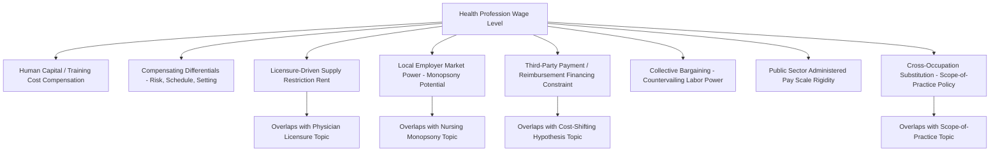

## Wage Determination in Health Professions

### Overview

Wage determination in health professions synthesizes and generalizes the labor-market mechanisms introduced separately for nursing and physicians earlier in this chapter into a unified framework applicable across the full range of health care occupations — physicians, nurses, allied health professionals (physical therapists, respiratory therapists, medical technologists), and support staff. Health profession wages are shaped by the interaction of standard human-capital and compensating-differential theory with sector-specific features: licensure-driven entry restriction, employer concentration (monopsony potential), third-party payment systems that indirectly determine the revenue available to fund wages, and, in many countries, a substantial public-sector or publicly-financed component that introduces administered-price elements alongside market-determined ones. This topic provides the general theoretical scaffolding that the occupation-specific topics in this chapter (nursing, physician workforce) each apply to their particular institutional context.

### Key Points: Foundational Wage Determination Theories

**1. Human Capital Theory**

The standard starting framework for health profession wage differentials is human capital theory: wages compensate workers for investment in education and training (tuition costs, foregone earnings during training, effort), with occupations requiring longer and more costly training commanding higher equilibrium wages to make the investment worthwhile relative to the returns available in less credential-intensive occupations.

$$W_{occupation} = W_{base} + r \times (\text{Training Cost} + \text{Foregone Earnings})$$

where $r$ represents the required rate of return on the human capital investment, calibrated so that the present value of the wage premium over a working career just compensates for the training investment (in a simplified competitive-equilibrium version of the theory). This directly explains, in broad terms, why physicians (with the longest, most expensive training pipeline covered in this chapter) command higher wages than allied health professionals with shorter training programs, who in turn typically earn more than support staff without formal credentialing requirements.

**2. Compensating Wage Differentials**

Beyond training-cost compensation, standard labor economics predicts that wages also adjust to compensate for non-wage job characteristics — risk, stress, schedule irregularity (night/weekend shifts, on-call requirements), physical and emotional demands, and geographic/practice-setting disadvantages (as discussed in the rural physician and nursing shortage topics). Health professions frequently exhibit substantial variation in these non-wage attributes even within the same credential level (e.g., emergency medicine versus a standard outpatient specialty), predicting corresponding wage variation independent of training-cost differences alone.

**3. Licensure as a Supply Restriction on Wage Determination**

As established in the physician licensure topic, entry restriction via licensure reduces the effective supply of labor in a given occupation relative to an unrestricted counterfactual, which — holding demand constant — is predicted to raise the equilibrium wage above what a fully open-entry market would produce. This means observed health profession wages reflect not only human-capital and compensating-differential factors but also a **licensure rent** component, the magnitude of which is difficult to separately identify empirically from legitimate quality-assurance value, and which is a recurring point of contention in the licensure/scope-of-practice literature discussed earlier in this chapter.

### Employer-Side Wage-Setting Power

**4. Monopsony Power Across Health Occupations**

As detailed in the nursing labor market topic, local labor market concentration (a small number of hospital or health system employers in a given commuting area) can confer wage-setting power on employers, suppressing wages below the competitive benchmark for occupations with limited practical employer-switching options. [Inference] The degree of monopsony power likely varies systematically across health occupations — highly specialized subspecialist physicians with strong outside options (including the ability to relocate or open independent practice) plausibly face less binding monopsony constraints than occupations with more employer-specific licensure/credentialing requirements or less geographic mobility, but this is a reasonable theoretical extension rather than a claim with occupation-by-occupation empirical confirmation cited here, and specific comparative findings should be verified against the relevant occupation-specific literature.

**5. The Interaction of Third-Party Payment with Wage-Setting Capacity**

Because health care revenue is substantially determined by insurer reimbursement rates (public and private) rather than direct patient willingness-to-pay, an employer's capacity to raise wages is partly constrained by the reimbursement environment it operates within — a hospital or clinic facing reimbursement rate compression (e.g., from a public payer rate cut, connecting to the cost-shifting hypothesis topic) has less revenue available to fund wage increases regardless of local labor market tightness, introducing a demand-side financing constraint on wage determination that is distinctive to health care relative to most other labor markets.

### Public Sector and Administered Wage-Setting

**6. Public Employment and Civil Service Pay Scales**

In many health systems — particularly those with substantial public-sector delivery (public hospitals, national health services, government-employed community health workers) — a meaningful share of health professionals are compensated under **administered civil-service-style pay scales** rather than through direct market-clearing wage negotiation, introducing rigidities (fixed step-based pay progression, limited ability to offer market-responsive premiums for hard-to-fill positions or specialties) that a purely market-based wage-determination model does not capture. [Inference] The specific structure and flexibility of public-sector health worker pay scales varies enormously by country and health system type; general statements here should be understood as describing a common institutional pattern rather than a universal or currently-precise description of any specific country's system.

**7. Collective Bargaining and Unionization**

Health profession wages in many settings, particularly nursing and some allied health occupations, are further shaped by collective bargaining where unionization is present, which can be modeled as a form of countervailing labor-supply-side market power intended to offset employer-side monopsony power (discussed above) — a standard "bilateral monopoly" framework in labor economics, where the wage outcome depends on the relative bargaining strength of the union versus the employer rather than being uniquely determined by either side's market power alone.

### Cross-Occupation Wage Structure and Substitution Effects

**8. Relative Wage Effects of Scope-of-Practice Policy**

As discussed extensively in the physician licensure and scope-of-practice topic, expanding NP/PA scope-of-practice authority changes the degree of labor substitutability between physicians and non-physician clinicians for specific clinical tasks, which — under standard labor-substitution theory — is predicted to exert some downward pressure on physician wages for the specific tasks now contestable by NPs/PAs (since physicians face increased competition for that task from a lower-training-cost substitute), while potentially exerting upward pressure on NP/PA wages (since their effective scope of billable, independently-performed work has expanded). [Inference] The empirical magnitude of this cross-occupation wage substitution effect is an area of ongoing research rather than a settled, precisely-quantified parameter, and likely varies by specific task, specialty, and jurisdiction.

**9. Specialty Wage Differentials and Reimbursement Policy Feedback**

Within physician wage determination specifically (as touched on in the workforce planning topic), relative reimbursement rates set by public payers (e.g., a national physician fee schedule) directly influence relative specialty income, which in turn influences medical student specialty choice (a human-capital investment decision responding to relative expected lifetime income), creating a feedback loop between administered payment policy and the eventual specialty composition of the physician workforce — an example of how administered pricing in health care (distinct from the market-based wage determination assumed in the baseline competitive model) has downstream labor-supply consequences beyond its immediate revenue effect on providers.

### Illustration: Layered Determinants of Health Profession Wages

### Practical Example

Consider a comparison of wage determination for three health occupations within the same hospital system — a subspecialist physician, a unionized registered nurse, and a non-unionized medical technologist:

1. **Subspecialist physician**: Wage reflects a substantial human-capital premium (long, costly training pipeline), a licensure-driven supply-restriction component (specialty board certification requirements), and relatively limited local monopsony exposure due to strong outside options (ability to relocate, contract with multiple facilities, or enter independent practice) — but is still ultimately capped by what the hospital system's payer mix and reimbursement rates can sustain, connecting to the third-party-payment financing constraint.
2. **Unionized registered nurse**: Wage reflects human-capital compensation for RN training, but with collective bargaining functioning as a countervailing force against the hospital system's potential local monopsony power (as discussed in the nursing labor market topic) — the bilateral-monopoly framework predicts a negotiated wage somewhere between what the hospital would prefer to pay unilaterally and what a fully competitive labor market would produce, with the specific outcome depending on relative bargaining leverage.
3. **Non-unionized medical technologist**: Wage reflects a shorter training-cost human-capital premium than either of the above occupations, no comparable countervailing collective-bargaining power, and potentially greater exposure to local employer monopsony power if the technologist's certification is employer- or region-specific and outside options are limited — predicting, under the theoretical framework above, a wage outcome more directly exposed to unilateral employer wage-setting than either the physician or the unionized nurse.
4. **Common financing constraint**: All three occupations' wage levels are ultimately bounded by the same underlying constraint — the hospital system's total revenue, which is substantially determined by negotiated commercial insurance rates and administered public payer rates rather than direct patient willingness-to-pay, meaning a system-wide reimbursement rate cut (as discussed in the cost-shifting hypothesis topic) constrains the wage pool available across all three occupations simultaneously, even though each occupation's specific wage-determination mechanism differs.

### Related Topics

- Nursing labor market economics and monopsony power
- Physician workforce planning and specialty choice theory
- Physician licensure and scope-of-practice regulation
- Human capital theory and returns to education
- Compensating wage differential theory
- Collective bargaining and bilateral monopoly wage models
- Cost-shifting hypothesis and reimbursement-driven revenue constraints
- Public sector health worker compensation structures
- Cross-occupation labor substitution and task-shifting policy