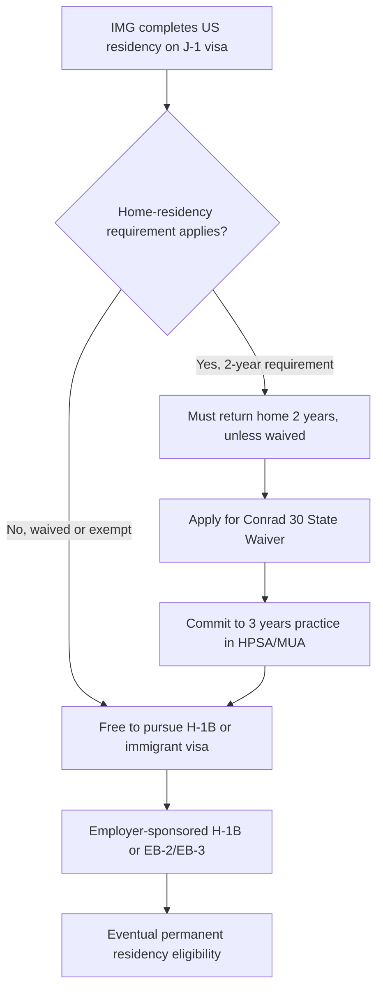

## Immigration and the Health Care Workforce

### Overview

Immigration plays a structurally significant role in health care labor supply, particularly in physician, nursing, and long-term care/direct-care occupations. Health economists analyze immigrant labor through several lenses: labor supply and shortage mitigation, wage effects on native-born workers, human capital transfer (including "brain drain" from source countries), credentialing and licensure frictions, and policy levers (visa categories, quotas, and immigration reform).

### Key Points

- Immigrants are disproportionately represented at both ends of the health care skill distribution: highly credentialed roles (physicians, specialists) and lower-wage direct-care roles (home health aides, nursing assistants).
- International Medical Graduates (IMGs) constitute a substantial share of the US physician workforce, particularly in primary care and in rural/underserved areas.
- Visa policy (H-1B, J-1, EB categories, Conrad 30 waiver) directly shapes physician geographic distribution and specialty choice.
- Foreign-born workers are a majority or near-majority of the direct-care workforce (home health aides, personal care aides) in the US.
- Immigration restrictions can tighten labor supply in already shortage-prone occupations, with downstream effects on access, wages, and care quality.
- Source-country effects ("brain drain") impose externalities on lower-income countries whose publicly-subsidized medical training produces emigrating physicians.

### Theoretical Framework: Labor Supply and Wage Effects

**Standard competitive labor market model**

In a competitive labor market, an inward shift of labor supply (from immigration) is predicted to reduce equilibrium wages and increase quantity of labor employed, holding demand fixed:

$$W^* = f(L^S + \Delta L^S_{imm}, L^D)$$

where an increase in $L^S_{imm}$ (immigrant labor supply) shifts the supply curve rightward, with the wage effect on incumbent (native-born) workers depending on:

1. **Substitutability**: whether immigrant and native-born workers are close substitutes ($\sigma$ elasticity of substitution is high) or complements
2. **Licensure/credential segmentation**: whether IMGs and US medical graduates compete in the same labor market segment or are functionally segmented by residency-match outcomes and specialty
3. **Monopsony conditions**: in health care labor markets with few employers (rural hospitals, some nursing home chains), immigration may offset employer wage-setting power rather than simply depressing wages

**Complementarity vs. substitution**

Empirical health economics literature (e.g., work in the tradition of Borjas-style immigration labor economics, applied to health care by researchers studying nursing and direct care) generally finds:

- In nursing and direct-care occupations, immigrant labor is frequently a partial substitute for native labor at the lower end of the wage distribution, but shortages are severe enough that net wage displacement effects are often small or statistically insignificant.
- In physician labor markets, IMGs are more likely to fill positions in underserved specialties/geographies that US medical graduates avoid, functioning more as complements to overall system capacity than direct wage competitors for US-trained physicians in high-demand specialties/locations.

[Inference] The degree of substitutability is empirically contested and varies significantly by occupation, region, and time period; results should not be generalized across all health care labor subsegments without checking the specific study population.

### Physician Workforce: International Medical Graduates (IMGs)

**Definition and scale**

An IMG is a physician who received their medical degree from a school outside the United States and Canada (the definition is credentialing-based, not citizenship-based — this includes US citizens who attended medical school abroad).

Key structural facts:

- IMGs enter the US physician workforce primarily via the residency Match (National Resident Matching Program, NRMP), requiring ECFMG (Educational Commission for Foreign Medical Graduates) certification.
- IMGs are overrepresented relative to their Match share in primary care specialties (internal medicine, family medicine) and in geographically underserved areas (rural counties, Health Professional Shortage Areas).

**Visa pathways for physicians**

| Visa/Program | Mechanism | Key Constraint |
| --- | --- | --- |
| J-1 exchange visitor | Standard visa for IMGs entering residency | Carries a two-year home-residency requirement post-training unless waived |
| J-1 waiver (Conrad 30) | Each US state may sponsor up to 30 J-1 waivers/year | Requires service commitment (typically 3 years) in a designated shortage area |
| H-1B specialty occupation | Employer-sponsored work visa | Subject to annual numerical cap (with some exemptions); requires employer sponsorship |
| EB-2/EB-3 employment-based green card | Permanent residency pathway | Subject to per-country annual caps, causing multi-year backlogs for some nationalities |
| National Interest Waiver (NIW) | Allows self-petition bypassing labor certification | Used by physicians committing to underserved-area practice |

**The Conrad 30 mechanism as a policy instrument**

The Conrad State 30 Waiver Program is a direct example of a health labor market intervention: it converts an immigration requirement (mandatory return to home country) into a domestic labor supply lever by conditioning the waiver on service in a shortage area. This is a targeted subsidy mechanism—effectively trading visa flexibility for guaranteed labor supply in markets that would otherwise be undersupplied due to low willingness-to-pay/reimbursement relative to physician preferences for practice location.

### Nursing Workforce and International Recruitment

**Scale and mechanisms**

Registered nurses (RNs) migrate internationally through both employer-sponsored visa channels and, more prominently in recent decades, through **international staffing agencies** that recruit from countries including the Philippines, India, and Caribbean/African nations to fill US hospital vacancies.

- The EB-3 "other workers"/"skilled workers" visa category is the primary permanent immigration pathway for foreign-trained RNs (RNs do not have a dedicated temporary work visa category comparable to physicians' J-1/H-1B structure, since nursing is generally classified in a way that does not qualify for H-1B specialty-occupation treatment under most circumstances).
- This structural gap — no dedicated temporary visa, reliance on the numerically-capped and backlogged EB-3 category — is frequently cited as a policy bottleneck contributing to persistent RN shortages, since the multi-year EB-3 backlog (with per-country caps producing especially long waits for applicants from high-volume source countries) discourages nurse migration relative to what unconstrained demand would otherwise support.
- The unsuccessful **Healthcare Workforce Resilience Act** (introduced in multiple congressional sessions) proposed recapturing unused visa numbers specifically for foreign nurses and physicians, illustrating an active area of health workforce immigration policy debate. [Unverified — legislative status changes across sessions; verify current status via congress.gov before citing as pending or enacted.]

**Source-country effects (Philippines case study)**

The Philippines is the leading source country for internationally-educated nurses in the US, a pattern rooted in a deliberate mid-20th-century Philippine government policy of training nurses for export as a foreign-exchange remittance strategy. This is a canonical case study in health economics for:

1. Deliberate human-capital-for-export national policy
2. Remittance economics as a rationale for supply-side labor training investment
3. Domestic health system strain in the source country, since nurse emigration can reduce domestic nurse-to-population ratios in the country of origin even as it fills gaps in destination countries

### Direct-Care Workforce (Home Health Aides, Personal Care Aides, Nursing Assistants)

This is a distinct labor market segment from licensed professionals, with different economic dynamics:

- Foreign-born workers make up a large share of the direct-care workforce in high-immigration states/metros, reflecting low barriers to entry, low wages, and physically demanding conditions that produce chronically weak native-born labor supply at prevailing wages.
- This segment is characterized by **monopsonistic tendencies** in some markets (few large employers — home care agencies, nursing home chains — setting wages), meaning immigration-driven labor supply increases may be absorbed without proportional wage suppression, since employers were previously wage-constrained rather than purely supply-constrained.
- Direct-care labor demand is projected to grow substantially due to population aging, making this segment particularly sensitive to immigration policy changes (enforcement intensity, DACA status, TPS designations for certain source countries).

**Key Points**

- Direct-care wages are frequently near or at state minimum wage floors, meaning labor supply shifts have muted price effects but significant effects on filled-vacancy rates and care access (particularly Medicaid-funded home- and community-based services, which have fixed reimbursement rates that constrain what agencies can offer).
- Undocumented immigration status is empirically significant in this segment specifically (unlike licensed professional segments, which require legal work authorization as a credentialing precondition).

### Policy Levers and Their Economic Logic

| Policy Lever | Economic Mechanism | Primary Affected Segment |
| --- | --- | --- |
| H-1B cap increase/exemption | Expands legal temporary skilled labor supply | Physicians, some allied health |
| Conrad 30 waiver expansion | Converts visa flexibility into geographic labor targeting | Rural/underserved physicians |
| EB-3 recapture/exemption for nurses | Removes numerical bottleneck on permanent RN immigration | RNs |
| J-1 waiver reform | Reduces friction in retaining trained IMGs domestically | Physicians |
| Enforcement intensity (interior/border) | Contracts undocumented labor supply | Direct-care workforce |
| TPS/DACA status changes | Alters work-authorization eligibility for existing US residents | Direct-care workforce |
| International recruitment agency regulation | Addresses recruitment-fee exploitation, contract terms | Internationally-recruited RNs |

### Empirical Considerations and Measurement Challenges

- **Endogeneity of location choice**: IMGs and immigrant nurses are not randomly distributed; they disproportionately locate where shortages (and thus job openings/visa sponsorship) already exist, which complicates causal inference about whether immigration "causes" workforce adequacy or simply flows toward pre-existing gaps. [Inference — this is a standard identification concern in this literature, not a claim about any single specific study's findings.]
- **Data limitations**: Distinguishing "immigrant" (foreign-born) from "IMG" (foreign-trained) matters, since a US-born citizen may be an IMG (attended medical school abroad, e.g., in the Caribbean), and a foreign-born individual may be a US medical graduate. Studies should be checked for which definition they use.
- **Selection effects**: Immigrant health workers are a selected population (those who pass credentialing exams, obtain visa sponsorship, and choose to migrate), which limits generalizability of source-country comparisons.

### Illustrative Example

Consider a rural county with an HPSA (Health Professional Shortage Area) designation and a single small hospital.

1. The hospital cannot recruit a US medical graduate at the prevailing offered salary because of location preferences among US-trained physicians (a form of compensating differential problem).
2. The hospital sponsors an IMG physician on a J-1 visa completing a Conrad 30 waiver, committing to 3 years of service in the HPSA.
3. Economically, this represents the immigration policy substituting for a wage increase the hospital would otherwise need to offer (and may be financially unable to offer, given fixed Medicare/Medicaid reimbursement rates) to attract a domestic candidate.
4. After the 3-year commitment, retention becomes uncertain — a documented phenomenon where Conrad 30 physicians may relocate to non-shortage areas once the service obligation ends. [Inference — retention rates vary by study and region; treat post-obligation retention as an empirical question, not a fixed rate.]

### Diagram: Immigration's Position in the Health Labor Market System

<svg xmlns="http://www.w3.org/2000/svg" viewBox="0 0 800 420" font-family="Arial, sans-serif">
<text x="400" y="25" font-size="16" font-weight="bold" text-anchor="middle">Immigration Flows into the Health Care Workforce (svg_diagram)</text>
<rect x="30" y="60" width="200" height="80" rx="8" fill="#e8f0fe" stroke="#4a6fa5" stroke-width="1.5" />
<text x="130" y="90" font-size="13" text-anchor="middle" font-weight="bold">Source Countries</text>
<text x="130" y="110" font-size="11" text-anchor="middle">Medical/nursing</text>
<text x="130" y="125" font-size="11" text-anchor="middle">education systems</text>
<rect x="300" y="60" width="200" height="80" rx="8" fill="#fef3e8" stroke="#c98a3e" stroke-width="1.5" />
<text x="400" y="85" font-size="13" text-anchor="middle" font-weight="bold">Visa/Credentialing</text>
<text x="400" y="103" font-size="11" text-anchor="middle">ECFMG, J-1, H-1B,</text>
<text x="400" y="118" font-size="11" text-anchor="middle">EB-2/3, Conrad 30</text>
<rect x="570" y="60" width="200" height="80" rx="8" fill="#e8fbe8" stroke="#3e9c4d" stroke-width="1.5" />
<text x="670" y="90" font-size="13" text-anchor="middle" font-weight="bold">US Labor Market</text>
<text x="670" y="110" font-size="11" text-anchor="middle">Hospitals, clinics,</text>
<text x="670" y="125" font-size="11" text-anchor="middle">LTC/home care</text>
<line x1="230" y1="100" x2="298" y2="100" stroke="#555" stroke-width="2" marker-end="url(#arrow)" />
<line x1="500" y1="100" x2="568" y2="100" stroke="#555" stroke-width="2" marker-end="url(#arrow)" />
<rect x="150" y="200" width="220" height="70" rx="8" fill="#f5e8fb" stroke="#8a4ab5" stroke-width="1.5" />
<text x="260" y="225" font-size="13" text-anchor="middle" font-weight="bold">Physician Segment</text>
<text x="260" y="245" font-size="11" text-anchor="middle">IMGs, primary care,</text>
<text x="260" y="260" font-size="11" text-anchor="middle">HPSA placement</text>
<rect x="430" y="200" width="220" height="70" rx="8" fill="#fbe8ec" stroke="#b54a6a" stroke-width="1.5" />
<text x="540" y="225" font-size="13" text-anchor="middle" font-weight="bold">Nursing / Direct Care</text>
<text x="540" y="245" font-size="11" text-anchor="middle">RNs, home health aides,</text>
<text x="540" y="260" font-size="11" text-anchor="middle">personal care aides</text>
<line x1="670" y1="140" x2="330" y2="198" stroke="#555" stroke-width="2" marker-end="url(#arrow)" />
<line x1="670" y1="140" x2="540" y2="198" stroke="#555" stroke-width="2" marker-end="url(#arrow)" />
<rect x="230" y="320" width="340" height="70" rx="8" fill="#fff8e0" stroke="#c9a13e" stroke-width="1.5" />
<text x="400" y="345" font-size="13" text-anchor="middle" font-weight="bold">Labor Market Outcomes</text>
<text x="400" y="365" font-size="11" text-anchor="middle">Wage effects, access to care,</text>
<text x="400" y="380" font-size="11" text-anchor="middle">shortage mitigation, source-country brain drain</text>
<line x1="260" y1="270" x2="350" y2="318" stroke="#555" stroke-width="2" marker-end="url(#arrow)" />
<line x1="540" y1="270" x2="450" y2="318" stroke="#555" stroke-width="2" marker-end="url(#arrow)" />
</svg>

### Conclusion

Immigration functions as a major, policy-sensitive labor supply valve in US health care, operating differently across the physician, nursing, and direct-care segments. Physician immigration is heavily mediated by visa/waiver structures (J-1, Conrad 30, H-1B) that function as targeted geographic labor allocation tools. Nursing immigration faces a structural visa bottleneck (no dedicated temporary visa, reliance on backlogged EB-3 categories) that is a persistent point of policy contention. Direct-care immigration operates in a segment with weaker credentialing barriers and greater sensitivity to enforcement policy and legal status. Across all three, the standard supply-and-demand wage-suppression model must be qualified by considerations of monopsony, geographic/specialty segmentation, and source-country externalities.

**Related Topics**

- Physician residency Match mechanics and NRMP algorithm design (market design economics)
- Health Professional Shortage Area (HPSA) designation methodology
- Monopsony power in rural hospital labor markets
- Scope-of-practice regulation and nurse practitioner substitution effects
- Medicaid reimbursement rates and their effect on direct-care wage floors
- International Centre on Nurse Migration (ICNM) ethical recruitment codes
- Brain drain vs. brain circulation models in global health workforce economics
- Occupational licensing as a labor market entry barrier (state-by-state medical licensure reciprocity)