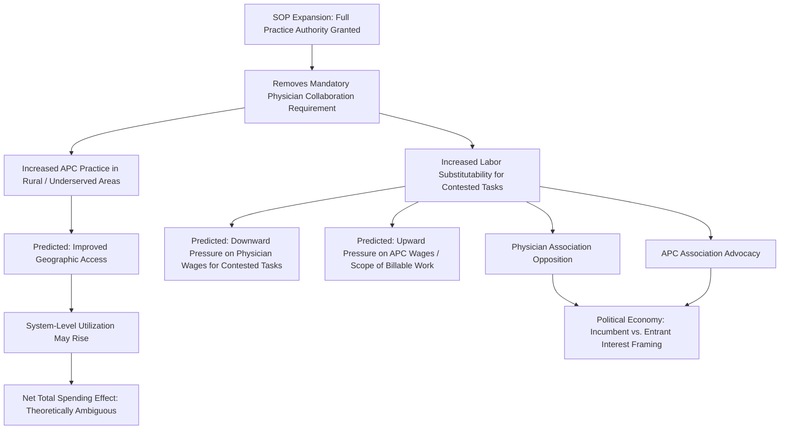

## Scope-of-Practice Expansion for Advanced Practice Clinicians

### Overview

This topic examines, in dedicated depth, the economic dynamics of scope-of-practice (SOP) expansion for advanced practice clinicians (APCs) — principally nurse practitioners (NPs), physician assistants (PAs), and, in some jurisdictions, other advanced practice roles such as certified nurse-midwives and clinical nurse specialists. While SOP regulation was introduced earlier in this chapter as one component of the broader physician licensure discussion, and its labor-substitution and wage effects were touched on in the workforce planning and wage-determination topics, this topic consolidates and extends that material specifically around the economics of *expansion* as a deliberate, ongoing policy lever — the empirical evidence base evaluating expansion's effects on access, cost, and quality, the political economy of the associated legislative conflict, and the specific mechanisms through which expanded APC scope interacts with the physician labor market, workforce shortage policy, and the broader agency and information-asymmetry framework established at the start of this chapter.

### Key Points: The Economic Logic of Scope Expansion

**1. APCs as Imperfect Substitutes for Physicians**

The central economic question underlying SOP policy is the degree of **substitutability** between APCs and physicians for a given clinical task. Standard labor economics treats this as a continuum rather than a binary: for some tasks (routine primary care visits, straightforward acute presentations, chronic disease management within established protocols), APCs may be close to perfect substitutes for physicians in terms of clinical outcome, while for other tasks (complex diagnostic reasoning across multiple interacting conditions, rare or atypical presentations), physicians may retain a meaningful comparative advantage due to more extensive training. SOP law effectively sets the *legal* boundary of substitutability, which may or may not align precisely with the *clinical* boundary of genuine competence-based substitutability — the gap between these two boundaries is the central object of empirical SOP research.

**2. Full Practice Authority versus Restricted/Reduced Practice Models**

As introduced in the licensure topic, SOP regulation for NPs in particular spans a spectrum:

- **Full practice authority**: NPs may evaluate, diagnose, treat, and prescribe independently, without a mandated collaborative or supervisory relationship with a physician
- **Reduced practice**: State or national law requires a collaborative agreement with a physician for at least one aspect of NP practice (commonly prescribing authority)
- **Restricted practice**: Direct physician supervision is required for NPs to practice at all

[Inference] The specific classification of any given jurisdiction along this spectrum changes over time through ongoing legislative activity; current status for any specific jurisdiction should be verified against current sources rather than assumed fixed from any general description.

**3. Economic Rationale for Expansion**

The efficiency argument for SOP expansion rests on standard labor-substitution logic: if APCs can perform a subset of physician tasks at comparable quality but with a substantially shorter and less costly training pipeline (connecting to the human-capital wage-determination framework), then restricting APCs from performing those tasks independently imposes an efficiency cost — forcing either more expensive physician labor to perform tasks a lower-cost substitute could handle equally well, or requiring costly and administratively burdensome supervisory/collaborative arrangements that add cost without adding clinical value if the APC is already fully competent for the task at hand.

### Empirical Evidence Base

**4. Access Effects**

A substantial share of the empirical literature evaluating SOP expansion focuses on **access outcomes** — geographic availability of primary care, particularly in rural and underserved areas (directly connecting to the geographic maldistribution concerns discussed in the physician workforce planning topic). Findings across this literature generally indicate that expanded NP scope-of-practice authority is associated with increased NP practice presence in rural and underserved areas relative to restricted-practice states, consistent with the theoretical prediction that removing the mandatory collaborative-physician requirement removes a practical bottleneck in areas where finding a willing supervising/collaborating physician is itself difficult.

**5. Cost Effects**

Empirical findings on **cost** are more nuanced than the access findings:

- At the individual-visit level, NP-delivered care for comparable tasks is frequently found to be lower-cost than physician-delivered care for the same visit type, consistent with the lower training-cost/wage differential established in the wage-determination topic
- At the **system level**, the net effect on total health spending is theoretically ambiguous and empirically mixed, because expanded access can increase total utilization (more visits occurring that would not have occurred at all absent expanded APC availability) — meaning lower cost-per-visit does not mechanically translate into lower total system spending if utilization rises enough to offset the per-visit savings. [Inference] The balance between per-visit cost savings and utilization-driven total spending effects is study- and context-dependent, and specific quantitative net-spending findings should be verified against current literature rather than generalized from theory alone.

**6. Quality and Outcome Effects**

For the specific tasks and patient populations most commonly studied (routine primary care, certain chronic disease management protocols), a substantial body of research finds NP-delivered outcomes statistically comparable to physician-delivered outcomes. [Unverified] This finding is frequently over-generalized in policy debate beyond its actual evidentiary scope; the underlying studies typically examine specific, protocol-amenable task categories and patient populations, and comparable-outcome findings for those specific tasks should not be extrapolated to imply equivalence across the full scope of tasks a fully licensed physician is trained to perform, including complex or atypical presentations that fall outside the task categories most commonly studied.

**7. Methodological Challenges in the Quality Literature**

A recurring methodological concern across this research area is **case-mix confounding**: NPs and physicians may not see comparable patient populations even within the same nominal task category, since referral patterns, patient self-selection, and practice-setting differences can systematically sort more complex cases toward physicians even under full-practice-authority regimes, potentially biasing simple observational quality comparisons toward finding equivalence even if a true difference exists for more complex sub-populations within the studied task category — a standard selection-bias concern that the strongest studies in this literature attempt to address through risk-adjustment or, less commonly, randomized or quasi-experimental designs.

### Political Economy of Scope Expansion

**8. Physician Association Opposition**

As noted in the licensure topic, SOP expansion is frequently opposed by state and national physician professional associations, typically framed publicly in patient-safety terms. From a political-economy and regulatory-capture perspective, this opposition can alternatively (and not mutually exclusively) be modeled as an incumbent response to increased labor-market substitution competition, since SOP expansion directly affects the wage and market-position dynamics discussed in the wage-determination topic (increased substitutability tends to place downward competitive pressure on physician wages for the contested task set).

**9. Advanced Practice Clinician Association Advocacy**

Correspondingly, nursing and PA professional associations typically advocate for SOP expansion, which can be modeled as the labor-supply-side counterpart to physician-association opposition — each professional group's advocacy position is broadly consistent with its own occupation's economic interest in the outcome, a standard feature of regulatory political economy that does not, on its own, determine which position better reflects genuine patient welfare.

**10. State-Level Policy Variation as a Natural Experiment**

Because SOP law varies substantially across states (in federal systems such as the U.S.) and has changed over time within individual states, researchers have used state-level policy variation as a quasi-experimental setting to estimate the causal effects of SOP liberalization on access, cost, and quality outcomes — a methodologically stronger approach than simple cross-sectional comparison, though still subject to the general caveat that states adopting SOP liberalization may differ systematically from those that do not in ways not fully captured by available controls.

### Illustration: Scope-of-Practice Expansion — Mechanisms and Effects

### Practical Example

Consider a state legislature debating a bill to move NP scope-of-practice from "reduced practice" (requiring a collaborative agreement) to "full practice authority":

1. **Access argument for the bill**: Rural legislators cite documented cases where NPs in their districts cannot practice at all because no local physician is willing to sign a collaborative agreement (a supervisory-bottleneck problem distinct from the NP's own clinical competence), directly connecting to the access-effect literature and the rural physician maldistribution concerns discussed in the workforce planning topic.
2. **Physician association opposition**: The state medical association testifies against the bill, citing patient-safety concerns regarding complex diagnostic cases — an argument that, per the quality-literature caveats above, has some genuine evidentiary basis regarding tasks outside the most commonly studied protocol-amenable categories, while also being consistent with a labor-market-competition interpretation of the opposition's economic incentive.
3. **NP association advocacy**: The state nurse practitioner association testifies in favor, citing the access and comparable-outcome literature for routine primary care tasks — an argument with genuine evidentiary support for the specific task categories studied, while also being consistent with the NP profession's own economic interest in expanded independent billing authority.
4. **Legislative compromise possibility**: A common resolution in actual SOP legislative debates is a phased or partial expansion (e.g., full practice authority granted only after an NP completes a specified number of supervised practice hours post-licensure) — an attempt to capture the access benefits of expansion while addressing some of the quality concerns regarding the earliest, least-experienced phase of independent practice, illustrating how actual policy outcomes often reflect a negotiated middle ground between the competing evidentiary claims and political-economy pressures described above rather than a clean adoption of either side's preferred position.

### Related Topics

- Physician licensure and scope-of-practice regulation (foundational framework)
- Wage determination in health professions (cross-occupation substitution effects)
- Physician workforce planning and shortages (rural/geographic access)
- Nursing labor market economics
- Regulatory capture theory applied to professional associations
- Quasi-experimental and state-policy-variation research methodology
- Case-mix confounding and selection bias in health services research
- Physician-patient agency relationship and information asymmetry
- Telehealth expansion as a complementary access lever