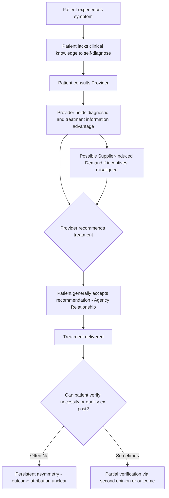

## Asymmetric Information Between Patients and Providers

### Definition and Conceptual Foundation

Asymmetric information describes a market condition in which one transacting party possesses materially more or better information than the other regarding a good, service, or the underlying risk being transacted. In health care, the physician (or provider more broadly) typically holds superior information about diagnosis, appropriate treatment, prognosis, and the quality/necessity of a given intervention relative to the patient. This asymmetry violates one of the core assumptions of the perfectly competitive market model — that all parties have complete and equal information — and is a primary justification economists use for why health care markets deviate systematically from textbook competitive outcomes.

The concept was formally introduced into economics by George Akerlof's 1970 analysis of used car markets ("lemons"), and extended to health insurance and medical care specifically by Kenneth Arrow in his 1963 paper "Uncertainty and the Welfare Economics of Medical Care." Arrow's paper is generally treated as the foundational text of health economics as a distinct field, precisely because it identified information asymmetry (alongside uncertainty) as structurally different in medical care than in most other goods.

### Why Health Care Is Especially Prone to This Problem

**Key Points**

- Medical knowledge requires years of specialized training to interpret; patients cannot easily verify a diagnosis or the necessity of a procedure through casual inspection, unlike most consumer goods.
- The consumption decision (accepting treatment) and the "purchase" decision are often the same act, made under time pressure or duress (acute illness, emergency), leaving little room for comparison shopping.
- Outcomes are probabilistic and confounded by the patient's own biology, so even after the fact, a patient often cannot tell whether a bad outcome reflects poor care or bad luck — this is sometimes called *ex post* information asymmetry, distinct from the *ex ante* asymmetry about what treatment is appropriate.
- The same actor (the provider) who diagnoses the problem also recommends and often supplies the remedy, unlike, say, an architect versus a construction firm.

### Manifestations of the Asymmetry

#### Agency Relationship and Supplier-Induced Demand

Because patients cannot fully evaluate provider recommendations, they delegate decision-making to the provider, who acts as their agent. This is formalized in economics as a **principal-agent problem**: the patient (principal) wants the provider (agent) to act purely in the patient's interest, but the provider's information advantage combined with potentially misaligned incentives (fee-for-service payment, defensive medicine, capacity utilization) can lead to **supplier-induced demand (SID)** — the provision of services beyond what a fully informed patient would choose for themselves.

$[Inference]$ The magnitude of SID is empirically contested; some studies attribute a meaningful share of regional variation in utilization (e.g., the Dartmouth Atlas findings) to it, while others argue that unobserved differences in patient severity or practice style explain the variation instead.

#### Quality Uncertainty and Adverse Selection in Provider Markets

Patients often cannot distinguish a high-quality provider from a low-quality one prior to treatment, and sometimes not even afterward. This creates conditions analogous to Akerlof's lemons problem: if patients cannot verify quality, they may be unwilling to pay a premium for it, which can depress the market-clearing price/quality equilibrium and, in the extreme, drive high-quality providers out of a price-sensitive segment of the market.

#### Insurance-Side Asymmetry (Related but Distinct)

Asymmetric information in health care also runs the other direction — from patient to insurer — regarding the patient's own health risk. This produces **adverse selection** (sicker individuals more likely to buy or retain insurance) and, once insured, **moral hazard** (reduced incentive to economize on care because a third party pays). These are conceptually distinct from patient-provider asymmetry but interact with it: because patients cannot verify what care is "necessary," moral hazard is harder to constrain through patient-side cost-sharing alone.

### Formal Representation

A simplified way to represent the agency problem: let $q^*$ be the quantity of care a fully informed patient would demand at price $p$, and let $q_p$ be the quantity actually provided under provider influence. Supplier-induced demand exists when:

$$q_p > q^*(p, I)$$

where $I$ represents the patient's true health information state. The wedge $(q_p - q^*)$ is attributable to the information gap combined with the provider's incentive structure, rather than to genuine clinical need.

Arrow's broader insight can be stated as: in a market with information asymmetry and uncertain, infrequent, and high-stakes transactions, the conditions for Pareto-optimal competitive equilibrium — complete markets, perfect information, no externalities — fail simultaneously, which is why institutional responses (licensing, insurance, nonprofit provision, professional norms) emerge as substitutes for missing market mechanisms rather than as market distortions.

### Diagram: The Information Asymmetry Loop

### Market and Policy Responses to the Asymmetry

**Key Points**

- **Licensing and credentialing**: State medical boards, board certification, and accreditation bodies act as a signaling and screening mechanism so patients need not personally verify competence.
- **Second opinions and referral norms**: Institutionalized mechanisms to partially counteract single-provider information monopoly.
- **Public reporting and quality metrics**: Report cards (e.g., hospital readmission rates, surgeon volume statistics) attempt to reduce ex ante quality uncertainty, though $[Inference]$ evidence on whether public reporting materially shifts patient choice (as opposed to provider behavior via reputational concern) is mixed.
- **Nonprofit and professional-norm provision**: Arrow argued that the prevalence of nonprofit hospitals and professional ethical codes (e.g., fiduciary duty, "first, do no harm") historically substituted for profit-maximizing behavior precisely because patients could not monitor quality the way they could in a standard for-profit market.
- **Payment reform (value-based/bundled payment, capitation)**: Attempts to realign provider incentives so that the information advantage is not exploited toward volume-maximizing behavior.
- **Shared decision-making models**: Clinical practice movement to explicitly transfer some information back to the patient (decision aids, risk communication tools) to narrow the gap for preference-sensitive conditions.

### Illustration: Information Gap Across the Care Episode

<svg xmlns="http://www.w3.org/2000/svg" viewBox="0 0 800 380" font-family="Arial, sans-serif">
<text x="400" y="30" text-anchor="middle" font-size="18" font-weight="bold" fill="#1a1a1a">Information Gap Across a Care Episode (svg_diagram)</text>

<line x1="80" y1="320" x2="740" y2="320" stroke="#333" stroke-width="2" />
<text x="410" y="355" text-anchor="middle" font-size="13" fill="#333">Stage of Care Episode</text>
<line x1="80" y1="320" x2="80" y2="60" stroke="#333" stroke-width="2" />
<text x="40" y="190" text-anchor="middle" font-size="13" fill="#333" transform="rotate(-90 40 190)">Relative Information Held by Provider</text>

<rect x="120" y="220" width="90" height="100" fill="#4C72B0" />
<text x="165" y="335" text-anchor="middle" font-size="12">Symptom Onset</text>
<rect x="240" y="140" width="90" height="180" fill="#4C72B0" />
<text x="285" y="335" text-anchor="middle" font-size="12">Diagnosis</text>
<rect x="360" y="90" width="90" height="230" fill="#DD8452" />
<text x="405" y="335" text-anchor="middle" font-size="12">Treatment Choice</text>
<rect x="480" y="120" width="90" height="200" fill="#DD8452" />
<text x="525" y="335" text-anchor="middle" font-size="12">Procedure/Delivery</text>
<rect x="600" y="200" width="90" height="120" fill="#55A868" />
<text x="645" y="335" text-anchor="middle" font-size="12">Outcome Review</text>

<rect x="580" y="60" width="14" height="14" fill="#4C72B0" />
<text x="600" y="72" font-size="11">Diagnostic gap</text>
<rect x="580" y="80" width="14" height="14" fill="#DD8452" />
<text x="600" y="92" font-size="11">Peak asymmetry</text>
<rect x="700" y="60" width="14" height="14" fill="#55A868" />
<text x="720" y="72" font-size="11">Partial resolution</text>
</svg>

### Empirical Measurement Approaches

- **Regional variation studies**: Comparing utilization rates across geographically similar populations to infer discretionary (agency-driven) versus needs-driven care.
- **Natural experiments in fee schedules**: Observing volume responses when reimbursement rates change (a pure income effect would predict lower volume when price per unit rises, but SID theory predicts providers may increase volume to maintain target income — the "target income hypothesis").
- **Physician-density studies**: Testing whether utilization rises with the local supply of physicians independent of population health need (a signature prediction of SID).
- **Patient-reported vs. chart-reviewed necessity ratings**: Comparing clinician panel assessments of appropriateness against actual utilization.

$[Inference]$ These methods generally cannot fully disentangle demand inducement from legitimate practice-style heterogeneity or from unmeasured patient case-mix differences, so results should be read as suggestive rather than conclusive of causal SID magnitude.

### Common Misconceptions

- Asymmetric information is not the same as moral hazard — moral hazard concerns *incentive* effects of insurance on behavior, while information asymmetry concerns *knowledge* gaps about what care is appropriate.
- Asymmetric information does not imply providers act in bad faith; the agency problem can produce inefficient outcomes even under well-intentioned, honest provider behavior, simply due to incentive misalignment (e.g., defensive medicine driven by malpractice risk rather than profit motive).
- The presence of insurance does not create the patient-provider information asymmetry; it operates through a separate channel (patient-insurer asymmetry) though the two interact in practice.

### Related Topics

- Kenneth Arrow's 1963 "Uncertainty and the Welfare Economics of Medical Care" (foundational text)
- Principal-agent theory and contract design in health care payment
- Supplier-induced demand and the target income hypothesis
- Adverse selection and moral hazard in health insurance markets
- Signaling and screening models (licensing, accreditation, quality certification)
- Shared decision-making and patient decision aids
- Physician payment mechanisms: fee-for-service vs. capitation vs. bundled payment
- The Dartmouth Atlas and regional variation in health care utilization
- Credence goods theory (health care as a "credence good" alongside auto repair, legal services)