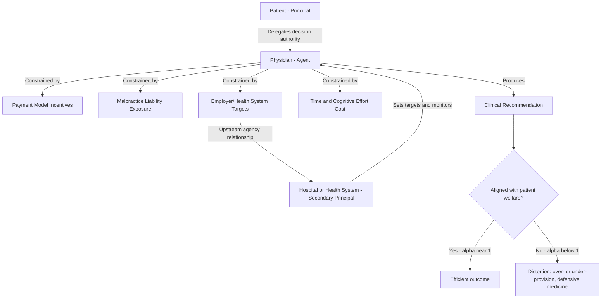

## Principal-Agent Problems in the Clinical Encounter

### Definition and Conceptual Foundation

A principal-agent problem arises when one party (the **principal**) delegates decision-making authority to another party (the **agent**) who possesses superior information or expertise, and whose interests are not perfectly aligned with the principal's. In the clinical encounter, the patient is the principal and the physician (or other treating provider) is the agent. The patient delegates diagnostic and treatment decisions because they lack the clinical knowledge to make them independently — but the physician's decisions are simultaneously shaped by financial incentives, professional norms, liability exposure, time constraints, and their own utility function, which need not coincide exactly with maximizing the patient's welfare.

This framework, drawn from contract theory and organizational economics, was applied to medicine most influentially by Mark Pauly and, in the broader information-asymmetry context, by Kenneth Arrow (1963). It is distinct from — but closely related to — the asymmetric information problem generally: agency theory specifically models *what the agent does with* their informational advantage, given their incentive structure, rather than simply describing the existence of the knowledge gap.

### The Core Structure of the Problem

**Key Points**

- The patient cannot costlessly verify whether the physician's recommendation reflects the patient's best clinical interest, the physician's income-maximizing interest, defensive-medicine risk aversion, or some blend of the three.
- Physicians simultaneously occupy two roles that create tension: **advisor** (recommending what care to obtain) and **supplier** (the one who profits from or delivers that care). This dual role is comparatively rare outside health care and a few other credence-good markets (e.g., auto repair, legal services).
- Unlike a classic employer-employee agency problem, the "contract" between patient and physician is almost always incomplete, implicit, and non-monitorable in real time — patients typically cannot specify ex ante the exact contingent actions they want taken for every possible clinical finding.
- The problem is compounded because the agent (physician) often also has *their own* principal-agent relationship upward — with a hospital employer, an insurer, or a health system with productivity targets — creating a chain of potentially misaligned incentives (a **multi-tiered agency** structure).

### Formal Representation

A standard principal-agent setup can be represented with a physician utility function that includes both patient welfare and self-interested components:

$$U_{physician} = \alpha \cdot W_{patient} + (1-\alpha) \cdot \pi_{physician}$$

where $W_{patient}$ is patient welfare, $\pi_{physician}$ represents the physician's own returns (income, reduced liability risk, reduced effort, reputation), and $\alpha \in [0,1]$ is the weight the physician places on patient welfare relative to self-interest — sometimes called the **agency parameter** or "extent of agency."

- When $\alpha = 1$: the physician is a **perfect agent**, and clinical decisions replicate what a fully informed patient would choose for themselves.
- When $\alpha < 1$: some portion of clinical decision-making is influenced by factors other than patient welfare, opening the door to supplier-induced demand, under-provision (if effort is costly to the physician), or defensive medicine (if $\pi_{physician}$ includes malpractice-risk avoidance).

$[Inference]$ Empirical estimates of $\alpha$ are not directly observable and must be inferred indirectly (e.g., via natural experiments in reimbursement rates or malpractice environments), so any specific numeric claim about "how much" agency is imperfect should be treated as model-dependent rather than a settled parameter.

### Sources of Incentive Misalignment

#### Payment-Model Effects

| Payment Model | Incentive Direction | Predicted Agency Distortion |
| --- | --- | --- |
| Fee-for-service (FFS) | Reward per unit of service | Incentive toward over-provision / supplier-induced demand |
| Capitation | Fixed payment per enrollee regardless of services | Incentive toward under-provision / stinting on care |
| Salary | Fixed regardless of volume | Weaker direct financial distortion, but may reduce effort intensity at the margin |
| Bundled/episode payment | Fixed payment per clinical episode | Incentive to reduce intensity within the episode; potential incentive to avoid complex/costly patients |
| Pay-for-performance (P4P) | Payment tied to quality/outcome metrics | Risk of "teaching to the test" — optimizing measured metrics rather than unmeasured welfare |

Each payment model can be understood as an attempted contractual solution to the agency problem, trading one distortion for another rather than eliminating misalignment entirely. This is a direct application of the **multitasking principal-agent model** (Holmström and Milgrom, 1991): when some dimensions of physician effort (e.g., measured quality indicators) are contractible and others (e.g., bedside manner, unmeasured diagnostic thoroughness) are not, incentivizing the contractible dimension can crowd out effort on the non-contractible one.

#### Malpractice Liability and Defensive Medicine

Liability exposure functions as an incentive that can push $\alpha$ effectively below 1 in either direction — it may increase test/procedure ordering beyond clinical benefit ("assurance behavior," positive defensive medicine) or induce avoidance of high-risk patients or procedures altogether ("avoidance behavior," negative defensive medicine). $[Inference]$ The share of total health spending attributable to defensive medicine is difficult to isolate empirically and estimates vary substantially by study design and specialty.

#### Time, Effort, and Cognitive Constraints

Even absent any financial or legal incentive misalignment, agency can be imperfect simply because thorough diagnostic effort is costly to the physician in time and cognitive load, and this cost is borne unilaterally by the agent while diagnostic benefit accrues to the principal — a classic **moral hazard on the agent's side**, sometimes labeled "agent moral hazard" to distinguish it from patient-side moral hazard in insurance.

### Diagram: The Agency Chain in Clinical Care

### Mechanisms Proposed to Mitigate the Agency Problem

**Key Points**

- **Second opinions and independent utilization review**: Introduce a second agent whose incentives are less correlated with the first, partially triangulating toward the patient's true interest.
- **Shared decision-making and informed consent frameworks**: Attempt to shift some decision rights back to the (now better-informed) patient, reducing reliance on pure delegation for preference-sensitive decisions.
- **Clinical practice guidelines and protocols**: Standardize the "default" recommendation, reducing the discretionary space in which agency slack can operate — though $[Inference]$ this can also suppress legitimate case-specific clinical judgment if applied too rigidly.
- **Public and professional reputation mechanisms**: Board certification, peer review, and malpractice history serve as reputational capital the physician has an incentive to protect, partially substituting for direct contractual alignment.
- **Value-based payment redesign**: Attempts to make $\pi_{physician}$ and $W_{patient}$ more directly correlated (e.g., shared savings tied to outcome measures rather than volume).
- **Professional ethical norms and fiduciary duty**: Arrow's original argument was that medicine's professional ethical code functions as an institutional substitute for the missing contractual completeness — effectively raising $\alpha$ through norm internalization rather than through monitoring.

### Distinguishing Related Concepts

- **Principal-agent problem vs. information asymmetry**: Information asymmetry is the *precondition* (the patient cannot verify the agent's actions or recommendations); the principal-agent problem is the *behavioral consequence* (what the agent does with that unverifiable discretion, given their incentives).
- **Principal-agent problem vs. moral hazard (insurance)**: Insurance-based moral hazard concerns the *patient's* reduced incentive to economize when a third party pays; the clinical agency problem concerns the *physician's* incentive to recommend more, less, or different care than the patient would choose if fully informed. The two frequently compound each other (an FFS-paid physician facing an insured, cost-insensitive patient has weak counterpressure from either side).
- **Perfect agency (benchmark) vs. realistic agency**: The "perfect agent" physician model is a theoretical benchmark economists use to measure the direction and magnitude of observed deviation, not an empirical claim that any real health system achieves it.

### Empirical Approaches to Detecting Agency Distortion

- Comparing utilization before/after exogenous reimbursement rate changes (testing whether volume moves opposite to price, consistent with income-target-driven agency behavior).
- Comparing treatment patterns for physicians treating family members or, in some studies, themselves as patients, versus their patients generally (testing consistency of $\alpha$).
- Comparing malpractice-environment variation (e.g., after tort reform) against test-ordering rates to isolate the liability-driven component of agency distortion.
- Studies of physician-owned facilities (e.g., self-referral to imaging or labs they have a financial stake in) as a direct test of the advisor/supplier conflict.

### Common Misconceptions

- The principal-agent framing does not imply physicians are acting unethically; $\alpha < 1$ can arise from structural incentive design even when every individual physician intends to act in good faith.
- A "perfect agent" is not the same as a physician who does whatever the patient asks; perfect agency means acting as the patient *would* choose if they had the physician's clinical knowledge, which may sometimes mean declining a patient's specific request.
- The agency problem is not resolved simply by disclosure (e.g., disclosing a financial conflict of interest) — disclosure may reduce information asymmetry about incentives but does nothing to change $\alpha$ itself unless it changes patient behavior or physician behavior in response.

### Related Topics

- Kenneth Arrow's agency argument in "Uncertainty and the Welfare Economics of Medical Care" (1963)
- Supplier-induced demand and the target income hypothesis
- Multitasking principal-agent models (Holmström and Milgrom, 1991) applied to pay-for-performance
- Physician payment mechanism design: FFS, capitation, bundled payment, shared savings
- Defensive medicine and malpractice liability economics
- Credence goods and the advisor-supplier dual role
- Shared decision-making and patient decision aids
- Physician self-referral and conflict-of-interest regulation (e.g., Stark Law in the U.S. context)