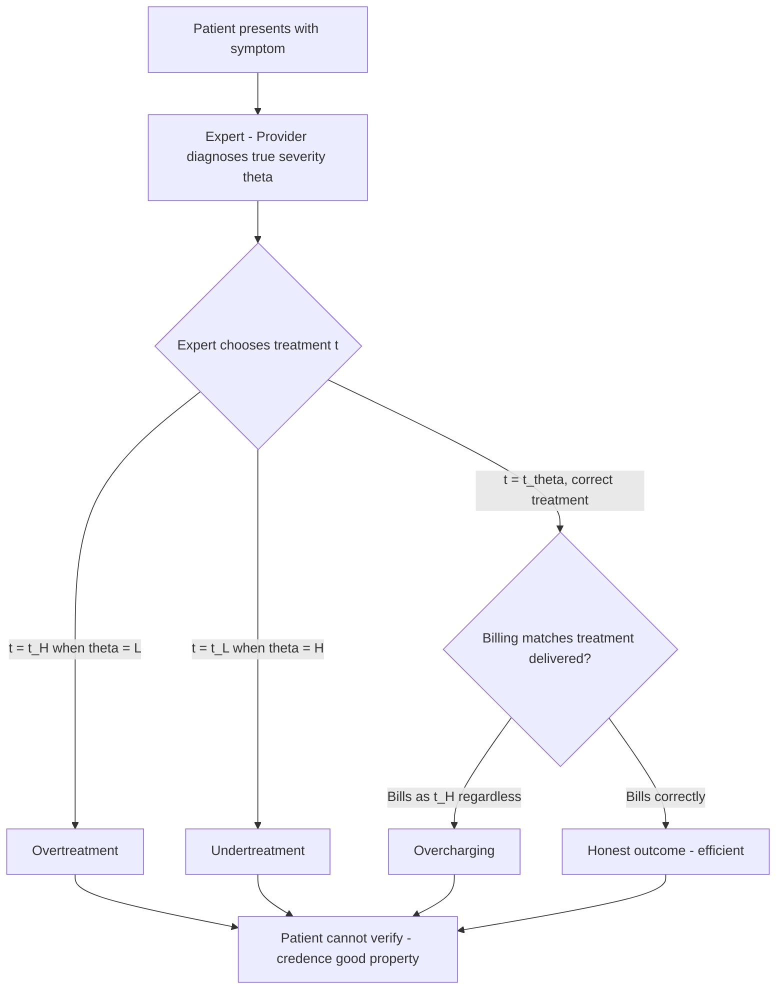

## Credence Goods and Quality Uncertainty

### Definition and Conceptual Foundation

A **credence good** is a good or service whose quality or necessity cannot be fully verified by the consumer even *after* consumption, in contrast to **search goods** (quality verifiable before purchase, e.g., a piece of fruit) and **experience goods** (quality verifiable during or after consumption, e.g., a restaurant meal). The term was introduced by Darby and Karni (1973), who identified medical care alongside auto repair and legal services as the paradigmatic credence goods, precisely because in all three cases the same party (the expert) diagnoses the problem, recommends the remedy, and often supplies it — while the customer typically cannot independently confirm whether the diagnosis was correct or the remedy was necessary.

**Quality uncertainty** is the closely related but conceptually distinct problem of not knowing, ex ante, the quality of the provider or service itself (as opposed to not knowing, ex post, whether the specific treatment received was necessary or effective). Akerlof's (1970) "market for lemons" model is the canonical formalization of quality uncertainty's market consequences, and health economists (following Arrow, 1963) apply it directly to physician and hospital quality.

### The Three-Tier Taxonomy of Goods

| Good Type | When Quality Is Verifiable | Health Care Example |
| --- | --- | --- |
| Search good | Before purchase | Choice of eyeglass frames, over-the-counter cold remedy packaging |
| Experience good | During/after consumption | Bedside manner, wait time, taste of hospital food |
| Credence good | Rarely or never fully verifiable, even after consumption | Whether a surgery was necessary; whether antibiotics were the correct choice for an ambiguous infection |

$[Inference]$ Most real clinical encounters are not purely credence goods in the strict sense — many have partially verifiable dimensions (e.g., a broken bone visibly heals) — so it is more accurate to describe medical care as *lying along a spectrum* with strong credence-good characteristics concentrated in diagnosis and treatment necessity, rather than as a good that is entirely unverifiable in every respect.

### Formal Structure of the Credence Goods Problem (Diagnosis-Treatment Model)

The standard credence-goods framework (formalized by Emons, 1997; Dulleck and Kerschbamer, 2006) models three possible patient states and expert behaviors:

- Let $\theta \in \{L, H\}$ represent the true severity of the problem (Low or High severity), unobserved by the patient.
- The expert observes $\theta$ (or a costly signal of it) and chooses a treatment $t \in \{t_L, t_H\}$.
- The patient can observe neither $\theta$ nor whether $t = \theta$ was matched correctly, only the bill and (imperfectly) the outcome.

This creates three canonical forms of expert misbehavior, all consistent with rational, informed profit-maximization by the expert absent countervailing constraints:

1. **Overtreatment**: Providing $t_H$ (the expensive treatment) when $\theta = L$ (only the cheap treatment was needed).
2. **Undertreatment**: Providing $t_L$ when $\theta = H$, saving the expert's own effort/cost at the expense of patient welfare.
3. **Overcharging**: Providing the correct treatment $t_\theta$ but billing as though the more expensive treatment $t_H$ was delivered.

$[Inference]$ Which of these three failure modes dominates in a given market depends heavily on the payment/liability regime; theoretical results in this literature show that verifiability of treatment (whether the patient/insurer can later confirm which treatment was actually delivered) and commitment to treat before diagnosis pricing are the two structural features that most affect which distortion emerges, and this is a modeling result rather than a universal empirical finding.

### Quality Uncertainty: The Lemons Mechanism Applied to Providers

Where credence-good theory concerns *what was done*, quality uncertainty concerns *who did it*. If patients cannot reliably distinguish high-quality from low-quality providers before treatment, and if signaling this quality is costly or imperfect, the market can unravel in an Akerlof-style manner:

$$P_{market} = f(\bar{Q})$$

where the price patients are willing to pay reflects the *average* expected quality $\bar{Q}$ across observationally similar providers, rather than each provider's individual true quality $Q_i$. If high-quality providers cannot capture a price premium proportional to $Q_i > \bar{Q}$, they face reduced incentive to invest in or maintain quality above the pooled average, and in the theoretical extreme, quality can spiral downward (adverse selection in the *supply* of quality, rather than the classic adverse selection in insurance risk pools).

$[Inference]$ Full market unraveling is a theoretical limiting case; in practice, licensing, credentialing, hospital reputation, and repeated-interaction effects (patients seeing the same primary care physician over years) counteract full unraveling, so most empirical health care markets show partial rather than complete quality degradation.

### Diagram: Credence Goods Decision Tree

### Illustration: Market Unraveling Under Quality Uncertainty

<svg xmlns="http://www.w3.org/2000/svg" viewBox="0 0 800 400" font-family="Arial, sans-serif">
<text x="400" y="28" text-anchor="middle" font-size="17" font-weight="bold" fill="#1a1a1a">Quality Uncertainty and Price Convergence to Average Quality (svg_diagram)</text>
<line x1="80" y1="340" x2="740" y2="340" stroke="#333" stroke-width="2" />
<text x="410" y="375" text-anchor="middle" font-size="13" fill="#333">Provider Quality Level (Low to High)</text>
<line x1="80" y1="340" x2="80" y2="60" stroke="#333" stroke-width="2" />
<text x="35" y="200" text-anchor="middle" font-size="13" fill="#333" transform="rotate(-90 35 200)">Price Patients Willing to Pay</text>

<line x1="120" y1="300" x2="700" y2="90" stroke="#999" stroke-width="2" stroke-dasharray="6,4" />
<text x="600" y="100" font-size="11" fill="#666">Ideal: price reflects true quality</text>

<line x1="120" y1="220" x2="700" y2="220" stroke="#C44E52" stroke-width="3" />
<text x="560" y="240" font-size="11" fill="#C44E52">Actual: price reflects pooled average quality</text>

<circle cx="180" cy="300" r="5" fill="#4C72B0" />
<text x="180" y="320" text-anchor="middle" font-size="10">Low-quality</text>
<circle cx="410" cy="195" r="5" fill="#4C72B0" />
<text x="410" y="320" text-anchor="middle" font-size="10">Average-quality</text>
<circle cx="650" cy="100" r="5" fill="#4C72B0" />
<text x="650" y="320" text-anchor="middle" font-size="10">High-quality</text>
<line x1="650" y1="100" x2="650" y2="220" stroke="#DD8452" stroke-width="1.5" stroke-dasharray="3,3" />
<text x="720" y="160" font-size="10" fill="#DD8452">Foregone premium</text>
</svg>

### Institutional Responses

**Key Points**

- **Licensing and mandatory credentialing**: Establishes a minimum verified quality floor, reducing (though not eliminating) the range of unobservable quality variation.
- **Liability/malpractice regimes**: Impose an ex post cost on the expert for undertreatment or negligent diagnosis, partially substituting for the patient's inability to verify treatment quality directly.
- **Second-opinion norms and diagnosis-treatment separation**: Structurally addresses the credence-good overtreatment/undertreatment problem by breaking the diagnosing party's monopoly over the treatment decision — theoretical work (Dulleck and Kerschbamer, 2006) shows that separating diagnosis from treatment provision, when feasible, can restore efficient outcomes if diagnosis itself is verifiable.
- **Verifiability mechanisms**: Requiring documentation, imaging, or lab confirmation of the diagnosed condition converts what would be a pure credence good into something closer to a search/experience good, since a third party (insurer, auditor, second physician) can retroactively verify whether the treatment matched the documented diagnosis.
- **Reputation and repeated interaction**: Long-term patient-physician relationships (as opposed to one-off encounters, e.g., emergency room visits or tourist medical care) allow reputational capital to substitute for per-transaction verifiability.
- **Public quality reporting and accreditation**: Attempts to convert unobservable quality into an observable signal (e.g., hospital accreditation status, surgical volume thresholds, standardized outcome metrics), though $[Inference]$ the responsiveness of patient choice to these signals varies considerably across studies and contexts.

### Distinguishing Credence Goods from Related Concepts

- **Credence goods vs. general information asymmetry**: Information asymmetry is the broader category (one party knows more than another about *any* relevant fact); credence goods specifically describe the case where verification remains impossible even *after* the transaction is complete, which is a stronger and narrower condition.
- **Credence goods vs. principal-agent problem**: The principal-agent framework describes what the informed party *does* given their incentives; the credence-goods framework describes the *market/contractual structure* (diagnosis bundled with treatment, non-verifiability) that makes the agency problem especially severe in this class of goods.
- **Quality uncertainty vs. treatment-necessity uncertainty**: Quality uncertainty concerns *which provider* to choose before any interaction occurs; credence-good treatment uncertainty concerns *what was actually delivered* by the chosen provider. Both can coexist and compound.

### Empirical Testing Approaches

- **Field and lab experiments with "seeded" faults**: In auto-repair and computer-repair credence-goods research, researchers bring in a device with a known, minor fault and measure rates of overtreatment/overcharging — a design $[Inference]$ less commonly (and more ethically constrained) applied directly in clinical medicine, but used as an analogy to motivate the health care application.
- **Comparing verifiable vs. non-verifiable diagnostic codes**: Studies exploiting variation in how easily a diagnosis can be audited (e.g., imaging-confirmed vs. symptom-based diagnosis) to test whether treatment intensity differs.
- **Malpractice environment and treatment-intensity correlation studies**: Testing whether tort reform changes (which shift the expert's liability exposure) shift measured over/undertreatment rates in predicted directions.
- **Studies of self-referral and vertically integrated ownership**: Testing whether treatment recommendations shift when the diagnosing physician also owns the facility providing the treatment (a direct test of the bundled diagnosis-treatment credence-good structure).

### Common Misconceptions

- Credence-good status does not imply provider dishonesty is common or the norm; the theory describes a structural vulnerability in the market, not an empirical claim about actual behavior rates, which vary by institutional safeguards in place.
- Quality uncertainty is not resolved simply by more information disclosure (e.g., publishing outcome statistics) if patients lack the capacity or opportunity to act on that information before needing urgent care.
- Credence goods and experience goods are not mutually exclusive within a single episode of care — many treatments have both a credence component (was this necessary?) and an experience component (how did the process feel, how quickly did symptoms resolve?).

### Related Topics

- Darby and Karni (1973) — original taxonomy of search, experience, and credence goods
- Akerlof's "market for lemons" (1970) and adverse selection in provider quality
- Dulleck and Kerschbamer (2006) credence goods model — diagnosis-treatment separation and verifiability
- Principal-agent problems in the clinical encounter
- Supplier-induced demand and overtreatment/undertreatment distinctions
- Malpractice liability and defensive medicine
- Public reporting, accreditation, and quality signaling mechanisms
- Physician licensing and credentialing as market-quality floors