## Signaling and Screening in Health Care Markets

### Definition and Conceptual Foundation

**Signaling** and **screening** are the two canonical mechanisms by which markets attempt to resolve information asymmetry when one party's private information (type) cannot be directly observed by the other. They are distinguished by *who initiates the information-revealing action*:

- **Signaling** (Spence, 1973): The informed party (the one who holds the private information) takes a costly, observable action to credibly reveal their type to the uninformed party. The action must be differentially costly across types — cheaper for the high-type to produce than the low-type — or it fails to separate them.
- **Screening** (Rothschild and Stiglitz, 1976): The *uninformed* party designs a menu of contracts or requirements such that agents with different private information self-select into different options, thereby revealing their type indirectly through their choice.

Both mechanisms are market-based (or institution-based) responses to the adverse selection and quality-uncertainty problems described by Akerlof (1970) and Arrow (1963), and both appear extensively in health care, on both the provider-quality side and the insurance-risk side.

### Signaling in Health Care Provider Markets

**Key Points**

- **Medical licensure and board certification** function as signals: acquiring an MD, completing residency, and passing certification exams are costly (time, effort, foregone earnings) in a way that is differentially harder for a lower-skill or lower-commitment individual to fake or complete, making the credential a credible — though imperfect — signal of underlying competence.
- **Hospital accreditation** (e.g., Joint Commission accreditation in the U.S. context) signals institutional quality investment to patients and payers who cannot directly audit clinical processes.
- **Specialty fellowship training and sub-specialization** signal depth of expertise beyond the baseline credential, differentiating providers within an already-licensed pool.
- **Malpractice insurance history and disciplinary records** can function as a negative signal channel — their *absence* of adverse history signals reliability, though this depends on public accessibility of such records.
- **Practice location and physical infrastructure investment** (e.g., a well-equipped facility) can signal quality when the investment itself is costly and would be a poor economic choice for a low-quality provider expecting low patient volume or short practice duration.

$[Inference]$ For a signal to be effective in the Spence sense, it must satisfy a **single-crossing condition** — the marginal cost of acquiring the signal must be lower for high-quality types than low-quality types. Whether this condition holds precisely for medical credentials (e.g., whether a mediocre physician truly finds board certification proportionally more costly than an excellent one) is a modeling assumption rather than something directly measured, so the credential-as-signal framework should be understood as a useful approximation rather than an exact empirical description.

### Screening in Health Care Insurance Markets

Screening is most extensively studied in the health *insurance* market, where the insurer (uninformed party) does not know an individual's true health risk and designs a menu of contracts to induce self-selection.

**Key Points**

- **Deductible/premium menus**: Insurers offer a menu of contracts, e.g., a low-premium/high-deductible plan alongside a high-premium/low-deductible plan. In the Rothschild-Stiglitz model, low-risk individuals self-select into the high-deductible option (since they expect to use less care and prefer to save on premium), while high-risk individuals self-select into the low-deductible, high-premium option (since they expect to use more care and prefer to pre-pay for coverage certainty). The chosen contract thereby reveals the individual's private risk type.
- **Waiting periods and pre-existing condition exclusions** function as a screening device: individuals who know they will need care soon disproportionately avoid contracts with long waiting periods, while low-risk individuals are less deterred by them.
- **Employer-based risk pooling** functions as an indirect screening mechanism: employment status itself correlates with underlying health status (a form of statistical screening the insurer exploits without needing individual-level information).
- **Underwriting questionnaires and medical exams** (where legally permitted) represent direct rather than incentive-based screening — the insurer requests information directly rather than relying purely on self-selection through contract choice.

### Formal Structure: The Rothschild-Stiglitz Screening Model

In the canonical Rothschild-Stiglitz (1976) setup:

- Two risk types exist: $\theta_H$ (high risk) and $\theta_L$ (low risk), with $\theta_H > \theta_L$ in probability of loss.
- The insurer cannot observe $\theta$ directly but can offer a menu of contracts $(P_i, D_i)$ — premium and deductible/coverage pairs.
- A **separating equilibrium** exists if the menu induces each type to select a different contract, such that:

$$U_L(P_L, D_L) \geq U_L(P_H, D_H) \quad \text{and} \quad U_H(P_H, D_H) \geq U_H(P_L, D_L)$$

meaning each type weakly prefers its own designated contract over the other type's contract (the incentive-compatibility constraints).

A key and famous result of this model is that a **pooling equilibrium** (a single contract serving both types at an average premium) is generally not stable under competitive conditions, because a rival insurer can always profitably "cream-skim" by offering a contract attractive only to low-risk types at a lower premium. $[Inference]$ The model also shows that under certain parameter conditions, *no* equilibrium exists at all (neither pooling nor separating), which is a theoretically important but empirically less directly tested result — real insurance markets are stabilized by additional institutional features (regulation, mandates, risk adjustment) not present in the base model.

### Diagram: Signaling vs. Screening Mechanism Comparison

```mermaid
flowchart TD
    subgraph Signaling
    A1[Informed party - e.g. Physician] -->|Takes costly observable action| A2[Acquires credential: MD, board certification]
    A2 -->|Differentially costly by type| A3[Reveals quality type to uninformed party - Patient]
    end
    subgraph Screening
    B1[Uninformed party - e.g. Insurer] -->|Designs menu of contracts| B2[Offers Low-Deductible/High-Premium and High-Deductible/Low-Premium plans]
    B2 -->|Informed party self-selects| B3[Applicant - Patient chooses contract]
    B3 -->|Choice reveals risk type| B4[High-risk selects low-deductible; Low-risk selects high-deductible]
    end
```

### Illustration: Separating Equilibrium in Insurance Contract Space

<svg xmlns="http://www.w3.org/2000/svg" viewBox="0 0 800 420" font-family="Arial, sans-serif">
<text x="400" y="28" text-anchor="middle" font-size="17" font-weight="bold" fill="#1a1a1a">Separating Equilibrium: Contract Choice by Risk Type (svg_diagram)</text>
<line x1="90" y1="360" x2="720" y2="360" stroke="#333" stroke-width="2" />
<text x="405" y="395" text-anchor="middle" font-size="13" fill="#333">Coverage Level (Deductible decreasing rightward)</text>
<line x1="90" y1="360" x2="90" y2="60" stroke="#333" stroke-width="2" />
<text x="45" y="210" text-anchor="middle" font-size="13" fill="#333" transform="rotate(-90 45 210)">Premium</text>

<path d="M 130 340 Q 300 260 470 150" fill="none" stroke="#4C72B0" stroke-width="2" />
<text x="480" y="145" font-size="11" fill="#4C72B0">Low-risk indifference curve</text>

<path d="M 130 320 Q 340 200 560 90" fill="none" stroke="#C44E52" stroke-width="2" />
<text x="565" y="85" font-size="11" fill="#C44E52">High-risk indifference curve</text>

<circle cx="230" cy="300" r="6" fill="#4C72B0" />
<text x="230" y="325" text-anchor="middle" font-size="11">Contract L (low premium, high deductible)</text>
<circle cx="500" cy="110" r="6" fill="#C44E52" />
<text x="500" y="90" text-anchor="middle" font-size="11">Contract H (high premium, low deductible)</text>
<line x1="230" y1="300" x2="500" y2="110" stroke="#999" stroke-dasharray="4,4" />
</svg>

### Related and Overlapping Mechanisms

- **Statistical discrimination**: Using observable group-level correlates (age, occupation, ZIP code) as an imperfect substitute for unobservable individual risk — related to but distinct from screening, since it does not rely on self-selection but on observable proxy variables.
- **Community rating and guaranteed issue regulation**: Policy interventions that explicitly *prohibit* risk-based screening (by requiring insurers to charge the same premium regardless of health status), imposed precisely because unrestricted screening/selection can produce adverse-selection death spirals or exclude high-risk individuals from coverage entirely.
- **Risk adjustment mechanisms**: A regulatory alternative to market-based screening, whereby payers are compensated based on enrollee risk profiles, reducing the insurer's incentive to screen or select against high-risk individuals in the first place.

### Distinguishing Signaling from Screening

| Feature | Signaling | Screening |
| --- | --- | --- |
| Who acts first | Informed party (e.g., physician) | Uninformed party (e.g., insurer) |
| Mechanism | Costly, differentially-costly observable action | Menu of contracts inducing self-selection |
| Example | Board certification | Deductible/premium plan menu |
| Underlying model | Spence (1973) job-market signaling | Rothschild-Stiglitz (1976) insurance screening |
| Failure mode | Pooling equilibrium if signal cost insufficiently differentiated | No equilibrium or unstable pooling under competitive entry |

### Empirical Testing Approaches

- **Wage/outcome premium studies for credentials**: Testing whether board-certified physicians achieve better measured outcomes or command higher referral volume independent of experience, as a test of whether the credential carries real informational content versus pure signaling with no underlying quality correlation.
- **Menu-choice studies in employer-sponsored insurance**: Testing whether employees who select high-deductible plans subsequently exhibit lower utilization, consistent with risk-based self-selection.
- **Regulatory natural experiments**: Comparing insurance markets before and after community-rating or guaranteed-issue mandates to observe how screening-driven contract menus change when risk-based screening is legally constrained.
- **"Unraveling" tests following adverse-selection regulation**: Testing for predicted market exits or premium spirals when regulation removes insurers' ability to screen, as a validation of the underlying theoretical mechanism.

### Common Misconceptions

- Signaling does not require that the signal itself have intrinsic value; in the pure Spence model, education can act as a signal of underlying ability even if it teaches no directly job-relevant skill — the value lies entirely in differential acquisition cost. $[Inference]$ Medical education is a partial exception since it plausibly *both* signals ability and directly builds clinical competence, making it a hybrid case rather than a pure signaling good.
- Screening does not require the uninformed party to ever directly learn any individual's true type; the mechanism works purely through revealed preference in contract choice, without any explicit disclosure occurring.
- A menu of insurance contracts existing in a market is not proof that screening is occurring as theorized — the same menu could arise from other causes (e.g., simple product differentiation for risk-preference reasons unrelated to asymmetric information).

### Related Topics

- Adverse selection and the Rothschild-Stiglitz model in health insurance
- Spence job-market signaling model and its health care analogues
- Credence goods and quality uncertainty
- Community rating, guaranteed issue, and risk adjustment as regulatory alternatives to screening
- Statistical discrimination versus screening in risk classification
- Physician licensing and credentialing as signaling mechanisms
- Moral hazard and its interaction with screened contract design