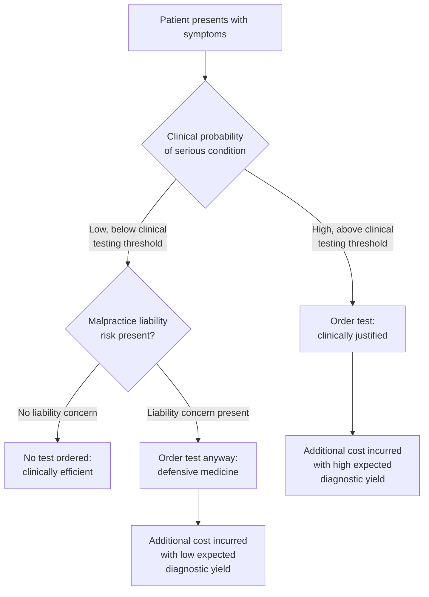

## Defensive Medicine and Malpractice Liability

### Definition and Conceptual Framework

Defensive medicine refers to the practice of ordering tests, procedures, or referrals, or avoiding high-risk patients or procedures, primarily to reduce exposure to malpractice liability rather than to benefit the patient medically. It is a behavioral response by physicians to the legal and financial risk created by tort liability systems governing medical negligence.

Defensive medicine is typically decomposed into two categories:

- **Assurance behavior (positive defensive medicine)**: Ordering additional tests, imaging, referrals, or procedures beyond what clinical judgment alone would recommend, in order to document thoroughness and reduce the probability of a successful malpractice claim.
- **Avoidance behavior (negative defensive medicine)**: Refusing to treat high-risk patients, avoiding high-risk procedures altogether, or withdrawing from specialties or practice settings (e.g., obstetrics, emergency medicine, neurosurgery) perceived as litigation-prone.

This distinction matters because assurance behavior primarily inflates health care costs, while avoidance behavior primarily restricts access to care, particularly for complex or high-risk patients.

### The Economic Logic of Malpractice Liability

Malpractice liability exists, in principle, to internalize the externality of medical negligence: without liability, a physician's private cost of carelessness would be lower than the social cost imposed on patients, leading to underinvestment in care quality. The tort system is meant to align private incentives with the socially optimal level of precaution.

A simplified expected-cost framework a physician (implicitly) faces when choosing effort/testing level $e$:

$$\min_{e} \; C(e) + p(e) \cdot L$$

where $C(e)$ is the private cost of effort/testing (time, resources, iatrogenic risk), $p(e)$ is the probability of an adverse outcome leading to a successful claim (decreasing in $e$), and $L$ is the expected loss from litigation (judgment, settlement, legal fees, reputational damage, increased malpractice premiums).

The socially optimal level of effort $e^*$ minimizes total social cost, including harm to the patient. Defensive medicine arises when the privately optimal $e$ (chosen by the physician facing liability) exceeds $e^*$ because $L$ reflects legal risk rather than the marginal clinical benefit to the patient. In other words, physicians overinvest in testing not because it improves expected patient outcomes at the margin, but because it lowers $p(e)$, the probability of being sued or losing a claim, independent of actual clinical value.

**Key Points**

- The tort system's stated goal is deterrence of negligence and compensation of injured patients.
- Defensive medicine represents a divergence between privately optimal and socially optimal physician behavior under liability.
- The wedge is driven by the fact that legal risk ($L$) is not perfectly correlated with clinical benefit.

### Why the Divergence Occurs: Information and Agency Problems

This topic sits within "Information Problems in Health Care" because defensive medicine is fundamentally a response to imperfect and asymmetric information in three dimensions:

1. **Physician–patient information asymmetry**: Patients cannot fully verify whether a bad outcome resulted from negligence or from the inherent uncertainty of medicine. This ambiguity creates room for litigation even when care met the standard of practice, so physicians hedge by generating more documentation and testing as *ex post* evidence of due diligence.
2. **Court/jury information limitations**: Judges and juries, lacking clinical expertise, often rely on retrospective, outcome-based judgments (an outcome bias) rather than assessing whether the *ex ante* decision-making process was reasonable given information available at the time. This asymmetry between what was knowable prospectively and what is judged retrospectively pushes physicians toward observable, verifiable actions (tests, scans, specialist referrals) that are easy to point to as evidence of care, even when their marginal diagnostic value is low.
3. **Insurer–physician information asymmetry**: Malpractice insurers cannot perfectly monitor individual physician effort or judgment quality, so premiums are typically set by specialty and broad risk class rather than individualized behavior, weakening the direct correlation between careful practice and lower premiums. This blunts the deterrence signal and can, in some specifications, encourage uniform defensive behavior across a specialty regardless of individual skill.

### Empirical Measurement Approaches

Quantifying defensive medicine is econometrically difficult because "unnecessary" care is not directly observable; researchers typically infer it using natural experiments or cross-sectional variation in liability exposure. Common approaches include:

- **Tort reform natural experiments**: Comparing utilization (e.g., imaging rates, cardiac catheterization rates, C-section rates) before and after states adopt caps on non-economic damages, changes to joint-and-several liability rules, or other liability-limiting reforms.
- **Cross-state/cross-region comparisons**: Comparing regions with different malpractice climates (measured by premiums, claim frequency, or damage caps) while controlling for patient case-mix.
- **Physician survey-based self-report**: Asking physicians directly whether and how they alter care due to liability concerns (subject to reporting bias).
- **"Sudden shock" studies**: Using events like the U.S. military's liability-free treatment environment (military physicians and Department of Veterans Affairs facilities have historically faced different liability exposure than civilian counterparts) to compare practice patterns for similar patients under different liability regimes.

**Example**

A widely cited study design compares elderly Medicare patients admitted for cardiac conditions in high-liability-risk states versus low-liability-risk states (proxied by malpractice premiums), finding modestly higher use of diagnostic testing and invasive procedures in high-risk states without correspondingly better health outcomes — used as evidence consistent with assurance-type defensive medicine. [Inference: exact magnitudes and specific study findings vary by paper, time period, and specification; treat point estimates from any single study as context-dependent rather than universal constants.]

### Cost Implications

Defensive medicine is frequently cited in U.S. health policy debates as a driver of excess health care spending, though the magnitude is contested:

- Estimates of the share of U.S. health expenditure attributable to defensive medicine have varied widely across studies, from low single-digit percentages to substantially higher figures, depending on methodology (survey-based estimates from physicians tend to be higher than econometric estimates from natural experiments). [Unverified: precise aggregate cost share is not settled in the literature and depends heavily on assumptions about what counts as "defensive" versus clinically justified care.]
- A persistent methodological challenge is that many tests ordered for liability reasons are also plausibly justifiable on clinical grounds (differential diagnosis coverage, risk aversion appropriate to rare-but-severe conditions), making it hard to cleanly separate "defensive" from "prudent" care using observational data alone.

### Access and Avoidance Effects

Beyond cost, avoidance-type defensive medicine has documented effects on the supply and geographic distribution of high-risk specialties:

- Obstetrics, particularly in rural areas, has been repeatedly cited as sensitive to malpractice premium levels, with reported reductions in the number of practitioners offering deliveries in high-premium, low-reform states.
- Emergency medicine physicians face a distinct incentive structure because EMTALA (the Emergency Medical Treatment and Labor Act) in the U.S. requires treatment regardless of ability to pay or malpractice risk tolerance, which can concentrate defensive testing (e.g., CT scans for low-probability but high-severity conditions like pulmonary embolism or subarachnoid hemorrhage) in emergency settings.
- Neurosurgery and other high-severity specialties have similarly been associated with elevated malpractice premiums correlating with reports of reduced willingness to take on complex or high-risk cases.

### Policy Interventions and Their Economic Logic

**Tort reform measures:**

| Reform Type | Mechanism | Intended Economic Effect |
| --- | --- | --- |
| Caps on non-economic damages | Limits jury awards for pain/suffering | Reduces $L$, lowering defensive behavior and premiums |
| Collateral source rule reform | Allows offsetting awards against other compensation (e.g., insurance) received | Reduces double-compensation, lowering $L$ |
| Statute of limitations shortening | Reduces the window for filing claims | Reduces long-run liability tail risk |
| Joint-and-several liability reform | Limits a defendant's liability to their proportional fault | Reduces liability exposure for low-fault parties |
| Certificate-of-merit requirements | Requires expert affidavit before a claim proceeds | Reduces frivolous/low-merit claims, lowering $p(e)$ noise |

**Alternative liability frameworks:**

- **Enterprise/no-fault liability**: Shifting liability from individual physicians to institutions or a no-fault compensation pool (as used in some other countries for specific injury classes), intended to decouple individual defensive behavior from institutional risk-pooling.
- **Safe harbor laws**: Providing legal protection for physicians who follow established clinical practice guidelines, intended to reduce ambiguity about the standard of care and thereby reduce the incentive to over-test as a hedge against ambiguous liability standards.
- **Health courts**: Proposed specialized administrative tribunals with medically trained adjudicators, intended to reduce the information asymmetry between courts and clinical practice that drives outcome-based (rather than process-based) judgments.

[Inference: The relative effectiveness of these interventions in reducing defensive medicine, as opposed to simply reducing claim frequency or insurance premiums, is an active area of empirical disagreement, and results are sensitive to state-specific implementation details.]

### Illustrative Model: Testing Threshold Under Liability

This diagram illustrates the core distortion: liability concern shifts the effective testing threshold below the clinically optimal threshold, so tests are ordered even in the region where expected diagnostic yield is low.

### Graphical Representation: Effort vs. Cost Trade-off

<svg xmlns="http://www.w3.org/2000/svg" viewBox="0 0 640 420">
<text x="320" y="24" text-anchor="middle" font-size="15" font-weight="bold" fill="#1a1a1a">Defensive Medicine: Private vs. Social Optimum (svg_diagram)</text>

<line x1="80" y1="360" x2="580" y2="360" stroke="#333" stroke-width="2" />
<line x1="80" y1="360" x2="80" y2="50" stroke="#333" stroke-width="2" />
<text x="330" y="395" text-anchor="middle" font-size="13" fill="#333">Testing / Effort Level (e)</text>
<text x="30" y="205" text-anchor="middle" font-size="13" fill="#333" transform="rotate(-90 30 205)">Expected Total Cost</text>

<path d="M 120 320 Q 250 100 350 130 Q 450 155 540 260" fill="none" stroke="#2166ac" stroke-width="3" />
<text x="545" y="255" font-size="12" fill="#2166ac">Social Cost Curve</text>

<path d="M 120 340 Q 300 130 420 110 Q 500 100 560 180" fill="none" stroke="#b2182b" stroke-width="3" />
<text x="450" y="95" font-size="12" fill="#b2182b">Private Cost Curve (with liability)</text>

<line x1="330" y1="360" x2="330" y2="128" stroke="#2166ac" stroke-width="1.5" stroke-dasharray="5,4" />
<circle cx="330" cy="128" r="5" fill="#2166ac" />
<text x="330" y="378" text-anchor="middle" font-size="12" fill="#2166ac">e* (socially optimal)</text>

<line x1="430" y1="360" x2="430" y2="112" stroke="#b2182b" stroke-width="1.5" stroke-dasharray="5,4" />
<circle cx="430" cy="112" r="5" fill="#b2182b" />
<text x="430" y="378" text-anchor="middle" font-size="12" fill="#b2182b">e_defensive (privately chosen)</text>

<path d="M 330 60 L 430 60" stroke="#555" stroke-width="1.5" marker-start="url(#arrow)" marker-end="url(#arrow)" />
<text x="380" y="50" text-anchor="middle" font-size="12" fill="#555">Defensive medicine wedge</text>
</svg>

### Counterarguments and Limits of the Defensive Medicine Framework

Several critiques temper the standard defensive medicine narrative:

- **Endogeneity of "necessity"**: What counts as "unnecessary" testing is often defined only in hindsight; some tests classified as defensive may in fact detect rare but serious conditions, meaning eliminating them could have real (if statistically diffuse) health costs.
- **Confounded with clinical practice norms**: Rising test utilization over time is also driven by technology diffusion, patient demand, fee-for-service reimbursement incentives, and defensive medicine simultaneously, making it difficult to isolate liability's independent causal contribution.
- **Small effect sizes in some tort reform studies**: Some rigorous natural-experiment studies of damage caps find statistically significant but economically modest effects on utilization, suggesting defensive medicine, while real, may be a smaller driver of aggregate health spending than commonly asserted in policy debate. [Inference: this remains a contested empirical claim rather than a settled consensus.]

### Conclusion

Defensive medicine illustrates how a legal mechanism designed to correct one information problem (patients cannot verify physician diligence, so liability creates accountability) can generate a second-order distortion when courts themselves face information limitations in judging clinical decisions retrospectively. The result is a wedge between privately and socially optimal care intensity, manifesting as both excess testing (assurance behavior) and reduced access in high-risk specialties (avoidance behavior). Policy responses—damage caps, safe harbors, alternative liability regimes—generally attempt to either reduce the magnitude of liability exposure ($L$) or improve the correlation between legal judgments and actual clinical negligence, thereby narrowing the gap between $e_{defensive}$ and $e^*$.

**Related Topics**

- Physician agency and the principal-agent problem in the doctor-patient relationship
- Asymmetric information and moral hazard in health insurance markets
- Supplier-induced demand under fee-for-service reimbursement
- Standard of care doctrine and its economic interpretation
- Tort reform empirical literature (damage caps, joint-and-several liability)
- No-fault compensation systems (comparative international models)
- The economics of clinical practice guidelines and safe harbor laws
- Outcome bias versus process-based evaluation in legal and regulatory judgment