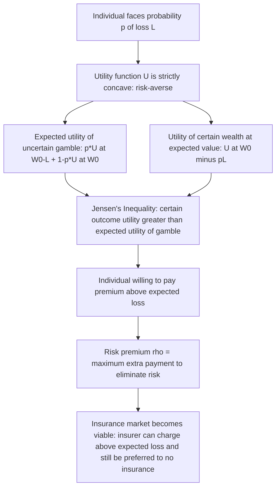

## Risk Aversion and the Demand for Insurance

### Definition and Conceptual Foundation

**Risk aversion** describes a preference structure in which an individual, facing a choice between a certain outcome and an uncertain outcome with the same expected value, prefers the certain outcome. Formally, an individual is risk-averse if their utility function over wealth $U(W)$ is **strictly concave**: $U''(W) < 0$. This concavity is the single most important microeconomic primitive underlying the theoretical demand for health insurance, because it implies that individuals are willing to pay *more* than the expected value of a loss to avoid bearing the risk of that loss — the wedge between what they'd pay and the expected loss is what makes insurance markets viable even though insurers must charge a premium above expected payout to cover administrative costs and profit.

This framework derives from **expected utility theory** (von Neumann and Morgenstern, 1944) and was applied specifically to insurance demand in the classic treatment by Arrow (1963, 1965) and Pratt (1964), whose risk-aversion measures remain the standard tools for characterizing how strongly an individual prefers certainty.

### The Basic Decision Problem

Consider an individual with initial wealth $W_0$ facing a probability $p$ of incurring a health loss $L$ (medical expense), with probability $(1-p)$ of no loss. Without insurance, expected wealth is:

$$E[W] = p(W_0 - L) + (1-p)W_0 = W_0 - pL$$

The individual's expected utility without insurance is:

$$EU_{no\ insurance} = p \cdot U(W_0 - L) + (1-p) \cdot U(W_0)$$

If offered **actuarially fair insurance** — a policy with premium $\pi = pL$ (exactly equal to the expected loss) that fully covers $L$ if the loss occurs — the individual's wealth becomes certain at $W_0 - pL$ in every state of the world, yielding:

$$EU_{insurance} = U(W_0 - pL)$$

By **Jensen's inequality**, for a strictly concave $U$:

$$U(W_0 - pL) = U(E[W]) > E[U(W)] = p \cdot U(W_0 - L) + (1-p) \cdot U(W_0)$$

This inequality is the formal core of the entire theory: a risk-averse individual strictly prefers the certain outcome of actuarially fair insurance to the uncertain uninsured gamble, **even though both have identical expected wealth**. This is the fundamental reason risk-averse individuals demand insurance at all — not to increase expected wealth (fair insurance leaves expected wealth unchanged), but to reduce the *variance* of wealth, which itself has negative utility value under concave preferences.

### The Risk Premium and Willingness to Pay

The **risk premium** $\rho$ is defined as the maximum amount above the actuarially fair premium an individual would be willing to pay to eliminate the risk entirely. It is the solution to:

$$U(W_0 - pL - \rho) = p \cdot U(W_0 - L) + (1-p) \cdot U(W_0)$$

Using a second-order Taylor approximation around $W_0$, the risk premium can be approximated as:

$$\rho \approx \frac{1}{2} \sigma^2 \cdot A(W_0)$$

where $\sigma^2 = p(1-p)L^2$ is the variance of the loss, and $A(W_0) = -\frac{U''(W_0)}{U'(W_0)}$ is the **Arrow-Pratt coefficient of absolute risk aversion**. This result is central: it shows that willingness to pay for insurance scales with both the *magnitude of the underlying risk* ($\sigma^2$) and the *individual's degree of risk aversion* ($A(W_0)$), and that insurance demand exists even for actuarially unfair premiums, as long as the premium loading does not exceed $\rho$.

### Measures of Risk Aversion

| Measure | Formula | Interpretation |
| --- | --- | --- |
| Absolute risk aversion (ARA) | $A(W) = -U''(W)/U'(W)$ | Sensitivity to risk on a fixed dollar-amount loss, as wealth varies |
| Relative risk aversion (RRA) | $R(W) = -W \cdot U''(W)/U'(W)$ | Sensitivity to risk on a loss proportional to wealth |
| Decreasing absolute risk aversion (DARA) | $A'(W) < 0$ | Willingness to accept a fixed-dollar gamble increases as wealth increases |

$[Inference]$ Most standard utility functions used in applied health economics (e.g., constant relative risk aversion, CRRA, utility) assume DARA because it matches commonly observed behavior (wealthier individuals are typically willing to self-insure smaller fixed losses), but the empirical stability of any single functional form across the full income distribution and across health-specific versus general financial risk is not settled, and functional form choice materially affects simulated insurance demand.

### Diagram: Why Concave Utility Generates Insurance Demand

### Illustration: Concave Utility and the Risk Premium

<svg xmlns="http://www.w3.org/2000/svg" viewBox="0 0 800 440" font-family="Arial, sans-serif">
<text x="400" y="28" text-anchor="middle" font-size="17" font-weight="bold" fill="#1a1a1a">Concave Utility, Expected Utility, and the Risk Premium (svg_diagram)</text>
<line x1="90" y1="380" x2="740" y2="380" stroke="#333" stroke-width="2" />
<text x="415" y="415" text-anchor="middle" font-size="13" fill="#333">Wealth (W)</text>
<line x1="90" y1="380" x2="90" y2="60" stroke="#333" stroke-width="2" />
<text x="45" y="220" text-anchor="middle" font-size="13" fill="#333" transform="rotate(-90 45 220)">Utility U(W)</text>

<path d="M 130 360 Q 300 220 680 90" fill="none" stroke="#4C72B0" stroke-width="3" />
<text x="600" y="110" font-size="11" fill="#4C72B0">U(W) - concave</text>

<line x1="200" y1="380" x2="200" y2="330" stroke="#666" stroke-dasharray="3,3" />
<circle cx="200" cy="330" r="5" fill="#C44E52" />
<text x="200" y="400" text-anchor="middle" font-size="11">W0 - L</text>
<line x1="600" y1="380" x2="600" y2="105" stroke="#666" stroke-dasharray="3,3" />
<circle cx="600" cy="105" r="5" fill="#C44E52" />
<text x="600" y="400" text-anchor="middle" font-size="11">W0</text>

<line x1="200" y1="330" x2="600" y2="105" stroke="#DD8452" stroke-width="2" />

<line x1="440" y1="380" x2="440" y2="192" stroke="#666" stroke-dasharray="3,3" />
<circle cx="440" cy="192" r="5" fill="#55A868" />
<text x="440" y="400" text-anchor="middle" font-size="11">E[W] = W0 - pL</text>

<circle cx="440" cy="245" r="5" fill="#DD8452" />

<line x1="440" y1="245" x2="440" y2="192" stroke="#333" stroke-width="2" />
<text x="470" y="220" font-size="11" fill="#333">Utility gap (risk premium effect)</text>

<text x="440" y="260" font-size="10" fill="`#DD8452`" text-anchor="middle">E[U(W)]</text>

<text x="440" y="180" font-size="10" fill="`#55A868`" text-anchor="middle">U(E[W])</text>

</svg>

### From Individual Risk Aversion to Market Insurance Demand

**Key Points**

- **Loading factor**: Real-world insurance premiums exceed the actuarially fair premium $pL$ by a **loading factor** covering administrative costs, adverse selection risk, and insurer profit: $\pi = (1+m)pL$ where $m$ is the loading percentage. An individual purchases insurance if and only if their risk premium $\rho$ exceeds the loading cost $m \cdot pL$ — meaning demand for insurance persists even at actuarially unfair prices as long as risk aversion is sufficiently high relative to the loading.
- **Deductibles and coinsurance as partial insurance**: Because full insurance at any positive loading is not always utility-maximizing (moral hazard costs and loading costs both favor partial coverage), the standard theoretical result (Mossin, 1968; Arrow, 1963) is that optimal insurance under proportional loading generally involves a **deductible** structure — insuring losses above a threshold fully, while leaving small losses uninsured, since the marginal utility gain from insuring a small, low-variance loss is outweighed by the loading cost for a sufficiently risk-tolerant range of outcomes.
- **Wealth effects on insurance demand**: Under decreasing absolute risk aversion, wealthier individuals exhibit lower absolute risk aversion for a fixed-dollar loss, predicting (all else equal) lower demand for full coverage of small, fixed-dollar medical expenses among wealthier individuals — though $[Inference]$ this prediction interacts heavily with the empirical fact that wealthier individuals often also have employer-sponsored coverage with tax-advantaged pricing, confounding a clean test of the pure risk-aversion channel.
- **Health-specific risk correlated with wealth risk**: Unlike idealized insurance models, major illness often reduces earning capacity *simultaneously* with imposing medical expense, meaning the "loss" $L$ in health insurance is frequently correlated with a decline in $W_0$ itself (income loss from inability to work) — amplifying the effective risk aversion relevant to health insurance demand relative to a pure property/casualty insurance analogy.

### Distinguishing Insurance Demand from Adjacent Concepts

- **Risk aversion vs. risk pooling**: Risk aversion is a *preference* characteristic of the individual demanding insurance; risk pooling is the *supply-side mechanism* (the law of large numbers across a large group of independent risks) that allows an insurer to offer a predictable premium. Both are necessary for the insurance market to function, but they operate on different sides of the transaction.
- **Actuarially fair vs. market insurance**: The Jensen's-inequality result formally guarantees demand only for actuarially fair insurance; demand for loaded (above-fair) insurance is a stronger empirical claim that depends on the specific magnitude of risk aversion, requiring the risk premium to exceed the loading rather than being guaranteed by concavity alone.
- **Risk aversion vs. moral hazard**: Risk aversion explains *why* individuals want insurance in the first place; moral hazard is the behavioral response *after* insurance is obtained (reduced incentive to prevent loss or economize on care), and the two interact in determining the second-best optimal insurance contract (full insurance would eliminate risk-bearing cost but maximize moral hazard cost; the observed contract balances the two).

### Empirical Approaches to Measuring Risk Aversion in Insurance Demand

- **Structural estimation from observed plan choice**: Using variation in premium/deductible menus (e.g., employer-sponsored plan choice sets) to back out an implied coefficient of risk aversion consistent with observed selection into higher- or lower-deductible plans.
- **Laboratory and survey-elicited risk preference measures**: Using lottery-choice experiments (e.g., Holt-Laury type tasks) to directly measure individual risk aversion, then testing correlation with subsequent real-world insurance purchase decisions.
- **Natural experiments in mandatory vs. voluntary coverage**: Comparing take-up rates and plan selection when subsidies or premiums change exogenously, to infer the price elasticity of demand implied by underlying risk preferences.

$[Inference]$ A well-documented empirical puzzle in this literature is that observed insurance purchasing behavior (for health and other risks) is not always well-fit by a single stable risk-aversion parameter across different decision domains for the same individual — someone who appears highly risk-averse in health insurance choices may appear risk-tolerant in investment choices — which has motivated alternative behavioral models (e.g., prospect theory, reference-dependence) as supplements to or replacements for the pure expected-utility framework in some applied work.

### Common Misconceptions

- Risk aversion does not imply that insurance increases expected wealth; under actuarially fair pricing, expected wealth is identical with or without insurance — the entire value of insurance to a risk-averse individual comes from reduced variance, not increased mean.
- A risk-averse individual is not necessarily willing to pay *any* premium for insurance; demand for loaded (above-fair) insurance requires the risk premium to exceed the specific loading charged, which depends on the magnitude of the underlying risk and the degree of risk aversion, not risk aversion alone.
- Full insurance coverage is not the utility-maximizing outcome for a risk-averse individual once realistic loading costs and moral hazard are introduced; the theoretically optimal contract under most standard models includes some cost-sharing (deductibles/coinsurance) rather than complete risk elimination.

### Related Topics

- Arrow-Pratt measures of absolute and relative risk aversion
- Expected utility theory and Jensen's inequality
- Optimal insurance contract design: deductibles and coinsurance (Mossin's theorem)
- Moral hazard and the coverage-incentive trade-off
- Adverse selection and the Rothschild-Stiglitz screening model
- Loading factors, administrative costs, and insurer pricing
- Behavioral alternatives to expected utility: prospect theory in insurance choice