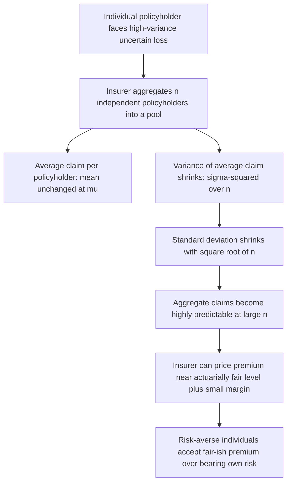

## Risk Pooling and the Law of Large Numbers

### Definition and Conceptual Foundation

**Risk pooling** is the supply-side mechanism by which an insurer aggregates a large number of individually uncertain, statistically independent (or weakly correlated) risks into a single portfolio, converting an unpredictable individual-level outcome into a predictable aggregate-level outcome. It is the structural counterpart to **risk aversion** on the demand side: risk aversion explains why individuals *want* to transfer risk away from themselves, while risk pooling explains *how* an insurer can profitably accept that risk and still offer a premium the individual is willing to pay.

The statistical foundation is the **law of large numbers (LLN)**: as the number of independent, identically distributed random variables in a sum grows, the sample mean converges (in probability) to the true expected value, and — critically for insurance — the *relative* variability of the sample mean shrinks toward zero. This is what allows an insurer to predict aggregate claims with far greater confidence than any single policyholder can predict their own individual claim experience.

### Formal Statement of the Law of Large Numbers in Insurance Context

Let $X_i$ be the loss random variable for policyholder $i$, with $E[X_i] = \mu$ and $Var(X_i) = \sigma^2$, and assume losses across policyholders are independent and identically distributed. The insurer's average claim per policyholder across a pool of $n$ policyholders is:

$$\bar{X}_n = \frac{1}{n}\sum_{i=1}^{n} X_i$$

The expected value of this average is unchanged regardless of pool size:

$$E[\bar{X}_n] = \mu$$

but the variance of the average **shrinks in proportion to pool size**:

$$Var(\bar{X}_n) = \frac{\sigma^2}{n}$$

and correspondingly the standard deviation (a measure of relative predictability) shrinks with $\sqrt{n}$:

$$SD(\bar{X}_n) = \frac{\sigma}{\sqrt{n}}$$

This $1/\sqrt{n}$ scaling is the single most important quantitative result in insurance economics: doubling the number of independent policyholders in a pool does not halve the uncertainty in average claims — it reduces it by a factor of $\sqrt{2} \approx 1.41$. Reducing uncertainty by half requires **quadrupling** the pool size. This nonlinear relationship explains why very small insurance pools (e.g., a small self-insured employer) face dramatically higher relative unpredictability than large national risk pools, even proportionally.

### Why This Matters for Insurer Solvency and Pricing

**Key Points**

- A single individual cannot self-insure efficiently against a rare, high-severity loss because their own realized outcome is either the full loss or nothing — there is no internal averaging mechanism.
- An insurer holding a large, diversified pool experiences aggregate claims that are close to deterministic (by the LLN), allowing it to set a premium based on the *expected* loss plus a small, calculable safety margin, rather than needing to hold reserves against the full variance of any individual claim.
- This is what makes actuarially fair (or near-fair) pricing *feasible* for the insurer to offer — risk pooling is the production-side technology that manufactures the "certain outcome" that risk-averse individuals value, as described in the demand-side theory of insurance.
- The **central limit theorem (CLT)**, a refinement of the LLN, further implies that for large $n$, the distribution of $\bar{X}_n$ approaches a normal distribution regardless of the shape of the individual loss distribution $X_i$, which is the statistical basis for standard actuarial reserve-setting and solvency capital calculations (e.g., value-at-risk style reserve requirements).

### Diagram: How Pool Size Reduces Aggregate Uncertainty

### Illustration: Convergence of Average Claims as Pool Size Grows

<svg xmlns="http://www.w3.org/2000/svg" viewBox="0 0 800 420" font-family="Arial, sans-serif">
<text x="400" y="28" text-anchor="middle" font-size="17" font-weight="bold" fill="#1a1a1a">Predictability of Average Claims as Pool Size Increases (svg_diagram)</text>
<line x1="90" y1="360" x2="740" y2="360" stroke="#333" stroke-width="2" />
<text x="415" y="395" text-anchor="middle" font-size="13" fill="#333">Pool Size (n)</text>
<line x1="90" y1="360" x2="90" y2="60" stroke="#333" stroke-width="2" />
<text x="45" y="210" text-anchor="middle" font-size="13" fill="#333" transform="rotate(-90 45 210)">Relative Uncertainty of Average Claim (SD/mean)</text>

<path d="M 130 100 Q 250 220 400 280 T 700 330" fill="none" stroke="#C44E52" stroke-width="3" />
<text x="500" y="255" font-size="12" fill="#C44E52">Uncertainty falls as 1/sqrt(n)</text>

<circle cx="150" cy="105" r="5" fill="#4C72B0" />
<text x="150" y="130" text-anchor="middle" font-size="11">n = 10</text>
<circle cx="330" cy="255" r="5" fill="#4C72B0" />
<text x="330" y="280" text-anchor="middle" font-size="11">n = 1,000</text>
<circle cx="560" cy="310" r="5" fill="#4C72B0" />
<text x="560" y="335" text-anchor="middle" font-size="11">n = 100,000</text>
<circle cx="700" cy="325" r="5" fill="#4C72B0" />
<text x="700" y="345" text-anchor="middle" font-size="10">n = 1,000,000</text>
</svg>

### Conditions Required for the Pooling Mechanism to Function

**Key Points**

- **Independence (or low correlation) across risks**: The variance-reduction result depends critically on losses across policyholders being statistically independent or only weakly correlated. If losses are highly correlated (e.g., a pandemic affecting many policyholders simultaneously, or a natural disaster), the $\sigma^2/n$ reduction breaks down because the pool behaves more like a single large correlated risk than $n$ independent small risks — the effective "n" for variance-reduction purposes is much smaller than the nominal pool size.
- **Sufficiently large pool size**: Small pools (e.g., small employer groups) retain meaningfully higher relative volatility in claims experience, which is one economic justification for **reinsurance** (insurers pooling risk with other insurers) and for regulatory minimum pool-size or stop-loss requirements in small-group insurance markets.
- **Homogeneous or well-characterized risk distributions**: The LLN guarantees convergence to the *pool's own* true mean $\mu$; it does not guarantee that $\mu$ is correctly estimated if the underlying population risk composition shifts (e.g., new enrollees with different risk profiles than the historical pool), which is a distinct estimation-risk problem from pure sampling variance.
- **No adverse selection distorting the risk composition**: Risk pooling as a statistical mechanism assumes the pool's composition is not itself being manipulated by asymmetric information (i.e., pool assumes a given, stable distribution of $X_i$); adverse selection processes (covered separately) can shift the *actual* composition of who enrolls, which is a demand-side/informational problem layered on top of, and distinct from, the pure statistical pooling mechanism.

### Risk Pooling vs. Risk Transfer: A Key Distinction

$[Inference]$ It is a common conceptual error to describe insurance purely as "risk transfer" from individual to insurer without recognizing that pure risk transfer to a single counterparty does not by itself reduce total risk in the system — it merely relocates it. The economically distinct contribution of *pooling* (as opposed to transfer alone) is the diversification effect: by combining many independent risks, the *total* variance borne by the system is reduced in relative terms (per-policyholder), not merely moved from one party to another. This distinction matters for understanding why reinsurance markets and larger risk pools (e.g., broader community rating pools, national exchanges) are generally understood to produce genuine efficiency gains rather than simply redistributing existing risk.

### Interaction with Other Insurance Concepts

| Concept | Relationship to Risk Pooling |
| --- | --- |
| Risk aversion (demand side) | Explains why individuals *want* to join a pool; pooling explains why an insurer *can* profitably offer them a stable premium |
| Adverse selection | A distortion of pool *composition* driven by private information, layered on top of (and potentially undermining) the pure statistical pooling mechanism |
| Community rating | A regulatory requirement that premiums reflect the *pooled* average risk rather than individual risk classification, directly leveraging the pooling mechanism for redistributive/access purposes |
| Reinsurance | A mechanism by which insurers pool risk with each other, extending the LLN benefit to a still-larger effective pool when any single insurer's book is not large enough for full diversification |
| Correlated/systemic risk (e.g., pandemics) | A structural limit on the pooling mechanism's effectiveness, since the LLN's variance-reduction result assumes low cross-policyholder correlation |

### Empirical and Actuarial Applications

- **Credibility theory**: Actuarial methods for blending a small pool's own limited claims experience with a larger reference population's experience, explicitly correcting for the fact that small $n$ produces unreliable direct estimates of $\mu$ even though the LLN guarantees convergence asymptotically.
- **Reserve and capital adequacy modeling**: Insurance regulators require capital reserves calibrated to the *residual* variance in the pool (via CLT-based value-at-risk or tail-risk measures) precisely because pooling reduces but never fully eliminates aggregate uncertainty, especially in the distribution's tail.
- **Small-group market stability studies**: Empirical work on small-employer health insurance markets studying premium volatility and insurer exit patterns as a direct function of typical group size, testing the practical relevance of the $1/\sqrt{n}$ relationship.
- **Catastrophic/correlated risk pricing models**: Actuarial and financial-economics literature on pandemic risk, natural catastrophe risk, and systemic financial risk explicitly modeling the breakdown of naive LLN-based pooling assumptions when risks are correlated, motivating alternative approaches (catastrophe bonds, government backstops) for that risk class.

### Common Misconceptions

- Risk pooling does not eliminate risk in the aggregate; it reduces the *relative* (per-capita) unpredictability of the average outcome, while the total dollar variance of aggregate claims can still grow with pool size in absolute terms even as it shrinks proportionally.
- A larger insurance pool is not automatically a *lower-cost* pool; pool size affects the *predictability* of average claims, not the underlying expected claim level $\mu$, which is determined by the health risk composition of the specific population enrolled, not by the pooling mechanism itself.
- Risk pooling and risk pricing (charging different premiums to different risk classes) are not the same thing and are not mutually exclusive; an insurer can pool a group of high-risk individuals together (gaining predictability) while still charging that group a higher premium than a pooled low-risk group, since pooling addresses *variance* while pricing addresses *mean* risk level.

### Related Topics

- Risk aversion and the demand for insurance (the reciprocal demand-side theory)
- Adverse selection and the Rothschild-Stiglitz screening model
- Community rating vs. experience rating in premium-setting
- Reinsurance and risk-sharing among insurers
- Actuarial credibility theory and reserve-setting under uncertainty
- Correlated/systemic risk and the limits of diversification (pandemic and catastrophe risk modeling)
- Central limit theorem applications in insurance solvency regulation