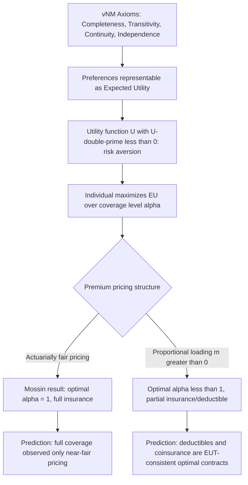

## Expected Utility Theory and Insurance Choice

### Definition and Conceptual Foundation

**Expected utility theory (EUT)**, formalized axiomatically by von Neumann and Morgenstern (1944) and extended to risk contexts by Pratt (1964) and Arrow (1965, 1971), is the dominant normative and positive framework for modeling decision-making under uncertainty in economics, and it is the theoretical backbone underlying nearly every model of insurance demand and contract design. It posits that a rational decision-maker facing uncertain outcomes evaluates a lottery (a set of possible outcomes with associated probabilities) by computing the **probability-weighted sum of the utility of each outcome**, rather than by evaluating outcomes on wealth levels alone, and chooses the option that maximizes this expected utility.

This chapter item consolidates and extends the risk-aversion foundations already established: where "Risk aversion and the demand for insurance" focused on the concavity of $U(W)$ and the risk premium, this item covers the broader axiomatic structure of EUT, how it generates specific testable predictions about insurance contract choice (not just the binary insure/don't-insure decision), and where the framework's empirical limits lie.

### The Axiomatic Foundations of Expected Utility

**Key Points**

Von Neumann-Morgenstern (vNM) expected utility theory rests on four axioms applied to preferences over lotteries. If preferences satisfy all four, they can be represented by an expected utility function:

- **Completeness**: For any two lotteries $A$ and $B$, the individual can rank them ($A \succeq B$, $B \succeq A$, or both).
- **Transitivity**: If $A \succeq B$ and $B \succeq C$, then $A \succeq C$.
- **Continuity**: If $A \succeq B \succeq C$, there exists some probability $p$ such that the individual is indifferent between $B$ for certain and a lottery yielding $A$ with probability $p$ and $C$ with probability $(1-p)$.
- **Independence**: If $A \succeq B$, then for any lottery $C$ and probability $p$, a compound lottery of $A$ with probability $p$ and $C$ with probability $(1-p)$ is weakly preferred to the analogous compound lottery with $B$ replacing $A$. This axiom is the most behaviorally restrictive and the one most frequently violated in empirical tests (see the Allais Paradox below).

$[Inference]$ The independence axiom in particular is a strong structural assumption rather than a directly observed behavioral regularity, and its violation is the primary motivator for the alternative models (prospect theory, rank-dependent utility) discussed later in this entry.

### The General Insurance Choice Problem Under EUT

Building on the binary insure/no-insure framework, EUT allows modeling of the **full contract choice problem**: given a menu of possible coverage levels $\alpha \in [0,1]$ (share of loss $L$ covered) at a premium $\pi(\alpha)$, the individual chooses $\alpha^*$ to maximize:

$$EU(\alpha) = p \cdot U(W_0 - L(1-\alpha) - \pi(\alpha)) + (1-p) \cdot U(W_0 - \pi(\alpha))$$

Differentiating with respect to $\alpha$ and setting the first-order condition to zero yields the classic **Mossin (1968) result**: under actuarially fair pricing ($\pi(\alpha) = \alpha p L$), a strictly risk-averse individual with $U'' < 0$ optimally chooses **full insurance** ($\alpha^* = 1$). Under a proportional loading ($\pi(\alpha) = (1+m)\alpha p L$ for $m > 0$), the optimal coverage is **strictly less than full** ($\alpha^* < 1$), and the optimal coverage level decreases as the loading factor $m$ increases. This is one of the most cited applied results in the EUT-insurance literature because it directly predicts (and is used to justify) the near-universal presence of deductibles and coinsurance in observed insurance contracts, rather than full-coverage policies.

### Diagram: From EUT Axioms to Contract Choice Prediction

### Deductibles vs. Coinsurance Under EUT

**Key Points**

- **Arrow's deductible theorem (1963, 1971)**: Among all insurance contracts with a given expected insurer payout (i.e., a fixed premium budget), the contract that **maximizes expected utility for a risk-averse individual is a straight deductible policy** — full coverage above a threshold $D$, zero coverage below it — rather than proportional coinsurance across the entire loss range. This is a striking and often-tested theoretical result: it implies coinsurance-style cost-sharing (a constant percentage across all loss sizes) is *not* EUT-optimal when the goal is pure risk reduction at minimum premium cost, even though coinsurance is extremely common in actual U.S. health insurance design.
- $[Inference]$ The prevalence of coinsurance rather than pure deductible structures in real health insurance markets is often attributed in the literature to **moral hazard control** rather than risk-pooling efficiency alone — coinsurance maintains some cost-sharing across the entire spending range, which a pure deductible-then-full-coverage structure would not do above the deductible threshold — meaning observed contract design reflects a second-best trade-off between the risk-reduction goal (favoring deductibles per Arrow's theorem) and the incentive-alignment goal (favoring proportional cost-sharing), not a simple failure to apply Arrow's result.

### Empirical Anomalies and Challenges to Expected Utility Theory

While EUT provides the dominant normative framework, several well-documented empirical patterns are difficult to reconcile with it in its pure form:

- **The Allais Paradox**: Experimental evidence (Allais, 1953) shows individuals commonly violate the independence axiom when choosing between lotteries with very high or very low probabilities, systematically overweighting small-probability extreme outcomes relative to what EUT predicts — directly relevant to insurance, since insurable events (catastrophic illness, major accidents) are frequently low-probability, high-severity events precisely in the probability range where the paradox is most pronounced.
- **The insurance-lottery puzzle**: Many individuals simultaneously purchase insurance (implying risk aversion) and gamble/buy lottery tickets (implying risk-seeking behavior for small-probability large gains), a pattern that pure globally-concave EUT struggles to accommodate without additional structure (e.g., Friedman-Savage utility functions with mixed concave/convex regions).
- **Observed under-insurance against catastrophic but low-probability risk**: Empirical insurance take-up for events with very low probability but very high severity (e.g., flood insurance, some forms of long-term care insurance) is frequently lower than standard EUT calibrations would predict, motivating explanations involving probability misperception, present bias, or narrow framing rather than pure risk-aversion parameters.
- **Reference dependence and loss aversion**: Prospect theory (Kahneman and Tversky, 1979) proposes that individuals evaluate outcomes relative to a reference point (rather than absolute final wealth as in EUT) and weight losses more heavily than equivalent gains, which can generate different — and in some tested cases better-fitting — predictions about insurance and deductible choice than standard EUT.

$[Inference]$ These anomalies are widely documented in the behavioral economics literature, but there is no single consensus alternative model that dominates EUT across all insurance applications; much applied health-insurance policy analysis continues to use standard EUT as a tractable baseline while treating behavioral deviations as an active research frontier rather than a settled replacement framework.

### Illustration: EUT-Predicted Optimal Contract vs. Arrow's Deductible Result

<svg xmlns="http://www.w3.org/2000/svg" viewBox="0 0 800 400" font-family="Arial, sans-serif">
<text x="400" y="28" text-anchor="middle" font-size="16" font-weight="bold" fill="#1a1a1a">Coverage Structure: Deductible vs. Coinsurance vs. Full Insurance (svg_diagram)</text>
<line x1="90" y1="340" x2="720" y2="340" stroke="#333" stroke-width="2" />
<text x="405" y="375" text-anchor="middle" font-size="13" fill="#333">Loss Size (L)</text>
<line x1="90" y1="340" x2="90" y2="60" stroke="#333" stroke-width="2" />
<text x="45" y="200" text-anchor="middle" font-size="13" fill="#333" transform="rotate(-90 45 200)">Insurer Payout</text>

<line x1="90" y1="340" x2="620" y2="90" stroke="#55A868" stroke-width="2" stroke-dasharray="5,3" />
<text x="630" y="90" font-size="11" fill="#55A868">Full insurance (alpha=1)</text>

<path d="M 90 340 L 260 340 L 620 130" fill="none" stroke="#C44E52" stroke-width="3" />
<text x="440" y="200" font-size="11" fill="#C44E52">Arrow-optimal deductible D</text>
<text x="260" y="360" text-anchor="middle" font-size="10">D</text>

<line x1="90" y1="340" x2="620" y2="180" stroke="#4C72B0" stroke-width="2" />
<text x="630" y="180" font-size="11" fill="#4C72B0">Coinsurance (constant %)</text>
</svg>

### Distinguishing EUT-Based Insurance Analysis from Adjacent Frameworks

| Framework | Reference Point | Key Prediction Relevant to Insurance |
| --- | --- | --- |
| Expected Utility Theory (vNM/Arrow-Pratt) | Absolute final wealth | Full insurance under fair pricing; deductible-optimal under loading (Mossin, Arrow) |
| Prospect Theory (Kahneman-Tversky) | Wealth relative to a reference point, with loss aversion | Can predict over-insurance of small/low-severity risks and under-insurance of some catastrophic risks depending on probability weighting |
| Rank-dependent utility / cumulative prospect theory | Reference-independent but with nonlinear probability weighting | Predicts systematic overweighting of small probabilities, relevant to catastrophic (low-probability) insurance demand |

### Empirical Testing Approaches

- **Structural estimation of risk-aversion parameters from deductible choice**: Using observed choices among deductible levels in employer-sponsored or individual-market insurance to back out an implied coefficient of absolute or relative risk aversion consistent with EUT, then testing out-of-sample predictive validity.
- **Direct tests of the independence axiom**: Presenting insurance-framed lottery choices (e.g., choices among probability/loss combinations) to test for Allais-type violations specifically in an insurance-relevant probability range.
- **Comparing EUT and prospect-theory model fit**: Structural comparison of which framework better predicts observed deductible choice, using likelihood-based model comparison on the same choice datasets.
- **Field experiments varying framing of insurance products**: Testing whether reframing identical actuarial contracts (e.g., as "protection against loss" vs. "investment with a probabilistic payout") changes uptake in ways EUT (which should be framing-invariant under the axioms) does not predict.

### Common Misconceptions

- Expected utility theory does not claim that individuals *consciously* perform expected-utility calculations; it is typically defended as an "as-if" model — a description of *as if* behavior were the output of such a calculation — rather than a claim about the actual cognitive process, though this interpretive distinction does not resolve empirical anomalies where behavior is inconsistent with *any* utility function satisfying the axioms.
- A violation of expected utility predictions in one context (e.g., lottery-ticket purchasing) does not imply the individual is irrational or that EUT is entirely inapplicable to their insurance decisions; behavioral economics generally treats EUT violations as domain- and context-specific rather than as evidence of globally incoherent preferences.
- Arrow's deductible-optimality theorem is a normative result about the utility-maximizing contract for a *given* premium budget and a pure risk-reduction objective; it does not by itself explain observed real-world contract design, which reflects additional considerations (moral hazard, insurer administrative constraints, regulatory mandates) not present in the base theorem.

### Related Topics

- Risk aversion and the demand for insurance (concavity, risk premium, Arrow-Pratt measures)
- Arrow's deductible theorem and Mossin's theorem on optimal coverage under loading
- Moral hazard and its role in explaining coinsurance versus pure deductible design
- Prospect theory and behavioral alternatives to expected utility
- The Allais Paradox and violations of the independence axiom
- Risk pooling and the law of large numbers (supply-side counterpart to EUT demand)
- Adverse selection and screening models built on expected-utility foundations (Rothschild-Stiglitz)