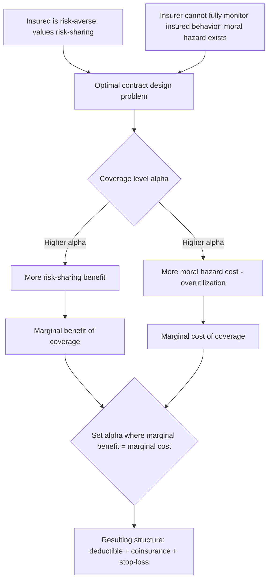

## Optimal Insurance Contract Design

### Definition and Conceptual Foundation

**Optimal insurance contract design** is the applied branch of insurance economics concerned with characterizing which contract structure — full coverage, deductibles, coinsurance, stop-loss limits, or combinations thereof — maximizes some well-defined objective (typically expected utility of the insured, or social welfare more broadly) subject to constraints on the insurer's side (loading costs, information limitations, moral hazard). It synthesizes and extends the demand-side theory (risk aversion, expected utility) and the supply-side theory (risk pooling, adverse selection, screening) already developed in this chapter into a unified framework for predicting and evaluating *actual contract terms*, rather than the binary insure/don't-insure decision alone.

The foundational results are due to Mossin (1968), Arrow (1963, 1971), and later extended substantially by Raviv (1979) to incorporate insurer risk aversion and administrative costs jointly, and by the broader contract theory literature (Holmström, 1979; Shavell, 1979) to formally incorporate moral hazard as a binding constraint on contract design rather than treating risk-sharing as the sole objective.

### The Core Trade-Off: Risk-Sharing vs. Incentive Provision

**Key Points**

Optimal contract design in the presence of both risk aversion and moral hazard is fundamentally a **second-best problem**: the first-best outcome (full insurance, since it maximizes risk-sharing for a risk-averse individual per Mossin's theorem under fair pricing) is not implementable once the insured's *effort or behavior* — care-seeking intensity, preventive behavior, provider selection — affects the probability or magnitude of loss and cannot be perfectly monitored by the insurer.

- **Full insurance** ($\alpha = 1$) maximizes risk-sharing but **minimizes the insured's incentive to control costs or loss probability**, since the insured bears none of the marginal cost of increased utilization (classic ex post moral hazard).
- **Zero insurance** ($\alpha = 0$) maximizes incentive alignment (the insured bears the full marginal cost of their choices) but **eliminates all risk-sharing value**, forcing the risk-averse individual to bear the full variance of the loss.
- The **optimal contract balances these two costs at the margin**: coverage is extended up to the point where the marginal risk-sharing benefit (in utility terms) equals the marginal moral-hazard cost (in expected-loss-inflation terms) imposed by that additional unit of coverage.

This trade-off can be represented formally as a constrained optimization: the insured's coverage level $\alpha^*$ solves

$$\max_{\alpha} \; EU(\alpha) \quad \text{s.t.} \quad \pi(\alpha) = (1+m) \cdot p(\alpha) \cdot L(\alpha)$$

where both the loss probability $p(\alpha)$ and/or severity $L(\alpha)$ are now **endogenous functions of the coverage level itself**, reflecting moral hazard — a key structural departure from the pure risk-aversion model, where $p$ and $L$ were treated as exogenous.

### Arrow's Deductible Theorem Revisited in the Design Context

Building on the result introduced under expected utility theory, Arrow's theorem establishes that **absent moral hazard**, a straight deductible is the expected-utility-maximizing contract for a fixed premium budget — no coverage below threshold $D$, full coverage above it. However, once moral hazard is introduced, this result is no longer the unconditional optimum, because a deductible-only structure that provides full coverage above $D$ removes *all* marginal cost-sharing incentive for spending above the deductible, potentially inducing large moral-hazard-driven overspending precisely in the range where the contract offers zero cost-sharing.

$[Inference]$ This tension is the standard economic explanation offered in the literature for why observed health insurance contracts in practice typically combine **multiple cost-sharing instruments simultaneously** (deductible + coinsurance + out-of-pocket maximum) rather than a pure deductible structure: each instrument addresses a different part of the risk-sharing/incentive trade-off across the spending distribution, though the precise optimal blend is model- and parameter-dependent rather than a single universally "correct" contract shape.

### The Standard Three-Part Contract Structure

| Contract Component | Spending Range | Primary Economic Function |
| --- | --- | --- |
| Deductible ($D$) | $0 to $D$ | Insured bears full marginal cost; controls small, low-value/discretionary utilization at minimal risk-sharing loss (since small losses generate little risk-premium value to insure) |
| Coinsurance ($c\%$) | $D$ to out-of-pocket maximum | Insured bears partial marginal cost; balances residual moral hazard incentive against residual risk-sharing need across the "middle" spending range |
| Out-of-pocket maximum / stop-loss ($M$) | Above $M$ | Insured bears zero marginal cost; restores full risk-sharing precisely for catastrophic, high-variance losses where the risk premium is largest and moral hazard concerns are smallest (since discretionary utilization is a minor share of catastrophic spending) |

This structure is often described in the literature as approximating the theoretically motivated shape in which cost-sharing intensity is **highest where moral hazard risk is highest relative to risk-sharing value** (small, discretionary spending) and **lowest where risk-sharing value is highest relative to moral hazard risk** (catastrophic, largely non-discretionary spending).

### Diagram: The Optimal Contract as a Balance of Two Costs

### Illustration: Marginal Benefit vs. Marginal Cost of Coverage

<svg xmlns="http://www.w3.org/2000/svg" viewBox="0 0 800 400" font-family="Arial, sans-serif">
<text x="400" y="28" text-anchor="middle" font-size="16" font-weight="bold" fill="#1a1a1a">Determining Optimal Coverage Level (svg_diagram)</text>
<line x1="90" y1="340" x2="720" y2="340" stroke="#333" stroke-width="2" />
<text x="405" y="375" text-anchor="middle" font-size="13" fill="#333">Coverage Level (alpha, 0 to 1)</text>
<line x1="90" y1="340" x2="90" y2="60" stroke="#333" stroke-width="2" />
<text x="45" y="200" text-anchor="middle" font-size="13" fill="#333" transform="rotate(-90 45 200)">Marginal Value</text>

<path d="M 130 100 Q 350 180 650 320" fill="none" stroke="#4C72B0" stroke-width="3" />
<text x="500" y="180" font-size="11" fill="#4C72B0">Marginal risk-sharing benefit (decreasing)</text>

<path d="M 130 320 Q 350 260 650 100" fill="none" stroke="#C44E52" stroke-width="3" />
<text x="500" y="260" font-size="11" fill="#C44E52">Marginal moral hazard cost (increasing)</text>

<circle cx="390" cy="210" r="6" fill="#333" />
<line x1="390" y1="210" x2="390" y2="340" stroke="#666" stroke-dasharray="4,4" />
<text x="390" y="360" text-anchor="middle" font-size="11">alpha*</text>
</svg>

### Extensions to the Basic Framework

**Key Points**

- **Insurer risk aversion / capital cost (Raviv, 1979)**: When the insurer is not risk-neutral (e.g., due to capital constraints or its own risk-bearing costs), the optimal contract generally involves **coinsurance even above any deductible**, because full coverage above a deductible would force the insurer to bear all upper-tail risk — a result that helps explain observed coinsurance in the upper spending range beyond what pure insured-side moral hazard alone would predict.
- **Multiple, imperfectly correlated loss types**: When health risk includes both discretionary (elective, price-sensitive) and non-discretionary (emergency, life-threatening) components, optimal design literature suggests **differential cost-sharing by service type** — e.g., higher cost-sharing for elective/discretionary services and near-full coverage for emergency or high-severity services — reflecting the differential moral-hazard elasticity across service categories.
- **Adverse selection interaction**: Optimal contract design under simultaneous adverse selection (unobserved risk type) and moral hazard (unobserved effort) is a substantially harder joint problem than either alone; the Rothschild-Stiglitz screening framework and the Arrow/Mossin risk-sharing framework generate potentially conflicting prescriptions (screening favors a *menu* of differentiated contracts to separate types, while pure risk-sharing optimization for a *given* type favors the single Arrow/Mossin-optimal structure), and reconciling the two is an active area of contract-theoretic research rather than a fully settled result.
- **Behavioral and bounded-rationality considerations**: $[Inference]$ Some applied literature incorporates evidence that consumers may not optimize deductible/coinsurance choice as EUT would predict (e.g., systematic mis-valuation of low-probability, high-deductible plans), suggesting that "optimal" contract design from a pure social-welfare standpoint may diverge from what a naive revealed-preference approach would recommend — this remains a contested and evolving area rather than a resolved consensus.

### Distinguishing Optimal Contract Design from Adjacent Concepts

- **Optimal contract design vs. Arrow's deductible theorem**: Arrow's theorem is a special-case result (no moral hazard, fixed premium budget) nested within the broader optimal-design literature; full contract design theory relaxes Arrow's no-moral-hazard assumption and generally predicts more complex, multi-instrument contracts as a result.
- **Optimal contract design vs. actual observed contracts**: The theoretical literature characterizes what an *unconstrained* optimizer would choose given specified assumptions about utility, moral hazard elasticity, and loading costs; actual health insurance contract design also reflects regulatory mandates (e.g., minimum benefit standards, essential health benefits requirements), employer administrative preferences, and historical/institutional path dependence not captured in the pure optimization model.
- **Moral hazard vs. adverse selection as design constraints**: Moral hazard is a *behavioral response* constraint (insured's actions change once insured) that shapes optimal contract *shape*; adverse selection is an *information* constraint (insurer doesn't know insured's risk type) that shapes optimal contract *menus*. Both act as binding constraints simultaneously in realistic settings but originate from distinct informational problems.

### Empirical Testing and Calibration Approaches

- **Structural estimation of moral hazard elasticity**: Using natural experiments in cost-sharing (e.g., the RAND Health Insurance Experiment and its successors) to estimate how utilization responds to coinsurance rate changes, providing the key empirical input (the moral-hazard cost curve) needed to calibrate the optimal-contract trade-off.
- **Welfare simulation studies**: Combining estimated risk-aversion parameters and estimated moral-hazard elasticities into structural models that simulate the welfare-maximizing contract shape under specified loading assumptions, then comparing the simulated optimum to observed contract menus.
- **Natural experiments in mandated benefit design changes**: Studying utilization and welfare outcomes when regulation shifts observed contracts toward or away from theoretically predicted optimal shapes (e.g., changes in permissible deductible/out-of-pocket maximum limits).
- **Comparative international contract design studies**: Comparing cost-sharing structures across health systems with different regulatory and market environments as an indirect test of which design features are robust to institutional variation versus contingent on specific market conditions.

### Common Misconceptions

- Optimal insurance contract design does not have a single universally correct answer independent of context; the optimal coverage shape is a function of the specific risk-aversion parameters, moral-hazard elasticity, and loading costs assumed, all of which vary across populations, service types, and health systems.
- A pure deductible (Arrow's theorem) is not the real-world "gold standard" contract design once moral hazard is taken seriously; the theorem's optimality is conditional on the absence of behavioral response to coverage, which is a simplifying assumption relaxed in the broader design literature.
- Higher cost-sharing is not unambiguously welfare-improving even when it successfully reduces moral-hazard-driven overutilization; the RAND-style empirical literature and subsequent work document that cost-sharing can also reduce clinically valuable, non-discretionary care, meaning the net welfare effect of any specific cost-sharing increase is an empirical question requiring evidence on the composition of the utilization being deterred, not solely on the aggregate utilization reduction achieved.

### Related Topics

- Expected utility theory and insurance choice (Mossin's and Arrow's foundational theorems)
- Moral hazard: ex ante and ex post distinctions and empirical measurement
- Risk aversion and the demand for insurance (the risk-sharing side of the trade-off)
- Adverse selection and the Rothschild-Stiglitz screening model (the joint-problem complication)
- The RAND Health Insurance Experiment and cost-sharing elasticity estimation
- Raviv's model of insurer risk aversion and coinsurance above the deductible
- Value-based insurance design (differential cost-sharing by clinical value of service)