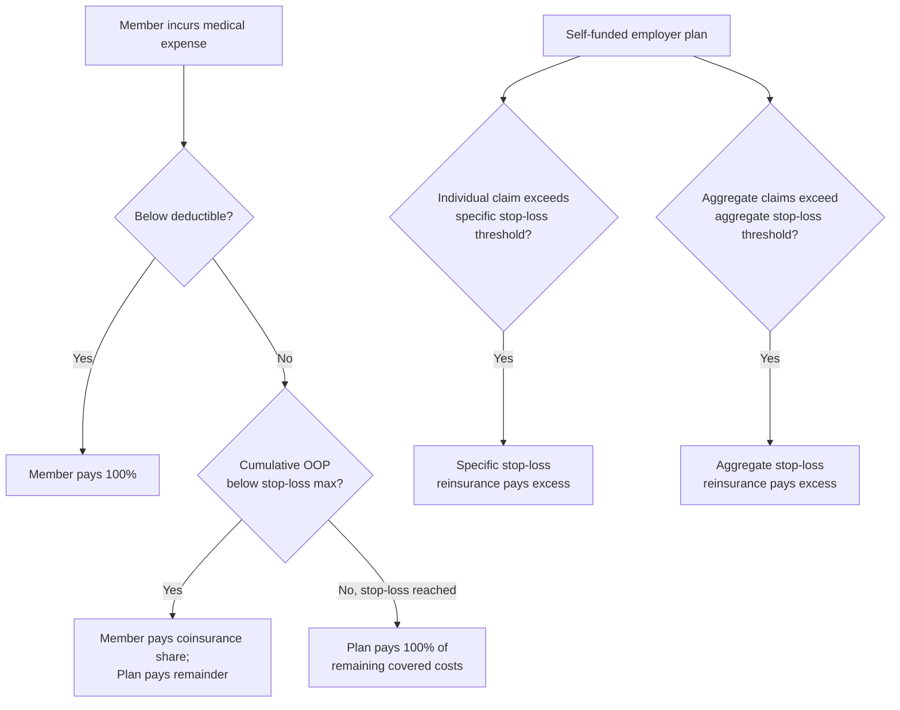

## Deductibles, Coinsurance, and Stop-Loss Provisions

### Definitions and Basic Mechanics

Cost-sharing instruments determine how the financial burden of covered health expenditures is split between the insured individual and the insurer. The three core mechanisms addressed here are structurally distinct but jointly determine the shape of an individual's out-of-pocket (OOP) liability as a function of total covered spending.

**Deductible ($D$)**: A fixed dollar threshold that the insured must pay out-of-pocket before the insurer begins contributing toward covered expenses. Below the deductible, the insured typically bears 100% of costs (absent copay-only services carved out by plan design, such as some primary care visits under high-deductible plans).

**Coinsurance ($c$)**: The percentage share of costs the insured continues to pay *after* the deductible is met, with the insurer paying the remaining $(1-c)$ share. Coinsurance differs from a copayment, which is a flat dollar amount per service rather than a percentage of cost.

**Stop-loss (out-of-pocket maximum, $M$)**: A ceiling on total out-of-pocket spending within a policy period (typically a plan year). Once cumulative OOP spending reaches $M$, the insurer pays 100% of additional covered costs for the remainder of the period.

**Key Points**

- These three parameters jointly define a piecewise-linear OOP liability function.
- They are core tools for addressing the ex post moral hazard problem inherent to insurance (see below), while stop-loss provisions simultaneously preserve the risk-pooling function that is insurance's core value proposition.
- Plan design requires balancing incentive effects (deductibles/coinsurance) against financial protection (stop-loss).

### The Out-of-Pocket Liability Function

For total covered medical expenditure $X$, out-of-pocket spending $OOP(X)$ under a standard deductible-coinsurance-stop-loss design is:

$$OOP(X) = \begin{cases}
X & 0 \le X \le D \\
D + c(X - D) & D < X \le D + \dfrac{M - D}{c} \\
M & X > D + \dfrac{M - D}{c}
\end{cases}$$

The threshold $D + \frac{M-D}{c}$ is the total expenditure level at which the stop-loss binds — the point where cumulative OOP payments (deductible plus accumulated coinsurance) reach $M$.

**Example**

Consider a plan with $D = \$1{,}500$, $c = 20\%$ (0.20), and $M = \$6{,}000$.

- If $X = \$1{,}000$: OOP $= \$1{,}000$ (below deductible, insured pays it all).
- If $X = \$10{,}000$: Deductible consumes $1,500, leaving $8,500 subject to coinsurance. Insured pays $0.20 \times 8{,}500 = \$1{,}700$ in coinsurance, plus the $1,500 deductible, totaling $3,200 OOP (below stop-loss, so this is correct).
- Stop-loss binds at $X = 1{,}500 + \frac{6{,}000 - 1{,}500}{0.20} = 1{,}500 + 22{,}500 = \$24{,}000$. For any $X > \$24{,}000$, OOP remains capped at $6,000.

### Graphical Representation of the OOP Function

<svg xmlns="http://www.w3.org/2000/svg" viewBox="0 0 640 420">
<text x="320" y="24" text-anchor="middle" font-size="15" font-weight="bold" fill="#1a1a1a">Out-of-Pocket Spending vs. Total Covered Expenditure (svg_diagram)</text>

<line x1="80" y1="360" x2="580" y2="360" stroke="#333" stroke-width="2" />
<line x1="80" y1="360" x2="80" y2="50" stroke="#333" stroke-width="2" />
<text x="330" y="395" text-anchor="middle" font-size="13" fill="#333">Total Covered Expenditure (X)</text>
<text x="30" y="205" text-anchor="middle" font-size="13" fill="#333" transform="rotate(-90 30 205)">Out-of-Pocket Spending</text>

<line x1="80" y1="360" x2="180" y2="260" stroke="#b2182b" stroke-width="3" />
<text x="100" y="330" font-size="11" fill="#b2182b">slope = 1</text>

<line x1="180" y1="260" x2="420" y2="180" stroke="#2166ac" stroke-width="3" />
<text x="270" y="205" font-size="11" fill="#2166ac">slope = c</text>

<line x1="420" y1="180" x2="560" y2="180" stroke="#238b45" stroke-width="3" />
<text x="450" y="165" font-size="11" fill="#238b45">slope = 0 (capped at M)</text>

<line x1="180" y1="360" x2="180" y2="260" stroke="#999" stroke-width="1" stroke-dasharray="4,3" />
<text x="150" y="378" font-size="11" fill="#555">D</text>
<line x1="420" y1="360" x2="420" y2="180" stroke="#999" stroke-width="1" stroke-dasharray="4,3" />
<text x="400" y="378" font-size="11" fill="#555">Stop-loss threshold</text>
<line x1="80" y1="180" x2="420" y2="180" stroke="#999" stroke-width="1" stroke-dasharray="4,3" />
<text x="45" y="184" font-size="11" fill="#555">M</text>
<circle cx="180" cy="260" r="4" fill="#1a1a1a" />
<circle cx="420" cy="180" r="4" fill="#1a1a1a" />
</svg>

### Economic Rationale: The Trade-off Between Moral Hazard and Risk Protection

Cost-sharing exists because full insurance ($c=0$, $D=0$) eliminates the price signal at the point of care, inducing **ex post moral hazard**: since the marginal price of care to the insured is zero, the insured (jointly with their provider) consumes care up to the point where marginal *clinical* benefit is zero, rather than the point where marginal benefit equals marginal social cost. This generates a classic welfare triangle loss.

Formally, under full insurance, the individual's demand for care $Q$ responds to price $P \cdot (1-c)$ rather than $P$. As $c \to 0$, quantity demanded rises toward the point where marginal value is zero (given zero marginal price), even though the resource cost of that care remains $P > 0$. The resulting welfare loss from overconsumption is approximately:

$$\text{DWL} \approx \frac{1}{2} \cdot \Delta P \cdot \Delta Q$$

where $\Delta P = c \cdot P$ is the price distortion and $\Delta Q$ is the resulting quantity response, governed by the price elasticity of demand for medical care.

Cost-sharing (positive $D$ and $c$) restores some price sensitivity, reducing the moral hazard welfare loss, but at the cost of increasing the insured's exposure to financial risk — the very risk insurance exists to pool. This is the central trade-off in insurance design: the **Zeckhauser trade-off** (Zeckhauser, 1970), which formalizes that optimal cost-sharing balances the marginal welfare gain from reduced moral hazard against the marginal welfare loss from reduced risk protection.

Stop-loss provisions exist precisely to bound this trade-off: they ensure that even as $c$ and $D$ discourage low-value marginal utilization, the insured's exposure to catastrophic financial risk from high-cost, low-probability events (which is the primary risk that insurance is meant to pool) remains capped.

**Key Points**

- Deductibles and coinsurance address moral hazard by restoring marginal price sensitivity.
- Stop-loss provisions address the residual risk-protection failure that pure cost-sharing would otherwise create for catastrophic expenditures.
- The RAND Health Insurance Experiment (1970s–1980s) remains the most frequently cited empirical source establishing that cost-sharing reduces utilization, including some utilization of effective care, without conclusively demonstrating harm to health outcomes for the average enrollee (though effects were more adverse for low-income, sicker subgroups). [Inference: subgroup-level health effects from RAND HIE are more contested than the aggregate utilization-reduction finding, which is well-established.]

### Deductible Design Variants

| Variant | Mechanism | Common Use Case |
| --- | --- | --- |
| Individual deductible | Applies per covered person | Standard individual/family plans |
| Family (aggregate) deductible | Family members' expenses accumulate toward one shared deductible | Family plans; can create free-riding within family once met |
| Embedded family deductible | Family deductible exists, but no individual pays more than their own (lower) individual deductible | Common in ACA-compliant plans to protect against one member bearing full family deductible alone |
| High-deductible health plan (HDHP) | Deductible set above a statutory minimum threshold (adjusted annually) to qualify for HSA pairing | Consumer-directed health plans |
| Embedded vs. non-embedded stop-loss | Analogous individual/family logic applied to the OOP maximum | Regulatory requirement under the ACA for family plans |

[Unverified: specific statutory HDHP minimum deductible and HSA contribution limits change annually via IRS inflation adjustments; consult current-year IRS guidance for exact figures rather than treating any cited number as durable.]

### Coinsurance Design Considerations

Coinsurance rates are typically uniform (e.g., 20% for in-network care) but can be **differentiated by service category** to reflect value-based insurance design (VBID) principles:

- Lower coinsurance (or $0\%$) for high-value services (e.g., preventive care, chronic disease management medications) to avoid discouraging clinically beneficial, cost-effective utilization.
- Higher coinsurance for discretionary, low-value, or elective services.
- Tiered coinsurance by provider network status (in-network vs. out-of-network) to steer utilization toward preferred, typically lower-cost providers.

This differentiation reflects the recognition that a uniform coinsurance rate is a blunt instrument: it discourages both low-value marginal care (the intended effect) and high-value marginal care (an unintended side effect), since patients often cannot perfectly distinguish which category a recommended service falls into at the point of decision (again, an information problem).

### Stop-Loss Provisions in Regulatory Context

In U.S. ACA-compliant individual and small-group markets, annual out-of-pocket maximums are subject to a statutory ceiling that is adjusted annually for inflation, applying to all essential health benefits delivered in-network. Self-funded employer plans (governed by ERISA) are not subject to identical state insurance regulations but generally still apply an internal OOP maximum for stop-loss purposes, often reinsured through **stop-loss insurance purchased by the employer** — a distinct but related concept referring to the employer's own risk protection against catastrophic claims from its self-insured plan, layered as:

- **Specific (individual) stop-loss**: Reinsurance attaching once a single claimant's costs exceed a specified threshold.
- **Aggregate stop-loss**: Reinsurance attaching once the plan's total claims across all members exceed a specified threshold relative to expected claims.

This employer-level stop-loss insurance is conceptually the same risk-transfer mechanism as member-level OOP maximums, but operates one layer up in the risk-bearing chain (employer transferring risk to a reinsurer, rather than member transferring risk to the plan).

### Adverse Selection Interactions

Cost-sharing structure interacts with adverse selection dynamics because plans with different $(D, c, M)$ combinations attract different risk pools:

- Individuals who anticipate high health expenditure (adverse selectors) disproportionately prefer plans with lower deductibles and lower coinsurance, holding premium differences aside, because they expect to exceed the deductible and benefit from lower marginal cost-sharing.
- Low-expected-utilization individuals disproportionately select high-deductible plans, particularly when paired with tax-advantaged savings vehicles (HSAs), since they expect to rarely cross the deductible threshold.
- This selection dynamic is a core reason regulators (e.g., under the ACA) standardize cost-sharing tiers (metal tiers: Bronze, Silver, Gold, Platinum, each targeting a specific **actuarial value** — the average share of costs the plan covers for a standard population) rather than allowing unlimited cost-sharing customization, to limit the degree to which plan design itself can be used as a risk-selection tool.

### Actuarial Value and Cost-Sharing Parameters

Actuarial value (AV) is the expected percentage of total allowed costs that a plan will cover for a standard population, and is mechanically a function of $D$, $c$, and $M$ (along with copay structures and covered benefit scope):

$$AV = \frac{E[\text{plan-paid costs}]}{E[\text{total allowed costs}]} = 1 - \frac{E[OOP(X)]}{E[X]}$$

Given a fixed target AV (e.g., 70% for a Silver plan under ACA metal tiers), there are infinitely many $(D, c, M)$ combinations that achieve it — for instance, a lower deductible can be offset by higher coinsurance, or a higher stop-loss can be offset by a lower deductible. Actuarial modeling (using claims distribution data across the relevant population) is required to solve for a design meeting the target AV, since the OOP function is a nonlinear (piecewise) function of the underlying spending distribution, not a simple linear average.

**Key Points**

- AV is a population-level expected-value concept, not a guarantee for any individual member (whose realized cost share will differ based on their own utilization).
- Because health expenditure is highly right-skewed (a small share of enrollees account for a large share of total spending), the stop-loss parameter $M$ has an outsized effect on AV, since it is the parameter binding for the highest-cost enrollees who drive most aggregate spending.

### Behavioral and Design Complications

Real-world cost-sharing design faces several well-documented complications beyond the basic model:

- **Deductible reset timing**: Annual deductible resets create end-of-year vs. start-of-year utilization timing distortions, as patients rationally shift discretionary, deferrable care to align with when they have already met the deductible.
- **Salience and complexity**: Behavioral economics research suggests that the complexity of multi-parameter cost-sharing schedules can reduce the effectiveness of the intended price signal, since patients frequently cannot accurately predict their own position on the $OOP(X)$ curve at the point of a care decision. [Inference: the magnitude of this "salience gap" effect on utilization behavior is an active empirical research area rather than a settled quantitative parameter.]
- **Preventive care carve-outs**: Many plans exempt specified preventive services from the deductible entirely (paying 100% pre-deductible), reflecting a policy judgment (and, in ACA-regulated plans, a regulatory requirement) that price-sensitivity for preventive care generates negative long-run welfare effects disproportionate to any short-run moral hazard savings.

### Conclusion

Deductibles, coinsurance, and stop-loss provisions are the three interlocking parameters that jointly resolve the central design tension in health insurance: reducing moral hazard–driven overconsumption while preserving the catastrophic-risk-pooling function that justifies insurance's existence. Deductibles and coinsurance restore marginal price sensitivity at the point of care; stop-loss provisions bound the resulting financial exposure so that the price-sensitivity mechanism does not undermine the core risk-protection purpose of the policy. Their joint calibration — formalized through the actuarial value concept — is further complicated by adverse selection dynamics, the skewed distribution of health expenditure, and behavioral limitations in how patients actually perceive and respond to complex, nonlinear cost-sharing schedules.

**Related Topics**

- The RAND Health Insurance Experiment and its methodology
- Value-based insurance design (VBID)
- Health Savings Accounts (HSAs) and high-deductible health plan pairing
- Actuarial value and ACA metal tier regulation
- Adverse selection and risk adjustment mechanisms
- Employer self-funding and stop-loss reinsurance markets
- Price elasticity of demand for medical care
- Ex ante vs. ex post moral hazard distinctions