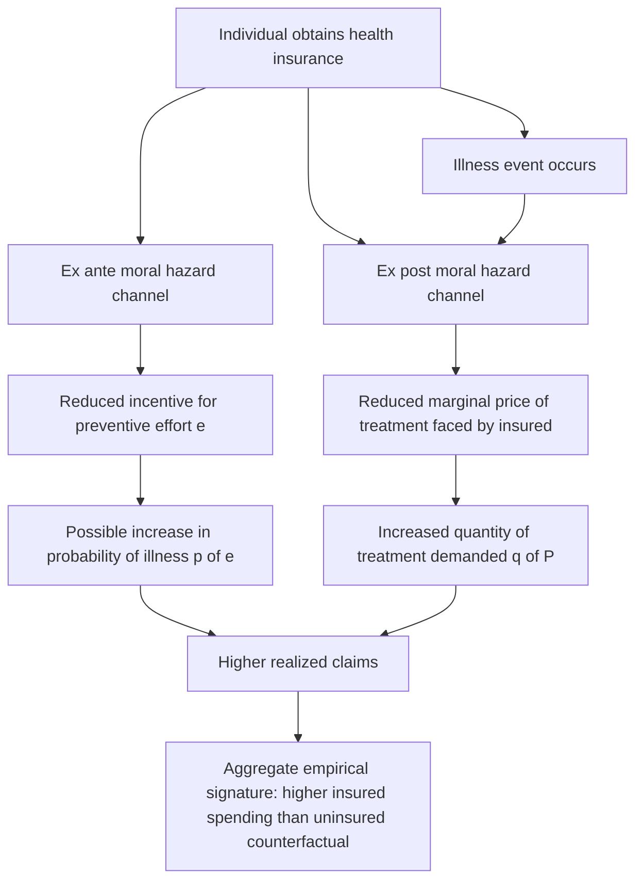

## Ex Ante and Ex Post Moral Hazard

### Definition and Conceptual Foundation

**Moral hazard** in health insurance refers to the change in an insured individual's behavior that results from being insulated, partially or fully, from the financial consequences of their own actions. The term originates in insurance economics generally but was formalized specifically for health care by Pauly (1968), building on Arrow's (1963) initial identification of moral hazard as one of the core market failures distinct from pure information asymmetry between patient and provider. The distinction between **ex ante** and **ex post** moral hazard — introduced most explicitly by Ehrlich and Becker (1972) and Zeckhauser (1970) — separates moral hazard by *timing relative to the health event*, and this distinction carries substantively different implications for contract design, welfare analysis, and empirical measurement.

- **Ex ante moral hazard** occurs *before* the health event (illness or injury) materializes, and concerns the insured's reduced incentive to engage in loss-*prevention* behavior once insured — because insurance reduces the financial cost of the loss occurring, it also reduces the insured's incentive to invest effort or resources in preventing that loss in the first place.
- **Ex post moral hazard** occurs *after* the health event has already occurred, and concerns the insured's increased incentive to consume more *treatment* once insured, because the marginal price of care faced by the insured is reduced (partially or fully) relative to the true resource cost of that care.

### Formal Distinction

Let $p(e)$ be the probability of illness, a decreasing function of preventive effort $e$ (e.g., exercise, diet, preventive screening, safety behavior), and let $q(P)$ be the quantity of treatment demanded once ill, a decreasing function of the price $P$ actually faced by the insured (the coinsurance-adjusted price, not the full price).

**Ex ante moral hazard** is captured by the effect of insurance on preventive effort:

$$\frac{\partial e^*}{\partial \alpha} < 0$$

where $\alpha$ is the coverage level — as coverage increases, optimal preventive effort $e^*$ decreases, because the insured no longer bears the full financial consequence of $p(e)$ being higher.

**Ex post moral hazard** is captured by the effect of insurance on treatment demand once ill:

$$\frac{\partial q^*}{\partial \alpha} > 0$$

as coverage increases, the effective marginal price paid by the insured, $P_{insured} = (1-\alpha) \cdot P_{market}$, falls, and by the standard law of demand, quantity demanded $q^*$ rises above what would be demanded at the full market price.

$[Inference]$ These two effects are conceptually and mathematically distinct — one operates on the probability of the loss event, the other on the quantity of response conditional on the event already occurring — but both produce the same aggregate empirical signature (higher insured spending than an uninsured counterfactual would predict), which is why disentangling the two channels empirically requires research designs that separately track preventive behavior and treatment-seeking behavior, not just aggregate spending.

### Ex Ante Moral Hazard: Detailed Mechanisms

**Key Points**

- **Reduced investment in preventive health behaviors**: Diet, exercise, smoking cessation, safety equipment use, and preventive screening uptake may all, in principle, respond to the financial insulation insurance provides against the downstream cost of illness — the classic prediction is that fully insured individuals have weaker financial incentive to avoid becoming ill in the first place.
- **This is the least empirically robust form of moral hazard**: $[Inference]$ Empirical evidence for a strong ex ante moral hazard effect specifically in health insurance (as opposed to other insurance lines like auto or property insurance, where the effect is often more clearly documented) is comparatively weaker and more contested, plausibly because health outcomes depend on many factors — genetics, habit formation, non-financial motivations for health behavior (feeling well, social factors) — that are far less sensitive to the specific financial insurance margin than, say, whether someone installs a home security system.
- **Distinction from behavioral/psychological explanations**: Some observed "underinvestment" in prevention among insured individuals may reflect present bias, imperfect information about risk, or non-financial barriers rather than a pure rational response to reduced financial exposure, meaning attributing all such patterns to ex ante moral hazard in the strict economic sense requires careful empirical disentangling from these alternative explanations.

### Ex Post Moral Hazard: Detailed Mechanisms

**Key Points**

- **The dominant and most empirically documented form of moral hazard in health economics**: Once illness occurs, the reduced marginal price of care faced by insured individuals is predicted — and extensively empirically confirmed — to increase the quantity of care consumed relative to an uninsured or higher-cost-sharing counterfactual.
- **The RAND Health Insurance Experiment** (Newhouse et al., 1970s–1980s) remains the canonical large-scale randomized study establishing that individuals randomly assigned to more generous (lower cost-sharing) health insurance plans consumed substantially more medical care than those assigned to less generous plans, providing direct experimental confirmation of ex post moral hazard's existence and rough empirical magnitude for the population and era studied.
- **The "welfare loss" interpretation of ex post moral hazard (Pauly, 1968; Feldstein, 1973)**: In the standard Pauly framework, ex post moral hazard is analyzed as a **standard price-distortion deadweight loss**: because the insured faces a price below the true marginal resource cost of care, they consume units of care whose marginal value to them is below the true marginal cost of production, generating an efficiency loss analogous to any subsidized-good overconsumption problem in public economics.
- **Distinguishing "wasteful" from "valuable" induced utilization**: A key and long-running debate (beginning with Nyman, 1999, and others) concerns whether *all* ex post moral hazard-induced utilization represents pure welfare loss, or whether some portion reflects a genuine **income transfer effect** — insurance effectively transfers wealth from the healthy state to the sick state, and some of the increased utilization when sick reflects the insured *rationally* consuming more care now that they have more effective resources available in the sick state, which is not necessarily inefficient in the same way as a pure price distortion.

### Diagram: Ex Ante vs. Ex Post Moral Hazard Timing and Mechanism

### Illustration: Ex Post Moral Hazard as a Standard Price-Distortion Welfare Loss

<svg xmlns="http://www.w3.org/2000/svg" viewBox="0 0 800 420" font-family="Arial, sans-serif">
<text x="400" y="28" text-anchor="middle" font-size="16" font-weight="bold" fill="#1a1a1a">Ex Post Moral Hazard: Demand Response to Insured Price (svg_diagram)</text>
<line x1="90" y1="360" x2="720" y2="360" stroke="#333" stroke-width="2" />
<text x="405" y="395" text-anchor="middle" font-size="13" fill="#333">Quantity of Care (q)</text>
<line x1="90" y1="360" x2="90" y2="60" stroke="#333" stroke-width="2" />
<text x="45" y="210" text-anchor="middle" font-size="13" fill="#333" transform="rotate(-90 45 210)">Price</text>

<path d="M 120 90 Q 350 220 680 340" fill="none" stroke="#4C72B0" stroke-width="3" />
<text x="600" y="300" font-size="11" fill="#4C72B0">Demand curve</text>

<line x1="120" y1="150" x2="680" y2="150" stroke="#55A868" stroke-width="2" stroke-dasharray="5,3" />
<text x="600" y="140" font-size="11" fill="#55A868">True marginal cost (market price)</text>

<line x1="120" y1="280" x2="680" y2="280" stroke="#C44E52" stroke-width="2" stroke-dasharray="5,3" />
<text x="600" y="295" font-size="11" fill="#C44E52">Insured marginal price (1-alpha)*P</text>

<line x1="300" y1="360" x2="300" y2="150" stroke="#999" stroke-dasharray="3,3" />
<text x="300" y="380" text-anchor="middle" font-size="10">q at market price</text>

<line x1="480" y1="360" x2="480" y2="280" stroke="#999" stroke-dasharray="3,3" />
<text x="480" y="380" text-anchor="middle" font-size="10">q at insured price (moral hazard induced)</text>

<polygon points="300,150 480,280 480,150" fill="#DD8452" opacity="0.4" />
<text x="400" y="180" font-size="10" fill="#DD8452">Deadweight loss</text>
</svg>

### Empirical Measurement Approaches

- **The RAND Health Insurance Experiment and successor studies**: Randomized assignment to differing cost-sharing arms remains the gold-standard design for isolating ex post moral hazard's causal effect on utilization, since randomization removes the confounding from unobserved health status that plagues observational comparisons of insured vs. uninsured spending.
- **Natural experiments in coinsurance/deductible changes**: Studies exploiting exogenous changes in cost-sharing (e.g., plan redesigns, policy-driven benefit changes) to estimate price elasticity of medical care demand as a direct measure of the ex post channel's magnitude.
- **Regression discontinuity designs around deductible thresholds**: Comparing utilization just above and just below a deductible reset point (e.g., calendar year-end "spend-down" behavior) to isolate moral-hazard-consistent responses to the marginal price change.
- **Difference-in-differences around preventive-care mandates**: Some studies test the ex ante channel by examining whether preventive behavior (e.g., screening uptake, smoking rates) changes differentially when insurance coverage or cost-sharing for prevention-adjacent activities changes, though $[Inference]$ this evidence base is considerably thinner and more mixed than the ex post literature.

### Distinguishing Moral Hazard from Related Concepts

- **Ex ante/ex post moral hazard vs. adverse selection**: Adverse selection concerns *who selects into* insurance based on private information about their own risk type (a selection problem occurring at the point of purchase); moral hazard concerns how insurance, once obtained, *changes behavior* for a given individual (a behavioral-response problem occurring after purchase). Both can operate simultaneously and are frequently confounded in observational data, since both predict higher realized spending among the insured relative to a naive comparison group.
- **Ex post moral hazard vs. supplier-induced demand**: Both predict increased utilization associated with insurance, but through different actors — ex post moral hazard is a *demand-side* response by the patient to a lower effective price, while supplier-induced demand is a *supply-side* response by the provider exploiting the agency relationship; the two can compound (an insured, price-insensitive patient combined with a volume-incentivized provider) but are analytically distinct mechanisms.
- **Ex ante moral hazard vs. rational income-transfer behavior (Nyman critique)**: Nyman's (1999) reformulation argues that some utilization increases attributed to ex post moral hazard are better understood as the insured rationally spending the "income transfer" insurance provides in the sick state, rather than as a pure price-distortion inefficiency — this is a reinterpretation of the *welfare implications* of the standard ex post moral hazard finding rather than a denial of the behavioral response itself.

### Common Misconceptions

- Moral hazard does not imply insured individuals are behaving irrationally or dishonestly; both ex ante and ex post moral hazard are standard, rational responses to a changed price/incentive structure under conventional economic assumptions, not evidence of fraud or bad faith.
- Ex post moral hazard-induced utilization is not automatically pure waste; the Nyman income-transfer critique specifically challenges the assumption that all moral-hazard-induced spending represents inefficient overconsumption, making the welfare interpretation of measured moral hazard effects a genuinely contested question rather than a settled negative judgment on all induced utilization.
- Ex ante and ex post moral hazard are not the same phenomenon measured at different times; they operate through structurally different behavioral channels (prevention effort vs. treatment-seeking price response) and have different empirical support bases, with ex post moral hazard being far more robustly documented in the health-specific literature than ex ante moral hazard.

### Related Topics

- Optimal insurance contract design and the moral-hazard/risk-sharing trade-off
- The RAND Health Insurance Experiment and price elasticity of medical care demand
- Nyman's income-transfer reinterpretation of moral hazard welfare loss
- Deductibles, coinsurance, and stop-loss provisions as moral-hazard control instruments
- Supplier-induced demand as a distinct, supply-side source of induced utilization
- Adverse selection and its empirical confounding with moral hazard in observational data
- Preventive care incentives and value-based insurance design