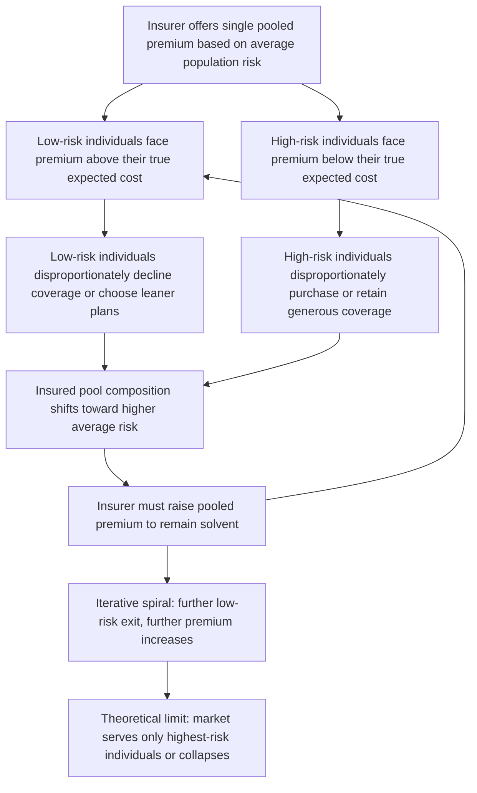

## Adverse Selection and the Lemons Problem

### Definition and Conceptual Foundation

**Adverse selection** describes a market failure arising when one party to a transaction has private information about a characteristic relevant to the transaction's value, and this private information causes an asymmetric pattern of *who chooses to participate* in the market or *which contract they choose*, in a way that systematically disadvantages the uninformed party. In health insurance specifically, adverse selection refers to the tendency for individuals who know (or believe) themselves to be higher health risk to be more likely to purchase insurance, or to purchase more generous coverage, than individuals who know themselves to be lower risk — a selection pattern the insurer cannot fully counteract because it cannot directly observe each individual's true risk type.

The foundational theoretical treatment is **Akerlof's (1970) "market for lemons"** model, originally developed for the used-car market, in which sellers know the quality of their own car but buyers cannot distinguish good cars ("peaches") from bad ones ("lemons") prior to purchase. Akerlof showed that under sufficiently severe information asymmetry, this uncertainty can cause the market to unravel: as buyers price cars at the *average* expected quality, sellers of above-average quality cars withdraw (since they cannot get a fair price), lowering the average quality of cars remaining in the market, which further lowers the price buyers are willing to pay, triggering further withdrawal — a downward spiral that can, in the theoretical limit, collapse the market for all but the lowest-quality goods.

### The Health Insurance Analogy: Reversed Information Structure

**Key Points**

- In the classic lemons model, the **seller** (informed party) knows quality and the **buyer** (uninformed party) does not. In health insurance, the **structure is reversed**: the **buyer of insurance** (the individual) is the informed party (knowing their own health risk better than the insurer), and the **seller** (the insurer) is the uninformed party setting the price.
- This reversal is why health insurance adverse selection is sometimes described as operating on the "wrong side" of Akerlof's original model relative to intuition, but the underlying mechanism — private information about quality/risk driving an unraveling dynamic — is structurally identical.
- Rothschild and Stiglitz (1976) formalized this specific reversed-structure case for insurance markets directly, showing that a competitive insurance market facing adverse selection may not sustain a stable pooling equilibrium (a single contract serving both risk types at an average price), because a rival insurer can always profitably offer a modified contract that attracts only the low-risk types away from the pool — the direct insurance-market analogue of Akerlof's used-car unraveling mechanism.

### Formal Structure of the Unraveling Mechanism

Let there be two risk types, $\theta_H$ (high risk, probability of loss $p_H$) and $\theta_L$ (low risk, probability of loss $p_L < p_H$), present in the population in proportions $\lambda$ and $(1-\lambda)$ respectively. If the insurer cannot distinguish types and must offer a single pooled premium reflecting the population's average risk:

$$\pi_{pooled} = [\lambda p_H + (1-\lambda) p_L] \cdot L$$

Low-risk individuals face a premium that overstates their true expected loss ($\pi_{pooled} > p_L \cdot L$), while high-risk individuals face a premium that understates theirs ($\pi_{pooled} < p_H \cdot L$). If purchasing insurance is voluntary, low-risk individuals — for whom the pooled premium looks like a bad deal relative to their true risk — are more likely to decline coverage or select a less generous contract, and high-risk individuals — for whom the pooled premium looks like a good deal — are more likely to purchase or select more generous coverage. This shifts the risk composition of the insured pool toward higher average risk than the population as a whole:

$$\lambda_{insured} > \lambda_{population}$$

If insurers reprice based on the shifted composition, the new pooled premium rises further, inducing the next tier of relatively lower-risk individuals within the remaining pool to exit, and the process can iterate toward an **adverse selection "death spiral"** in the theoretical extreme case, where only the highest-risk individuals remain insurable at any actuarially sustainable price.

### Diagram: The Adverse Selection Death Spiral Mechanism

### Illustration: Market Unraveling Under Adverse Selection

<svg xmlns="http://www.w3.org/2000/svg" viewBox="0 0 800 420" font-family="Arial, sans-serif">
<text x="400" y="28" text-anchor="middle" font-size="16" font-weight="bold" fill="#1a1a1a">Adverse Selection Death Spiral (svg_diagram)</text>
<line x1="90" y1="360" x2="720" y2="360" stroke="#333" stroke-width="2" />
<text x="405" y="395" text-anchor="middle" font-size="13" fill="#333">Iteration (repricing round)</text>
<line x1="90" y1="360" x2="90" y2="60" stroke="#333" stroke-width="2" />
<text x="45" y="210" text-anchor="middle" font-size="13" fill="#333" transform="rotate(-90 45 210)">Premium / Average Risk of Insured Pool</text>

<path d="M 130 300 Q 300 260 450 180 T 680 90" fill="none" stroke="#C44E52" stroke-width="3" />
<text x="550" y="140" font-size="11" fill="#C44E52">Pooled premium (rising)</text>

<path d="M 130 150 Q 300 200 450 260 T 680 320" fill="none" stroke="#4C72B0" stroke-width="3" />
<text x="550" y="300" font-size="11" fill="#4C72B0">Number of low-risk enrollees remaining (falling)</text>

<circle cx="130" cy="300" r="5" fill="#333" />
<text x="130" y="330" text-anchor="middle" font-size="10">Round 1</text>
<circle cx="450" cy="180" r="5" fill="#333" />
<text x="450" y="345" text-anchor="middle" font-size="10">Round 3</text>
<circle cx="680" cy="90" r="5" fill="#333" />
<text x="680" y="345" text-anchor="middle" font-size="10">Round 5</text>
</svg>

### Conditions That Determine Severity of Adverse Selection

**Key Points**

- **Degree of information asymmetry**: The severity of adverse selection scales with how much better-informed individuals are about their own risk relative to what insurers can observe or verify; conditions with strong self-knowledge but weak external verifiability (e.g., family history of a genetic condition not yet diagnostically confirmed) generate more severe adverse selection than conditions that are easily observable and verifiable by underwriters.
- **Voluntariness of participation**: Adverse selection is most severe in voluntary, individually purchased insurance markets; it is structurally muted (though not entirely eliminated) in mandatory or near-universal enrollment settings (e.g., employer-based group coverage with high participation rates, social insurance mandates), since the selection margin — the choice of whether to enroll at all — is constrained or removed.
- **Availability of risk classification tools to the insurer**: The more information insurers can legally and practically use to classify risk (medical underwriting, health questionnaires, biometric data), the more the *effective* private information advantage of the individual is narrowed, reducing the scope for adverse selection — though this trades off against other policy goals (see Common Misconceptions below).
- **Menu richness and market thickness**: Markets with a wide range of available contract options (allowing risk-based self-selection into differentiated plans, per the Rothschild-Stiglitz screening framework) can experience adverse selection primarily through *plan choice* (high-risk individuals selecting generous plans, low-risk individuals selecting lean plans) even when overall market participation remains high.

### Regulatory and Institutional Responses to Adverse Selection

- **Community rating**: Prohibits insurers from pricing individual policies based on health status, directly removing the information channel through which adverse selection would otherwise operate on price — though this reintroduces the pooling-equilibrium instability problem identified by Rothschild-Stiglitz unless paired with other mechanisms.
- **Guaranteed issue**: Requires insurers to offer coverage to all applicants regardless of health status, addressing the *access* dimension of adverse selection (ensuring high-risk individuals are not simply excluded) but not the *pricing* dimension alone.
- **Individual mandates / enrollment penalties**: Directly address the voluntary-participation channel of adverse selection by compelling or strongly incentivizing broad enrollment, including relatively low-risk individuals who would otherwise selectively exit the pool.
- **Risk adjustment / risk corridors**: Regulatory mechanisms that transfer funds among insurers based on the realized risk composition of their enrolled populations, reducing insurers' incentive to compete on risk selection ("cherry-picking" low-risk enrollees) rather than on price and quality.
- **Employer-based group coverage**: Functions as an indirect adverse-selection mitigation mechanism because enrollment is tied to employment status (a characteristic correlated with, but not chosen on the basis of, individual health risk), producing a form of risk pooling that does not rely purely on individual voluntary selection.

### Distinguishing Adverse Selection from Related Concepts

- **Adverse selection vs. moral hazard**: Adverse selection is a **pre-contractual selection problem** (who chooses to buy insurance, based on private information about existing risk type); moral hazard is a **post-contractual behavioral response problem** (how insurance changes an already-insured individual's behavior). Both produce a pattern of higher realized claims among the insured than a naive baseline would predict, but through entirely different causal mechanisms, and empirically distinguishing them typically requires research designs that hold enrollment decisions fixed while varying only the behavioral incentive (to isolate moral hazard) or that use random assignment to selection-free enrollment (to isolate adverse selection).
- **Adverse selection vs. risk classification/statistical discrimination**: Risk classification is the insurer's *attempt to observe* risk-relevant characteristics to price more accurately; adverse selection is the *residual* selection problem that persists on whatever risk dimension remains unobservable to the insurer despite classification efforts. More extensive risk classification narrows the scope for adverse selection but does not eliminate it as long as any private information asymmetry remains.
- **Death spiral (extreme case) vs. moderate adverse selection**: A full market-unraveling death spiral is the theoretical limiting case; most real insurance markets, even those exhibiting measurable adverse selection, do not collapse entirely, due to countervailing institutional features (mandates, subsidies, regulatory backstops, employer-based pooling) that are typically absent from the pure theoretical model.

### Empirical Testing Approaches

- **Positive correlation test (Chiappori and Salanié, 2000)**: Testing whether, conditional on observable risk characteristics used for pricing, individuals who choose more generous coverage also exhibit higher realized claims than those choosing leaner coverage — a positive correlation is consistent with (though not definitive proof of) adverse selection, since it could also partly reflect moral hazard (more generous coverage causing higher utilization) rather than pure risk-based selection.
- **Natural experiments around mandate introduction or removal**: Comparing insurance pool risk composition and premiums before and after policy changes that alter the voluntariness of enrollment (e.g., introduction or repeal of an individual mandate penalty).
- **Studies of guaranteed-renewable vs. medically underwritten market segments**: Comparing risk-pool stability and pricing dynamics across market segments with differing degrees of insurer ability to risk-classify, as an indirect test of adverse selection's practical severity when underwriting tools are constrained.
- **Studies of employer-group vs. individual-market enrollment patterns**: Comparing risk composition and premium stability across these two market types as a natural test of the group-based adverse-selection mitigation hypothesis.

### Common Misconceptions

- Adverse selection is not resolved simply by allowing insurers unlimited medical underwriting; while more information narrows the *information asymmetry* driving adverse selection, extensive underwriting on health status directly conflicts with widely held policy goals around access to insurance for individuals with pre-existing conditions, illustrating a genuine policy trade-off (efficiency of risk-based pricing vs. equity of access) rather than a straightforward technical fix.
- A "death spiral" is not the automatic or typical outcome of any market exhibiting some adverse selection; it is a theoretical limiting case that requires specific conditions (highly voluntary participation, weak counteracting institutions, and repeated iterative repricing) to fully manifest, and most real markets exhibit partial, bounded adverse selection effects rather than complete collapse.
- Adverse selection and moral hazard, despite both being classified as core "market failures" attributable to asymmetric information in health insurance, are not interchangeable terms and do not have the same policy remedies; conflating them can lead to misapplied interventions (e.g., addressing an adverse-selection problem with a cost-sharing tool designed for moral hazard, or vice versa).

### Related Topics

- Akerlof's original "market for lemons" model (1970)
- Rothschild-Stiglitz screening model and separating vs. pooling equilibria
- Signaling and screening in health care markets
- Ex ante and ex post moral hazard (the companion demand-side distortion)
- Community rating, guaranteed issue, and individual mandate policy design
- Risk adjustment and risk corridor mechanisms in regulated insurance markets
- Chiappori-Salanié positive correlation test for asymmetric information