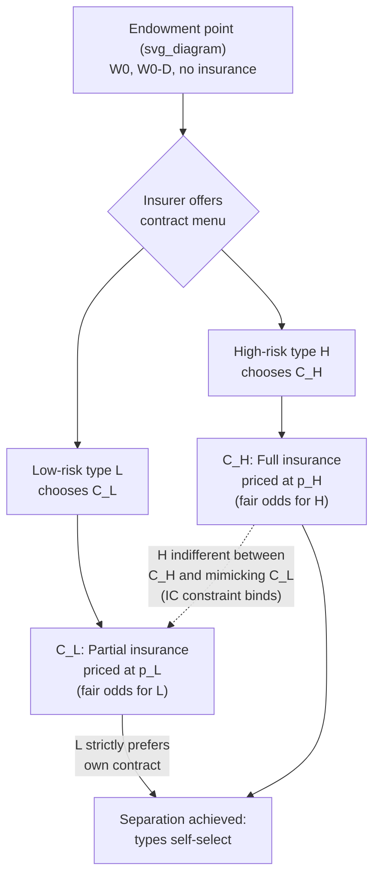

## Rothschild-Stiglitz Separating Equilibrium

### Overview

The Rothschild-Stiglitz (R-S) model, introduced in their 1976 paper "Equilibrium in Competitive Insurance Markets: An Essay on the Economics of Imperfect Information," analyzes how competitive insurance markets behave when insurers cannot observe individual consumers' risk types. It is the canonical formalization of adverse selection under asymmetric information, extending Akerlof's "market for lemons" logic to a screening context where the uninformed party (the insurer) moves first by offering a menu of contracts, and the informed party (the consumer) self-selects.

The model's central result is that a pooling equilibrium (one contract for all risk types) can never be stable in this setting, and that if a competitive equilibrium exists, it must be a **separating equilibrium** in which high-risk and low-risk individuals choose different contracts that reveal their type. A further, more troubling result is that under certain market conditions, no equilibrium exists at all.

### Model Setup

**Agents:**

- Two types of consumers: high-risk ($H$) and low-risk ($L$), with loss probabilities $p_H > p_L$.
- Each consumer knows their own risk type; insurers only know the proportion of each type in the population, not any individual's type.
- Consumers are risk-averse (concave utility function $U(W)$); insurers are risk-neutral and operate in a perfectly competitive market with free entry.

**Contract space:**

- A contract is a pair $(\alpha_1, \alpha_2)$ specifying wealth in the no-loss state and wealth in the loss state, or equivalently a (premium, coverage) pair.
- Consumers begin with initial wealth $W_0$ and face a potential loss $D$ if an accident occurs.
- Without insurance: wealth is $W_0$ in the no-loss state and $W_0 - D$ in the loss state.

**Zero-profit condition:**

Because of free entry and Bertrand-style competition, any contract offered in equilibrium must earn zero expected profit given the risk type(s) that purchase it:

$$\pi = \text{premium} - p \cdot \text{payout} = 0$$

This traces out a "fair odds line" for each risk type in wealth-state space, with slope $-\frac{1-p}{p}$.

### Key Assumptions

- **Single-crossing property**: The indifference curves of high-risk and low-risk types cross at most once, and at any given point, the high-risk indifference curve is always steeper (they value additional coverage more, since they are more likely to need it). This property is what makes separation possible through contract design.
- **Perfect competition**: Firms are price-takers with free entry/exit; any profitable deviation attracts an entrant.
- **Nash equilibrium concept**: Each insurer's contract offering must be a best response given the contracts offered by rivals; no firm can profitably alter its offer given what others offer.
- **Full insurance benchmark**: Under symmetric information, each type would be offered a separate contract with full coverage priced at their own fair odds (actuarially fair full insurance).

### Why Pooling Equilibria Fail

Suppose an insurer offers a single pooling contract priced at the population-average risk $\bar{p} = \lambda p_H + (1-\lambda) p_L$, providing full coverage to both types at this average premium.

This allocation cannot be an equilibrium. A rival insurer can always design a new contract offering **slightly less coverage at a lower premium**, positioned close to the low-risk fair-odds line, that:

- Is unattractive to high-risk types (who strongly prefer full coverage and are willing to pay more for it, per the single-crossing property), so they remain with the original pooling contract.
- Attracts low-risk types away from the pooling contract, since it gives them a better deal for less coverage than they need to "subsidize" the high-risk pool.

Because this deviation contract only attracts low-risk consumers, it is profitable at the low-risk fair-odds price. Once low-risk types leave, the original pooling contract suffers losses (it retains only high-risk consumers at a premium priced for the average). Hence any pooling contract is vulnerable to **cream-skimming** entry, and cannot survive as an equilibrium.

### The Separating Equilibrium

If an equilibrium exists, it must involve two distinct contracts:

- **High-risk contract $C_H$**: Full insurance at the high-risk fair-odds price ($p_H$). High-risk individuals fully insure because no low-risk type would ever want to mimic them (full coverage at the high price is unattractive to someone with a lower loss probability).
- **Low-risk contract $C_L$**: Partial insurance (less than full coverage) at the low-risk fair-odds price ($p_L$).

The low-risk contract must be deliberately **distorted below full coverage**. This is the crucial screening device: coverage is restricted precisely to the point where the high-risk type is indifferent between mimicking the low-risk contract and taking their own contract, i.e., the incentive-compatibility (self-selection) constraint binds:

$$U_H(C_H) = U_H(C_L)$$

where $U_H(\cdot)$ denotes the high-risk type's utility. Because the high-risk type is just indifferent, they do not deviate, and the low-risk type — who values coverage less at any given premium — strictly prefers their own (partial) contract to the high-risk one. This is the standard **incentive-compatibility / self-selection constraint** from screening theory.

The separating outcome is inefficient relative to the full-information benchmark: low-risk individuals are rationed to less coverage than they would choose if their type were verifiable, purely to prevent high-risk individuals from mimicking them. This is the cost of asymmetric information borne entirely by the low-risk population.

### Geometric Intuition

In a wealth-state diagram (no-loss wealth on one axis, loss-state wealth on the other):

- The 45° line represents full insurance (wealth equalized across states).
- Each type has a fair-odds line through the endowment point $(W_0, W_0 - D)$, with the high-risk line flatter/closer to the 45° line reflecting a higher premium per unit of coverage.
- $C_H$ sits at the intersection of the high-risk fair-odds line and the 45° line (full insurance, actuarially fair for high risk).
- $C_L$ sits at the intersection of the low-risk fair-odds line and the high-risk indifference curve passing through $C_H$ — below the 45° line (partial insurance), guaranteeing incentive compatibility.

Below is a static wealth-state diagram showing the two fair-odds lines, the two contracts, and the binding high-risk indifference curve.

<svg xmlns="http://www.w3.org/2000/svg" viewBox="0 0 640 520" font-family="Helvetica, Arial, sans-serif">
<text x="320" y="28" text-anchor="middle" font-size="16" font-weight="bold" fill="#1a1a1a">Rothschild-Stiglitz Separating Equilibrium (svg_diagram)</text>

<line x1="80" y1="460" x2="580" y2="460" stroke="#333" stroke-width="1.5" />
<line x1="80" y1="460" x2="80" y2="60" stroke="#333" stroke-width="1.5" />
<text x="580" y="480" font-size="12" fill="#333">No-loss state wealth (W1)</text>
<text x="20" y="60" font-size="12" fill="#333" transform="rotate(-90 20 60)">Loss state wealth (W2)</text>

<line x1="100" y1="440" x2="480" y2="80" stroke="#888" stroke-width="1" stroke-dasharray="4,3" />
<text x="420" y="100" font-size="11" fill="#666">45° full insurance line</text>

<circle cx="480" cy="420" r="5" fill="#1a1a1a" />
<text x="490" y="415" font-size="12" fill="#1a1a1a">Endowment (W0, W0-D)</text>

<line x1="480" y1="420" x2="260" y2="120" stroke="#c0392b" stroke-width="2" />
<text x="270" y="115" font-size="11" fill="#c0392b">High-risk fair-odds line (slope -(1-pH)/pH)</text>

<line x1="480" y1="420" x2="150" y2="220" stroke="#2980b9" stroke-width="2" />
<text x="90" y="215" font-size="11" fill="#2980b9">Low-risk fair-odds line (slope -(1-pL)/pL)</text>

<circle cx="264" cy="122" r="6" fill="#c0392b" />
<text x="200" y="105" font-size="12" font-weight="bold" fill="#c0392b">C_H (full insurance, priced at pH)</text>

<path d="M 264 122 C 220 150, 190 200, 175 250 C 160 300, 155 330, 160 350" fill="none" stroke="#c0392b" stroke-width="1.5" stroke-dasharray="6,3" />
<text x="130" y="365" font-size="10" fill="#c0392b">H's indifference curve through C_H</text>

<circle cx="205" cy="200" r="6" fill="#2980b9" />
<text x="215" y="195" font-size="12" font-weight="bold" fill="#2980b9">C_L (partial insurance, priced at pL)</text>

<text x="330" y="330" font-size="11" fill="#333">C_L chosen so H is indifferent</text>

<text x="330" y="345" font-size="11" fill="#333">between C_H and C_L (IC binds)</text>

<line x1="264" y1="200" x2="320" y2="325" stroke="#333" stroke-width="0.75" marker-end="url(#arrow)" />

</svg>

### Formal Conditions for the Separating Equilibrium

Let $\lambda$ be the proportion of low-risk consumers in the population. The separating contracts $(C_H, C_L)$ constitute the candidate equilibrium if:

1. **Zero profit on each contract individually**:

   $$\text{Premium}_H = p_H \cdot \text{Payout}_H, \quad \text{Premium}_L = p_L \cdot \text{Payout}_L$$
2. **Full insurance for high risk**:

   $$C_H: \text{wealth equalized across states at the } p_H \text{ fair-odds line}$$
3. **Incentive compatibility (binding) for high risk**:

   $$U_H(C_H) = U_H(C_L)$$
4. **Individual rationality**: Both types prefer their assigned contract to no insurance.

### Non-Existence Problem

The R-S separating allocation, even when it satisfies conditions 1–4, is not guaranteed to be an equilibrium of the overall market game. The critical vulnerability is **pooling contract entry**:

- If the proportion of low-risk consumers ($\lambda$) is sufficiently high, a rival insurer can profitably offer a **pooling contract** — priced at the average risk $\bar p$, offering more coverage than $C_L$ but less than full — that both types prefer over their separating contracts.
- Such a pooling deviation is profitable in aggregate (since there are enough low-risk consumers to subsidize it) and attracts both types away from the separating menu.
- But as shown earlier, this pooling contract is itself unstable, since it invites further cream-skimming entry.

The result is a **non-existence problem**: for a sufficiently large fraction of low-risk individuals in the population, no pure-strategy Nash equilibrium exists in the R-S game — every candidate allocation (pooling or separating) can be upset by some other feasible contract. This is one of the most cited theoretical weaknesses of the model and motivated substantial follow-up literature.

- [Inference] Whether non-existence is a practical concern in real insurance markets, versus primarily a theoretical artifact of the pure Nash equilibrium concept used, is disputed among economists and depends on institutional features (e.g., long-term contracting, mandates, regulation) not present in the base model.

### Extensions Addressing Non-Existence

Several later contributions modify the equilibrium concept or model structure to restore existence:

- **Wilson (1977) "anticipatory equilibrium"**: Assumes insurers, when considering whether to withdraw a contract in response to a rival's entry, anticipate that other insurers will also react (e.g., withdraw contracts that become unprofitable). Under this foresight assumption, a pooling equilibrium can be sustained because would-be entrants correctly anticipate that other pooling contracts would be withdrawn, making cream-skimming unprofitable.
- **Miyazaki (1977) and Spence (1978)**: Allow insurers to offer a portfolio of contracts (cross-subsidization across contract types within a single firm) rather than single contracts, which can restore existence of an equilibrium and, in some formulations, yields the second-best efficient (Miyazaki-Wilson-Spence) allocation rather than the R-S separating allocation.
- **Dubey and Geanakoplos** and other general equilibrium approaches reformulate the problem with an explicit market-clearing mechanism, again restoring existence under broader information/signaling structures.
- **Mandatory pooling / social insurance**: In practice, policy responses to R-S-type adverse selection include mandates (compelling low-risk individuals to purchase insurance, preventing them from opting out of the pool) and community rating regulations, which are direct real-world analogues to solving the non-existence/inefficiency problem through non-market mechanisms.

### Welfare and Policy Implications

- **Inefficiency relative to full information**: Low-risk consumers are worse off than they would be if their type were observable and verifiable — they are constrained to inefficient partial coverage purely as a signaling/screening device.
- **High-risk consumers are unaffected in welfare terms** relative to full information; they still get actuarially fair full coverage priced at their own risk.
- **Rationale for mandates**: The R-S framework is frequently invoked to justify individual mandates in health insurance reform (e.g., discussions surrounding the U.S. Affordable Care Act), since compulsory participation eliminates the low-risk "exit" option that destabilizes pooling and can support a more efficient pooling-like outcome.
- **Rationale for risk adjustment and community rating**: Regulatory tools that neutralize insurers' incentive or ability to cream-skim (risk-adjustment transfers, restrictions on medical underwriting, guaranteed issue) are policy analogues to preventing the destabilizing entry that drives the R-S non-existence result.
- **Contrast with signaling models**: Unlike Spence's job-market signaling model (where the informed party moves first by acquiring a costly signal), in R-S the **uninformed party (insurer) moves first** by designing the contract menu, and the informed party's choice among contracts is what reveals type. This is a screening model, not a signaling model, though both rely on single-crossing conditions.

### Worked Numerical Example

Assume:

- $W_0 = 100$, potential loss $D = 60$, so no-insurance outcomes are $(100, 40)$.
- $p_H = 0.5$, $p_L = 0.2$.
- $U(W) = \sqrt{W}$ for both types (risk-averse, common utility function, differing only in loss probability).

**High-risk contract (full insurance, fair odds):**

Full insurance equalizes wealth at $W^*$ such that the insurer breaks even:

$$\text{Premium} = p_H \cdot D = 0.5 \times 60 = 30$$

$$C_H = (100 - 30,\ 100 - 30) = (70, 70)$$

**Low-risk contract (partial insurance, fair odds, IC-constrained):**

The low-risk contract lies on the $p_L$ fair-odds line: for a payout $q$ in the loss state, premium $= p_L \cdot q = 0.2q$, giving:

$$C_L = (100 - 0.2q,\ 100 - 60 + q - 0.2q) = (100 - 0.2q,\ 40 + 0.8q)$$

To find $q$, impose the binding IC constraint for the high-risk type:

$$\sqrt{70} = 0.5\sqrt{100 - 0.2q} + 0.5\sqrt{40 + 0.8q}$$

Solving numerically (since $\sqrt{70} \approx 8.3666$):

- [Unverified] Precise numerical solution for $q$ requires iterative computation; a full closed-form solution is not standard to present without computation. As an illustrative approximate result, $q$ typically falls in the range of roughly 35–45 (well below the full-coverage payout of 60), consistent with the theoretical prediction of partial coverage for the low-risk type. Readers working through this example numerically should solve the equation above directly rather than relying on this approximate range.

This example nonetheless illustrates the qualitative structure correctly: $C_H$ is full insurance at 70/70, while $C_L$ involves less than full coverage ($q < 60$), verified against the high-risk type's indifference condition.

### Common Exam/Application Angles

- Explain why a pooling equilibrium is never stable in the R-S framework (cream-skimming argument).
- Derive or sketch the separating contracts geometrically using fair-odds lines and indifference curves.
- Discuss the single-crossing property and why it is necessary for separation to be achievable via contract design.
- Explain the non-existence result and identify the conditions ($\lambda$ too high) under which it arises.
- Compare R-S screening to Akerlof's lemons problem and to Spence signaling.
- Discuss real-world policy analogues: individual mandates, community rating, guaranteed issue, risk-adjustment transfers.
- Analyze how relaxing assumptions (e.g., allowing cross-subsidized contract menus, as in Miyazaki-Wilson-Spence) changes the equilibrium outcome and its efficiency properties.

**Related Topics**

- Akerlof's market for lemons and the general theory of adverse selection
- Spence job-market signaling model (contrast: informed party moves first)
- Miyazaki-Wilson-Spence equilibrium (cross-subsidized contract menus)
- Wilson anticipatory equilibrium concept
- Risk adjustment and community rating in health insurance markets
- Individual mandates and their theoretical justification
- Moral hazard vs. adverse selection distinction in health insurance
- Screening vs. signaling models in information economics
- Empirical tests of adverse selection (e.g., positive correlation test between coverage and risk)
- General equilibrium approaches to insurance markets under asymmetric information (Dubey-Geanakoplos)