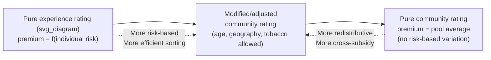
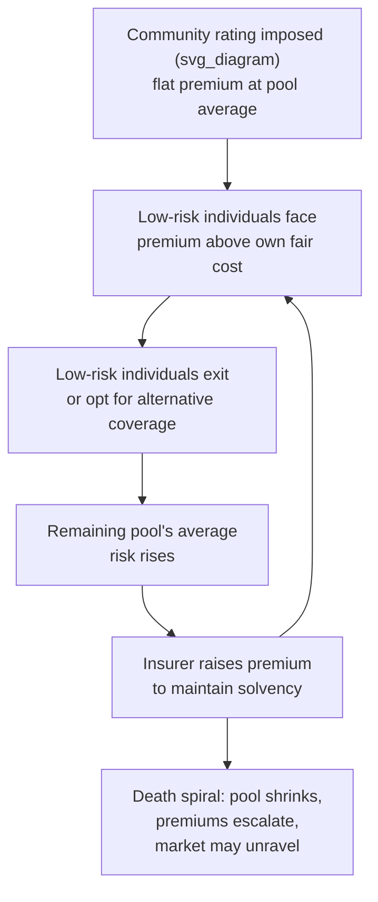

## Community Rating versus Experience Rating

### Overview

Community rating and experience rating are the two polar approaches insurers use to set premiums, and the choice between them is central to how health insurance markets handle risk heterogeneity, adverse selection, and equity. The distinction determines whether premiums reflect an individual's own expected risk (experience rating) or the average risk of a broader pool (community rating), with significant consequences for market stability, risk selection incentives, and access to coverage for high-risk individuals.

### Definitions

**Experience rating**: Premiums are set based on an individual's (or group's) own expected claims experience — factors such as age, sex, health status, pre-existing conditions, occupation, or past claims history. Premiums closely track actuarially fair, individual-specific risk.

$$\text{Premium}_i = p_i \cdot L_i \cdot (1 + \text{loading})$$

where $p_i$ is individual $i$'s loss probability, $L_i$ is expected loss severity, and the loading factor covers administrative costs and profit.

**Community rating**: All individuals within a defined community or rating pool pay the same premium regardless of individual risk characteristics, based on the average expected cost across the entire pool.

$$\text{Premium} = \bar{p} \cdot \bar{L} \cdot (1 + \text{loading}), \quad \bar{p} = \sum_i w_i p_i$$

where $w_i$ is individual $i$'s weight in the pool and $\bar p$ is the pool's average risk.

**Modified/adjusted community rating**: An intermediate approach, permitting limited premium variation across a small set of factors (commonly age, geography, tobacco use) while prohibiting variation based on health status or claims history. This is the approach used in ACA-compliant individual and small-group markets in the United States.

### Spectrum of Rating Methods

### Underlying Economic Logic

**Experience rating** aligns with the actuarial fairness principle: each individual pays a premium proportional to the risk they impose on the pool. This:

- Minimizes adverse selection at the individual contract level, since premiums already reflect risk, reducing the incentive for low-risk individuals to exit the pool.
- Rewards risk-reducing behavior (e.g., non-smoking, wellness program participation) with lower premiums, creating an incentive-compatible structure.
- Can price out high-risk individuals entirely if their actuarially fair premium exceeds their ability or willingness to pay, resulting in coverage gaps for the sick, elderly, or those with pre-existing conditions.

**Community rating** operationalizes a form of social insurance and risk pooling that occurs independent of underwriting:

- Cross-subsidizes high-risk individuals using premiums collected from low-risk individuals within the same pool.
- Improves access and affordability for high-risk individuals (e.g., those with chronic illness), consistent with equity and universal-coverage goals.
- Creates an incentive for low-risk individuals to exit the pool if participation is voluntary, since they are charged more than their own actuarially fair premium — this is the mechanism connecting community rating directly to the **Rothschild-Stiglitz adverse selection problem** and the broader **adverse selection death spiral**.

### The Adverse Selection Death Spiral Under Voluntary Community Rating

When community rating is imposed without a mandate or other mechanism compelling broad participation:

1. Premium is set at the pool-average risk $\bar p$.
2. Low-risk individuals, facing a premium above their own fair-odds price, have an incentive to drop coverage (or select a cheaper, less comprehensive alternative if available).
3. As low-risk individuals exit, the remaining pool's average risk $\bar p$ rises.
4. Insurers must raise premiums to remain solvent, which drives out the next-lowest-risk tier.
5. This iterates, progressively increasing average premiums and driving out more of the (relatively) healthy population.

$$\bar{p}_{t+1} = \frac{\sum_{i \in \text{remaining pool}} p_i}{\lvert \text{remaining pool} \rvert} > \bar{p}_t$$

In the limiting case, only the highest-risk individuals remain, at premiums that may approach or exceed their own fully experience-rated cost, or the market may unravel entirely (no viable pooling equilibrium exists) — the same structural instability identified formally in the Rothschild-Stiglitz model.

### Comparison Table

| Dimension | Experience Rating | Community Rating |
| --- | --- | --- |
| Premium basis | Individual/group risk factors | Pool average risk |
| Adverse selection risk | Low (premiums already risk-adjusted) | High (if voluntary participation) |
| Cross-subsidization | Minimal to none | Substantial, low-risk to high-risk |
| Access for high-risk individuals | Can be priced out or denied coverage | Guaranteed access at pooled rate |
| Administrative complexity | Higher (requires underwriting, risk classification) | Lower (single or few rate tiers) |
| Incentive for healthy behavior | Direct premium reward | Muted or absent |
| Market stability (voluntary) | Stable, but exclusionary | Vulnerable to death spiral without mandate |
| Typical use case | Group life, auto, individually underwritten health markets (historically) | Employer-sponsored group health, ACA-compliant individual markets, single-payer systems |

### Mechanisms to Sustain Community Rating

Because pure community rating is fragile without offsetting mechanisms, real-world systems pair it with tools that prevent the death spiral:

- **Individual mandate**: Legally requiring (or strongly incentivizing via tax penalty/subsidy) broad participation, which prevents low-risk individuals from exiting and keeps the pool's average risk close to the population average. The ACA's individual mandate (with penalty in effect 2014–2018 at the federal level) was designed for this purpose.
- **Guaranteed issue**: Requiring insurers to accept all applicants regardless of health status, which is a necessary complement to community rating (otherwise insurers could still risk-select at the underwriting stage even under a flat rate).
- **Risk adjustment / risk equalization**: Ex-post transfers between insurers, moving funds from plans that enrolled healthier-than-average populations to plans that enrolled sicker-than-average populations, neutralizing the incentive to engage in risk selection (cherry-picking) even when premiums are community-rated.
- **Reinsurance and risk corridors**: Government or industry-funded backstops that cover a share of very high-cost claims, reducing insurers' exposure to catastrophic tail risk and allowing more stable community-rated premiums.
- **Open enrollment periods**: Restricting the timing of coverage purchase/switching to prevent "adverse selection at the margin" (e.g., waiting until sick to enroll).
- **Employer-based pooling**: In employer-sponsored insurance, the pool is effectively defined by employment (not health status), and participation is often high due to employer subsidy and default enrollment, which naturally mitigates adverse selection without needing an explicit individual mandate.

### Modified Community Rating in Practice (U.S. ACA Example)

The ACA individual and small-group markets use **modified adjusted community rating**, permitting premium variation only along:

- Age (up to a 3:1 ratio between oldest and youngest adults)
- Geographic rating area
- Tobacco use (up to 1.5:1 ratio)
- Family size/composition

Health status, gender, claims history, and pre-existing conditions are explicitly prohibited as rating factors. This represents a deliberate policy compromise: allowing some risk-based variation (to reduce the magnitude of cross-subsidy and moderate adverse selection pressure) while preserving the core equity goal of not pricing out the sick.

- [Unverified] Specific rating band ratios and prohibited factors are subject to ongoing regulatory and legislative change; verify current requirements against the applicable jurisdiction and year, since Marketplace rules have been amended multiple times since 2010.

### Comparative International Context

- **United States (pre-ACA individual market)**: Predominantly experience-rated / medically underwritten, allowing denial of coverage or premium loading for pre-existing conditions — a frequently cited example of experience rating's exclusionary effect at the individual level.
- **United States (employer group market)**: Largely community-rated at the level of the employer group (experience rating typically applies at the group/firm level for larger employers, not the individual employee level).
- **Switzerland and the Netherlands**: Mandatory basic health insurance with community rating within each insurer, mandates, and government-run risk adjustment across insurers — often cited as a model combining private insurer competition with strict community rating safeguards.
- **Germany**: Statutory health insurance uses income-based community-rated contributions combined with a risk structure compensation scheme (Risikostrukturausgleich) across sickness funds.
- **Single-payer / national health systems (e.g., UK NHS, Canada)**: Effectively fully community-rated (in fact, tax-financed rather than premium-financed), eliminating individual-level rating entirely.

### Formal Illustration: Premium Comparison

Consider a two-type population, $\lambda$ fraction low-risk ($p_L$) and $(1-\lambda)$ fraction high-risk ($p_H$), each with expected loss $L$ if a claim occurs.

**Experience-rated premiums:**

$$\text{Premium}_L = p_L \cdot L, \qquad \text{Premium}_H = p_H \cdot L$$

**Community-rated premium (single pool):**

$$\text{Premium}_{\text{community}} = \left[\lambda p_L + (1-\lambda) p_H\right] \cdot L$$

The **implicit cross-subsidy** transferred from low-risk to high-risk individuals under community rating is:

$$\text{Subsidy per low-risk individual} = \text{Premium}_{\text{community}} - \text{Premium}_L = (1-\lambda)(p_H - p_L) \cdot L$$

$$\text{Discount per high-risk individual} = \text{Premium}_H - \text{Premium}_{\text{community}} = \lambda (p_H - p_L) \cdot L$$

**Numerical example**: $p_L = 0.10$, $p_H = 0.40$, $L = \$5{,}000$, $\lambda = 0.7$.

- Experience-rated: Premium$_L$ = $500, Premium$_H$ = $2,000
- Community-rated: Premium = $(0.7 \times 0.10 + 0.3 \times 0.40) \times 5000 = 0.19 \times 5000 = \$950$
- Low-risk subsidy paid: $950 - 500 = \$450$ per person
- High-risk discount received: $2000 - 950 = \$1{,}050$ per person

This demonstrates the magnitude of redistribution embedded in community rating and clarifies why low-risk individuals face a strong financial incentive to exit a voluntary community-rated pool.

### Welfare and Efficiency Trade-offs

- **Efficiency argument for experience rating**: Prices reflecting true risk send correct signals for risk-reducing behavior and avoid inefficient cross-subsidization that distorts labor and consumption decisions; aligns with the standard insurance-pricing efficiency benchmark.
- **Equity argument for community rating**: Health risk is substantially attributable to factors outside individual control (genetics, age, prior illness), so many policymakers view experience-rated pricing of health insurance as inequitable in a way that does not apply as strongly to, say, auto insurance (where risk is more behaviorally driven).
- **Insurable risk vs. pre-existing certainty**: A foundational insurance-theory point is that insurance is meant to cover uncertain future risk; once an individual has a known pre-existing condition, experience-rating that condition is arguably no longer "insurance" against uncertainty but rather a mechanism allocating an already-realized cost, which is a core argument for community rating and guaranteed issue in health-specific markets.
- **Behavioral incentive loss**: Community rating dampens or eliminates price signals that would otherwise reward healthy behavior (e.g., non-smoking), which is a standard efficiency critique, though partially addressed via limited rating factors (e.g., tobacco surcharges) or non-price wellness incentive programs.
- [Inference] The socially optimal degree of rating restriction (fully community-rated vs. modified vs. fully experience-rated) depends on value judgments about redistribution versus efficiency that are not resolvable by economic analysis alone; economists can characterize the trade-offs but the weighting is a normative policy choice.

### Common Exam/Application Angles

- Explain the death spiral mechanism under voluntary community rating and connect it to Rothschild-Stiglitz adverse selection.
- Calculate implicit cross-subsidies under community rating given risk-type proportions and loss probabilities.
- Discuss why mandates, guaranteed issue, and risk adjustment are necessary complements to community rating, not substitutes for each other.
- Compare experience rating's efficiency properties against community rating's equity properties.
- Analyze real-world policy design (e.g., ACA modified community rating) as a compromise point on the rating spectrum.
- Discuss how employer-sponsored insurance achieves de facto community rating without an explicit individual mandate.

**Related Topics**

- Rothschild-Stiglitz separating equilibrium and adverse selection
- Individual mandates and penalty design
- Risk adjustment and risk equalization mechanisms
- Guaranteed issue and guaranteed renewability
- Medical underwriting and pre-existing condition exclusions
- Adverse selection death spirals (theory and historical case studies)
- ACA Marketplace rating rules and metal tier design
- Social insurance versus private insurance rationale
- Moral hazard versus adverse selection distinction
- Risk pooling theory and the law of large numbers in insurance