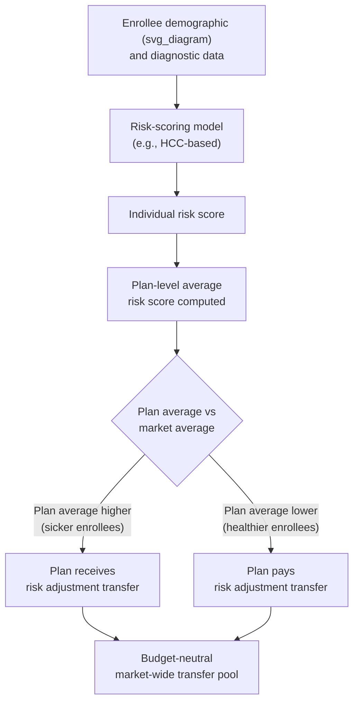
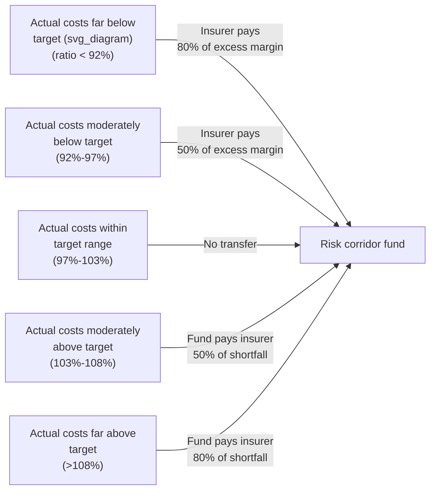

## Risk Adjustment and Risk Corridors

### Overview

Risk adjustment and risk corridors are two of the three so-called "3R" risk-mitigation mechanisms (alongside reinsurance) developed to stabilize health insurance markets that operate under community rating and guaranteed issue. Both address the same underlying problem — insurers face financial exposure from enrolling an unpredictable or systematically skewed mix of risk — but they operate through different mechanisms, timeframes, and levels of permanence. Risk adjustment is a **permanent**, **ex-post but predictable**, formula-driven transfer system addressing predictable risk variation across insurers. Risk corridors are a **temporary**, **aggregate profit/loss-sharing** mechanism addressing overall pricing uncertainty in a new or reformed market.

### Why These Mechanisms Exist

Under community rating and guaranteed issue (see the related topic in this chapter), insurers cannot use individual health status to set premiums or deny coverage, yet they still bear the actual cost of the risk mix they enroll. This creates two distinct problems these mechanisms are designed to solve:

1. **Risk selection incentive**: Even with flat community-rated premiums, an insurer that attracts a sicker-than-average population loses money relative to a competitor with a healthier-than-average population, purely due to differential enrollment mix rather than any difference in efficiency or plan design. This creates an incentive for insurers to engage in indirect risk selection (e.g., benefit design, network design, or marketing that discourages high-cost enrollees) even when they cannot underwrite directly.
2. **Pricing uncertainty in new markets**: When a market is newly created or substantially reformed (e.g., new rating rules, new populations entering, new benefit mandates), insurers lack reliable historical claims data to price premiums accurately, creating first-mover risk and potential market exit if early losses are severe.

### Risk Adjustment

**Definition**: Risk adjustment is a mechanism that transfers funds from insurers who enrolled a healthier-than-average population (relative to the pool's risk mix) to insurers who enrolled a sicker-than-average population, based on the demographic and diagnostic characteristics of each insurer's actual enrollees. It is intended to be **budget-neutral** within the market (in most implementations) and **permanent**, not a temporary transition tool.

**Core mechanism**: Each enrollee is assigned a **risk score** based on demographic factors (age, sex) and diagnostic/clinical information (from claims or encounter data), typically using a **Hierarchical Condition Category (HCC)**-style model or similar concurrent/prospective risk-scoring methodology.

$$\text{Risk Score}_i = \beta_0 + \sum_k \beta_k \cdot X_{ik}$$

where $X_{ik}$ are indicator variables for demographic cells and diagnosis-derived condition categories, and $\beta_k$ are coefficients estimated from a reference population's historical cost data (calibrated so the risk score predicts relative expected expenditure).

**Plan Average Risk Score**: Each insurer's average risk score across its enrolled population is compared to the statewide (or market-wide) average risk score.

$$\text{Transfer}_j = \left(\bar{R}_j - \bar{R}_{\text{market}}\right) \times \text{Premium}_{\text{market}} \times \text{Adjustment Factors}$$

where $\bar{R}_j$ is insurer $j$'s average normalized risk score and $\bar{R}_{\text{market}}$ is the market average. Insurers with $\bar{R}_j > \bar{R}_{\text{market}}$ (sicker-than-average enrollees) receive a net inbound transfer; insurers with $\bar{R}_j < \bar{R}_{\text{market}}$ (healthier-than-average enrollees) pay a net transfer out.

**Key design features**:

- **Budget neutrality**: In the ACA's federal risk adjustment methodology, total transfers collected from below-average-risk plans equal total transfers paid to above-average-risk plans within the same state and market (individual, small group), with no net government subsidy or cost.
- **Prospective vs. concurrent models**: Concurrent risk adjustment uses the current year's diagnoses to predict the current year's costs (used in ACA Marketplace risk adjustment); prospective models use prior-year diagnoses to predict the following year's costs (used in Medicare Advantage risk adjustment).
- **Plan liability risk score adjustment**: Transfers are typically also adjusted for each plan's actuarial value (metal tier) and induced demand factors, since richer benefit plans mechanically attract somewhat higher utilization independent of underlying health status.
- **Data source**: Relies on claims/encounter data and enrollee demographic data submitted by insurers, which introduces potential for **upcoding** or more aggressive diagnosis documentation to inflate risk scores and transfer payments — a well-documented gaming concern in both Medicare Advantage and ACA risk adjustment literature.

**Where risk adjustment is used**:

- ACA individual and small-group Marketplaces (federal HHS-operated risk adjustment methodology, permanent and ongoing).
- Medicare Advantage (CMS-HCC risk adjustment model, determining capitated payments to MA plans based on enrollee risk scores).
- Medicare Part D (prescription drug risk adjustment).
- Various other regulated health insurance markets internationally (e.g., Germany's Risikostrukturausgleich, the Netherlands' risk equalization system).

### Risk Corridors

**Definition**: A risk corridor is a **temporary**, symmetric profit/loss-sharing arrangement between insurers and a government (or market-wide) fund, designed to limit both extreme gains and extreme losses relative to a target margin during a period of high pricing uncertainty, typically when a market undergoes major structural change.

**Core mechanism**: At the end of a plan year, each insurer's actual claims costs are compared to their projected/target costs (as reflected in the premiums they set). Based on the ratio of actual-to-target costs, the insurer either pays into or receives funds from the risk corridor program according to a defined corridor structure.

$$\text{Allowable Costs Ratio} = \frac{\text{Actual Claims Costs}}{\text{Target Amount (Premiums Earned)}}$$

**Typical ACA risk corridor structure (2014–2016)**:

| Allowable Costs Ratio | Result |
| --- | --- |
| 97%–103% of target | No transfer (within the "corridor," insurer keeps outcome) |
| 103%–108% (costs above target) | Government pays insurer 50% of costs in this band |
| Above 108% | Government pays insurer 80% of costs above this threshold |
| 92%–97% (costs below target) | Insurer pays government 50% of the difference |
| Below 92% | Insurer pays government 80% of the difference |

**Purpose and design intent**:

- Reduces the downside risk of aggressive/low pricing by new entrants in a reformed market, encouraging insurers to price competitively rather than defensively (with large risk margins) during a period when claims experience is unknown.
- Symmetric structure (gains above target also flow back to the fund) was intended to make the program roughly budget-neutral over time, though this depends on aggregate market experience matching predictions.
- Distinguished from risk adjustment by its **temporary** nature (designed for a transition period, not permanent), its basis on an **insurer's own prior pricing target** (not relative risk mix versus other insurers), and its focus on aggregate profitability rather than individual enrollee risk scores.

### The ACA Risk Corridor Controversy (Illustrative Case Study)

The ACA's risk corridor program (2014–2016) became a significant, well-documented policy and legal episode illustrating design and political-economy risks in risk-mitigation mechanisms:

- The program was structured to be budget-neutral in expectation, but in practice, payments owed to insurers (because many insurers had costs well above target) substantially exceeded payments collected from insurers with costs below target.
- Congressional appropriations riders (2014–2016) prohibited the use of other federal funds to cover the shortfall, limiting the government to paying insurers only from amounts collected from other insurers into the program.
- This resulted in the government paying a small fraction of what was owed to insurers with above-target costs, which several insurers cited as a contributing factor in financial insolvency (particularly among newly formed nonprofit "CO-OP" plans created under the ACA).
- Multiple insurers subsequently sued the federal government for the shortfall; in *Maine Community Health Options v. United States* (2020), the U.S. Supreme Court ruled that the government was obligated to pay the full amounts owed under the risk corridor statute, resulting in substantial retroactive payments.
- [Unverified] Precise dollar figures for aggregate risk corridor shortfalls and the exact scope of subsequent payments following the Supreme Court ruling should be verified against current government or court records, as the settlement and payment process extended over several years and involved case-by-case claims processing.

This episode is frequently used pedagogically to illustrate how a well-designed risk-mitigation mechanism can be undermined by subsequent political/legislative action, independent of the underlying actuarial design.

### Risk Adjustment vs. Risk Corridors: Structured Comparison

| Dimension | Risk Adjustment | Risk Corridors |
| --- | --- | --- |
| Duration | Permanent, ongoing | Temporary (ACA: 2014–2016 only) |
| Basis for transfer | Relative risk mix (enrollee health status) vs. market average | Own prior pricing accuracy (actual vs. target costs) |
| Level of comparison | Across insurers within the same market | Each insurer against its own target |
| Funding source | Budget-neutral, funded by transfers among insurers | Originally intended to be budget-neutral; in ACA case, insurer-to-insurer plus (contested) federal backstop |
| Purpose | Neutralize incentive for risk selection based on enrollee health | Reduce pricing uncertainty risk in new/reformed markets |
| Data basis | Enrollee-level diagnostic/demographic risk scores | Aggregate plan-level financial results |
| Symmetry | Symmetric by construction (net transfers sum to zero) | Symmetric by design (gains and losses both shared) |

### The Third "R": Reinsurance (Brief Context)

Though not the focus of this topic, reinsurance is the third ACA risk-mitigation mechanism and is often discussed alongside risk adjustment and risk corridors:

- **Reinsurance** reimburses insurers for a portion of very high-cost individual claims above a specified attachment point, funded via assessments on health insurers generally.
- Unlike risk adjustment (permanent, based on relative risk) or risk corridors (temporary, based on aggregate target deviation), reinsurance addresses **individual catastrophic claim risk** directly, reducing the variance insurers face from a small number of extremely high-cost enrollees.
- The ACA's transitional reinsurance program also operated only 2014–2016, though several states have since implemented their own state-based reinsurance programs (via Section 1332 waivers) as an ongoing premium-stabilization tool.

### Welfare and Market Stability Rationale

- **Risk adjustment** directly targets the risk-selection incentive problem that arises whenever community rating and guaranteed issue are imposed: without it, insurers could still effectively select against high-risk enrollees indirectly (narrow specialist networks, restrictive drug formularies, marketing targeted at healthy populations), undermining the goals of guaranteed issue even though direct medical underwriting is banned.
- **Risk corridors** address a distinct, temporary problem: information asymmetry between insurers and the market about the true cost of a newly defined risk pool. Without such a mechanism, insurers facing Knightian uncertainty about a new market may price defensively (very high premiums) to protect against downside risk, or may exit entirely, undermining competition and choice in the initial years of a reform.
- **Together**, all "3R" programs reflect a broader principle in health insurance market design: since regulation removes insurers' ability to manage risk through underwriting (individual risk selection), some collective risk-sharing mechanism among insurers or between insurers and government becomes necessary to prevent the resulting risk-bearing gap from destabilizing the market — a direct structural response to the market failure formalized in the Rothschild-Stiglitz framework.

### Common Exam/Application Angles

- Distinguish risk adjustment from risk corridors along duration, basis of comparison, and purpose.
- Explain why risk adjustment is necessary even when guaranteed issue and community rating are already in place (i.e., why banning underwriting alone is insufficient to prevent risk selection).
- Analyze the ACA risk corridor shortfall as a case study in political-economy risk affecting program design.
- Calculate risk adjustment transfers given plan-level average risk scores and a market average.
- Explain gaming concerns in risk-scoring models (upcoding) and their implications for programs like Medicare Advantage.
- Compare the "3 Rs" (risk adjustment, risk corridors, reinsurance) as complementary tools targeting distinct sources of insurer risk.

**Related Topics**

- Rothschild-Stiglitz separating equilibrium and adverse selection
- Community rating versus experience rating
- Guaranteed issue and guaranteed renewability
- Medicare Advantage risk scoring (CMS-HCC model) and upcoding concerns
- Reinsurance mechanisms and state Section 1332 waiver programs
- Risk selection and "cherry-picking" behavior by insurers
- ACA CO-OP program history and insolvencies
- *Maine Community Health Options v. United States* and government contract liability
- Actuarial value and metal tier plan design
- International risk equalization systems (Germany, Netherlands, Switzerland)