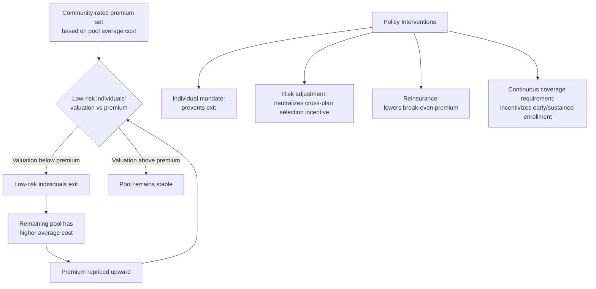

## Insurance Market Unraveling and Death Spirals

### Definition and Conceptual Overview

An insurance death spiral (also called adverse selection unraveling) describes a dynamic process in which a deteriorating risk pool causes premiums to rise, which in turn drives lower-risk enrollees out of the pool, further deteriorating the risk pool's average cost, requiring further premium increases — a self-reinforcing feedback loop that can, in the limiting case, cause a market to shrink toward covering only the highest-risk individuals or collapse entirely.

This is a dynamic, multi-period extension of the static adverse selection problem described by Akerlof (1970) and Rothschild-Stiglitz (1976): whereas static adverse selection models show that asymmetric information can produce an inefficient equilibrium (or no equilibrium at all) in a single period, the death spiral describes the *path* by which repeated re-pricing under adverse selection can cause a market to unravel over successive periods.

**Key Points**

- A death spiral requires a *dynamic* repricing mechanism — it is not merely the existence of adverse selection, but the repeated interaction between pricing and selection over multiple periods.
- The core mechanical driver is that premiums are typically set based on a single average rate for a pool that is heterogeneous in risk, allowing individual risk types to enter/exit based on whether their willingness-to-pay exceeds that single price.
- Complete unraveling is a limiting theoretical case; most real-world adverse selection dynamics are partial, resulting in reduced-but-nonzero market size rather than total collapse.

### Formal Mechanics

Consider a pool of individuals with heterogeneous expected medical costs $\theta_i$, distributed over some range $[\theta_L, \theta_H]$. Suppose the insurer must set a single community-rated premium $P$ (cannot price-discriminate by observable risk, whether by regulation or by inability to verify $\theta_i$).

At any premium $P$, an individual with cost type $\theta_i$ purchases coverage if and only if their valuation of coverage exceeds $P$. In the simplest case (risk-neutral valuation equal to expected costs, ignoring risk aversion for illustration), individuals purchase if $\theta_i \geq P$ is *not* quite right — more precisely, purchase depends on the gap between an individual's valuation (which typically includes a risk premium reflecting risk aversion, $\theta_i + \rho_i$) and $P$. Individuals with low $\theta_i$ (and low risk aversion $\rho_i$) are the first to exit as $P$ rises, since their valuation is closest to their (low) expected cost.

The insurer's break-even premium given the current pool $S \subseteq [\theta_L, \theta_H]$ is:

$$P^*(S) = E[\theta_i \mid i \in S]$$

The unraveling dynamic proceeds as follows:

1. Initial pool $S_0$ (e.g., the full population) yields break-even premium $P_0 = E[\theta_i \mid i \in S_0]$.
2. At $P_0$, individuals with $\theta_i + \rho_i < P_0$ exit, leaving a smaller, higher-average-cost pool $S_1 \subset S_0$.
3. New break-even premium $P_1 = E[\theta_i \mid i \in S_1] > P_0$ (since $S_1$ excludes the lowest-cost members).
4. At $P_1$, a further subset exits, yielding $S_2 \subset S_1$, and $P_2 > P_1$.
5. This process repeats. If the sequence $\{P_t\}$ converges to a stable pool where no further exit occurs at the break-even price, the market reaches a (possibly small) stable equilibrium. If exit continues at every iteration all the way to the highest-risk types, the market fully unravels (formally, $S_t \to \{\theta_H\}$ or $S_t \to \emptyset$ if even the highest-risk type's valuation falls short of their own expected cost due to risk-aversion mismatches or if pricing lags cost trend).

**Key Points**

- Whether unraveling is partial or complete depends on the shape of the cost distribution and the distribution of risk aversion $\rho_i$ across types.
- A pool with a "long tail" of low-risk, low-valuation individuals is more prone to substantial (though not necessarily complete) unraveling than a pool with a compressed cost distribution.

### Graphical Illustration of the Spiral Dynamic

<svg xmlns="http://www.w3.org/2000/svg" viewBox="0 0 640 440">
<text x="320" y="24" text-anchor="middle" font-size="15" font-weight="bold" fill="#1a1a1a">Death Spiral Dynamic: Premium and Enrollment Over Iterations (svg_diagram)</text>

<line x1="90" y1="380" x2="90" y2="60" stroke="#b2182b" stroke-width="2" />
<text x="30" y="220" text-anchor="middle" font-size="12" fill="#b2182b" transform="rotate(-90 30 220)">Break-even Premium (P)</text>

<line x1="550" y1="380" x2="550" y2="60" stroke="#2166ac" stroke-width="2" />
<text x="605" y="220" text-anchor="middle" font-size="12" fill="#2166ac" transform="rotate(90 605 220)">Enrollment (pool size)</text>

<line x1="90" y1="380" x2="550" y2="380" stroke="#333" stroke-width="2" />
<text x="320" y="415" text-anchor="middle" font-size="13" fill="#333">Repricing Iteration (t)</text>

<polyline points="90,340 160,300 230,250 300,200 370,165 440,145 510,135" fill="none" stroke="#b2182b" stroke-width="3" />
<circle cx="90" cy="340" r="4" fill="#b2182b" />
<circle cx="160" cy="300" r="4" fill="#b2182b" />
<circle cx="230" cy="250" r="4" fill="#b2182b" />
<circle cx="300" cy="200" r="4" fill="#b2182b" />
<circle cx="370" cy="165" r="4" fill="#b2182b" />
<circle cx="440" cy="145" r="4" fill="#b2182b" />
<circle cx="510" cy="135" r="4" fill="#b2182b" />

<polyline points="90,90 160,120 230,160 300,205 370,245 440,270 510,285" fill="none" stroke="#2166ac" stroke-width="3" stroke-dasharray="6,3" />
<circle cx="90" cy="90" r="4" fill="#2166ac" />
<circle cx="160" cy="120" r="4" fill="#2166ac" />
<circle cx="230" cy="160" r="4" fill="#2166ac" />
<circle cx="300" cy="205" r="4" fill="#2166ac" />
<circle cx="370" cy="245" r="4" fill="#2166ac" />
<circle cx="440" cy="270" r="4" fill="#2166ac" />
<circle cx="510" cy="285" r="4" fill="#2166ac" />

<text x="120" y="365" font-size="11" fill="#555">t=0</text>

<text x="500" y="365" font-size="11" fill="#555">t=6</text>

<rect x="380" y="55" width="14" height="14" fill="#b2182b" />
<text x="400" y="66" font-size="11" fill="#333">Premium (rising)</text>
<rect x="380" y="75" width="14" height="14" fill="#2166ac" />
<text x="400" y="86" font-size="11" fill="#333">Enrollment (falling)</text>
</svg>

### Distinguishing Partial Unraveling from Full Collapse

| Outcome | Description | Determinants |
| --- | --- | --- |
| No unraveling | Pool remains stable at initial break-even price | Low cost heterogeneity; high risk aversion uniformly across types; regulatory pooling constraints (e.g., mandates) |
| Partial unraveling | Pool shrinks and stabilizes at a smaller, higher-premium equilibrium | Moderate cost heterogeneity; some low-risk exit but remaining pool still finds coverage worthwhile |
| Complete unraveling (classic death spiral) | Pool shrinks toward zero or toward only the highest-risk type | High cost heterogeneity; low risk aversion among low-risk types; absence of mechanisms preventing exit |
| Market failure to form (Akerlof "no trade" case) | No stable positive-enrollment equilibrium exists at all | Extreme informational asymmetry; even the average-risk premium exceeds the valuation of all but the highest-risk types |

### Empirical Cases and Applications

Death spiral dynamics have been documented and analyzed in several real-world contexts:

- **Harvard University employee health plan (1990s)**: A frequently cited case study in health economics in which Harvard's move to a defined-contribution model (requiring employees to pay the difference if they chose a more expensive plan) is associated with adverse selection against a more comprehensive (indemnity-style) plan, contributing to its price rising and eventual withdrawal from the offered set. [Inference: this case is used pedagogically as an illustration of the mechanism; the precise causal decomposition between selection effects and other contemporaneous plan changes is subject to some debate in the literature.]
- **Individual health insurance markets pre-ACA (U.S.)**: Medically underwritten individual markets in several states exhibited selection-driven premium increases for less healthy enrollees, motivating guaranteed-issue and community-rating reforms; some states' small-group reforms in the 1990s (e.g., certain states' initial guaranteed-issue reforms without an accompanying mandate) experienced substantial short-run adverse selection dynamics following the removal of medical underwriting. [Inference: exact market-level outcomes varied significantly by state depending on the specific bundle of reforms adopted.]
- **ACA individual marketplace concerns (early implementation years)**: Debates around the ACA's individual mandate centered explicitly on death-spiral risk — the concern that guaranteed issue and community rating, without a sufficiently enforced mandate, could induce low-risk individuals to forgo coverage (especially given the option to purchase only when sick, subject to open enrollment period constraints), destabilizing the risk pool. [Inference: whether the ACA marketplace experienced a genuine death spiral versus a one-time adverse-selection-driven repricing that then stabilized is a matter of ongoing empirical and political debate; premium trends in the marketplace after initial years showed stabilization in many states, which is inconsistent with the classic *complete* unraveling scenario but consistent with a partial, one-time adjustment.]

### Policy Mechanisms to Prevent or Mitigate Unraveling

**Mandates (demand-side pooling enforcement)**

An individual mandate (a legal requirement, often with a financial penalty, to purchase coverage) works by preventing low-risk individuals from exiting the pool even when their short-run valuation is below the community-rated premium, thereby holding $S_t$ constant across iterations rather than allowing progressive exit.

**Risk adjustment (supply-side redistribution)**

Risk adjustment transfers payments from insurers with healthier-than-average enrollees to insurers with sicker-than-average enrollees, based on a risk score computed from enrollee demographic and diagnostic data. This does not prevent selection *across plans* but neutralizes its financial consequences for insurers, removing the incentive for insurers to engage in risk-selection behavior (e.g., benefit design intended to attract healthy enrollees and deter sick ones) that would otherwise exacerbate cross-plan sorting.

**Reinsurance**

Reinsurance mechanisms (either government-funded, as in some ACA state waiver programs, or private) offset a portion of insurers' costs for the highest-cost enrollees, reducing the premium impact of high-cost claims and thereby reducing the break-even premium $P^*(S)$ that would otherwise be needed, which slows the rate at which low-risk individuals are priced out.

**Guaranteed issue with continuous coverage requirements**

Rather than a mandate with a penalty, some designs (e.g., Medicare Part D's late-enrollment penalty, or HIPAA's pre-ACA continuous coverage protections) impose a cost on *late* or *discontinuous* enrollment, creating an incentive to enroll early and remain enrolled (a "use it or pay more later" structure) without a direct purchase mandate.

**Rate bands / limited underwriting flexibility**

Allowing some but not unlimited risk-based price variation (e.g., ACA's permitted age-rating bands and tobacco surcharges, capped at specified ratios) is a compromise design that permits partial risk-based pricing to retain some low-risk enrollees (who would otherwise face a premium reflecting the full pool average and be more likely to exit) without fully re-introducing medical underwriting.

### Interaction with Multiple-Plan Markets (Selection Across Plans)

Death spirals also occur *within a market offering multiple plan choices*, not only in single-plan markets facing an insured/uninsured margin. When a market offers a generous plan and a leaner plan side by side:

- Sicker enrollees disproportionately select the generous plan (anticipating higher utilization, valuing lower cost-sharing more).
- This raises the generous plan's average cost and therefore its premium relative to the leaner plan.
- The premium gap widens, inducing the healthiest remaining enrollees in the generous plan to switch to the leaner plan (or, if no adjustment mechanism exists, out of the market).
- This is the specific mechanism behind the Harvard case cited above, and is why risk adjustment (rather than mandates alone) is necessary in markets with multiple competing plans — a market-wide mandate does not, by itself, prevent selection *across* plans within the mandated market.

**Key Points**

- Single-plan death spirals are addressed primarily by mandates, subsidies, and reinsurance (mechanisms that keep the *aggregate* pool intact).
- Multi-plan death spirals require risk adjustment or standardized benefit designs (mechanisms that prevent *sorting* across otherwise-differentiated products from being financially consequential).

### Limitations of the Death Spiral Model

- **Risk aversion moderates unraveling**: The stylized model above often abstracts from risk aversion; in practice, even low-expected-cost individuals may retain valuation for coverage due to risk aversion regarding low-probability, high-severity events, which dampens the rate of exit relative to a risk-neutral model.
- **Behavioral and inertia effects**: Enrollment inertia, default effects, and incomplete price-shopping (documented extensively in the health insurance choice literature) mean that observed exit rates in response to premium increases are often lower than a fully rational, frictionless model would predict, which can slow or stall a theoretically-predicted spiral. [Inference: the magnitude of inertia's dampening effect on unraveling dynamics varies substantially by market and population studied.]
- **Subsidies as an exogenous stabilizer**: Income-linked premium subsidies (as under the ACA) partially decouple an individual's *net* premium from the *gross* community-rated premium, which can prevent a death spiral even without a binding mandate, since subsidized individuals' out-of-pocket premium exposure to pool-average repricing is muted.

### Conclusion

Insurance market unraveling formalizes, in dynamic terms, the static adverse selection insight that a single price cannot simultaneously reflect heterogeneous risk types without inducing selective exit by the types for whom that price is unfavorable. Whether this dynamic terminates in a stable, if reduced, market or proceeds to full collapse depends on the underlying distribution of risk and risk aversion in the population, and can be mitigated through mandates, risk adjustment, reinsurance, subsidies, and continuous-coverage incentives — each targeting a different point in the feedback loop between pricing and selection.

**Related Topics**

- Akerlof's "Market for Lemons" and adverse selection foundations
- Rothschild-Stiglitz separating equilibrium model
- Risk adjustment methodology (concurrent vs. prospective models, HCC coding)
- Individual mandate design and enforcement mechanisms
- Community rating vs. experience rating regulatory regimes
- Reinsurance and risk corridor programs in the ACA marketplace
- Enrollee inertia and choice frictions in health plan selection
- Guaranteed issue and continuous coverage requirements (HIPAA, Medicare Part D)