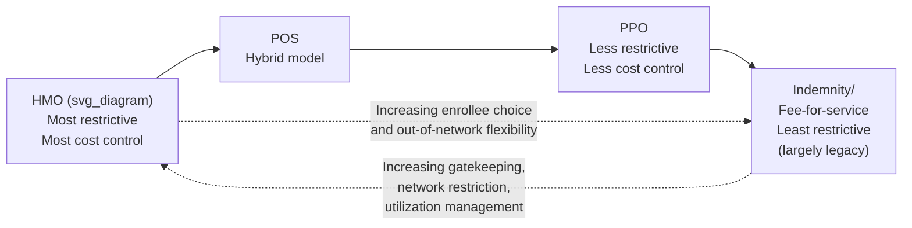
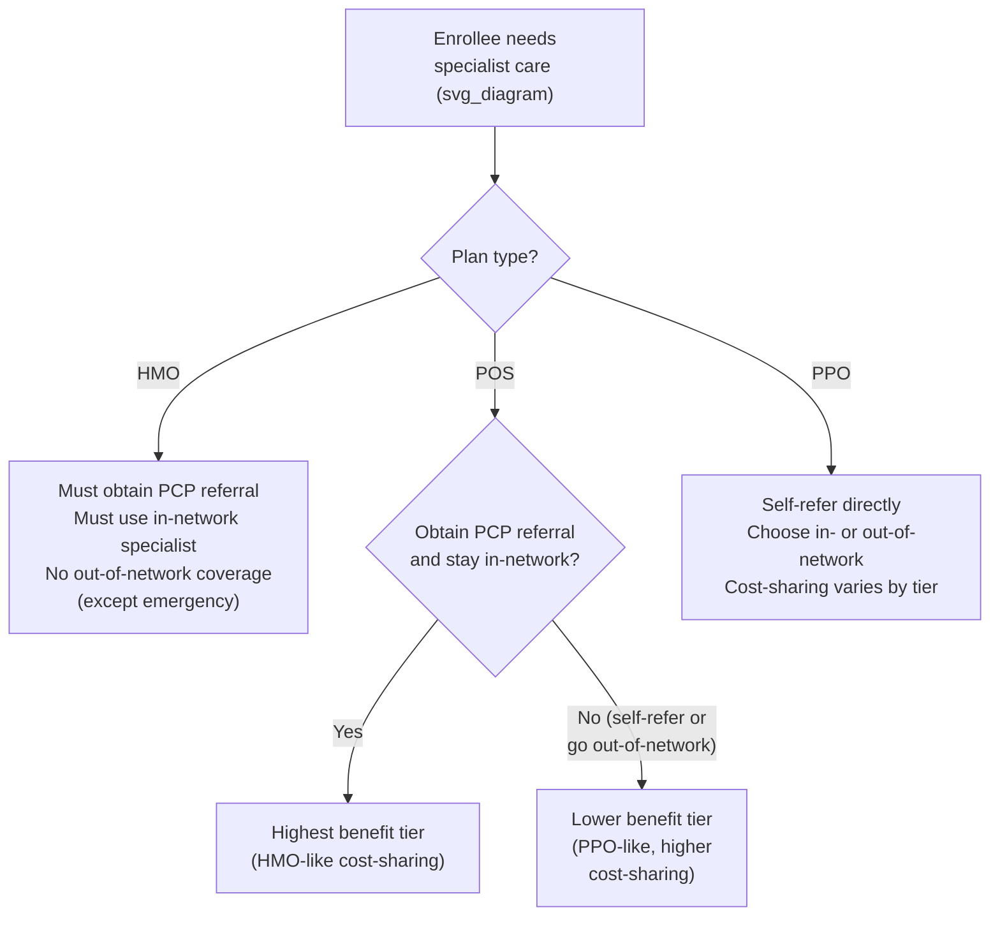

## HMO, PPO, and Point-of-Service Plan Structures

### Overview

Health Maintenance Organizations (HMOs), Preferred Provider Organizations (PPOs), and Point-of-Service (POS) plans represent the three core managed care plan architectures used to organize provider networks, control utilization, and manage costs in health insurance. Each structure represents a different point on a spectrum trading off **cost control and care coordination** against **enrollee choice and flexibility**. Understanding these structures is foundational for analyzing provider payment mechanisms, utilization management, and the broader economics of managed care.

### The Managed Care Spectrum

### Health Maintenance Organization (HMO)

**Core structure**: An HMO combines the insurance and healthcare delivery functions, typically requiring enrollees to select a **Primary Care Physician (PCP)** who acts as a **gatekeeper**, coordinating and authorizing all other care, including specialist referrals.

**Defining features**:

- **Closed network**: Coverage is generally limited to in-network providers; out-of-network care is typically not covered except in emergencies.
- **Gatekeeping/referral requirement**: Enrollees must obtain a referral from their PCP to see a specialist; without a referral, specialist visits are typically not covered.
- **Capitation payment**: Providers (particularly PCPs) are frequently paid via **capitation** — a fixed per-member-per-month (PMPM) payment regardless of the volume of services provided — rather than fee-for-service.

$$\text{Capitation Payment}_{\text{PCP}} = \text{PMPM Rate} \times \text{Number of Enrolled Members}$$

- **Utilization review and prior authorization**: Extensive use of prior authorization requirements for elective procedures, imaging, and specialty referrals.
- **Lower premiums and cost-sharing**: Generally the lowest premiums and out-of-pocket costs among managed care structures, reflecting tighter utilization control.

**HMO Sub-models** (organizational variants):

| Model | Description |
| --- | --- |
| Staff model | HMO directly employs physicians who work exclusively for the HMO, typically in HMO-owned facilities |
| Group model | HMO contracts with a single multi-specialty physician group practice |
| Network model | HMO contracts with multiple independent group practices |
| Independent Practice Association (IPA) model | HMO contracts with an association of independent physicians who continue to see non-HMO patients as well |

**Economic rationale**: The gatekeeping and capitation structure directly targets **moral hazard** and **supplier-induced demand** (the concern that fee-for-service payment incentivizes providers to increase service volume). By shifting financial risk to providers (via capitation) and requiring PCP coordination, HMOs align provider incentives with cost containment, at the cost of reduced enrollee autonomy in provider choice.

- [Inference] The degree to which capitation successfully aligns incentives without causing **underprovision of necessary care** (the mirror-image risk to fee-for-service overprovision) is empirically contested and depends heavily on quality monitoring, risk adjustment of capitation rates, and competitive pressure from enrollee plan-switching.

### Preferred Provider Organization (PPO)

**Core structure**: A PPO establishes a network of "preferred" providers who agree to discounted fee schedules in exchange for patient volume, but enrollees retain the ability to see out-of-network providers, typically at higher cost-sharing.

**Defining features**:

- **No gatekeeper/referral requirement**: Enrollees can self-refer directly to specialists without a PCP referral.
- **Tiered cost-sharing**: In-network care carries lower copayments/coinsurance and deductibles; out-of-network care is covered but at a higher coinsurance rate and often subject to a separate, higher deductible, plus potential **balance billing** exposure (out-of-network providers may bill the patient for the difference between their charge and the plan's allowed amount).

$$\text{Out-of-Pocket (in-network)} = \text{Copay/Coinsurance}_{\text{in}} \ll \text{Out-of-Pocket (out-of-network)} = \text{Coinsurance}_{\text{out}} + \text{Balance Billing}$$

- **Fee-for-service payment (discounted)**: Providers are typically paid on a discounted fee-for-service basis rather than capitation, meaning the PPO negotiates lower per-service rates but does not transfer utilization risk to providers the way an HMO's capitation arrangement does.
- **Less utilization management**: Prior authorization requirements exist but are generally less extensive than in HMOs.
- **Higher premiums**: Reflecting greater enrollee choice and weaker utilization control, PPO premiums are typically higher than comparable HMO premiums.

**Economic rationale**: PPOs represent a market response to consumer demand for choice and flexibility that pure HMOs restrict. The tiered cost-sharing structure is a form of **price discrimination and steering**: enrollees are given a financial incentive (not a mandate) to use lower-cost, in-network providers, preserving a substantial degree of consumer sovereignty while still capturing some network-negotiated discounts.

### Point-of-Service (POS) Plan

**Core structure**: A POS plan is a hybrid that combines HMO-style gatekeeping for in-network care with PPO-style out-of-network coverage options, with the enrollee choosing "at the point of service" (i.e., at the time care is sought) whether to stay in-network (HMO-like terms) or go out-of-network (PPO-like terms, with higher cost-sharing).

**Defining features**:

- **PCP-based gatekeeping for in-network benefits**: Similar to an HMO, in-network specialist care generally requires a PCP referral to receive the highest coverage tier.
- **Out-of-network option available**: Unlike a pure HMO, enrollees may see out-of-network providers, but typically at substantially higher cost-sharing and often requiring the enrollee to file their own claims (rather than the provider billing the plan directly).
- **Referral-contingent tiering**: The key structural distinction from a PPO is that even in-network benefits in a POS plan are often contingent on having gone through the PCP referral process; bypassing the PCP even for an in-network specialist can trigger the lower, out-of-network benefit tier.

**Positioning**: POS plans occupy a middle position on the managed-care spectrum, offering more flexibility than a pure HMO (some out-of-network coverage exists) while retaining more utilization control than a pure PPO (gatekeeping still applies for full in-network benefits).

### Structured Comparison Table

| Dimension | HMO | POS | PPO |
| --- | --- | --- | --- |
| PCP/gatekeeper required | Yes | Yes (for full benefits) | No |
| Out-of-network coverage | Generally none (except emergencies) | Yes, at higher cost-sharing | Yes, at higher cost-sharing |
| Referral needed for specialist | Yes | Yes (in-network) | No |
| Typical provider payment | Capitation (often) | Mixed | Discounted fee-for-service |
| Premium level | Lowest | Middle | Highest |
| Enrollee cost-sharing | Lowest | Middle | Highest (esp. out-of-network) |
| Utilization management intensity | Highest | Middle-High | Lower |
| Balance billing risk | Minimal (closed network) | Possible (out-of-network use) | Possible (out-of-network use) |
| Network breadth typically offered | Narrowest | Narrow to moderate | Broadest |

### Provider Payment Mechanisms Across Structures

| Payment Method | Common in | Risk-Bearing Party | Incentive Effect |
| --- | --- | --- | --- |
| Capitation (PMPM) | HMO (esp. staff/group model) | Provider bears utilization risk | Incentive to limit services, control costs; risk of underprovision |
| Discounted fee-for-service | PPO | Insurer bears utilization risk | Incentive to increase volume; risk of overprovision (supplier-induced demand) |
| Fee-for-service with utilization review | POS, some PPOs | Shared (insurer bears financial risk, but utilization review constrains volume) | Partial mitigation of both over- and under-provision incentives |
| Salary (staff-model HMO) | HMO staff model | Employer (HMO) bears risk; physician has no direct financial link to volume | Neutral to service volume, but requires strong internal productivity monitoring |

### Selection and Adverse Selection Considerations

The choice among HMO, POS, and PPO plans by enrollees is itself a canonical setting for studying **adverse selection in plan choice** (distinct from, but related to, the Rothschild-Stiglitz framework covered elsewhere in this course):

- Enrollees who anticipate needing more out-of-network flexibility or specialist access without referral friction (often correlated with anticipated higher utilization or chronic conditions) may systematically select PPO or POS plans.
- Healthier enrollees, more sensitive to premium cost and less concerned about network restrictions, may disproportionately select HMOs.
- This selection pattern can, over time, cause **risk segmentation** across plan types within the same employer or market, complicating premium-setting and risk adjustment, and is a key reason employer-sponsored multi-plan offerings (as in the Harvard case study referenced elsewhere in this course) can experience the plan-specific death spiral dynamics discussed under market unraveling.

### Regulatory and Historical Context

- **HMO Act of 1973**: Federal legislation that provided grants and loans to establish and expand HMOs and required employers of a certain size offering conventional health coverage to also offer a federally qualified HMO option if available in their area, substantially accelerating HMO market growth in the U.S.
- **Managed care backlash (1990s)**: Public and political backlash against perceived excessive utilization restriction (particularly gatekeeping and capitation-driven care limits) led to a market shift away from tightly restrictive "closed-panel" HMOs toward looser PPO and POS structures, and to legislative responses (e.g., state "patient protection" laws addressing network adequacy, appeals processes, and emergency care coverage).
- **Contemporary trends**: Many current "HMO" and "PPO" products in ACA Marketplace and employer markets have blended significantly, with some nominal "PPO" plans incorporating tiered networks and narrow-network variants, and some "HMO" products relaxing pure gatekeeping in favor of open-access models (allowing self-referral to in-network specialists without a formal PCP referral) — a trend sometimes referred to as an "open-access HMO" or "EPO" (Exclusive Provider Organization, which resembles a PPO's lack of gatekeeping but an HMO's closed network with no out-of-network coverage).
- [Unverified] Current market share figures for each plan type (HMO, PPO, POS, EPO, high-deductible health plans) vary by market segment (individual, small group, large group, ACA Marketplace) and change over time; consult current Kaiser Family Foundation Employer Health Benefits Survey data or similar sources for up-to-date figures rather than relying on any fixed figure presented here.

### Common Exam/Application Angles

- Compare HMO, POS, and PPO structures along the dimensions of gatekeeping, network breadth, and provider payment method.
- Explain how capitation shifts utilization risk to providers and analyze the resulting incentive for underprovision versus fee-for-service's incentive for overprovision.
- Analyze the economic rationale for gatekeeping as a tool against supplier-induced demand and moral hazard.
- Discuss how a POS plan's referral-contingent tiering structurally differs from a PPO's simple in-/out-of-network tiering.
- Connect enrollee plan-choice patterns across HMO/PPO/POS to adverse selection and risk segmentation concepts from earlier in the course.
- Explain the historical managed care backlash and its regulatory consequences (network adequacy laws, appeals rights).

**Related Topics**

- Capitation, fee-for-service, and other provider payment mechanisms
- Supplier-induced demand theory
- Moral hazard in health insurance (ex ante vs. ex post)
- Utilization review and prior authorization design
- Narrow network and tiered network plan design
- Exclusive Provider Organization (EPO) structures
- Adverse selection in health plan choice (multi-plan employer settings)
- HMO Act of 1973 and managed care regulatory history
- Balance billing and surprise billing regulation (No Surprises Act)
- Risk adjustment applied to capitated provider payments