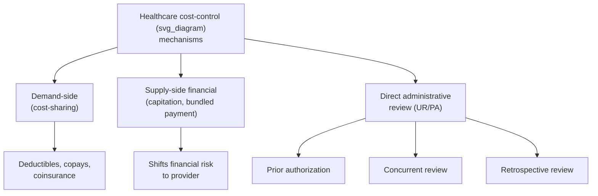
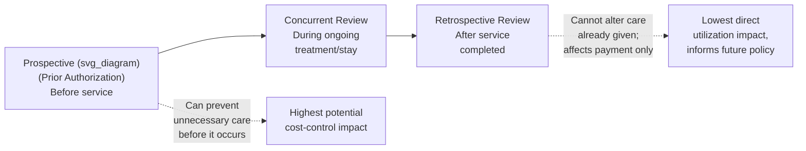
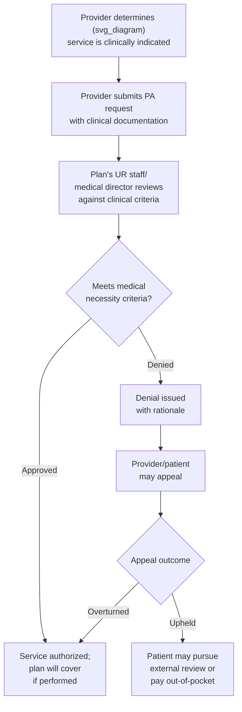

## Utilization Review and Prior Authorization

### Overview

Utilization review (UR) and prior authorization (PA) are the primary administrative tools managed care organizations and insurers use to control healthcare utilization directly, as opposed to indirectly through cost-sharing (demand-side incentives) or capitation (supply-side financial incentives). Whereas cost-sharing changes the enrollee's price faced at the point of care, and capitation changes the provider's payment structure, utilization review and prior authorization intervene **directly on the clinical decision itself**, requiring administrative approval or retrospective justification before (or after) a service is covered.

### Conceptual Placement Among Cost-Control Tools

### Types of Utilization Review

Utilization review is typically categorized by **timing relative to the service**:

**1. Prospective (Prior Authorization)**

Review and approval required **before** a service is rendered. If approval is denied, the plan will not cover the service (though the patient may still receive it and pay out-of-pocket, or appeal the denial).

**2. Concurrent Review**

Review conducted **during** an ongoing course of treatment, most commonly during an inpatient hospital stay, to determine whether continued treatment/hospitalization remains medically necessary (e.g., daily or periodic review of inpatient length-of-stay).

**3. Retrospective Review**

Review conducted **after** a service has already been provided, typically for claims auditing, medical necessity determination for payment purposes, or quality/pattern-of-care analysis. Unlike prospective and concurrent review, retrospective review cannot change clinical decisions in real time, but it affects payment and can inform future PA policy.

### Prior Authorization: Detailed Mechanics

**Definition**: Prior authorization is a requirement that a provider obtain approval from the health plan before performing a specific service, procedure, prescribing certain medications, or referring a patient for specific tests/imaging, as a condition of coverage.

**Typical process flow**:

**Common targets for prior authorization**: Advanced imaging (MRI, CT, PET scans), elective surgical procedures, specialty pharmaceuticals (particularly high-cost biologics), durable medical equipment, inpatient admissions (non-emergency), out-of-network referrals, and certain diagnostic tests.

**Clinical review criteria**: Plans typically apply standardized medical necessity criteria (e.g., InterQual or MCG — Milliman Care Guidelines — in the U.S. context) that translate clinical evidence and practice guidelines into structured decision rules used by UR staff (often nurses) and medical directors (physicians) for adjudicating requests.

### Economic Rationale

**Target market failure**: Prior authorization and utilization review are designed primarily to address two related problems:

1. **Supplier-induced demand**: Under fee-for-service payment, providers may have a financial incentive to recommend services of marginal or unclear clinical benefit; PA introduces an independent clinical check before payment is committed.
2. **Ex post moral hazard**: Once insured, patients (and their providers acting partly on their behalf) have reduced incentive to economize on care utilization since the marginal cost to the patient is below the marginal social cost; PA constrains utilization directly rather than relying solely on patient price sensitivity (as cost-sharing does), which is particularly useful for services where the *patient* has limited ability to judge necessity (highly technical, low-frequency, physician-directed services such as advanced imaging or surgery).

**Formal framing**: If $q^*$ is the socially efficient quantity of a service (where marginal benefit equals marginal cost) and $q_{FFS}$ is the quantity that would be delivered under unconstrained fee-for-service with insurance-driven moral hazard, prior authorization is intended to shift realized utilization $q_{PA}$ closer to $q^*$:

$$q^* \leq q_{PA} < q_{FFS} \quad \text{(when PA functions as intended)}$$

The efficiency case for PA rests on providers/patients being unable or unwilling to fully internalize the marginal cost of care; if instead PA denies services with $q_{PA} < q^*$ (denying medically necessary care), it introduces its own **inefficiency and welfare loss**, which is the central critique of the tool.

### Costs and Criticisms of Utilization Review

- **Administrative burden**: PA imposes substantial administrative costs on both providers (staff time completing and following up on requests) and plans (staff and systems to adjudicate requests), representing a pure transaction cost with no direct clinical benefit if the request would have been approved regardless.
- **Care delay**: Time required for review and approval can delay clinically appropriate care, particularly problematic for urgent or time-sensitive conditions.
- **Denial of medically necessary care**: If review criteria are overly conservative, poorly calibrated, or applied inconsistently, PA can result in denial of services that are in fact medically necessary, shifting the error term from over-provision to under-provision — this is the mirror-image failure mode to the moral hazard problem PA is designed to solve.
- **Physician time burden and burnout**: Frequently cited by physician professional organizations (e.g., American Medical Association survey data) as a significant contributor to administrative burden and burnout, given the volume of PA requests required in some specialties.
- **Adverse selection interaction**: Overly burdensome or restrictive UR in a specific plan can act as an implicit risk-selection tool — chronically ill patients requiring frequent authorizations may be more likely to avoid or switch away from a plan with a reputation for aggressive denial, a dynamic sometimes discussed as "utilization management as risk selection" in the health economics literature.
- [Unverified] Specific quantitative estimates of administrative cost as a share of total healthcare spending attributable to prior authorization specifically (as opposed to administrative costs generally) vary considerably across studies and data sources; consult current peer-reviewed or government sources (e.g., CMS national health expenditure data, AMA physician surveys) for up-to-date figures rather than a fixed number.

### Regulatory Responses

Given the tension between UR's cost-control rationale and its potential to delay or deny necessary care, utilization review is subject to substantial regulatory oversight in most jurisdictions:

- **External review/appeal rights**: Most U.S. states and the ACA require that denied prior authorization requests be subject to internal appeal and, ultimately, an **independent external review** by a party unaffiliated with the insurer, providing a check on erroneous or overly restrictive denials.
- **Timeliness standards**: Regulations frequently mandate maximum turnaround times for PA decisions (e.g., expedited timelines for urgent requests versus standard timelines for non-urgent requests), addressing the care-delay criticism directly.
- **"Gold carding" programs**: An emerging regulatory and payer-initiated approach exempting providers with a demonstrated history of high PA approval rates from ongoing PA requirements for specific services, reducing administrative burden for low-risk-of-denial providers while retaining review for others.
- **Medicare Advantage-specific oversight**: Given documented concerns about inappropriate denials in Medicare Advantage prior authorization (highlighted in U.S. Department of Health and Human Services Office of Inspector General reports), CMS has issued specific rules governing medical necessity criteria, review timelines, and denial notification requirements for MA plans.
- [Unverified] Specific current regulatory requirements (federal and state) governing prior authorization timelines, gold-carding mandates, and appeal rights change frequently through both legislation and rulemaking; verify against current CMS regulations and state-specific insurance department requirements for the applicable jurisdiction and year.

### Utilization Review Across Plan Types

Connecting to the HMO/PPO/POS structures covered elsewhere in this chapter, the intensity of utilization review typically varies by plan architecture:

| Plan Type | Typical UR/PA Intensity | Primary Mechanism |
| --- | --- | --- |
| HMO | Highest | PCP gatekeeping + PA for specialist/advanced services |
| POS | Moderate-High | PCP referral requirement + PA for in-network full-benefit tier |
| PPO | Moderate | PA typically limited to high-cost/high-variation services (imaging, surgery, specialty drugs) |
| Indemnity/traditional FFS | Lowest (largely legacy) | Minimal to no UR |

### Measuring Utilization Review Effectiveness

Health economists typically evaluate UR/PA programs along several empirical dimensions:

- **Denial rate**: Share of PA requests denied; a very low denial rate raises the question of whether the administrative cost of the program exceeds its utilization-control benefit (if almost everything is approved, the program may be pure overhead).
- **Appeal overturn rate**: Share of denials overturned on appeal; a high overturn rate suggests initial review criteria may be poorly calibrated or inconsistently applied.
- **Cost impact per authorization avoided**: Comparing administrative cost of the PA program against the cost of services actually avoided (not merely delayed or eventually approved), which is the appropriate marginal comparison for assessing net cost-effectiveness.
- **Health outcome impact**: Whether denied or delayed services are associated with adverse downstream health outcomes (e.g., emergency department visits, hospitalizations) that offset apparent short-run savings — a key methodological challenge in this literature is separating true unnecessary-care avoidance from harmful care restriction.
- [Inference] Because randomized evaluation of prior authorization policies is rare (most evidence comes from observational comparisons across plans or before/after policy changes), causal estimates of UR's net welfare effect are subject to more uncertainty than for interventions evaluated with experimental designs, and results are more setting- and service-specific than headline summaries sometimes suggest.

### Common Exam/Application Angles

- Distinguish prospective, concurrent, and retrospective utilization review by timing and by their respective ability to influence the clinical decision itself.
- Explain the economic rationale for prior authorization as a direct response to supplier-induced demand and ex post moral hazard, distinct from cost-sharing (a demand-side tool).
- Analyze the trade-off between PA's cost-control benefit and its administrative burden/care-delay costs, using the $q^* \leq q_{PA} < q_{FFS}$ framing versus the failure case $q_{PA} < q^*$.
- Discuss regulatory responses (external review, timeliness standards, gold carding) as mechanisms addressing UR's potential for erroneous denial.
- Evaluate UR/PA intensity differences across HMO, POS, and PPO plan structures and connect to each structure's broader utilization-management philosophy.
- Discuss appropriate metrics (denial rate, appeal overturn rate, cost per authorization avoided) for empirically assessing a UR program's net value.

**Related Topics**

- HMO, PPO, and point-of-service plan structures
- Supplier-induced demand theory
- Moral hazard in health insurance (ex ante vs. ex post)
- Capitation and other provider payment mechanisms
- Medical necessity criteria and clinical practice guidelines (InterQual, MCG)
- Medicare Advantage prior authorization oversight (CMS and OIG findings)
- Gold carding and administrative burden reduction initiatives
- External/independent review processes for denied claims
- Narrow networks and tiered network design
- Value-based insurance design (VBID)