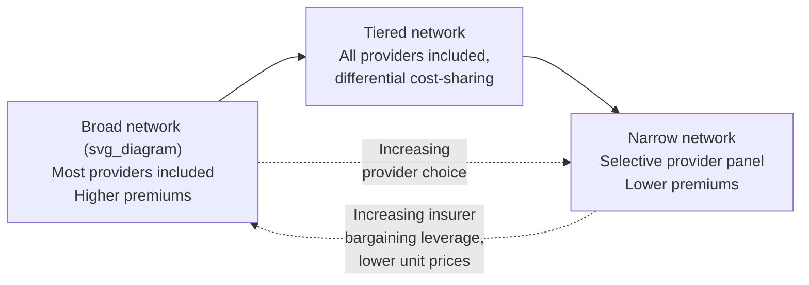
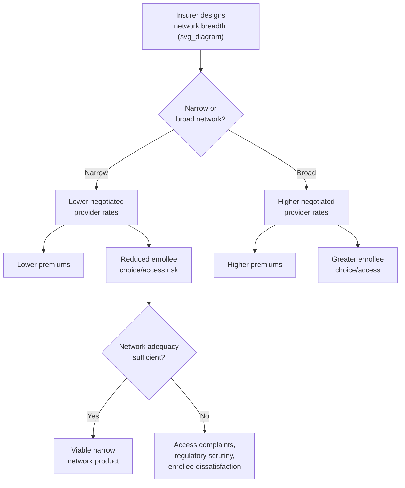

## Provider Network Design and Narrow Networks

### Overview

Provider network design is the process by which health insurers select, contract with, and organize the set of healthcare providers (physicians, hospitals, and other facilities) that enrollees can access under a given plan. Network breadth — ranging from broad, near-unrestricted networks to deliberately narrow networks — is one of the primary tools insurers use to manage costs, alongside cost-sharing, utilization review, and provider payment mechanisms covered elsewhere in this chapter. Network design directly interacts with insurer bargaining power, provider payment rates, enrollee access, and market competition.

### Defining Network Breadth

**Broad network**: Includes a large share of available providers and facilities in a given geographic area, often including most major hospital systems and a high proportion of practicing physicians across specialties.

**Narrow network**: Deliberately restricts the panel of contracted providers to a smaller subset, often selected based on cost, quality metrics, or willingness to accept lower negotiated payment rates. There is no universally fixed threshold, but narrow networks are commonly characterized in the literature and by rating organizations as including meaningfully less than the majority of providers in a market area (e.g., commonly cited industry classifications define "narrow" as covering under roughly 30% of area physicians, though exact cutoffs vary by source and methodology).

**Tiered network**: An intermediate structure in which providers are stratified into tiers (e.g., preferred/Tier 1 versus standard/Tier 2) with differential cost-sharing — enrollees may use any tier but face lower out-of-pocket costs for using preferred-tier providers, similar in spirit to PPO in-/out-of-network tiering but applied *within* a single network.

### Economic Rationale for Narrow Networks

**Bargaining leverage mechanism**: The central economic logic of narrow networks is that by committing to exclude providers who do not accept discounted rates, an insurer credibly threatens to direct patient volume away from high-cost providers, strengthening its bargaining position in fee negotiations.

$$\text{Insurer's Threat Point} = \text{Value of Volume Redirected to Competing (Included) Providers}$$

The more effectively an insurer can credibly exclude a given provider without unacceptable enrollee attrition, the lower the negotiated price that provider will accept — meaning narrow network effectiveness depends on the **availability of adequate substitute providers** in the same market and on **enrollees' price sensitivity to network breadth relative to premium savings**.

**Quality/value-based selection**: Some narrow networks (sometimes termed "high-performance networks") select providers based on quality metrics and demonstrated cost-efficiency (e.g., lower per-episode costs for comparable outcomes) rather than price alone, aiming to steer enrollees toward higher-value providers rather than simply the cheapest ones.

**Care coordination rationale**: A smaller, more integrated provider panel can, in principle, facilitate better care coordination and reduce duplicative testing or fragmented care, similar to the rationale underlying HMO gatekeeping (covered elsewhere in this chapter), though this is distinct from — and sometimes conflated with — the pure price-negotiation rationale.

### Network Design Trade-offs

**Key trade-offs**:

- **Premium savings vs. access/choice**: Narrow networks typically allow insurers to offer lower premiums (reflecting lower negotiated provider payment rates), but at the cost of enrollee provider choice and potentially longer travel distances or wait times.
- **Adverse selection interaction**: Narrow networks that exclude specific high-cost specialty providers (e.g., leading academic medical centers or specific specialist types) can function as an implicit risk-selection mechanism, discouraging enrollment by individuals with complex or chronic conditions who value access to those specific providers — a dynamic closely related to the risk-selection concerns discussed for HMO gatekeeping and connected to the broader adverse selection material earlier in this course.
- **Surprise/balance billing exposure**: Enrollees in narrow-network plans face elevated risk of inadvertently receiving care from an out-of-network provider (e.g., an out-of-network anesthesiologist at an in-network hospital), a problem directly addressed by the U.S. federal No Surprises Act (effective 2022).
- **Quality variation**: Evidence on whether narrow networks systematically include lower-quality or higher-quality providers is mixed and highly setting-specific; narrow networks built around quality/value selection differ substantially in this respect from narrow networks built purely around price concessions.
- [Inference] Whether a given narrow network primarily reflects genuine value-based provider selection versus primarily reflects an insurer's leverage to extract price concessions from providers willing to accept steep discounts (independent of quality) is often difficult to distinguish from plan design alone and is an active area of empirical health services research.

### Network Adequacy Regulation

Given access concerns associated with narrow networks, most jurisdictions impose **network adequacy standards** — minimum requirements ensuring enrollees have reasonable access to covered services within the network.

**Common regulatory approaches**:

- **Time and distance standards**: Maximum allowable travel time or distance to reach specific provider types (e.g., PCP, specific specialties, hospitals) within the network.
- **Provider-to-enrollee ratios**: Minimum required ratios of specific provider types per enrolled population.
- **Appointment wait-time standards**: Maximum allowable wait times for routine and urgent appointments.
- **Essential community provider requirements**: Requirements (particularly under ACA Marketplace rules) that networks include a minimum percentage of "essential community providers" serving low-income and medically underserved populations (e.g., federally qualified health centers, Ryan White HIV/AIDS providers).
- **Network directory accuracy requirements**: Given documented problems with inaccurate provider directories (listing providers who are not actually accepting new patients, are out-of-network, or are no longer practicing), regulations increasingly mandate directory accuracy standards and enrollee protections when directory information proves inaccurate.
- [Unverified] Specific numerical network adequacy standards (time/distance thresholds, provider ratios) vary substantially by state, plan market segment (ACA Marketplace, Medicare Advantage, Medicaid managed care, commercial), and are updated periodically through rulemaking; consult current CMS and applicable state insurance department regulations for precise, current figures rather than a fixed universal standard.

### Narrow Networks in Different Markets

| Market Segment | Narrow Network Prevalence/Context |
| --- | --- |
| ACA Marketplace (individual) | Historically associated with substantial narrow-network prevalence, partly attributed to insurers' need to control costs under ACA rating restrictions (community rating, guaranteed issue) without the ability to underwrite; extensively studied in health economics literature examining Marketplace plan design post-2014 |
| Medicare Advantage | Narrow and tiered networks common; subject to CMS network adequacy review as part of plan approval |
| Medicaid managed care | Narrow networks common, raising particular access concerns given the population served; subject to state-specific network adequacy requirements |
| Employer-sponsored (large group) | Historically broader networks more common, though narrow and tiered "high-performance network" products have grown as an employer cost-control strategy |

### Empirical Evidence and Case Studies

- **ACA Marketplace network breadth studies**: Multiple published analyses (e.g., by researchers using data compiled by organizations tracking Marketplace plan networks) have documented that a substantial share of ACA Marketplace plans in the years following 2014 implementation used narrow networks, particularly excluding certain academic medical centers and cancer centers, motivating research into access and selection effects.
- **Hospital exclusion and steering studies**: Health services research has examined instances where insurers excluded specific high-cost hospital systems from narrow networks, generally finding effects consistent with the bargaining leverage rationale (exclusion or credible threat of exclusion associated with lower subsequently negotiated rates), though specific quantitative effects are study- and market-specific.
- [Unverified] Specific citations, statistics, and named study findings regarding narrow network prevalence and effects should be verified against current peer-reviewed literature (e.g., published health economics and health services research journals) for the most accurate and current figures, as this is an active empirical research area with findings that continue to be refined.

### Provider Network Design and Competitive Dynamics

Network design also interacts with provider market structure and antitrust considerations:

- **Provider consolidation response**: In markets with highly consolidated hospital systems (limited competing systems), insurers have less ability to construct a credible narrow network (since excluding the dominant system leaves few adequate substitutes), reducing insurers' bargaining leverage — an important interaction between provider market concentration (a supply-side market structure issue) and network design as a demand-side cost-control tool.
- **"Must-have" provider dynamics**: Certain providers or systems (e.g., the only trauma center or academic medical center in a region) may be effectively impossible to exclude from any commercially viable network due to enrollee demand and regulatory network adequacy requirements, limiting the scope of narrow network strategies regardless of price.
- **Antitrust scrutiny of network-related contract terms**: Provisions such as "anti-steering," "anti-tiering," or "most-favored-nation" clauses in provider contracts (which can restrict an insurer's ability to design narrower networks or offer tiered incentives favoring competitors) have drawn antitrust scrutiny and litigation in several jurisdictions, as they can entrench high-price providers by limiting insurers' network design flexibility.

### Common Exam/Application Angles

- Explain the bargaining leverage mechanism underlying narrow network design and its dependence on the availability of substitute providers.
- Analyze the trade-off between premium savings and enrollee access/choice in a narrow network product.
- Discuss how narrow networks can function as an implicit risk-selection tool and connect this to the broader adverse selection framework from earlier in the course.
- Evaluate network adequacy regulation as a policy response to narrow network access concerns.
- Distinguish price-based narrow networks from quality/value-based ("high-performance") narrow networks.
- Analyze how provider market consolidation limits insurers' ability to construct effective narrow networks.
- Connect narrow network design to surprise billing exposure and the policy rationale for the No Surprises Act.

**Related Topics**

- HMO, PPO, and point-of-service plan structures
- Utilization review and prior authorization
- Provider payment mechanisms (capitation, fee-for-service, bundled payment)
- No Surprises Act and balance billing regulation
- Hospital market concentration and antitrust in healthcare
- Adverse selection in health plan choice
- ACA Marketplace plan design and essential community provider requirements
- Medicare Advantage and Medicaid managed care network requirements
- Value-based insurance design (VBID)
- Anti-steering, anti-tiering, and most-favored-nation contract clauses