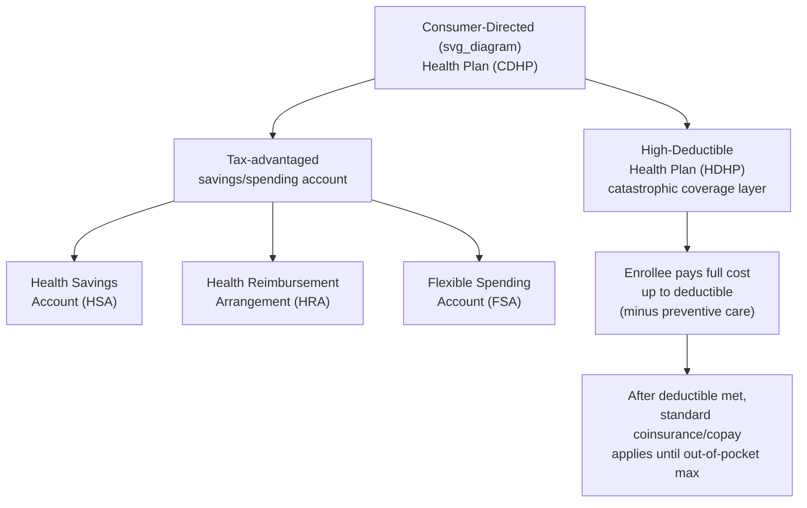

## Consumer-Directed Health Plans and Health Savings Accounts

### Overview

Consumer-directed health plans (CDHPs) represent a distinct approach to managing healthcare costs by shifting greater financial responsibility and decision-making authority to enrollees, in contrast to the supply-side and administrative controls of managed care (gatekeeping, utilization review, narrow networks) covered elsewhere in this chapter. CDHPs are typically structured around a **high-deductible health plan (HDHP)** paired with a **tax-advantaged savings account** — most commonly a **Health Savings Account (HSA)**, though **Health Reimbursement Arrangements (HRAs)** and **Flexible Spending Accounts (FSAs)** are related vehicles. The underlying economic theory rests on classical demand-side moral hazard reduction: by exposing consumers to a larger share of costs at the margin, CDHPs aim to induce more price-conscious healthcare consumption decisions.

### Conceptual Architecture

### High-Deductible Health Plan (HDHP) Structure

**Definition**: An HDHP is a health plan with a deductible above a statutorily or regulatorily defined minimum threshold, below which the enrollee is generally responsible for the full negotiated cost of non-preventive services.

**Typical cost-sharing structure**:

$$\text{Enrollee Out-of-Pocket} = \begin{cases} \text{Full negotiated cost} & \text{if cumulative spending} < \text{Deductible} \\ \text{Coinsurance} \times \text{Cost} & \text{if Deductible} \leq \text{spending} < \text{OOP Max} \\ 0 & \text{if cumulative spending} \geq \text{OOP Max} \end{cases}$$

**Preventive care exception**: In the U.S., HSA-qualified HDHPs are required (under IRS rules implementing ACA preventive service mandates) to cover a defined set of preventive services (e.g., routine screenings, immunizations, annual wellness visits) **before** the deductible is met, at no cost-sharing — this exception is deliberately designed to preserve incentives for cost-effective preventive care even while imposing first-dollar exposure on other services.

- [Unverified] Specific IRS-defined minimum deductible thresholds and maximum out-of-pocket limits for HSA-qualified HDHPs are indexed for inflation and updated annually; consult current IRS guidance (e.g., the relevant Revenue Procedure) for the applicable tax year's exact dollar figures rather than relying on any fixed number.

### Health Savings Account (HSA) Mechanics

**Definition**: An HSA is an individually owned, tax-advantaged account that can be funded by the account holder, an employer, or both, used to pay for qualified medical expenses, and available only to individuals enrolled in an HSA-qualified HDHP.

**Triple tax advantage** (the central design feature distinguishing HSAs from most other savings vehicles):

$$\text{HSA Tax Treatment} = \underbrace{\text{Pre-tax contributions}}_{\text{Deduction 1}} + \underbrace{\text{Tax-free growth}}_{\text{Deduction 2}} + \underbrace{\text{Tax-free qualified withdrawals}}_{\text{Deduction 3}}$$

1. **Contributions** are tax-deductible (or pre-tax if made via payroll deduction), reducing taxable income in the contribution year.
2. **Investment growth** within the account (interest, dividends, capital gains) is not taxed while held in the account.
3. **Withdrawals** for qualified medical expenses are not taxed at any point.

**Key structural features**:

- **Portability**: Unlike an FSA, an HSA is owned by the individual, not tied to a specific employer, and the balance carries over indefinitely (no "use it or lose it" provision) and remains with the individual across job changes.
- **Investment feature**: Once a minimum cash balance is met, HSA funds are typically eligible to be invested (similar to a retirement account), allowing tax-advantaged growth over long horizons — a feature increasingly emphasized as a supplemental retirement savings vehicle given that HSA funds can be used for any purpose after age 65 (subject to ordinary income tax if used for non-medical expenses, analogous to a traditional IRA).
- **Contribution limits**: Annual contribution limits are set and indexed by the IRS, with a higher limit for family coverage than self-only coverage, and an additional "catch-up" contribution allowed for individuals aged 55 and older.
- **Eligibility requirement**: An individual must be enrolled in an HSA-qualified HDHP and have no other disqualifying coverage (e.g., cannot simultaneously be enrolled in Medicare, cannot have a general-purpose FSA held by themselves or a spouse) to contribute to an HSA.
- [Unverified] Current annual HSA contribution limits (self-only and family), the minimum required HDHP deductible, and the maximum out-of-pocket limit are set annually by the IRS and change over time; verify current figures against the applicable IRS revenue procedure for the relevant tax year before citing specific dollar amounts.

### Comparison: HSA, HRA, and FSA

| Feature | HSA | HRA | FSA |
| --- | --- | --- | --- |
| Ownership | Individual | Employer | Employer (individual has a sub-account) |
| Funding source | Individual and/or employer | Employer only | Individual (pre-tax payroll) and/or employer |
| Portability across jobs | Yes, fully portable | No, forfeited on job change (unless employer specifies otherwise) | No, generally forfeited on job change |
| Rollover ("use it or lose it") | No limit, balance carries over indefinitely | Employer-determined; often no rollover or limited rollover | Limited rollover or grace period allowed under IRS rules; otherwise forfeited |
| Requires HDHP enrollment | Yes | No (employer-defined) | No |
| Investment option | Yes, typically | No | No |
| Employee contribution allowed | Yes | No (employer-funded only) | Yes |

### Economic Theory: Demand-Side Moral Hazard Reduction

**Core mechanism**: CDHPs operationalize the standard economic prescription for addressing **ex post moral hazard** — the tendency of insured individuals to consume more healthcare than they would if fully exposed to its marginal cost, because insurance reduces the price faced at the point of service to below the true resource cost.

By raising the enrollee's cost-sharing (via a high deductible) up to a meaningful threshold, CDHPs increase the **price elasticity-relevant price** faced by the consumer for a larger share of typical annual healthcare spending, theoretically inducing:

- More careful comparison shopping for elective or discretionary services.
- Reduced utilization of low-value or marginal-benefit care.
- Greater engagement with cost and quality information when available.

**RAND Health Insurance Experiment connection**: The foundational empirical basis for demand-side cost-sharing effects (elasticity of demand for medical care with respect to out-of-pocket price) traces to the RAND Health Insurance Experiment (1970s–1980s), a large-scale randomized controlled trial that remains a canonical reference in health economics for estimating how cost-sharing affects utilization. CDHP research builds on and extends this literature to the specific deductible-based, HSA-paired plan structure.

### The Core Trade-off: Cost Control vs. Reduced Necessary Care

The central empirical and policy debate around CDHPs mirrors the utilization review trade-off discussed elsewhere in this chapter — deductible-driven cost-sharing does not distinguish between low-value and high-value care at the point of decision, since the enrollee (not a clinical reviewer) determines whether to seek care.

$$\text{Net Welfare Effect} = \underbrace{\text{Value of reduced low-value utilization}}_{\text{Efficiency gain}} - \underbrace{\text{Value of forgone high-value/necessary care}}_{\text{Efficiency loss}}$$

**Empirical findings** (general characterization of a substantial literature, not a single study):

- Studies of CDHP/HDHP adoption have generally found reductions in overall healthcare spending and utilization following enrollment.
- A recurring concern in this literature is that observed utilization reductions are not well targeted — enrollees frequently reduce use of preventive and chronic disease management services (which are typically high-value) at similar or even greater rates than reductions in discretionary or low-value care, suggesting that consumers often lack the clinical information needed to distinguish necessary from unnecessary care when facing high out-of-pocket costs.
- Effects tend to be more pronounced for lower-income enrollees, who face more binding liquidity constraints relative to the deductible amount, raising equity concerns about differential impact across income groups.
- [Inference] Whether CDHP-associated utilization reductions represent efficient elimination of low-value care or inefficient underuse of necessary care likely varies by service type, enrollee health status, and the availability of price/quality transparency tools, and existing literature substantially supports the view that the reduction is a mix of both, rather than being cleanly attributable to one or the other.

### Value-Based Insurance Design (VBID) as a Refinement

**Value-Based Insurance Design** emerged partly as a response to the "blunt instrument" critique of standard deductible-based cost-sharing, proposing that cost-sharing be calibrated to the **clinical value** of a service rather than applied uniformly:

$$\text{Cost-sharing}_{\text{service}} \propto \frac{1}{\text{Clinical value of service}}$$

Under VBID, high-value services (e.g., medications for chronic disease management, such as insulin or statins) are exempted from the deductible or subject to minimal cost-sharing, even within an otherwise high-deductible plan structure, while low-value or discretionary services retain full cost-sharing exposure — directly targeting the efficiency loss term in the trade-off equation above without sacrificing the efficiency gain term.

- Many HSA-qualified HDHPs now incorporate a limited VBID-style exception, permitting first-dollar (pre-deductible) coverage for a defined list of preventive services for certain chronic conditions, per IRS guidance expanding the traditional preventive care safe harbor.

### CDHP Adoption Trends and Market Context

- CDHPs have grown substantially as a share of employer-sponsored insurance offerings since the mid-2000s, driven by employer cost-control objectives and, in the U.S., by the tax advantages associated with HSA contributions (a rare instance of a health-policy tool with bipartisan political support, given its market-based, savings-oriented framing).
- Employers frequently pair HDHP/HSA offerings with an employer HSA contribution (a fixed or matching amount) to offset some of the increased first-dollar exposure and encourage enrollment.
- [Unverified] Current market penetration statistics for HDHP/HSA-eligible plans as a share of total employer-sponsored coverage should be verified against current Kaiser Family Foundation Employer Health Benefits Survey data or similar sources, as these figures change year to year.

### Common Exam/Application Angles

- Explain the "triple tax advantage" of HSAs and contrast HSA, HRA, and FSA structures along ownership, portability, and rollover dimensions.
- Connect CDHP design directly to the theory of ex post moral hazard and the RAND Health Insurance Experiment's empirical foundation.
- Analyze the core efficiency trade-off in deductible-based cost-sharing: reduced low-value utilization versus forgone necessary care.
- Discuss Value-Based Insurance Design as a targeted refinement addressing the "blunt instrument" critique of uniform high deductibles.
- Evaluate equity concerns associated with CDHP adoption across income groups, connecting to liquidity constraints and differential utilization responses.
- Compare CDHP/HSA demand-side cost control to the supply-side and administrative tools (capitation, utilization review, narrow networks) covered elsewhere in this chapter.

**Related Topics**

- Moral hazard in health insurance (ex ante vs. ex post)
- RAND Health Insurance Experiment and price elasticity of medical care demand
- Value-based insurance design (VBID)
- Utilization review and prior authorization
- HMO, PPO, and point-of-service plan structures
- Cost-sharing design: deductibles, copayments, and coinsurance
- Price and quality transparency tools in healthcare
- Employer-sponsored insurance tax exclusion and its policy implications
- Medicare Medical Savings Accounts (a related but distinct vehicle)
- Equity considerations in cost-sharing design across income groups