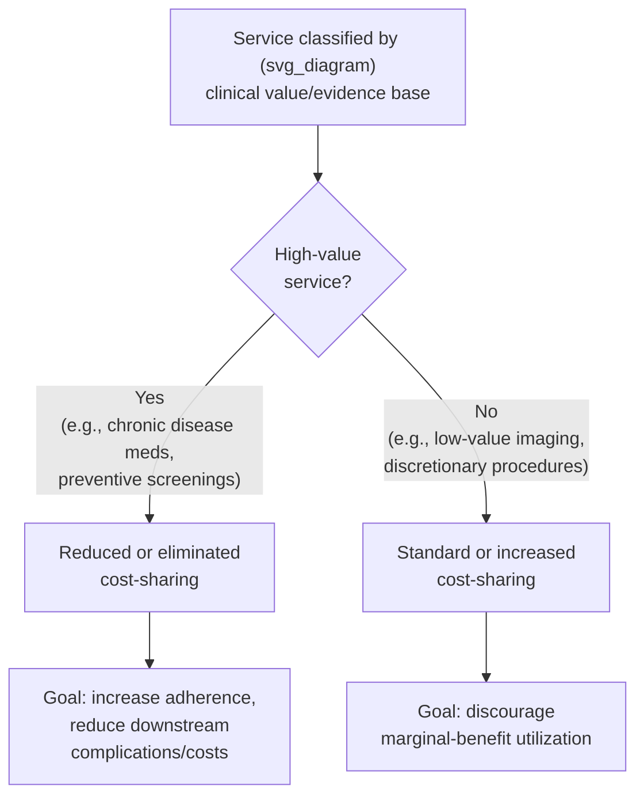

## Value-Based Insurance Design

### Overview

Value-Based Insurance Design (VBID) is a health plan design framework that calibrates enrollee cost-sharing to the **clinical value** of a service rather than applying cost-sharing uniformly across all services regardless of benefit. VBID was developed explicitly as a response to the central limitation of conventional cost-sharing structures (flat deductibles, uniform coinsurance) discussed elsewhere in this chapter: such structures reduce utilization of high-value and low-value care indiscriminately, since the enrollee's out-of-pocket price does not vary with a service's clinical benefit. VBID reframes cost-sharing as a **targeted incentive instrument** rather than a blunt, uniform demand-reduction tool.

### The Problem VBID Addresses

Conventional cost-sharing (deductibles, flat coinsurance) is based on a "clinically blind" model:

$$\text{Cost-sharing}_{\text{conventional}} = f(\text{Price of service}) \quad \text{independent of clinical value}$$

This structure creates the efficiency trade-off examined under consumer-directed health plans: because the enrollee (not a clinical algorithm) is the one making the utilization decision at the point of cost-sharing exposure, and because enrollees often cannot reliably distinguish high-value from low-value care using price signals alone, flat cost-sharing suppresses **both** the low-value care that policy intends to discourage **and** the high-value care that policy would prefer to encourage — particularly problematic for chronic disease management, where reduced adherence (e.g., to insulin, statins, or antihypertensives) due to cost-sharing has been extensively documented to worsen downstream health outcomes and can paradoxically **raise** total costs through avoidable complications, hospitalizations, and emergency care.

$$\text{Total Cost} = \text{Direct Service Cost} + \text{Cost of Complications from Reduced Adherence}$$

VBID's foundational insight is that when a service's demand elasticity with respect to cost-sharing is high relative to its clinical value, and the marginal cost of non-adherence (downstream complications) exceeds the marginal savings from reduced first-dollar spending, then reducing cost-sharing for that specific service can be **cost-saving or cost-neutral overall**, not merely clinically beneficial at increased cost.

### Core Design Principle

VBID inverts the relationship between price and value:

$$\text{Cost-sharing}_{\text{VBID}} \propto \frac{1}{\text{Clinical value of service}}$$

**Two-sided implementation**: VBID can be implemented as a purely one-sided intervention (only reducing cost-sharing for high-value services, leaving other cost-sharing unchanged) or as a fully two-sided intervention (simultaneously reducing cost-sharing for high-value services and increasing it for identified low-value services), though most real-world VBID programs to date have emphasized the "carrot" (reduced cost-sharing for high-value care) side more heavily than the "stick" (increased cost-sharing for low-value care) side, partly due to political and enrollee-acceptance considerations.

### Theoretical Foundations

**Origins**: VBID emerged from health economics and health services research in the early-to-mid 2000s, most prominently associated with the work of A. Mark Fendrick and Michael Chernew at the University of Michigan Center for Value-Based Insurance Design, building on the broader moral hazard literature (including the RAND Health Insurance Experiment) but explicitly critiquing the assumption embedded in standard cost-sharing theory that all utilization reductions from cost-sharing represent efficiency gains.

**Distinction from standard moral hazard framing**: The traditional Pauly (1968) moral hazard framework treats any utilization increase from insurance coverage as a welfare loss relative to the uninsured optimum, implicitly assuming that at the margin, insured individuals consume care whose marginal cost exceeds marginal benefit. VBID's underlying critique is that this framing is incomplete for services with **well-established, high-certainty clinical evidence of benefit** (e.g., secondary prevention medications after a heart attack) — for these services, the marginal benefit may substantially exceed marginal cost even at higher utilization levels, meaning cost-sharing-induced reductions in *these specific services* represent a welfare loss in the *opposite* direction from the standard moral hazard story.

$$\text{Standard moral hazard framing: } MB(q) < MC(q) \text{ at insured } q$$

$$\text{VBID counter-case for high-value services: } MB(q) > MC(q) \text{ even at insured } q, \text{ so cost-sharing reduces welfare}$$

### Common VBID Applications

| Service Category | Typical VBID Treatment | Rationale |
| --- | --- | --- |
| Chronic disease medications (e.g., insulin, statins, ACE inhibitors) | Reduced/eliminated copay | High adherence elasticity; strong evidence linking adherence to reduced complications |
| Preventive screenings (e.g., mammography, colonoscopy) | Reduced/eliminated cost-sharing | ACA mandates first-dollar coverage for USPSTF Grade A/B recommended services broadly, and VBID extends this logic further |
| Post-MI (myocardial infarction) secondary prevention drugs | Reduced/eliminated copay | Frequently studied case (e.g., the MI FREEE trial) with strong evidence of cost-effectiveness |
| High-value primary care visits and chronic disease management visits | Reduced copay | Encourages ongoing management reducing acute exacerbations |
| Low-value imaging (e.g., imaging for uncomplicated low back pain) | Standard or increased cost-sharing | Evidence of frequent low clinical yield relative to cost |
| Elective procedures with high geographic practice variation | Standard or reference pricing applied | Signals of discretionary, preference-sensitive care where value is less certain |

### Key Empirical Evidence: The MI FREEE Trial

The **Post-Myocardial Infarction Free Rx Event and Economic Evaluation (MI FREEE)** trial is among the most frequently cited randomized evaluations of VBID in the health economics literature. It examined the effect of eliminating copayments for statins, beta-blockers, ACE inhibitors/ARBs, and other secondary-prevention medications for patients following a heart attack.

- Findings generally showed improved medication adherence among patients with eliminated cost-sharing, though findings regarding the magnitude of the effect on the trial's primary composite clinical endpoint (rates of major vascular events and revascularization) were more modest than adherence effects alone might suggest.
- The trial is frequently used pedagogically to illustrate both the promise of VBID (improved adherence, no net cost increase to the insurer in this specific case) and the empirical complexity of translating improved adherence into statistically significant improvements in hard clinical outcomes within a typical study timeframe.
- [Unverified] Precise quantitative results (specific adherence percentage-point improvements, statistical significance levels for clinical endpoints, cost-neutrality figures) from the MI FREEE trial and other specific VBID studies should be verified against the original published literature (e.g., the New England Journal of Medicine publication reporting these results) rather than cited from memory, given the importance of precise figures in this domain.

### Regulatory and Policy Integration

- **ACA preventive services mandate**: While not labeled "VBID" in the ACA statute itself, the ACA's requirement that USPSTF Grade A/B preventive services be covered without cost-sharing is conceptually a VBID-style provision applied at a national regulatory level, rather than as an optional employer or plan design choice.
- **Medicare Advantage VBID Model**: CMS operated a **Medicare Advantage VBID Model** demonstration (a Center for Medicare and Medicaid Innovation initiative) allowing participating Medicare Advantage plans to offer reduced cost-sharing or supplemental benefits targeted at enrollees with specified chronic conditions, testing VBID principles within the Medicare Advantage population at scale.
- **HSA-compatible VBID**: IRS guidance (notably Notice 2019-45) expanded the list of preventive care items and services that HSA-qualified HDHPs can cover before the deductible is met to include certain care for chronic conditions (e.g., insulin for diabetics, statins for individuals with heart disease risk factors), explicitly reconciling VBID principles with HSA/HDHP eligibility rules — addressing a prior tension where a fully VBID-compliant plan (covering chronic disease drugs pre-deductible) could have disqualified the plan from HSA eligibility under earlier IRS interpretation.
- [Unverified] The specific list of conditions and services covered under IRS Notice 2019-45 and any subsequent expansions should be verified against current IRS guidance, as this list has been updated since initial publication.

### Implementation Challenges

- **Defining "clinical value" operationally**: Translating clinical evidence into a workable, auditable cost-sharing tier requires condition-specific and sometimes patient-specific clinical algorithms (e.g., "this medication is high-value **for patients with diagnosis X**" rather than a blanket drug-level classification), which increases administrative complexity relative to uniform cost-sharing.
- **Adverse selection and risk-coding concerns**: Structuring benefits around specific diagnoses to trigger reduced cost-sharing requires reliable diagnostic coding, which introduces similar upcoding/documentation-incentive concerns as those discussed under risk adjustment.
- **Two-sided VBID's political/enrollee acceptance**: Increasing cost-sharing for identified low-value services (the "stick" side of two-sided VBID) has faced greater implementation resistance than reducing cost-sharing for high-value services (the "carrot" side), partly reflecting greater enrollee sensitivity to cost increases than to the framing of foregone cost decreases (a pattern broadly consistent with loss-aversion findings in behavioral economics, though VBID-specific behavioral research on this exact asymmetry is more limited than the general finding).
- **Evidence base limitations**: While VBID is well-supported for a defined set of chronic disease medications and preventive services with strong RCT-level adherence-outcome evidence, extending VBID principles to a broader range of services requires clinical evidence of comparable quality, which is not uniformly available across all service categories.
- [Inference] The overall cost-effectiveness of a specific VBID program depends heavily on the particular services targeted, the population's baseline adherence and disease prevalence, and the magnitude of cost-sharing reduction applied; broad claims that "VBID saves money" or "VBID improves outcomes" without specifying the targeted service and population should be treated as directional generalizations from a body of service-specific evidence rather than a universal, service-independent result.

### VBID in the Broader Managed Care Toolkit

Connecting VBID to the other mechanisms covered in this chapter clarifies its distinct role:

| Mechanism | Primary Lever | Target Failure |
| --- | --- | --- |
| HMO gatekeeping / narrow networks | Restrict provider choice / access | Supplier-induced demand, ex post moral hazard |
| Utilization review / prior authorization | Direct administrative clinical review | Supplier-induced demand, ex post moral hazard |
| Standard HDHP/CDHP cost-sharing | Uniform price exposure | Ex post moral hazard (undifferentiated by value) |
| Value-Based Insurance Design | Value-differentiated price exposure | Ex post moral hazard **and** underuse of high-value care caused by undifferentiated cost-sharing |

VBID is best understood not as a replacement for conventional cost-sharing or utilization management, but as a **refinement layered on top of** an existing benefit design, correcting for the specific failure mode (indiscriminate suppression of high-value care) that uniform cost-sharing structures introduce.

### Common Exam/Application Angles

- Explain how VBID's underlying critique of standard moral hazard theory differs from the Pauly (1968) framing, specifically regarding services where marginal benefit may exceed marginal cost even at insured utilization levels.
- Use the MI FREEE trial as a worked example distinguishing improved adherence from improved hard clinical outcomes, and discuss why these can diverge in a trial's observed results.
- Analyze why two-sided VBID (increasing cost-sharing for low-value services) has faced greater implementation resistance than one-sided VBID.
- Discuss the interaction between VBID design and HSA/HDHP eligibility rules (IRS Notice 2019-45) as a case study in reconciling two health policy goals.
- Evaluate the administrative complexity of operationalizing "clinical value" into an auditable benefit design, including diagnosis-coding and upcoding concerns.
- Compare VBID to other cost-control tools in this chapter (utilization review, narrow networks, standard CDHP cost-sharing) along the dimension of whether they discriminate between high- and low-value care.

**Related Topics**

- Consumer-directed health plans and health savings accounts
- Moral hazard in health insurance (ex ante vs. ex post), including the Pauly (1968) framework
- RAND Health Insurance Experiment and price elasticity of medical care demand
- Utilization review and prior authorization
- ACA preventive services mandate and USPSTF grading system
- Medicare Advantage VBID Model (CMS Innovation Center demonstration)
- Medication adherence and chronic disease management economics
- Reference pricing for elective procedures
- Risk adjustment and diagnosis-coding incentives
- Behavioral economics applications in health insurance design (loss aversion, framing effects)