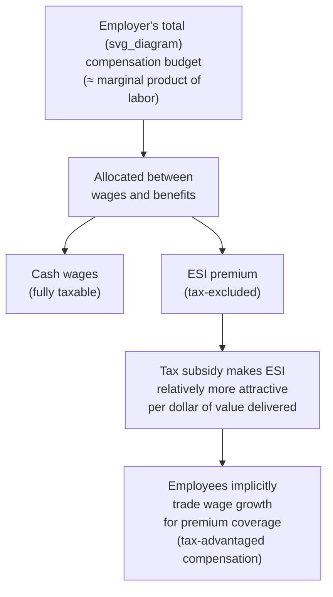

## Employer-Sponsored Insurance Economics

### Overview

Employer-sponsored insurance (ESI) is the dominant form of health coverage in the United States and several other countries, and its economic structure differs fundamentally from individually purchased insurance in ways that affect risk pooling, tax policy, labor market dynamics, and the incidence of healthcare costs. Understanding ESI requires integrating labor economics (wage-benefit trade-offs, tax incidence) with insurance economics (risk pooling, adverse selection) covered elsewhere in this course.

### Why Employers Sponsor Insurance: Historical and Economic Origins

**Historical origin**: The prevalence of ESI in the U.S. traces substantially to **wage and price controls during World War II**, when employers, unable to compete for scarce labor through wage increases, began offering health insurance as a non-wage benefit to attract workers. This benefit subsequently received favorable tax treatment, cementing its position as the dominant coverage form.

**Ongoing economic rationale**: Beyond historical path dependency, several economic factors continue to make the employer-based group an efficient risk-pooling and distribution mechanism:

- **Natural risk pooling unrelated to health status**: Employment groups are formed for reasons unrelated to health risk (skills, industry, geography), which — absent active health-based hiring discrimination (illegal in most contexts) — produces a risk pool less subject to adverse selection than a purely voluntary individual market, since the selection into the group is not driven primarily by anticipated healthcare need.
- **Reduced administrative/marketing costs**: Selling one group policy to an employer covering many employees carries substantially lower per-covered-life administrative and marketing costs than selling many individual policies, an economy of scale reflected in generally lower administrative loading ratios for large-group insurance relative to individual market insurance.
- **Employer as information intermediary**: Employers can partially substitute for individual underwriting information by observing employee tenure, occupation, and (indirectly) general health/productivity signals, though this is a weaker and less direct mechanism than individual underwriting.

### The Tax Exclusion for Employer-Sponsored Insurance

**Core mechanism**: In the U.S. tax system, employer contributions toward employee health insurance premiums are excluded from both employee income tax and payroll (FICA) tax, for both the employer and employee, unlike cash wages, which are fully taxable.

$$\text{After-tax value of \$1 in wages} = \$1 \times (1 - \tau)$$

$$\text{After-tax value of \$1 in ESI premium} = \$1$$

where $\tau$ is the employee's combined marginal income and payroll tax rate. This creates a **tax subsidy** favoring compensation paid as health insurance over equivalent cash wages, with the subsidy's value increasing with the employee's marginal tax rate.

$$\text{Tax Subsidy per dollar of ESI premium} = \tau \times \text{Premium}$$

**Regressivity concern**: Because the tax subsidy's value scales with the marginal tax rate, and marginal tax rates rise with income, the ESI tax exclusion is widely characterized in public finance literature as **regressive in its distributional pattern** — higher-income workers, facing higher marginal tax rates, receive a larger tax subsidy per dollar of premium than lower-income workers, even though the nominal premium might be similar.

- [Unverified] Precise current estimates of the aggregate annual value of the ESI tax exclusion (a commonly cited "tax expenditure" in U.S. federal budget analysis) and its distributional incidence across income deciles are published periodically by entities such as the Congressional Budget Office and the Joint Committee on Taxation; consult current editions of these publications for up-to-date figures rather than a fixed number, as this is one of the largest tax expenditures in the federal budget and estimates are updated regularly.

### Wage-Benefit Trade-off and Tax Incidence

**Standard labor economics framing**: In a competitive labor market, total compensation (wages plus benefits) is determined by a worker's marginal productivity; the *composition* of compensation between cash wages and non-wage benefits (like health insurance) is, in standard theory, largely a matter of tax-advantaged reallocation rather than a net addition to total compensation.

$$\text{Total Compensation} = \text{Wages} + \text{ESI Premium Value} = \text{Marginal Product of Labor (approximately, in competitive equilibrium)}$$

**Implication — "employees bear the cost"**: This framework implies that, over time and in competitive labor markets, the **cost of employer health insurance is substantially borne by employees themselves** in the form of foregone wage growth, not by the employer's shareholders or by some untaxed third party. This is a canonical and empirically well-supported result in labor economics, though the *speed and completeness* of wage adjustment to premium cost changes (especially in the short run, or in labor markets with wage rigidities, minimum wage constraints, or strong union bargaining) is a more nuanced and debated empirical question.

- [Inference] The degree to which wage adjustment to ESI premium costs is complete and immediate versus partial and lagged is empirically contested and likely depends on labor market tightness, minimum wage constraints (which can prevent full wage offset for low-wage workers), and the specific time horizon examined; the general direction of the effect (employees bearing a substantial share of ESI cost through wage trade-offs) is well-supported, but the precise magnitude and timing are less settled.

### Group Underwriting and Rating in ESI Markets

**Large group market**: Typically experience-rated (or partially experience-rated) at the level of the employer group — a large employer's own claims history substantially determines its group's premium, since the group is large enough for the law of large numbers to make its own claims experience a statistically credible basis for pricing (connecting directly to the community rating versus experience rating material covered elsewhere in this chapter).

**Small group market**: Historically more variable in rating approach; the ACA imposed modified community rating requirements on the small-group market (parallel to the individual market rules), limiting the extent to which a small employer's own claims experience can affect its group's premium, given that small groups lack sufficient claims volume for experience rating to be statistically reliable without exposing the group to substantial rating volatility from a small number of high-cost claims.

**Self-insured (self-funded) employers**: Large employers frequently **self-insure**, meaning the employer itself bears the direct financial risk of its employees' claims (often administered by a third-party administrator, and typically protected against catastrophic losses via **stop-loss reinsurance**), rather than purchasing a fully-insured group policy from a carrier.

- **ERISA preemption**: Self-insured employer health plans in the U.S. are governed primarily by the federal Employee Retirement Income Security Act (ERISA) and are generally exempt from state insurance regulation (including many state benefit mandates and, notably, certain ACA state-level rating and coverage requirements that apply to fully-insured plans), a significant structural feature affecting benefit design flexibility and regulatory compliance costs for self-insured employers relative to fully-insured group or individual market plans.
- This ERISA preemption is a frequently tested distinction in health policy coursework, since it means the regulatory environment for the "same" nominal benefit design can differ substantially depending on whether the employer is fully insured or self-insured.

### Adverse Selection and Risk Considerations Specific to ESI

Even though employment-based grouping reduces (relative to a purely voluntary individual market) the adverse selection concerns central to the Rothschild-Stiglitz framework, ESI is not immune to selection dynamics:

- **Multi-plan offering selection**: When an employer offers multiple plan options (e.g., HMO vs. PPO vs. HDHP, as covered elsewhere in this chapter), employees self-select based partly on anticipated health needs, which can generate the plan-specific adverse selection and death-spiral dynamics illustrated by the Harvard University case study discussed under market unraveling.
- **Job lock**: Because pre-ACA individual market coverage was subject to medical underwriting and pre-existing condition exclusion in many states, employees with health conditions faced a strong disincentive to leave employer-sponsored coverage (e.g., to start a business or change jobs) for fear of being unable to obtain equivalent individual coverage — a well-documented labor market distortion known as **"job lock,"** studied extensively in health economics and labor economics literature. The ACA's guaranteed issue and community rating provisions in the individual market were partly intended to reduce job lock by making individual market coverage a more viable alternative for individuals with health conditions.
- **COBRA continuation coverage**: U.S. federal law (the Consolidated Omnibus Budget Reconciliation Act) requires many employers to offer terminated employees the option to continue their group coverage temporarily at their own expense (typically at close to the full group premium plus an administrative fee), functioning as a transitional bridge that partially mitigates job lock and coverage gaps at job separation, though its cost (typically substantially higher than the employee's prior payroll-deducted share) limits its practical accessibility for some workers.

### Employer Decision-Making: Offer, Contribution, and Plan Design Choices

Employers face several interrelated decisions that have distinct economic drivers:

| Decision | Key Economic Drivers |
| --- | --- |
| Whether to offer coverage at all | Labor market competition for talent, firm size (large employers historically far more likely to offer), tax advantage magnitude, applicable mandates (e.g., ACA employer mandate for firms above a size threshold) |
| Premium contribution split (employer vs. employee share) | Tax advantage considerations, desire to influence plan enrollment/selection, competitive benchmarking against industry norms |
| Number and type of plans offered | Trade-off between employee choice/satisfaction and adverse selection risk across multiple plans (see Harvard case study) |
| Self-insure vs. fully insure | Firm size/risk tolerance, desire for ERISA preemption benefits, administrative capacity, state mandate avoidance |

### ACA Employer Mandate (Brief Context)

The ACA's **employer shared responsibility provision** ("employer mandate") requires applicable large employers (generally defined by a full-time-equivalent employee threshold) to offer minimum essential coverage meeting minimum value and affordability standards to full-time employees, or potentially face a penalty payment, if at least one full-time employee receives subsidized coverage through the ACA Marketplace.

- [Unverified] Specific current thresholds (employer size definition, affordability percentage-of-income standard, applicable penalty amounts) are indexed and updated periodically; consult current IRS and CMS guidance for precise, up-to-date figures.

### Efficiency and Equity Critiques of the ESI System

**Efficiency critiques**:

- The tax exclusion is frequently characterized in public finance and health economics literature as distorting compensation choices away from what would otherwise be a more efficient (from a labor-market-clearing perspective) mix of cash wages and benefits, and as contributing to overconsumption of health insurance generosity (more comprehensive, lower-cost-sharing plans than employees would choose if the tax subsidy did not favor benefit-heavy compensation), an application of the same moral-hazard-amplification logic discussed for cost-sharing design elsewhere in this chapter.
- Some economists and policy analysts have proposed capping or eliminating the tax exclusion (or capping it at a defined dollar threshold, as was proposed under the ACA's now-repealed "Cadillac tax" on high-cost employer plans) as a mechanism to reduce this distortion while raising federal revenue.

**Equity critiques**:

- The regressive distributional pattern of the tax subsidy (described above) is a persistent point of critique.
- ESI's link to employment status creates coverage gaps for the unemployed, part-time workers, gig/contract workers, and those in industries with historically lower offer rates (e.g., small businesses, certain service-sector industries), a structural equity concern distinct from the tax-subsidy regressivity issue.
- [Inference] The relative weight that should be placed on efficiency concerns (tax-driven distortion of compensation and benefit generosity) versus the practical risk-pooling and administrative-efficiency benefits of the employer-based system is a normative policy question on which reasonable economists disagree, and is frequently framed as a central point of contention in broader health reform debates (e.g., proposals ranging from ESI-preserving reforms to single-payer alternatives that would eliminate the employer link to coverage entirely).

### Common Exam/Application Angles

- Explain the mechanics of the ESI tax exclusion and derive why it produces a regressive distributional pattern across income levels.
- Analyze the wage-benefit trade-off model and its implication that employees substantially bear the cost of ESI premiums through foregone wage growth.
- Distinguish self-insured from fully-insured employer plans and explain the significance of ERISA preemption for regulatory applicability.
- Connect multi-plan offering adverse selection dynamics in ESI to the Harvard University case study and the broader market unraveling framework from this course.
- Explain "job lock" as a labor market distortion arising from pre-ACA individual market underwriting practices, and discuss how ACA reforms addressed it.
- Discuss the efficiency and equity critiques of the ESI tax exclusion, including proposed reforms such as a cap on the exclusion (e.g., the "Cadillac tax").

**Related Topics**

- Community rating versus experience rating
- Insurance market unraveling and death spirals (Harvard case study)
- HMO, PPO, and point-of-service plan structures
- Consumer-directed health plans and health savings accounts
- ACA employer shared responsibility provision (employer mandate)
- ERISA preemption and self-insured employer health plans
- Job lock and labor market mobility effects of health insurance design
- Tax expenditure analysis and public finance treatment of employee benefits
- COBRA continuation coverage
- Rothschild-Stiglitz separating equilibrium and group versus individual risk pooling