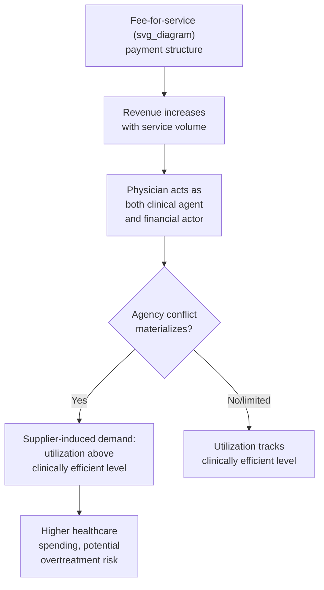

## Fee-for-Service Payment and Volume Incentives

### Overview

Fee-for-service (FFS) is the traditional and historically dominant provider payment mechanism in which providers are reimbursed a specified amount for each discrete service, procedure, or unit of care delivered. Its central economic property — and the source of most of the critiques directed at it — is that provider revenue scales directly with **volume** of services rendered, independent of the necessity, quality, or outcome of that care. Understanding FFS is foundational to this chapter because nearly every alternative payment model discussed subsequently (capitation, bundled payment, value-based payment) is designed specifically to counteract the volume incentive analyzed here.

### Basic Mechanics

**Definition**: Under FFS, a provider bills for each individual service using a defined fee schedule, and payment is a direct function of the quantity and type of services delivered:

$$\text{Total Provider Revenue} = \sum_{k} q_k \times f_k$$

where $q_k$ is the quantity of service type $k$ delivered and $f_k$ is the fee (price) associated with that service.

**Fee schedule determination**: Fees can be set through several mechanisms:

- **Negotiated rates**: Private insurers negotiate discounted fee schedules with in-network providers (as discussed under provider network design elsewhere in this course).
- **Administered pricing**: Government payers (Medicare, Medicaid) set fees through administrative pricing formulas, most notably Medicare's **Resource-Based Relative Value Scale (RBRVS)**, which assigns each service a relative value unit (RVU) reflecting physician work, practice expense, and malpractice cost components, converted to a dollar fee via a conversion factor.

$$\text{Medicare Physician Fee} = (\text{RVU}_{\text{work}} \times \text{GPCI}_{\text{work}} + \text{RVU}_{\text{PE}} \times \text{GPCI}_{\text{PE}} + \text{RVU}_{\text{mal}} \times \text{GPCI}_{\text{mal}}) \times \text{Conversion Factor}$$

where GPCI (Geographic Practice Cost Index) adjusts for regional cost variation across the three RVU components.

- **Usual, Customary, and Reasonable (UCR)**: An older, less standardized approach based on prevailing charges in a geographic area, largely superseded in most contexts by RBRVS-style administered pricing or negotiated network rates.

### The Core Economic Problem: Volume Incentives and Supplier-Induced Demand

**The central incentive structure**: Because provider revenue under FFS increases monotonically with quantity of services delivered, and because providers (particularly physicians) possess substantial informational advantage over patients regarding what care is clinically appropriate, FFS creates a direct financial incentive that can be exploited to increase service volume beyond the clinically efficient level.

$$\frac{\partial \text{Revenue}}{\partial q_k} = f_k > 0 \quad \text{for all services, regardless of marginal clinical benefit}$$

**Supplier-Induced Demand (SID) theory**: This is the same theoretical concern introduced under utilization review elsewhere in this course, but FFS is the specific payment structure that creates the underlying incentive SID theory describes. The physician, acting simultaneously as the patient's clinical agent (typically assumed to advise in the patient's best interest) and as a self-interested economic actor (benefiting financially from increased volume), faces a potential **agency conflict**.

$$q_{\text{actual}} = q^* + \Delta q_{\text{induced}}$$

where $q^*$ is the socially/clinically efficient quantity and $\Delta q_{\text{induced}} \geq 0$ represents utilization attributable to the physician's financial incentive rather than the patient's independent informed demand.

### Empirical Evidence on Supplier-Induced Demand

The existence and magnitude of SID under FFS has been a long-standing empirical research question in health economics, given the methodological challenge of distinguishing physician-induced demand from legitimate unobserved differences in patient need or physician practice style.

**Classic empirical approaches and findings**:

- **Physician-to-population ratio studies**: Early SID research (e.g., studies from the 1970s–1980s) examined whether areas with higher physician-to-population ratios exhibited higher per-physician utilization rates (rather than the standard competitive-market prediction of lower prices/utilization per physician as supply increases), interpreting a positive relationship as evidence consistent with induced demand. Findings from this literature were mixed and methodologically contested, since higher physician density could also reflect areas with genuinely higher underlying healthcare need or non-price competition on quality/amenities rather than demand inducement.
- **Fee cut studies**: A widely cited category of natural experiments examines physician behavioral responses to exogenous fee reductions (e.g., Medicare fee schedule changes for specific procedures), testing whether physicians respond to lower per-service fees by increasing service *volume* to maintain target income levels — a pattern sometimes termed the **"volume offset" or "target income" hypothesis**, which if true would represent a particularly strong form of SID (physicians actively adjusting quantity to counteract price changes, rather than quantity being purely determined by clinical need).

$$\text{Target Income Hypothesis: } \Delta q = -\alpha \times \Delta f, \quad \alpha > 0$$

- **Practice variation studies**: Substantial and long-documented geographic variation in medical practice patterns for clinically similar populations (most prominently documented by the Dartmouth Atlas of Health Care project) is frequently cited as indirect, though not definitive, evidence consistent with SID and physician discretion playing a significant role in utilization beyond what clinical need alone would predict, though disentangling supply-side inducement from other explanations (differences in patient preferences, differences in physician training/beliefs about appropriate care, differences in local practice culture) remains an active methodological challenge.
- [Inference] The health economics literature has not reached full consensus on the precise magnitude of supplier-induced demand attributable specifically to FFS payment (as opposed to other factors correlated with fee structure, such as defensive medicine practices or local practice norms), and results are sensitive to the specific service category, time period, and empirical methodology used; broad claims that SID under FFS accounts for a specific, universal percentage of healthcare spending should be treated with caution absent a specific, current citation.

### Volume Incentive Effects Beyond Individual Physician Behavior

FFS volume incentives operate at multiple levels of the healthcare delivery system, not only at the level of individual physician clinical decisions:

- **Facility-level incentives**: Hospitals and facilities paid FFS (or FFS-adjacent per-diem or per-procedure rates) similarly face incentives favoring higher-volume, higher-intensity service lines (e.g., a documented historical tendency toward higher rates of certain elective procedures, such as some spine surgeries and cardiac interventions, in FFS-dominant markets relative to markets or payment systems with stronger utilization constraints).
- **Specialty and technology adoption incentives**: FFS fee schedules that pay well for procedural and technology-intensive services relative to cognitive/evaluation-and-management services have been argued in health policy literature to influence specialty choice among physicians in training and the pace of adoption of new procedural technologies, independent of the direct patient-encounter-level inducement question.
- **Unbundling and upcoding**: FFS creates incentives for providers to bill services as separate, more numerous line items ("unbundling") rather than as a single comprehensive service, and to code services at a higher-intensity (and higher-fee) level than clinically documented ("upcoding"), both representing revenue-maximizing responses to the per-service payment structure that do not necessarily involve inducing additional *clinical* utilization but do increase *billed* volume/intensity.

### FFS Compared to Alternative Payment Incentive Structures

| Payment Model | Revenue-Volume Relationship | Primary Incentive Risk |
| --- | --- | --- |
| Fee-for-service | Revenue increases directly with volume | Overprovision / supplier-induced demand |
| Capitation | Revenue fixed per enrollee regardless of volume | Underprovision / stinting on necessary care |
| Bundled/episode payment | Revenue fixed per episode regardless of service count within episode | Reduced services within episode; potential care fragmentation avoidance incentive shifts to episode definition gaming |
| Salary | Revenue independent of volume | Reduced productivity incentive absent other performance monitoring |

This table synthesizes a recurring theme across payment mechanism chapters: essentially every alternative to pure FFS trades the overprovision risk of volume-based payment for some form of underprovision or gaming risk associated with fixed or capped payment, rather than eliminating provider-payment-driven distortion entirely. This "no free lunch" framing is a standard and important synthesis point in provider payment economics.

### Policy Responses to FFS Volume Incentives

Several policy tools have been developed specifically to counteract FFS's volume incentive without abandoning the FFS structure entirely:

- **Utilization review and prior authorization** (covered in depth elsewhere in this course): A direct administrative check on the clinical decision, functioning as an external constraint on the volume that FFS's financial incentive alone might otherwise produce.
- **Volume-based fee schedule adjustments**: Some payment reforms (e.g., certain iterations of the Medicare Sustainable Growth Rate formula, in effect 2002–2015 before repeal) attempted to constrain aggregate physician spending growth by adjusting the fee schedule conversion factor downward if aggregate volume/spending exceeded a target, directly targeting the aggregate consequence of the volume incentive at a system level rather than the individual encounter level. [Unverified: the SGR formula's specific mechanics and its 2015 repeal via MACRA should be verified against current CMS historical documentation if precise technical details are needed for the response.]
- **Hybrid and blended payment models**: Rather than fully replacing FFS, many contemporary payment reforms layer quality bonuses, shared-savings arrangements, or partial capitation on top of an FFS base, attempting to blunt the pure volume incentive while retaining FFS's administrative familiarity and its (comparatively) lower underprovision risk relative to full capitation.
- **Site-neutral payment policies**: Reforms addressing a specific FFS-related distortion in which the same service can be billed at different rates depending on care setting (e.g., hospital outpatient department versus physician office), which can create incentives favoring higher-cost sites of service independent of clinical necessity.

### Why FFS Persists Despite Its Incentive Problems

Despite extensive critique, FFS remains a substantial component of provider payment in most health systems, for several economically coherent reasons:

- **Administrative simplicity and transparency**: A per-service fee schedule is comparatively straightforward to administer, audit, and understand relative to complex risk-adjusted capitation or bundled payment formulas.
- **Lower underprovision risk**: Relative to full capitation, FFS does not create a direct financial incentive to withhold necessary care, which is a meaningful advantage in populations or conditions where underprovision risk is a greater clinical concern than overprovision risk.
- **Better alignment for unpredictable, acute, or rare conditions**: FFS is often considered better suited to unpredictable acute care episodes (e.g., trauma, emergency surgery) where a pre-set bundled or capitated rate is difficult to define appropriately in advance, compared to predictable, high-volume chronic disease management where alternative payment models have seen more traction.
- **Political economy and provider preference**: Providers and provider organizations have historically favored FFS's direct link between clinical effort/volume and revenue, and transitions to alternative payment models have often required substantial negotiation, phased implementation, and risk-adjustment infrastructure investment.

### Common Exam/Application Angles

- Derive the direct algebraic relationship between FFS payment structure and the incentive for volume maximization, and connect it explicitly to supplier-induced demand theory.
- Discuss the empirical challenges in measuring supplier-induced demand, distinguishing physician-to-population ratio studies, fee-cut/target-income studies, and Dartmouth Atlas practice variation evidence.
- Explain the "target income hypothesis" and its implications for the direction of the fee-volume relationship under an SID model versus a standard competitive-market model.
- Apply the "no free lunch" framing to compare FFS's overprovision risk against capitation's underprovision risk and bundled payment's episode-gaming risk.
- Analyze specific policy tools (utilization review, volume-based fee adjustments, hybrid payment models) as targeted responses to FFS's volume incentive.
- Discuss why FFS persists in specific clinical contexts (acute/unpredictable care) despite its documented incentive problems.

**Related Topics**

- Capitation and risk-based provider payment
- Bundled and episode-based payment models
- Utilization review and prior authorization
- Supplier-induced demand theory and the physician-as-agent problem
- Medicare RBRVS and physician fee schedule methodology
- Dartmouth Atlas of Health Care and geographic practice variation
- Medicare Sustainable Growth Rate (SGR) formula and MACRA reform
- Site-neutral payment policy
- Upcoding, unbundling, and billing integrity concerns
- Pay-for-performance and value-based payment hybrids