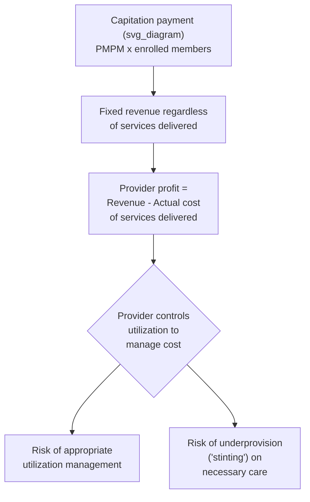
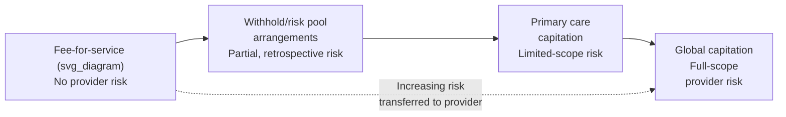

## Capitation and Provider Risk-Bearing

### Overview

Capitation is a provider payment mechanism in which a provider or provider organization receives a fixed, predetermined payment per enrolled patient over a defined period, regardless of the volume or intensity of services actually delivered. Capitation represents the polar opposite of fee-for-service (FFS) along the volume-incentive spectrum introduced elsewhere in this chapter: where FFS ties revenue directly to service volume, capitation completely decouples provider revenue from volume, transferring **financial risk for utilization** from the payer to the provider. This risk transfer is the defining economic feature of capitation and the source of both its cost-control potential and its most significant incentive concerns.

### Basic Mechanics

**Definition**: Under pure capitation, a provider receives a fixed per-member-per-month (PMPM) payment for each enrolled patient, independent of whether that patient uses zero services or an extensive volume of services during the period.

$$\text{Provider Revenue} = \text{PMPM Rate} \times N_{\text{enrolled}}$$

where $N_{\text{enrolled}}$ is the number of patients (members) attributed to that provider or provider organization, and the PMPM rate is negotiated or administratively set in advance, typically based on the expected average cost of the population covered.

**Provider profit under capitation**:

$$\text{Provider Profit} = (\text{PMPM Rate} \times N_{\text{enrolled}}) - \text{Actual Cost of Services Delivered}$$

This equation is the crux of capitation's incentive structure: because profit is *inversely* related to the actual cost of services delivered (holding the PMPM rate and enrollment fixed), the provider bears direct financial risk for utilization and cost, and has a direct financial incentive to **minimize** the cost of care delivered to the capitated population.

### Types and Degrees of Capitation

Capitation is not monolithic; it varies substantially in scope (which services are covered by the capitated payment) and in the degree of risk transferred:

| Capitation Type | Scope | Risk-Bearing Entity |
| --- | --- | --- |
| Primary care capitation | Covers only primary care services (visits, basic preventive care) | Primary care provider bears risk only for primary care utilization |
| Global capitation | Covers essentially the full scope of a patient's care (primary, specialty, hospital, sometimes pharmacy) | Capitated entity (often an integrated system or IPA) bears risk for essentially all utilization |
| Partial/blended capitation | A mix of capitated payment for some services combined with FFS payment for others (e.g., capitated primary care with FFS specialist referrals) | Risk split between capitated entity and FFS-paid providers |
| Risk pools with withhold arrangements | Providers paid FFS but a percentage is withheld and returned (or forfeited) based on aggregate utilization/cost performance against a target | Partial, delayed risk-sharing rather than full prospective capitation |

### Economic Rationale: Targeting Overprovision and Supplier-Induced Demand

**Direct incentive reversal**: Capitation is specifically designed to reverse the volume incentive analyzed under FFS. Where FFS creates $\partial \text{Revenue}/\partial q_k = f_k > 0$ for each additional service, capitation creates:

$$\frac{\partial \text{Provider Profit}}{\partial q_k} = -MC_k < 0$$

where $MC_k$ is the marginal cost to the provider of delivering an additional unit of service $k$. Under capitation, every additional service delivered is a direct cost to the provider with no corresponding marginal revenue, creating a financial incentive to deliver only clinically necessary care (or, in the failure case, to deliver less than clinically necessary care).

**Alignment with care coordination and preventive care**: Because capitated revenue does not depend on service volume, capitation in principle removes the financial disincentive to invest time in care coordination, preventive care, and non-billable activities (e.g., care management phone calls, coordination with specialists) that FFS does not directly compensate but that can reduce total downstream cost of care — this is a frequently cited theoretical advantage of capitation for managing chronic disease populations, where care coordination investment can reduce costly acute exacerbations and hospitalizations.

### The Mirror-Image Problem: Underprovision ("Stinting")

**Core concern**: Just as FFS's volume incentive can produce supplier-induced demand (overprovision), capitation's cost-minimization incentive can produce **stinting** — withholding, delaying, or under-delivering clinically necessary care to preserve provider profit margin.

$$q_{\text{actual}} = q^* - \Delta q_{\text{withheld}}$$

where $\Delta q_{\text{withheld}} \geq 0$ represents care withheld due to the capitated provider's financial incentive rather than genuine clinical judgment that the care is unnecessary.

**Why stinting is harder to detect than overprovision**: A key asymmetry noted in the health economics literature is that overprovision (excess services delivered) generates a *visible, billed* record that can in principle be audited retrospectively, whereas underprovision (services *not* delivered) leaves no billing record at all, making stinting inherently more difficult to detect through claims-based auditing and typically requiring outcome-based or patient-experience-based monitoring instead.

- [Inference] The relative empirical magnitude of overprovision under FFS versus underprovision under capitation is difficult to compare directly given this asymmetric detectability, and conclusions in the literature about which distortion is "worse" in a given context often depend heavily on the specific outcome measures and monitoring infrastructure available in that setting, rather than reflecting a settled, general finding.

### Managed Care Backlash and Capitation's Historical Trajectory

The **managed care backlash of the 1990s** (introduced under HMO/PPO structures elsewhere in this course) was substantially driven by public and physician concern about capitation-associated stinting incentives, particularly in tightly capitated staff/group-model HMOs with aggressive utilization review layered on top of capitated payment. This backlash contributed to:

- A market shift away from the most tightly capitated HMO models toward looser PPO and open-access structures.
- Regulatory responses in several U.S. states restricting or requiring disclosure of capitation-based physician incentive arrangements (e.g., requiring plans to disclose to enrollees whether their physician is paid via capitation and requiring stop-loss protections for individual physicians bearing capitation risk beyond a certain threshold).
- Increased emphasis on pairing capitation with quality monitoring and outcome measurement, to counterbalance the pure cost-minimization incentive with an explicit incentive (or at minimum, a monitoring mechanism) tied to care quality.

### Risk Mitigation Tools for Capitated Providers

Because capitation transfers financial risk to providers, several mechanisms have developed to manage the resulting risk exposure, particularly important for smaller provider organizations less able to absorb the statistical variance in a small patient panel's healthcare costs:

- **Risk adjustment of capitation rates**: Rather than a flat PMPM rate applied uniformly, risk-adjusted capitation sets the PMPM rate based on the health risk profile of the specific attributed population (using risk-scoring methodologies similar to those discussed under risk adjustment elsewhere in this course), reducing the incentive for providers to avoid enrolling higher-risk patients (a capitation-specific analogue of insurer-level risk selection).

$$\text{Risk-Adjusted PMPM}_j = \text{Base PMPM} \times \text{Risk Score}_j$$

- **Stop-loss (reinsurance) protection**: Capitated providers, particularly smaller physician groups, frequently purchase or are contractually provided stop-loss protection, limiting their financial exposure for any single very high-cost patient or aggregate losses beyond a defined threshold, functioning analogously to insurer-level reinsurance but applied at the provider-risk level.
- **Risk corridors at the provider level**: Some capitated contracts include provider-level risk-corridor-style arrangements (conceptually parallel to the insurer-level risk corridors discussed elsewhere in this course), sharing gains and losses between the payer and provider within a defined band around the target capitation rate, rather than transferring full first-dollar risk to the provider.
- **Carve-outs for high-cost/unpredictable services**: Global capitation arrangements frequently exclude specific high-cost, low-frequency service categories (e.g., transplants, certain specialty pharmaceuticals) from the capitated scope, paying for these separately (often FFS) to avoid concentrating catastrophic financial risk on a single capitated provider organization.

### Provider Organizational Requirements for Managing Capitation Risk

Successfully bearing capitation risk requires organizational capabilities that differ substantially from those needed under FFS, which is a significant practical barrier to capitation adoption among smaller or less integrated provider organizations:

- **Actuarial and financial risk management expertise**: Capitated organizations need internal capability (or contracted external capability) to project expected costs, monitor utilization trends, and manage the resulting financial risk — capabilities more traditionally associated with insurers than individual physician practices.
- **Population health management infrastructure**: Effective capitation management typically requires data systems capable of identifying high-risk patients for proactive intervention, tracking care gaps, and coordinating care across settings — infrastructure investment that is a barrier particularly for smaller, less-resourced practices.
- **Sufficient panel size for risk pooling**: Given the law of large numbers, a larger attributed patient panel reduces the statistical variance of aggregate costs relative to the capitated payment, meaning capitation risk is generally more manageable for larger, more integrated provider organizations (e.g., large multispecialty groups or integrated delivery systems) than for small independent practices, which is a structural factor favoring provider consolidation in markets with substantial capitation penetration.

### Capitation in Contemporary Value-Based Payment Models

Capitation concepts have been substantially incorporated into more recent value-based payment reforms, often blended with quality performance components to directly address the stinting concern:

- **Global budget/global capitation with quality gates**: Contemporary capitated arrangements frequently condition full payment (or bonus payment) on meeting defined quality metrics, directly linking the capitation's cost-minimization incentive to an explicit quality floor intended to counteract stinting risk.
- **Accountable Care Organizations (ACOs)**: While ACOs (covered in depth as a related topic in this chapter/course) often begin with shared-savings arrangements layered on an FFS base rather than full capitation, many ACO models progress toward increasing degrees of capitation-like risk-bearing (e.g., Medicare's "two-sided risk" ACO tracks) as organizations develop the population health management infrastructure described above.
- **Medicare Advantage capitation**: CMS pays Medicare Advantage plans a risk-adjusted capitated rate per enrolled beneficiary, and MA plans frequently pass a substantial share of this capitation risk downstream to contracted provider groups via sub-capitation arrangements, illustrating capitation risk transfer occurring at multiple layers of the payment chain (CMS to plan, plan to provider organization).

### Comparative Summary: Capitation vs. Fee-for-Service Incentive Structure

| Dimension | Fee-for-Service | Capitation |
| --- | --- | --- |
| Revenue-volume relationship | Positive (more services = more revenue) | None (fixed regardless of volume) |
| Primary incentive risk | Overprovision / supplier-induced demand | Underprovision / stinting |
| Incentive for care coordination/prevention | Weak (uncompensated activities discouraged) | Strong (reduces provider's own downstream cost) |
| Detectability of the associated distortion | Higher (billed services create an auditable record) | Lower (withheld services leave no record) |
| Risk borne by | Payer (insurer bears full utilization risk) | Provider (bears utilization risk, often risk-adjusted) |
| Suitability for population-based chronic care | Weaker alignment | Stronger alignment (if adequately risk-adjusted) |
| Suitability for unpredictable acute/rare conditions | Stronger alignment | Weaker alignment absent carve-outs/stop-loss |

### Common Exam/Application Angles

- Derive the algebraic relationship between capitation payment structure and the provider's incentive to minimize service cost, and contrast directly with the FFS volume-incentive derivation from the prior topic.
- Explain why stinting is inherently harder to detect and audit than supplier-induced demand, and discuss the monitoring approaches used to address this asymmetry.
- Analyze the role of risk adjustment, stop-loss protection, and service carve-outs as tools for managing capitation-associated provider risk.
- Discuss why larger, more integrated provider organizations are structurally better positioned to bear capitation risk than small independent practices, connecting to panel size and the law of large numbers.
- Explain how the managed care backlash of the 1990s was linked specifically to capitation's stinting incentive, and describe the regulatory responses that followed.
- Compare capitation and FFS using the "no free lunch" framing (overprovision risk vs. underprovision risk) introduced under fee-for-service payment.

**Related Topics**

- Fee-for-service payment and volume incentives
- Bundled and episode-based payment models
- Risk adjustment and risk corridors (insurer-level and provider-level parallels)
- HMO, PPO, and point-of-service plan structures
- Accountable Care Organizations and shared savings/shared risk models
- Medicare Advantage payment methodology and sub-capitation arrangements
- Managed care backlash and physician incentive disclosure regulation
- Stop-loss reinsurance for capitated provider risk
- Population health management infrastructure
- Value-based payment and quality-gated capitation arrangements