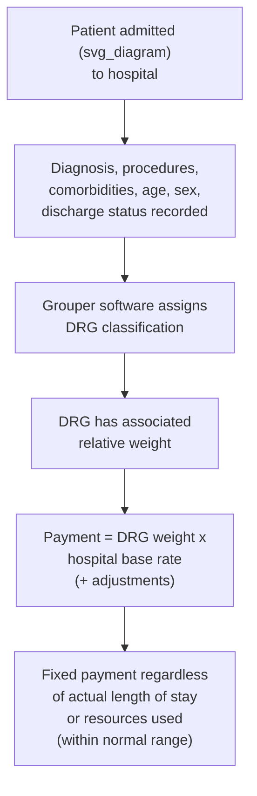
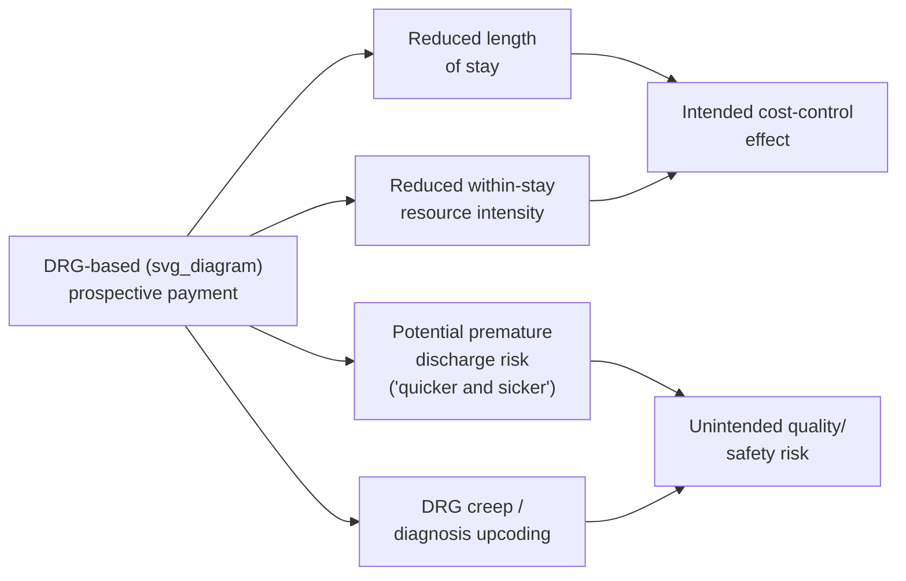

## Prospective Payment and Diagnosis-Related Groups

### Overview

Prospective payment systems (PPS) represent a payment approach in which the amount a provider will be paid for an episode of care is determined **in advance**, based on a classification of the patient's condition or treatment, rather than being determined **retrospectively** based on the provider's actual accumulated costs or itemized services rendered. Diagnosis-Related Groups (DRGs) are the specific classification system most closely associated with prospective payment, developed initially for hospital inpatient care and now foundational to Medicare's Inpatient Prospective Payment System (IPPS) and widely adapted internationally. This topic sits at an important structural midpoint between fee-for-service (paid per discrete service, retrospectively summed) and capitation (paid per enrolled person, independent of any specific episode), since DRG-based prospective payment fixes payment at the level of an entire hospital **stay** or **episode**, rather than at the level of an individual service or an entire enrolled population.

### Historical Context and Origin

**Pre-PPS retrospective cost-based reimbursement**: Prior to 1983, Medicare reimbursed hospitals on a **retrospective, cost-based** basis — hospitals were paid based on their actual reported costs of providing care, subject to certain allowable cost rules. This structure created a volume- and cost-escalation incentive analogous to (and in some respects stronger than) the fee-for-service incentive discussed elsewhere in this chapter: since payment tracked actual cost, hospitals had limited financial incentive to control costs, contributing to documented rapid growth in Medicare hospital spending during the 1970s.

**Introduction of Medicare's Inpatient Prospective Payment System (1983)**: The Social Security Amendments of 1983 established the IPPS, replacing retrospective cost-based reimbursement for Medicare inpatient hospital services with a prospective, DRG-based payment system — widely regarded as one of the most significant provider payment reforms in U.S. health policy history and a foundational case study in payment reform economics.

### Diagnosis-Related Groups (DRG) Classification Mechanics

**Core concept**: A DRG system classifies each hospital inpatient stay into one of several hundred categories based on the patient's principal diagnosis, secondary diagnoses/comorbidities, procedures performed, age, sex, and discharge disposition, under the premise that patients within the same DRG category consume clinically and economically similar resources on average.

**Payment formula**:

$$\text{DRG Payment} = \text{Relative Weight}_{\text{DRG}} \times \text{Hospital Base Rate} \times \text{Wage Index Adjustment} + \text{Applicable Add-ons}$$

- **Relative weight**: A numerical value reflecting the average relative resource intensity of that DRG compared to the average of all DRGs (a weight of 1.0 represents average resource intensity across all cases).
- **Hospital base rate**: A dollar amount reflecting national and regional average costs per case, adjusted for local wage differences via a wage index (analogous in concept to the Geographic Practice Cost Index used in the physician fee schedule discussed under fee-for-service payment).
- **Add-on adjustments**: Additional payments for factors such as teaching hospital status (indirect medical education adjustment), disproportionate share of low-income patients (disproportionate share hospital adjustment), rural location, and outlier cases with unusually high costs.

**Outlier payments**: To protect hospitals against extreme financial risk from unusually costly cases (a risk-mitigation feature conceptually similar to stop-loss protection for capitated providers, discussed elsewhere in this chapter), Medicare's IPPS includes **outlier payments** providing additional reimbursement when a case's actual costs exceed a defined threshold above the standard DRG payment, partially — but not fully — compensating for extreme-cost cases.

- [Unverified] Specific current relative weights, base rates, wage index values, and outlier thresholds are updated annually by CMS through rulemaking (the annual IPPS final rule); consult current CMS publications for precise, current figures rather than relying on any fixed historical number.

### Economic Incentive Structure

**The fixed-payment-per-episode incentive**: Because payment is fixed at the DRG level regardless of the actual length of stay or intensity of resources used *within* that hospitalization (barring outlier thresholds), DRG-based prospective payment creates a direct financial incentive structurally similar to capitation, but scoped to a single episode rather than a population over time.

$$\text{Hospital Profit per Case} = \text{DRG Payment} - \text{Actual Cost of Care Delivered During Stay}$$

$$\frac{\partial \text{Hospital Profit}}{\partial (\text{Length of Stay, Resource Intensity})} < 0 \quad \text{(within the DRG payment, before outlier threshold)}$$

This creates several documented and theoretically predicted behavioral responses:

- **Reduced length of stay**: Since payment does not increase with additional inpatient days (within the DRG), hospitals face a direct financial incentive to discharge patients as soon as clinically appropriate rather than to extend stays as FFS or cost-based reimbursement might have permitted — a well-documented effect of DRG implementation, with average Medicare inpatient length of stay declining notably following IPPS adoption.
- **"Quicker and sicker" discharge concern**: A significant policy concern following DRG implementation was that hospitals might discharge patients prematurely (before they were clinically ready) to preserve the DRG payment margin, potentially shifting cost and risk to post-acute care settings (skilled nursing facilities, home health) or increasing readmission risk — this concern motivated substantial research attention in the years following IPPS implementation and continues to inform related policy (e.g., the Hospital Readmissions Reduction Program, discussed as a related topic).
- **Reduced within-stay resource intensity**: Hospitals have an incentive to reduce ancillary service utilization (tests, procedures) during a stay that does not affect the DRG classification, since such services represent a cost against a fixed payment rather than additional billable revenue as under FFS.
- **DRG creep / upcoding**: A well-documented behavioral response in which hospitals adjust diagnosis and procedure coding practices (documenting additional comorbidities or more resource-intensive principal diagnoses) to classify a given case into a higher-weighted DRG than would have been assigned under prior coding practices, without any actual change in the clinical care provided — a coding-based revenue-maximization response structurally analogous to the upcoding concern discussed under risk adjustment elsewhere in this course.

### Empirical Evidence on DRG Implementation Effects

- Research examining the 1983 IPPS implementation has generally documented a substantial reduction in Medicare inpatient length of stay in the years following adoption, consistent with the theoretical prediction of reduced within-episode resource use under fixed episode payment.
- Evidence on the "quicker and sicker" discharge concern has been more mixed; while length of stay declined substantially, the broader literature examining patient outcomes and readmission rates following DRG implementation did not find the severe, systematic quality deterioration that the most alarmist predictions anticipated, though this remains a studied and debated area, and post-acute care utilization (skilled nursing, home health) increased substantially following IPPS implementation, consistent with some shifting of recovery-period care to lower-intensity, differently-reimbursed settings.
- DRG creep has been documented empirically in several studies examining coding pattern changes following DRG-based payment implementation (both in the original 1983 Medicare context and in subsequent adoptions of DRG-style systems by other payers and countries), generally finding measurable increases in average case-mix-adjusted payment attributable to coding pattern shifts rather than genuine changes in patient acuity.
- [Inference] Precisely partitioning observed increases in average DRG weight (case-mix index) over time between genuine increases in patient acuity/comorbidity burden versus coding-pattern-driven DRG creep is a persistent empirical challenge, since both genuine population aging/comorbidity trends and coding incentive responses can produce similar aggregate statistical signatures; specific quantitative attributions between these two explanations should be treated as estimates from particular studies rather than settled figures.

### DRG Systems Beyond Original Medicare IPPS

- **All-Payer Refined DRGs (APR-DRGs) and other DRG variants**: Several DRG classification refinements have been developed to better capture severity of illness and risk of mortality within a given base diagnosis category, used by some state Medicaid programs and other payers beyond original Medicare.
- **International adoption**: DRG-based (or DRG-analogous, sometimes termed "Case-Mix Groups" or similar) prospective payment systems have been adopted by numerous other countries' health systems (e.g., Germany's G-DRG system, Australia's AR-DRGs) as a hospital payment methodology, reflecting the broad international influence of the U.S. Medicare IPPS model as a template for hospital payment reform.
- **Extension beyond inpatient care**: Conceptually related prospective, classification-based payment approaches have been extended to other care settings, including Medicare's Ambulatory Payment Classifications (APCs) for hospital outpatient services and the Resource Utilization Groups historically used for skilled nursing facility payment — extending the core prospective payment logic (fix payment based on patient classification, transfer within-episode resource-use risk to the provider) beyond the original inpatient hospital context.

### Prospective Payment in the Broader Provider Payment Spectrum

DRG-based prospective payment can be positioned relative to the other payment mechanisms in this chapter along the dimension of **risk-bearing scope** (over what unit of care/time the provider bears financial risk for utilization):

| Payment Model | Unit of Risk-Bearing | Provider Incentive |
| --- | --- | --- |
| Fee-for-service | Individual service | Maximize volume of billable services |
| DRG/prospective payment | Single episode (e.g., hospital stay) | Minimize resource use *within* the episode; may affect episode boundary/discharge timing |
| Bundled/episode payment (broader) | Multi-provider episode spanning care settings (e.g., 90-day surgical episode) | Minimize resource use across the full episode, including post-acute care |
| Capitation | Enrolled population over a time period | Minimize resource use across the entire population and time horizon |

This progression illustrates DRG-based payment as an important conceptual and historical precursor to the broader bundled/episode payment models (e.g., Medicare's Bundled Payments for Care Improvement and Comprehensive Care for Joint Replacement models) covered as a related topic, which extend the core prospective-payment logic beyond the single hospital stay to encompass related pre- and post-acute care within a defined episode window.

### Policy Responses to DRG-Associated Incentive Concerns

- **DRG weight recalibration and coding audits**: CMS periodically recalibrates DRG relative weights and monitors aggregate case-mix index trends, and conducts coding audits (including Recovery Audit Contractor reviews) specifically targeting DRG creep and improper upcoding.
- **Hospital Readmissions Reduction Program (HRRP)**: Introduced under the ACA, HRRP financially penalizes hospitals with higher-than-expected 30-day readmission rates for specified conditions, directly addressing the "quicker and sicker" premature discharge concern by attaching a financial consequence to excess readmissions, rather than relying solely on DRG payment discipline alone.
- **Post-acute care payment reforms**: Given the documented shift of recovery-period care into post-acute settings following IPPS implementation, subsequent payment reforms (e.g., prospective payment systems developed for skilled nursing facilities, home health, and inpatient rehabilitation) have extended similar prospective-payment logic to these settings, partly to prevent unconstrained cost growth in the settings absorbing care shifted out of the now-more-tightly-managed inpatient stay.

### Common Exam/Application Angles

- Explain the shift from retrospective cost-based reimbursement to DRG-based prospective payment and the specific incentive change this produced.
- Derive the DRG payment formula and explain the roles of relative weight, base rate, and wage index adjustment.
- Analyze the "quicker and sicker" discharge concern as a predicted incentive effect and discuss the empirical evidence assessing whether it materialized.
- Explain DRG creep/upcoding as a coding-based revenue-maximization response, and connect it to the broader upcoding concerns discussed under risk adjustment.
- Position DRG-based prospective payment within the broader risk-bearing-scope spectrum (FFS, episode/DRG, bundled payment, capitation).
- Discuss the Hospital Readmissions Reduction Program as a policy response specifically targeting the premature discharge incentive risk of DRG payment.

**Related Topics**

- Fee-for-service payment and volume incentives
- Capitation and provider risk-bearing
- Bundled and episode-based payment models
- Risk adjustment and diagnosis-coding incentives (DRG creep parallel)
- Hospital Readmissions Reduction Program
- Medicare Ambulatory Payment Classifications (APCs) for outpatient services
- Post-acute care payment systems (skilled nursing, home health, inpatient rehabilitation)
- International DRG systems (Germany's G-DRG, Australia's AR-DRGs)
- Case-mix index trends and hospital coding audits
- Accountable Care Organizations and multi-provider episode risk