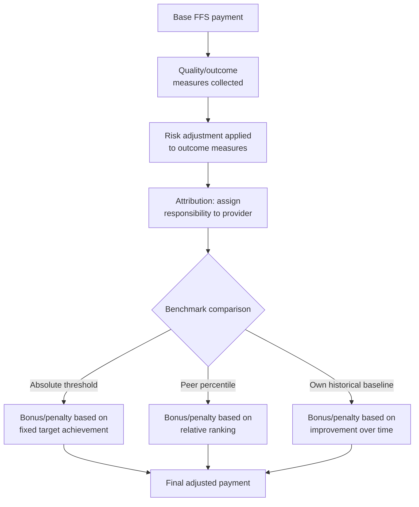

## Pay-for-Performance and Value-Based Purchasing

### Definition and Conceptual Placement

Pay-for-performance (P4P) and value-based purchasing (VBP) refer to reimbursement arrangements that tie some portion of provider payment to measured quality, outcomes, efficiency, or patient experience, rather than paying solely based on the volume or intensity of services delivered (as under pure fee-for-service, FFS). These arrangements sit on a broader spectrum of provider payment reform intended to correct incentive misalignments inherent in volume-based reimbursement.

**Key Points**

- P4P is typically a *bonus/penalty overlay* on an underlying base payment system (usually FFS), rather than a standalone payment method.
- VBP is often used as a broader umbrella term encompassing P4P alongside related mechanisms (bundled payments, shared savings, capitation with quality gates), though usage varies across policy documents and institutions.
- The unifying goal is to shift the marginal financial incentive from "more services" toward "better-measured outcomes per dollar spent," addressing the supplier-induced demand and quality-blind volume incentives of pure FFS.

### The Underlying Incentive Problem

Under pure fee-for-service payment, a provider's revenue $R$ is a function of volume and intensity of billed services:

$$R = \sum_{i} q_i \cdot p_i$$

where $q_i$ is quantity of service $i$ and $p_i$ is its price. This payment structure creates no direct financial reward for achieving better patient outcomes, and can create a perverse incentive to increase $q_i$ even when marginal clinical value is low (supplier-induced demand) or, worse, when a service is needed to *correct* a prior complication (e.g., readmissions, hospital-acquired infections) — FFS pays for the complication's treatment just as it would pay for any other service, effectively rewarding poor quality with additional revenue.

P4P/VBP modifies this by introducing a quality-linked adjustment term:

$$R_{VBP} = \sum_i q_i \cdot p_i + f(\text{performance score})$$

where $f(\cdot)$ can be a bonus, a withhold-and-return, or a penalty, and the "performance score" is constructed from a defined set of quality, outcome, cost, or experience measures.

### Taxonomy of Value-Based Payment Models

| Model | Mechanism | Financial Risk Borne By |
| --- | --- | --- |
| Pay-for-performance (P4P) bonus | Additional payment on top of FFS base if quality thresholds met | Provider bears no downside beyond foregone bonus |
| Pay-for-performance withhold | A percentage of FFS payment is withheld and returned only if quality thresholds met | Provider bears downside risk equal to withhold amount |
| Value-based purchasing (VBP) with penalties | Payment adjusted up or down (budget-neutral) relative to peer performance distribution | Provider bears two-sided risk |
| Bundled/episode payment | Single payment covers a defined episode of care (e.g., hip replacement); provider bears risk on costs exceeding the bundle price | Provider bears full episode cost risk, often with quality gates |
| Shared savings (upside-only ACO) | Provider group receives a share of savings versus a spending benchmark, no penalty for exceeding it | Provider bears no downside risk |
| Shared savings/losses (two-sided ACO) | Provider group shares both savings and losses relative to benchmark | Provider bears two-sided risk |
| Capitation with quality gates | Fixed per-member-per-month payment, sometimes reduced if quality thresholds are not met | Provider bears full utilization risk plus quality-linked risk |

**Key Points**

- Models differ primarily along two axes: (1) the *degree* of financial risk shifted to the provider (none, upside-only, two-sided), and (2) whether the *quality* component is a bonus overlay or a core determinant of the base payment itself.
- Programs frequently combine multiple mechanisms (e.g., ACOs that include both shared savings and P4P quality-score adjustments to the shared savings rate).

### Design Components of a P4P/VBP Program

**Measure selection**: Quality measures are typically drawn from established measure sets (e.g., HEDIS, CMS Core Measures, PQRS/MIPS quality measures) and generally fall into three categories following the Donabedian framework:

- **Structural measures**: Characteristics of care delivery capacity (e.g., EHR adoption, staffing ratios).
- **Process measures**: Whether recommended clinical actions were performed (e.g., HbA1c testing for diabetics, appropriate antibiotic prophylaxis timing).
- **Outcome measures**: Actual patient results (e.g., risk-adjusted mortality, readmission rates, patient-reported outcome measures).

**Key Points**

- Process measures are easier to specify and audit but may not correlate strongly with actual outcomes; outcome measures are more clinically meaningful but require risk adjustment to be fair across providers serving different patient populations, and can be subject to smaller sample sizes at the individual-provider level, increasing statistical noise.
- Measure selection itself is a significant design challenge: including too many measures dilutes the financial incentive per measure and increases administrative burden; too few measures risks "teaching to the test" (providers optimizing narrowly for measured dimensions of quality while neglecting unmeasured dimensions).

**Risk adjustment**: Because patient case-mix varies systematically across providers (e.g., safety-net hospitals serving sicker, lower-income populations), outcome-based measures require statistical adjustment for patient risk factors (age, comorbidities, socioeconomic indicators in some models) to avoid penalizing providers simply for treating higher-risk patients. Inadequate risk adjustment is one of the most persistent critiques of outcome-based VBP programs, since it can create a disincentive to treat complex or disadvantaged patients (a variant of the avoidance-behavior problem seen in other risk-bearing arrangements).

**Attribution methodology**: In multi-provider care (a patient seen by multiple specialists, primary care, and facilities), programs must determine which provider is "attributed" responsibility for a given outcome or cost measure — typically via plurality-of-visits rules, primary care assignment, or episode-based attribution windows. Attribution methodology significantly affects perceived fairness and can distort provider behavior around referral patterns.

**Benchmark setting**: Performance can be measured against an absolute threshold, against the provider's own historical performance (improvement-based), or against peer percentile rankings (relative/tournament-based). Relative benchmarking is budget-predictable for the payer (since it is inherently zero-sum or budget-neutral) but can create perceived unfairness if the entire distribution of providers improves yet a defined bottom percentile still receives penalties.

### Major U.S. Federal VBP Programs (Illustrative Examples)

**Example**

The Centers for Medicare & Medicaid Services (CMS) has implemented several prominent VBP programs, each illustrating different design choices:

- **Hospital Value-Based Purchasing (HVBP) Program**: Adjusts Medicare inpatient payments based on a composite score across clinical outcomes, patient safety, patient experience (HCAHPS survey), and efficiency/cost domains, funded through a budget-neutral withhold-and-redistribute mechanism applied to participating hospitals' base DRG payments.
- **Hospital Readmissions Reduction Program (HRRP)**: Penalizes hospitals (via payment reduction, not bonus) for excess risk-adjusted 30-day readmissions for specified conditions (e.g., heart failure, pneumonia, COPD), representing a pure penalty-only (one-sided) design rather than a bonus/penalty budget-neutral redistribution.
- **Hospital-Acquired Condition (HAC) Reduction Program**: Penalizes the lowest-performing quartile of hospitals on specified hospital-acquired condition rates, illustrating a relative/tournament-based benchmark design.
- **Merit-based Incentive Payment System (MIPS)**: Applies to individual clinicians and groups under Medicare Part B, combining quality, cost, improvement activities, and interoperability (Promoting Interoperability) categories into a composite score determining a budget-neutral payment adjustment.
- **Medicare Shared Savings Program (MSSP)**: The primary Accountable Care Organization (ACO) program, offering shared savings (and, in higher-risk tracks, shared losses) relative to a risk-adjusted spending benchmark, with the shared savings rate itself modified by a quality performance score.

[Inference: specific measure sets, weighting formulas, and penalty/bonus percentages for these programs are updated through annual CMS rulemaking; exact current-year parameters should be verified against the current Federal Register rule rather than assumed static, as historical program parameters cited in older literature may not reflect present-day program rules.]

### Empirical Evidence on Effectiveness

The empirical literature on P4P/VBP effectiveness is mixed and provides important nuance to the theoretical rationale:

- **Effects on process measures**: Studies of early P4P programs (e.g., the UK's Quality and Outcomes Framework for primary care, and various U.S. pilot programs) generally find modest, measurable improvements in the specific process measures directly incentivized.
- **Effects on outcomes**: Evidence for meaningful improvement in *outcome* measures (mortality, hospitalization rates) attributable specifically to P4P/VBP incentives is considerably weaker and more mixed across studies, with several large randomized or quasi-experimental evaluations of U.S. hospital VBP programs finding limited or statistically insignificant effects on mortality once secular trends and other confounding contemporaneous initiatives are accounted for. [Inference: this remains a genuinely contested area of health services research rather than a settled finding, and results vary considerably by program design, population, and study methodology.]
- **Documented unintended consequences**:
  - **Measure gaming and upcoding**: Providers may adjust documentation practices to make patients appear at higher baseline risk (favorably affecting risk-adjusted comparisons) without a corresponding change in actual care.
  - **Patient selection/avoidance**: Analogous to the defensive medicine avoidance behavior discussed elsewhere in this curriculum, providers facing outcome-based penalties have an incentive to avoid or transfer the highest-risk, hardest-to-treat patients if risk adjustment is imperfect.
  - **Teaching to the test**: Concentration of quality improvement effort narrowly on incentivized measures, potentially at the expense of unmeasured but clinically important dimensions of care.
  - **Widening disparities**: Some studies have raised concern that safety-net providers serving disadvantaged populations are disproportionately penalized under programs with imperfect socioeconomic risk adjustment, potentially reducing resources available to the providers serving the most vulnerable populations — a concern that has led some programs (e.g., later HRRP iterations) to adopt peer-grouping by socioeconomic proxy measures. [Unverified: the precise current-year adjustment methodology for socioeconomic stratification in specific federal programs should be checked against current program rules, as this has been an area of iterative regulatory revision.]

### Theoretical Framework: Multitasking and Incentive Design

The multitasking principal-agent model (Holmström and Milgrom, 1991) provides a formal lens for understanding P4P's limitations: when an agent (provider) performs multiple tasks (dimensions of quality, some measurable and some not) and effort is fungible across tasks, providing strong incentives on the *measurable* subset of tasks can cause the agent to reallocate effort away from *unmeasured* tasks, even if those unmeasured tasks are equally or more valuable. This formalizes the "teaching to the test" concern: it is not merely an empirical anomaly but a predictable consequence of incentivizing a partial, imperfect proxy for the true underlying objective (patient welfare across all dimensions of care, most of which are not fully contracted upon or measured).

**Key Points**

- This theoretical result implies that the *optimal* strength of a P4P incentive is not simply "as strong as possible" — excessively strong incentives on a narrow measure set can be counterproductive if they crowd out effort on unmeasured but valuable dimensions of care.
- This is a central argument for using balanced scorecards (composite measures spanning multiple domains) rather than single-measure incentive schemes, though composite measures introduce their own weighting and aggregation design challenges.

### Comparison to Related Payment Reforms

VBP/P4P is often discussed alongside, and sometimes conflated with, related but mechanically distinct payment reforms:

- **Bundled payments** address volume incentives by fixing the total payment for a defined episode, shifting cost-control incentives to the provider directly through payment structure rather than through a quality-measure overlay; VBP-style quality gates are frequently layered on top of bundles to prevent stinting on care (an ex ante moral hazard risk analogous to underprovision).
- **Capitation** addresses volume incentives even more directly (fixed payment per patient regardless of service volume), with quality measures serving a similar prevent-stinting function as in bundled payments.
- **Global budgets** (used for entire hospital systems or regions) address system-level volume incentives, often paired with population-level quality and access measures.

The distinguishing feature of P4P/VBP relative to these alternatives is that it generally preserves the underlying FFS volume incentive (or a capitated/bundled base) while adding a *supplementary* quality-linked financial layer, rather than restructuring the fundamental unit of payment itself.

**Key Points**

- P4P/VBP is best understood as an incremental correction layered onto an existing payment method, whereas bundling and capitation are more fundamental restructurings of the payment unit itself.
- In practice, many current U.S. payment reform initiatives combine both approaches (e.g., bundled payments with embedded quality withholds, or ACOs combining shared-savings risk with P4P-style quality score modifiers).

### Conclusion

Pay-for-performance and value-based purchasing represent a family of mechanisms designed to correct the volume-maximizing, quality-blind incentive structure of pure fee-for-service reimbursement by tying a portion of provider payment to measured quality, outcomes, or efficiency. While theoretically well-motivated as a response to the misalignment between provider financial incentives and patient welfare, empirical evidence on outcome-level effectiveness remains mixed, and the multitasking incentive problem provides a formal explanation for observed unintended consequences such as measure gaming and patient avoidance. Effective program design requires careful attention to measure selection, risk adjustment, attribution methodology, and benchmark structure, with an inherent trade-off between incentive strength on measured dimensions and the risk of crowding out unmeasured but clinically valuable effort.

**Related Topics**

- Principal-agent theory and multitasking incentive models (Holmström-Milgrom)
- Bundled payment and episode-based reimbursement design
- Accountable Care Organizations (ACO) risk-bearing structures
- Risk adjustment methodology in provider payment
- Donabedian's structure-process-outcome quality framework
- Supplier-induced demand under fee-for-service
- Socioeconomic disparities in outcome-based payment penalties
- Defensive medicine and provider avoidance behavior (cross-reference: Information Problems in Health Care)