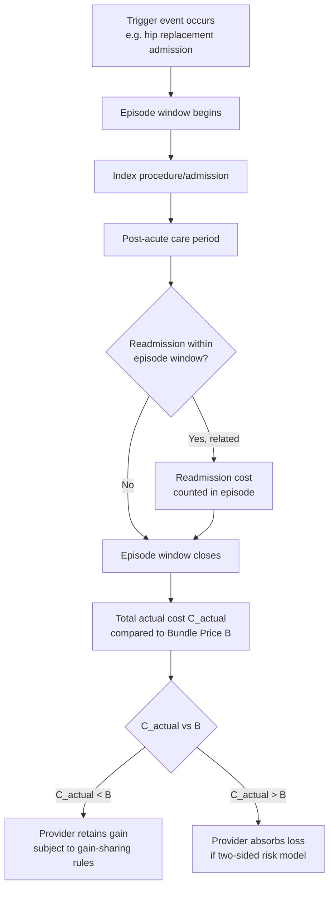

## Bundled Payments and Episode-Based Care

### Definition and Conceptual Placement

A bundled payment (also called episode-based payment) is a single, predetermined payment covering all (or a defined subset of) services delivered during a clinically defined episode of care, spanning multiple providers, settings, and time periods, rather than paying each individual service or provider separately as under fee-for-service (FFS). The episode is the fundamental payment unit, replacing the individual service or visit.

**Key Points**

- Bundling shifts financial risk for the *total cost* of an episode onto the provider(s) accountable for it, creating a direct incentive to reduce unnecessary services, complications, and care fragmentation within the episode.
- Unlike capitation (which fixes payment per patient per time period regardless of what conditions arise), bundled payment is *condition-specific* and *episode-specific* — the fixed payment applies only when a defined triggering event (e.g., a hip replacement, an acute myocardial infarction admission) occurs.
- Bundling sits conceptually between FFS (payment per discrete service, no risk to provider) and full capitation (payment per patient per period, full utilization risk to provider) on the spectrum of provider financial risk-bearing.

### Formal Structure of an Episode

An episode is defined by three core parameters that must be explicitly specified in program design:

1. **Trigger event**: The clinical event that initiates the episode (e.g., inpatient admission for a hip fracture, initiation of chemotherapy, an ESRD dialysis start).
2. **Episode window**: The time period over which included services are counted, typically spanning a pre-defined period before the trigger (e.g., some pre-admission diagnostic costs) through a defined post-acute window (e.g., 90 days post-discharge, covering readmissions, rehabilitation, and follow-up visits).
3. **Included services**: The scope of services counted toward the bundle price — commonly including the index procedure, associated physician fees, post-acute care (skilled nursing facility, home health, inpatient rehabilitation), and readmissions related to the index condition, while typically excluding unrelated care.

The bundle price $B$ is generally set using a historical or regional benchmark, adjusted for expected case mix:

$$B = \bar{C}_{\text{benchmark}} \times (1 - \text{discount factor}) \times \text{risk adjustment}$$

where $\bar{C}_{\text{benchmark}}$ is average historical episode spending for a comparable population (provider-specific, regional, or national), and the discount factor represents an expected savings target built into the program (common in voluntary CMS bundled payment models, where the discount is the mechanism by which the payer captures a guaranteed savings share independent of provider performance).

Provider financial outcome for a given episode is then:

$$\text{Gain/Loss} = B - C_{\text{actual}}$$

where $C_{\text{actual}}$ is the actual total cost of services delivered within the episode window. A positive gain is retained (fully or partially, subject to program-specific gain-sharing rules) by the accountable provider; a loss may be absorbed by the provider (in two-sided risk models) or by the payer (in one-sided, upside-only models).

### Illustration: Episode Cost Distribution and Risk

<svg xmlns="http://www.w3.org/2000/svg" viewBox="0 0 640 420">
<text x="320" y="24" text-anchor="middle" font-size="15" font-weight="bold" fill="#1a1a1a">Bundle Price vs. Realized Episode Cost Distribution (svg_diagram)</text>

<line x1="80" y1="360" x2="580" y2="360" stroke="#333" stroke-width="2" />
<line x1="80" y1="360" x2="80" y2="50" stroke="#333" stroke-width="2" />
<text x="330" y="395" text-anchor="middle" font-size="13" fill="#333">Actual Episode Cost</text>
<text x="30" y="205" text-anchor="middle" font-size="13" fill="#333" transform="rotate(-90 30 205)">Frequency</text>

<path d="M 100 350 Q 180 100 260 90 Q 340 100 400 220 Q 460 300 560 345" fill="none" stroke="#2166ac" stroke-width="3" />

<line x1="260" y1="360" x2="260" y2="80" stroke="#b2182b" stroke-width="2" stroke-dasharray="6,4" />
<text x="200" y="70" font-size="12" fill="#b2182b">Bundle Price (B)</text>

<path d="M 100 350 Q 180 100 260 90 L 260 360 Z" fill="#2166ac" opacity="0.15" />
<text x="150" y="330" font-size="11" fill="#2166ac">Gain region </text>
<text x="140" y="345" font-size="11" fill="#2166ac">(actual &lt; B)</text>

<path d="M 260 90 Q 340 100 400 220 Q 460 300 560 345 L 560 360 L 260 360 Z" fill="#b2182b" opacity="0.15" />
<text x="400" y="330" font-size="11" fill="#b2182b">Loss region</text>
<text x="395" y="345" font-size="11" fill="#b2182b">(actual &gt; B)</text>
</svg>

### Taxonomy of Bundled Payment Models

| Model Type | Risk Timing | Example |
| --- | --- | --- |
| Retrospective bundling | Provider bills FFS as usual; reconciliation against bundle target occurs after the episode, with reconciliation payment/recoupment | CMS Bundled Payments for Care Improvement (BPCI) models |
| Prospective bundling | A single payment is made upfront (typically to a designated "episode initiator") who then distributes payment to other involved providers | CMS Comprehensive Care for Joint Replacement (CJR), in its prospective variant design intent |
| Procedure-based episodes | Triggered by a discrete procedure (e.g., joint replacement, coronary artery bypass graft) | CJR, BPCI Advanced procedural episodes |
| Condition-based (medical) episodes | Triggered by a diagnosis or acute medical event rather than a procedure (e.g., COPD exacerbation, sepsis) | BPCI Advanced medical episodes |
| Maternity/chronic condition episodes | Triggered by a defined clinical pathway spanning a longer or recurring time horizon | Commercial maternity bundles; oncology episode models |

**Key Points**

- Procedure-based episodes are generally easier to define and risk-adjust (a discrete, identifiable trigger with relatively predictable resource use) than condition-based medical episodes, where the acute event itself may vary substantially in underlying severity.
- Retrospective bundling preserves the existing FFS billing infrastructure (lower implementation burden) but delays financial feedback to providers; prospective bundling provides immediate incentive alignment but requires more complex payment distribution infrastructure among participating providers.

### Illustrative U.S. Federal Bundled Payment Programs

**Example**

CMS has implemented several bundled payment demonstrations and permanent programs, illustrating the evolution of episode-based payment design:

- **Bundled Payments for Care Improvement (BPCI, and BPCI Advanced)**: A voluntary, multi-model initiative allowing hospitals, physician groups, and post-acute providers to take accountability for episode costs across a range of clinical episodes, using a retrospective reconciliation methodology against a risk-adjusted target price.
- **Comprehensive Care for Joint Replacement (CJR)**: A model (initially mandatory in selected geographic areas) specifically targeting hip and knee replacement episodes, holding the hospital financially accountable for costs from the surgical admission through 90 days post-discharge, including post-acute care and readmissions.
- **Oncology Care Model (OCM) and successor models**: Applied episode-based accountability to six-month chemotherapy episodes for cancer patients, combining a per-episode monthly enhanced payment with a retrospective performance-based payment tied to both cost and quality.

[Inference: specific program names, mandatory/voluntary status, and target price methodologies have been subject to repeated CMS revision and program sunset/replacement over time (e.g., transitions between BPCI, BPCI Advanced, and successor episode models); current program status and parameters should be verified against current CMS Innovation Center program documentation rather than assumed from any single historical description.]

### Economic Rationale: Correcting Fragmented Care Incentives

Bundled payment is designed to address a specific failure of FFS in multi-provider episodes: under FFS, no single provider bears financial responsibility for the *total* cost or the *coordination quality* of an episode spanning multiple providers and settings. This creates several documented inefficiencies that bundling is intended to correct:

- **Fragmentation and duplicated services**: Absent a shared financial stake in total episode cost, providers in different settings (e.g., surgeon, hospital, skilled nursing facility, home health agency) have no direct incentive to coordinate care transitions, potentially leading to duplicated diagnostic testing, delayed information transfer, and preventable readmissions.
- **Post-acute care overutilization**: A substantial share of variation in total episode cost for many procedures (particularly orthopedic procedures) is attributable to post-acute care setting choice (e.g., discharge to inpatient rehabilitation facility vs. skilled nursing facility vs. home health) rather than the index procedure itself; FFS provides no incentive to select the most cost-effective clinically appropriate post-acute setting.
- **Complication-driven revenue**: As with the P4P/VBP incentive problem, FFS pays for the *treatment* of a complication (e.g., surgical site infection, readmission) as additional billable service volume, meaning complications can be revenue-neutral or even revenue-positive for providers under pure FFS — bundling reverses this by making complications a cost borne within the fixed bundle price.

By making a single entity (or coordinated group of entities) financially accountable for the *entire* episode, bundling internalizes these cross-provider externalities, creating a direct financial incentive for care coordination, appropriate post-acute setting selection, and complication prevention.

### Design Challenges and Risk Mitigation Mechanisms

**Outlier protection**: Because episode costs can be highly right-skewed (a small number of catastrophic complications driving disproportionate cost), most bundled payment programs incorporate stop-loss/stop-gain provisions or outlier payment adjustments that cap the provider's exposure to extreme high-cost episodes, analogous in function (though applied at the episode level rather than the individual-consumer level) to the stop-loss provisions discussed in insurance benefit design.

**Risk adjustment**: Patient severity and comorbidity burden vary across providers' patient populations; inadequate risk adjustment can penalize providers who treat sicker patients or who are more willing to accept complex cases, creating a patient-selection incentive (analogous to the avoidance-behavior concern raised in defensive medicine and P4P contexts) where providers may become reluctant to accept high-risk patients whose expected episode cost exceeds the bundle price.

**Attribution and gain-sharing among multiple providers**: Because an episode typically involves multiple independent provider entities (hospital, surgeon, post-acute facilities), programs must specify rules for how a single bundle payment (or gain/loss) is distributed or shared among the multiple parties involved — a nontrivial contracting problem, since it requires the "episode initiator" (often the hospital or physician group holding formal accountability) to negotiate gain-sharing arrangements with downstream providers who may have limited direct contractual relationship with the initiator.

**Quality gates ("stinting" prevention)**: Fixing total episode payment creates an incentive, symmetric to the FFS overprovision problem, to *underprovide* necessary care in order to reduce costs within the fixed bundle (an ex ante moral hazard risk on the supply side). Bundled payment programs therefore typically incorporate quality measures (readmission rates, patient-reported outcomes, complication rates) as a gate or modifier on gain-sharing eligibility, preventing providers from capturing savings achieved through under-treatment or premature discharge.

**Key Points**

- The central design tension in bundled payment is symmetric to that in insurance cost-sharing: fixed payment amounts create efficient cost-consciousness but also create an underprovision (stinting) risk that must be counterbalanced by quality safeguards.
- Multi-provider attribution and gain-sharing complexity is one of the most significant practical implementation barriers to bundled payment adoption, particularly for medical (non-procedural) episodes involving diffuse, hard-to-coordinate provider networks.

### Empirical Evidence

- **Orthopedic bundles (joint replacement)**: This is the clinical area with the most consistent evidence of cost savings under bundled payment, generally attributed to reductions in post-acute care spending (particularly shifts away from inpatient rehabilitation facilities toward home health, where clinically appropriate) without consistent evidence of quality degradation on measured outcomes. [Inference: while joint replacement bundle evaluations (e.g., of CJR and BPCI models) have relatively consistently found post-acute spending reductions, the magnitude of net savings after accounting for program administrative costs and reconciliation payments varies across evaluation studies and time periods.]
- **Medical/condition-based episodes**: Evidence of savings for medical (as opposed to procedural) episodes has generally been weaker and more mixed, consistent with the theoretical expectation that condition-based episodes are harder to define, risk-adjust, and manage cost variation within, given more heterogeneous underlying severity and less standardized care pathways compared to elective procedures. [Inference: this pattern is a recurring finding across multiple evaluation studies but the underlying causal mechanisms (severity heterogeneity vs. implementation/design factors) are not fully disentangled in the literature.]
- **Care coordination effects**: Several evaluations report qualitative and process-level evidence of increased care coordination activity (e.g., discharge planning protocols, post-acute network narrowing to preferred high-quality providers) under bundled payment, consistent with the theoretical mechanism, though translating these process changes into measurable population health outcome improvements has been harder to demonstrate conclusively.

### Comparison to Related Payment Models

- **Versus capitation**: Capitation fixes payment per patient per time period regardless of what conditions arise, exposing the provider to *all* utilization risk across a population; bundling fixes payment only for a defined episode triggered by a specific clinical event, exposing the provider to risk only within that clinically defined scope. Bundling is therefore a narrower, more clinically targeted risk-transfer instrument than capitation.
- **Versus ACO shared savings**: ACO models (e.g., MSSP) hold a provider organization accountable for *total* spending across an attributed population over a full performance year, which is a broader (population-level, time-based) unit of accountability than an episode; some ACOs voluntarily incorporate bundled payment methodology as a component of their broader population-based risk arrangement.
- **Versus P4P/VBP**: P4P/VBP typically layers a quality-linked bonus/penalty on top of an underlying FFS base without altering the fundamental unit of payment; bundled payment restructures the payment unit itself (from individual service to episode), representing a more fundamental departure from FFS mechanics, though the two are frequently combined (quality gates within a bundled payment model function similarly to a P4P overlay).

### Conclusion

Bundled payment and episode-based care restructure the fundamental unit of provider reimbursement from the individual service to a clinically defined episode spanning multiple providers and care settings, directly addressing the care fragmentation, post-acute overutilization, and complication-revenue incentives inherent in fee-for-service payment. By making a single accountable entity financially responsible for total episode cost, bundling creates incentives for care coordination and appropriate resource use, but introduces its own design challenges around risk adjustment, multi-provider gain-sharing, outlier cost protection, and the need for quality safeguards to prevent underprovision. Empirical evidence to date shows the most consistent cost-saving effects in procedural (particularly orthopedic) episodes, with weaker and more variable evidence for medical/condition-based episodes.

**Related Topics**

- Accountable Care Organizations and population-based shared savings models
- Post-acute care setting selection and site-of-service variation
- Risk adjustment methodology across payment reform models
- Pay-for-performance and value-based purchasing (cross-reference: same chapter)
- Ex ante moral hazard and underprovision/stinting incentives
- CMS Innovation Center demonstration model design and evaluation methodology
- Capitation and full-risk provider payment arrangements
- Care coordination and multi-provider gain-sharing contract design