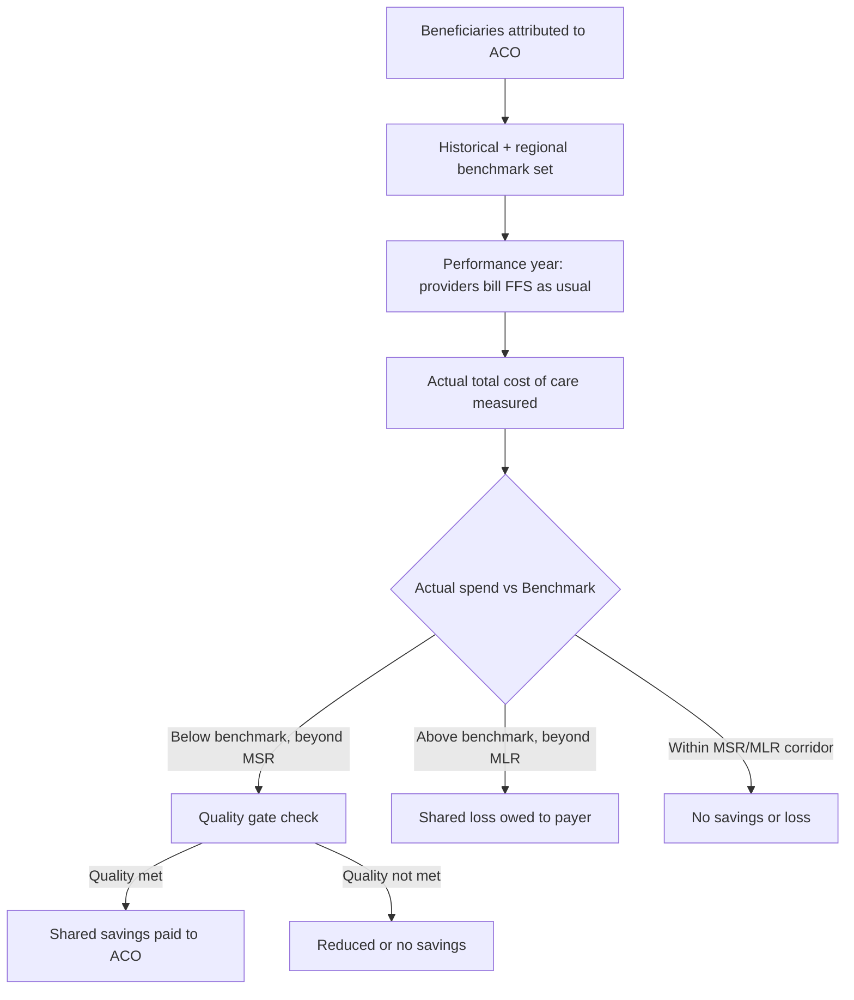

## Accountable Care Organizations

### Definition and Core Concept

An Accountable Care Organization (ACO) is a group of physicians, hospitals, and other healthcare providers who voluntarily coordinate care for an assigned population of patients and accept collective accountability for the quality, cost, and overall experience of that population's care. The defining structural feature of an ACO is the linkage between payment and performance on both cost and quality metrics, distinguishing it from traditional fee-for-service (FFS) arrangements where reimbursement is decoupled from outcomes.

The underlying economic logic rests on realigning provider incentives away from volume (more services generate more revenue under FFS) toward value (efficient, high-quality care generates shared savings). This is achieved by making providers financially responsible for total cost of care across a population, not just the services they individually deliver.

### Historical and Policy Origin

ACOs were formalized as a payment model under Section 3022 of the Affordable Care Act (ACA) of 2010, which established the Medicare Shared Savings Program (MSSP). The conceptual groundwork predates the ACA, drawing on:

- **Integrated delivery systems** (e.g., Kaiser Permanente, Geisinger) that demonstrated coordinated care could improve outcomes and control costs
- **Physician Group Practice (PGP) Demonstration** (2005–2010), a CMS pilot that tested shared savings among large group practices
- **Managed care and HMO experience** of the 1990s, which showed both the potential and the risks (underservice, patient backlash) of capitation-style incentives

The term "Accountable Care Organization" itself is credited to Elliott Fisher and colleagues at Dartmouth, who introduced it in the mid-2000s as an alternative to full capitation — a middle path between FFS and HMO-style risk-bearing.

### Core Structural Components

**Population Assignment (Attribution)**

Patients are assigned (attributed) to an ACO, typically based on where they receive the plurality of primary care services over a defined lookback period. Attribution can be:

- **Prospective**: patients assigned at the start of the performance year based on historical utilization
- **Retrospective**: final attribution determined after the performance year based on actual utilization patterns

Attribution methodology materially affects an ACO's financial results because it determines which patients' costs count toward the benchmark.

**Benchmark Setting**

CMS (or a private payer) establishes a spending benchmark representing expected total cost of care for the attributed population, typically based on:

- Historical spending for the ACO's assigned beneficiaries (usually a 3-year weighted average)
- Regional or national spending trends
- Risk adjustment for population health status (e.g., using CMS-HCC risk scores)

**Shared Savings/Losses Calculation**

$$\text{Savings} = \text{Benchmark} - \text{Actual Spending}$$

If actual spending falls below the benchmark by more than a **minimum savings rate (MSR)** — a threshold designed to ensure savings reflect real performance rather than normal statistical variation — the ACO receives a share of the difference, contingent on meeting quality performance standards. Under two-sided (downside) risk models, spending above the benchmark beyond a **minimum loss rate (MLR)** requires the ACO to repay a portion of the excess to the payer.

**Quality Performance Gate**

Financial reward is contingent on quality scores, preventing an ACO from generating savings purely by stinting on necessary care. Quality is typically measured across domains such as patient/caregiver experience, care coordination/patient safety, preventive health, and management of at-risk populations.

### Financial Track Structures (Medicare Shared Savings Program)

MSSP has evolved through multiple track structures; as of the current **BASIC and ENHANCED** track framework (effective since 2019 under the "Pathways to Success" rule):

| Track | Risk Type | Savings Share | Loss Share | Typical User |
| --- | --- | --- | --- | --- |
| BASIC Levels A–B | Upside-only | Up to 40% | None | New/lower-experience ACOs |
| BASIC Levels C–E | Two-sided (increasing) | Up to 50% | Increasing with level | ACOs progressing toward risk |
| ENHANCED | Two-sided (highest risk/reward) | Up to 75% | Higher loss sharing, higher MLR | Experienced, high-revenue ACOs |

ACOs generally must progress from upside-only to two-sided risk within a defined glide path (typically capped at a set number of years in upside-only arrangements), reflecting CMS's policy goal of moving providers toward full accountability over time.

### Economic Mechanism: Why Shared Savings Changes Behavior

**Key Points**

- Under pure FFS, marginal revenue for an additional service is positive regardless of necessity, creating incentive for volume
- Under shared savings, marginal revenue for an *unnecessary* service is negative in expectation, because it raises total spending against a fixed benchmark while the provider still bears only partial financial exposure (the "shared" portion)
- The ACO retains FFS billing for individual claims — this is the critical distinguishing feature from capitation. Providers are paid FFS *and* reconciled against the benchmark at year-end, rather than receiving a fixed per-member payment upfront
- This creates a hybrid incentive structure: some volume incentive persists (since underlying payment is still FFS), but it is dampened by shared-savings/loss exposure

This hybrid nature is why ACOs are often characterized as a transitional or intermediate payment model between FFS and full capitation/global budgets.

### Risk Adjustment and Benchmark Methodology Nuances

Benchmark accuracy is central to ACO economics and a persistent source of methodological controversy:

- **Regional adjustment**: Post-2016 MSSP rules blend an ACO's historical spending with regional FFS spending to reduce the "ratchet effect," where efficient ACOs that already lowered costs face progressively harder-to-beat benchmarks in subsequent periods
- **Risk score trend caps**: CMS caps the amount by which risk scores can grow year-over-year, to prevent benchmark inflation through more intensive diagnosis coding (upcoding) rather than genuine population health changes
- **Regression to the mean**: High-spending ACOs in a base period tend to show more apparent "savings" simply due to statistical regression, independent of any care management improvement — a known confound in program evaluation

[Inference] The magnitude of measured MSSP savings in independent evaluations (e.g., from MedPAC and academic literature) is sensitive to the counterfactual and risk-adjustment method used, and estimates vary accordingly; exact figures should be checked against the most recent published evaluations rather than treated as fixed.

### Mermaid Diagram: ACO Shared Savings Flow

### ACO Types and Variants

**Medicare Shared Savings Program (MSSP)**

The largest and most enduring ACO program, open to fee-for-service Medicare providers on a voluntary basis, structured under the BASIC/ENHANCED tracks described above.

**ACO REACH (Realizing Equity, Access, and Community Health)**

Successor to the Global and Professional Direct Contracting (GPDC) model, launched by the CMS Innovation Center. Key distinguishing features:

- Higher risk levels (up to 100% risk in the "Global" option, versus capped risk in MSSP)
- Explicit health equity requirements, including a benchmark adjustment tied to serving underserved populations
- Two risk-sharing options: **Professional** (lower risk, 50% savings/losses, capitated payments for primary care services) and **Global** (full risk, 100% savings/losses, capitated payments for all services)

**Next Generation ACO Model** (concluded)

A precursor to REACH that tested higher risk/reward levels and more payment flexibility (e.g., population-based payments, beneficiary incentives) than standard MSSP; ended in 2021, informing REACH's design. [Unverified: exact transition details and final-year performance figures should be verified against current CMS program summaries.]

**Commercial and Medicaid ACOs**

Private payers (e.g., Blue Cross Blue Shield plans, UnitedHealthcare) and state Medicaid programs (e.g., Massachusetts Medicaid ACO program) have adopted analogous shared-savings/risk structures outside Medicare, often with payer-specific benchmark and quality methodologies.

### Quality Measurement Framework

ACOs report on a standardized measure set (the specific measure set and count have changed across program years; providers should consult the current CMS measure specification for exact reporting requirements). Categories typically include:

- **Patient/caregiver experience**: CAHPS survey-based measures (communication, access, care coordination as experienced by patients)
- **Care coordination and patient safety**: e.g., hospital readmission rates, medication reconciliation, use of health IT/electronic exchange of information
- **Preventive health**: screening rates (cancer screenings, immunizations, BMI screening/follow-up)
- **At-risk population management**: outcomes for patients with diabetes, hypertension, depression, and other chronic conditions

Since 2021, MSSP has moved toward reporting via **electronic Clinical Quality Measures (eCQMs)/MIPS CQMs** using certified EHR data rather than manual sampling, reflecting a broader shift toward digitally-sourced quality reporting. [Unverified: confirm current-year reporting mechanics against the latest MSSP quality reporting rule, as this has been an area of active regulatory revision.]

### Worked Example: Shared Savings Calculation

**Example**

An ACO has 10,000 attributed beneficiaries. The risk-adjusted benchmark for the performance year is $95,000,000 (i.e., $9,500 per beneficiary). Actual total cost of care for the attributed population comes in at $90,000,000.

$$\text{Gross Savings} = \$95{,}000{,}000 - \$90{,}000{,}000 = \$5{,}000{,}000$$

Assume the Minimum Savings Rate is 2%, applied to the benchmark:

$$\text{MSR Threshold} = 0.02 \times \$95{,}000{,}000 = \$1{,}900{,}000$$

Since gross savings ($5,000,000) exceed the MSR threshold ($1,900,000), the full savings amount is eligible for sharing (in most MSSP methodologies, once the MSR is exceeded, the entire savings amount — not just the excess over MSR — is shared, subject to a shared savings cap). Assume the ACO is in a track with a 50% shared savings rate and it met all quality gate requirements:

$$\text{ACO Payment} = 0.50 \times \$5{,}000{,}000 = \$2{,}500{,}000$$

This $2,500,000 is distributed among participating providers according to the ACO's internal distribution methodology (which is negotiated among ACO participants and is not dictated by CMS beyond high-level compliance rules).

### Internal Distribution Methodologies

How an ACO allocates shared savings among its constituent providers is a significant internal governance and economic design question, separate from the CMS-ACO financial relationship. Common approaches include:

- **Participation-based**: fixed payments for meeting care management/reporting requirements, regardless of individual cost performance
- **Performance-based**: distribution weighted by individual provider or practice contribution to quality and cost metrics
- **Hybrid models**: combining a participation floor with performance-based bonus pools

[Inference] The choice of internal distribution methodology affects provider-level incentive alignment within the ACO and is a frequent focus of ACO governance disputes, though outcomes are highly organization-specific and not standardized across ACOs.

### SVG Diagram: ACO Payment Flow Structure

<svg xmlns="http://www.w3.org/2000/svg" viewBox="0 0 760 380" font-family="Arial, sans-serif">
<text x="380" y="25" text-anchor="middle" font-size="16" font-weight="bold" fill="#1a1a1a">ACO Payment Flow Structure (svg_diagram)</text>
<rect x="20" y="60" width="180" height="60" rx="6" fill="#e8f0fe" stroke="#3b5bdb" stroke-width="1.5" />
<text x="110" y="85" text-anchor="middle" font-size="12" fill="#1a1a1a">Individual Providers</text>
<text x="110" y="102" text-anchor="middle" font-size="11" fill="#555">(bill FFS as usual)</text>
<rect x="20" y="160" width="180" height="60" rx="6" fill="#e8f0fe" stroke="#3b5bdb" stroke-width="1.5" />
<text x="110" y="185" text-anchor="middle" font-size="12" fill="#1a1a1a">Payer (CMS/Payer)</text>
<text x="110" y="202" text-anchor="middle" font-size="11" fill="#555">Pays FFS claims</text>
<line x1="200" y1="90" x2="20" y2="190" stroke="#888" stroke-width="1" />
<line x1="110" y1="120" x2="110" y2="160" stroke="#3b5bdb" stroke-width="1.5" marker-end="url(#arrow)" />
<text x="120" y="145" font-size="10" fill="#555">claims flow</text>
<rect x="290" y="120" width="180" height="60" rx="6" fill="#fff4e6" stroke="#e8590c" stroke-width="1.5" />
<text x="380" y="145" text-anchor="middle" font-size="12" fill="#1a1a1a">Benchmark vs Actual</text>
<text x="380" y="162" text-anchor="middle" font-size="11" fill="#555">Reconciliation (annual)</text>
<line x1="200" y1="150" x2="290" y2="150" stroke="#888" stroke-width="1.5" marker-end="url(#arrow)" />
<rect x="560" y="60" width="180" height="60" rx="6" fill="#e6fcf5" stroke="#0ca678" stroke-width="1.5" />
<text x="650" y="85" text-anchor="middle" font-size="12" fill="#1a1a1a">Shared Savings Pool</text>
<text x="650" y="102" text-anchor="middle" font-size="11" fill="#555">if quality gate met</text>
<rect x="560" y="200" width="180" height="60" rx="6" fill="#fff0f0" stroke="#e03131" stroke-width="1.5" />
<text x="650" y="225" text-anchor="middle" font-size="12" fill="#1a1a1a">Shared Loss Repayment</text>
<text x="650" y="242" text-anchor="middle" font-size="11" fill="#555">if two-sided risk</text>
<line x1="470" y1="135" x2="560" y2="95" stroke="#0ca678" stroke-width="1.5" marker-end="url(#arrow)" />
<text x="480" y="105" font-size="10" fill="#0ca678">spend &lt; benchmark</text>
<line x1="470" y1="165" x2="560" y2="220" stroke="#e03131" stroke-width="1.5" marker-end="url(#arrow)" />
<text x="480" y="200" font-size="10" fill="#e03131">spend &gt; benchmark</text>
<rect x="290" y="280" width="180" height="60" rx="6" fill="#f3f0ff" stroke="#7048e8" stroke-width="1.5" />
<text x="380" y="305" text-anchor="middle" font-size="12" fill="#1a1a1a">Internal Distribution</text>
<text x="380" y="322" text-anchor="middle" font-size="11" fill="#555">to ACO participants</text>
<line x1="650" y1="120" x2="480" y2="290" stroke="#0ca678" stroke-width="1.5" marker-end="url(#arrow)" />
</svg>

### Governance and Legal Structure Requirements

MSSP ACOs must satisfy specific governance requirements under CMS regulation:

- A formal legal structure (e.g., corporation, LLC) capable of receiving and distributing shared savings payments
- A governing body with meaningful representation from ACO participants, including a required minimum proportion of representation held by ACO providers/suppliers, and at least one Medicare beneficiary representative
- A designated leadership structure (typically an executive/medical director) accountable for clinical and operational performance
- A compliance program addressing fraud, waste, and abuse
- Minimum enrollment thresholds (historically at least 5,000 assigned beneficiaries for MSSP, though CMS has introduced flexibilities for smaller/rural ACOs in later program years) [Unverified: confirm current minimum beneficiary thresholds against the latest MSSP regulations, as CMS has adjusted these over time]

### Interaction with Other Value-Based Payment Models

ACOs frequently coexist and interact with other payment reforms in the same care setting:

- **Bundled payments** (e.g., BPCI-Advanced) can operate alongside ACO attribution for the same patient; CMS has established reconciliation rules to avoid double-counting savings across overlapping episode-based and population-based models
- **Patient-Centered Medical Home (PCMH)** recognition is often used within ACOs as a primary-care-level care delivery model that supports the ACO's population health management goals
- **MIPS (Merit-based Incentive Payment System) / APM (Advanced Alternative Payment Model) pathways**: Under MACRA, MSSP participation in two-sided risk tracks can qualify providers as participants in an Advanced APM, exempting them from standard MIPS reporting and offering different incentive payment structures. [Inference] The specific qualifying thresholds (e.g., percentage of revenue or patients through the Advanced APM) are subject to periodic CMS rule updates and should be verified against the current QPP (Quality Payment Program) rule year.

### Evidence on Cost and Quality Outcomes

Independent evaluations (notably from MedPAC, CMS's own program evaluations, and peer-reviewed health services research) have generally found:

- Modest net savings to Medicare from MSSP overall, with savings tending to grow as ACOs gain experience and move into higher-risk tracks
- Two-sided risk ACOs tend to show larger measured savings than upside-only ACOs, though this partly reflects selection (more confident/capable organizations self-select into risk) rather than risk-bearing alone causing better performance
- Quality performance under ACOs has generally been comparable to or better than non-ACO FFS care on measured metrics, though improvements are often concentrated in specific domains (e.g., preventive screening, reduced hospital readmissions) rather than uniform across all measures

[Inference] Because ACO participation is voluntary, evaluation literature must account for selection effects — organizations that join ACOs, and especially those that accept downside risk, likely differ systematically from non-participants in ways that affect outcomes independent of the payment model itself. Causal attribution of savings solely to the ACO structure should be treated cautiously.

### Common Criticisms and Limitations

- **Attribution instability**: Patients can be reassigned between ACOs or revert to non-ACO status year to year based on utilization patterns, complicating long-term population health investment
- **Benchmark ratchet effect**: Efficient ACOs may face progressively tighter benchmarks, reducing the long-run incentive to sustain savings efforts (partially mitigated by regional blending, but not eliminated)
- **Risk selection concerns**: Incentive to attract healthier, lower-cost patients or discourage high-cost patients from ACO-affiliated providers, though risk adjustment and CMS monitoring aim to limit this
- **Administrative burden**: Quality reporting, care coordination infrastructure, and data analytics capacity requirements impose substantial fixed costs, which may disadvantage smaller or independent physician groups relative to large health systems
- **Savings concentration**: A meaningful share of documented ACO savings in some analyses is attributed to a subset of high-performing ACOs, with many participants generating minimal or no measurable savings

### Key Points

- ACOs link FFS payment to population-level cost and quality accountability without replacing FFS billing itself
- The shared savings/loss mechanism, benchmark methodology, and risk adjustment together determine financial outcomes and are the primary levers of program design
- MSSP (Medicare), ACO REACH, and commercial/Medicaid ACOs represent parallel implementations of the same underlying economic model with varying risk and equity design features
- Quality gates prevent pure cost-minimization behavior by tying financial reward to performance on standardized measures
- Evidence suggests modest, growing savings with generally maintained or improved quality, though causal interpretation requires care given voluntary participation and selection effects

### Related Topics

- Bundled Payments for Care Improvement (BPCI-Advanced) and episode-based payment design
- Risk adjustment methodologies (CMS-HCC model mechanics)
- Capitation and global budget payment models
- Patient-Centered Medical Home (PCMH) and primary care transformation
- MACRA, MIPS, and the Quality Payment Program (QPP) Advanced APM pathway
- Health Maintenance Organizations (HMOs) and historical managed care risk-bearing models
- ACO REACH health equity benchmark adjustments
- Value-based purchasing in Medicaid managed care
- CAHPS survey methodology and patient experience measurement
- Population health management infrastructure and care coordination technology