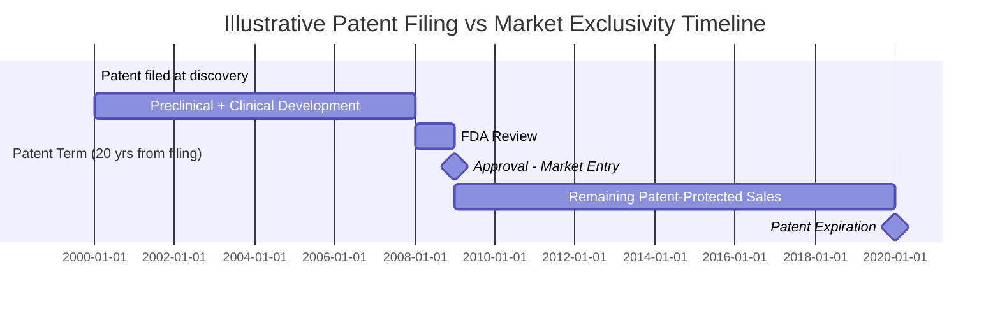
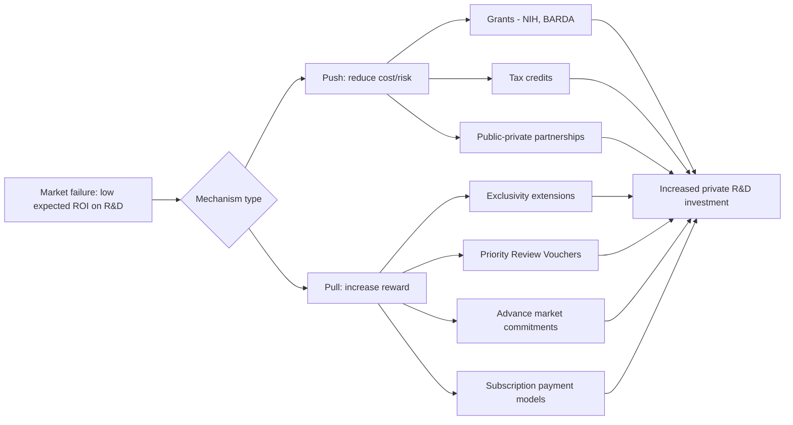

## Economics of Drug Research and Development

### Overview

Pharmaceutical R&D economics studies the cost structure, risk profile, financing mechanisms, and incentive design underlying new drug development. The field is defined by extremely high attrition rates, long development timelines, asymmetric information between innovators and payers, and market structures (patents, exclusivity) designed to solve an underlying public-goods problem: drug knowledge is non-rival and difficult to exclude others from once disclosed, so without legal protection, innovators could not recoup fixed R&D costs from a good that is cheap to copy.

### Key Points

- Estimates of full capitalized cost per approved drug range widely (commonly cited figures span roughly $1 billion to over $2 billion), depending heavily on methodology (cost-of-capital assumptions, inclusion of failed candidates, phase-specific success rates).
- The dominant cost driver is not manufacturing marginal cost but the amortized cost of **failure** — the vast majority of drug candidates entering clinical trials do not reach approval.
- Patents and regulatory exclusivity (not patents alone) jointly determine the effective period of market protection, since these two mechanisms have different scopes, durations, and triggers.
- The "patent cliff" — loss of exclusivity followed by generic/biosimilar entry — produces a predictable, sharp revenue decline that is a central strategic variable in pharmaceutical corporate finance.
- Orphan drug policy, priority review vouchers, and push/pull incentive mechanisms exist specifically to correct market failures in R&D for conditions where expected commercial return is insufficient to motivate private investment (small patient populations, low-income-country diseases).

### The Drug Development Pipeline and Attrition Economics

**Phase structure**

| Phase | Purpose | Typical Duration | Approximate Success Rate to Next Phase |
| --- | --- | --- | --- |
| Preclinical | In vitro/animal testing, lead optimization | 3–6 years | Varies widely; large candidate pool narrows sharply |
| Phase I | Safety, dosage, pharmacokinetics in small healthy/patient cohort | ~1–2 years | ~60-70% advance (rough historical range) |
| Phase II | Efficacy signal, dose-ranging in target patient population | ~2 years | ~30-40% advance (rough historical range) |
| Phase III | Large-scale confirmatory efficacy/safety trials | ~2–4 years | ~50-60% advance (rough historical range) |
| Regulatory review (e.g., FDA NDA/BLA) | Agency evaluation of submitted evidence | ~1–2 years | Majority of Phase III completions submitted are eventually approved, but not all |

[Unverified — phase-transition probabilities vary substantially across therapeutic area (e.g., oncology has historically lower success rates than other areas) and across studies/time periods; treat the ranges above as illustrative order-of-magnitude figures, not precise current estimates, and verify against a current source (e.g., BIO, Tufts CSDD, or peer-reviewed clinical development success rate studies) for any figure used in analysis.**

**Compounding attrition**

The overall probability of an entrant at preclinical/Phase I reaching approval is the product of each phase's conditional success probability:

$$P(\text{approval}) = P(\text{PI} \to \text{PII}) \times P(\text{PII} \to \text{PIII}) \times P(\text{PIII} \to \text{submission}) \times P(\text{submission} \to \text{approval})$$

Because this is a multiplicative chain of imperfect probabilities, overall success rates from first-in-human trials to approval are typically low (commonly cited industry-wide estimates fall in a single-digit-to-low-double-digit percentage range, varying by therapeutic area). [Unverified — precise current aggregate figures should be checked against a current primary source, as they shift over time and across data-sourcing methodologies.]

### Cost-of-Capital-Adjusted R&D Cost Estimation

**Why simple cost summation understates true economic cost**

A naive estimate might sum actual cash outlays across all trial phases for an approved drug. This understates the economic cost of drug development because:

1. **Time value of money**: R&D spending occurs years before revenue is realized; a dollar spent in year 1 has a higher economic cost (in present-value terms, given the firm's cost of capital) than a dollar spent in year 10.
2. **Failure cost allocation**: The relevant cost of producing one approved drug must include the cost of the failed candidates whose costs are sunk but which produced no revenue-generating product. If only 1 in $N$ candidates entering clinical trials succeeds, the true cost per approval includes the failed $N-1$ candidates' costs.

**Standard capitalization formula (illustrative structure)**

$$C_{capitalized} = \sum_{t} \frac{C_t}{P_t} \times (1+r)^{T-t}$$

where $C_t$ is cash cost incurred in period $t$, $P_t$ is the cumulative probability of reaching approval from that phase (used to allocate failure costs across successes), $r$ is the cost of capital, and $T$ is the approval date. This is the general logic underlying widely cited estimates (e.g., work associated with the Tufts Center for the Study of Drug Development), though exact methodologies, cost-of-capital assumptions (often historically around 10-11% real, though this is methodology- and era-dependent), and resulting headline figures are contested in the health economics literature. [Unverified — treat any single point estimate (e.g., "$2.6 billion") as methodology-dependent and subject to academic dispute rather than a settled fact; critics argue industry-funded estimates may overstate costs by using high cost-of-capital assumptions or including opportunity costs some economists consider inappropriate to attribute as a "cost."]

### Intellectual Property and Exclusivity Mechanisms

**Patents vs. regulatory exclusivity: a critical distinction**

These are separate legal mechanisms with different rules, and conflating them is a common analytical error:

| Mechanism | Granting Body | Typical Duration | Basis |
| --- | --- | --- | --- |
| Patent | Patent office (e.g., USPTO) | 20 years from filing (not from approval) | Novel invention (molecule, method, formulation) |
| New Chemical Entity (NCE) exclusivity | FDA | 5 years from approval | First approval of active moiety, independent of patent status |
| Orphan Drug exclusivity | FDA | 7 years from approval | Approval for a rare disease indication (US: fewer than 200,000 patients) |
| Biologics exclusivity (BPCIA) | FDA | 12 years from approval | Reference biologic product, distinct from small-molecule NCE exclusivity |
| Pediatric exclusivity extension | FDA | +6 months added to existing exclusivity | Completion of FDA-requested pediatric studies |

Because patent filing typically occurs early in development (often at discovery/preclinical stage) while the patent clock runs from filing, and clinical development consumes many years before approval, the **effective market exclusivity period post-approval** (patent life remaining after approval) is typically substantially shorter than the full 20-year patent term — commonly cited as roughly half of the nominal term, though this varies by development timeline. This is why mechanisms like **patent term restoration** (partial extension to compensate for regulatory review time, subject to statutory caps) exist as a policy correction.

### Patent Cliff Dynamics and Generic/Biosimilar Entry

**Post-exclusivity revenue collapse**

Upon loss of exclusivity (LOE), small-molecule drugs typically face rapid, steep revenue erosion as generic manufacturers enter under abbreviated approval pathways (in the US, the Hatch-Waxman Act's ANDA process, which allows generics to rely on the innovator's safety/efficacy data upon demonstrating bioequivalence rather than repeating full clinical trials).

- Generic price competition is typically severe because generic manufacturers compete primarily on manufacturing cost rather than differentiated value, and multiple entrants often enter simultaneously once exclusivity lapses.
- **Biosimilars** (for biologic drugs) face a distinct, more complex regulatory and clinical pathway (demonstrating biosimilarity rather than simple bioequivalence) under the BPCIA framework, and empirically have shown less severe price erosion than small-molecule generics, reflecting higher manufacturing complexity, switching/interchangeability barriers, and fewer entrants. [Inference — the magnitude of biosimilar price erosion is an active empirical research area and figures vary by therapeutic class and market; do not treat any single erosion percentage as universally applicable.]

**Strategic responses to the patent cliff**

Firms commonly pursue several documented strategies, with varying degrees of regulatory and antitrust scrutiny:

1. **Life-cycle management**: reformulations (e.g., extended-release versions), new indications, or combination products that can carry independent, later-expiring patents
2. **"Pay-for-delay" settlements**: patent litigation settlements between brand and generic manufacturers in which the generic firm agrees to delay market entry, often in exchange for payment — a practice that has drawn significant US antitrust (FTC) scrutiny under cases addressing reverse-payment settlements
3. **Authorized generics**: the brand manufacturer licenses its own generic version (often through a subsidiary) to capture some generic-segment revenue itself
4. **Portfolio diversification**: pipeline replacement, so revenue loss from one product's LOE is offset by new product launches

### Push and Pull Incentive Mechanisms (Correcting Market Failure)

Standard patent-based incentives fail where expected commercial return is too low relative to R&D cost and risk — notably for neglected tropical diseases, antimicrobial resistance (where value to society from *conserving* a new antibiotic's effectiveness conflicts with volume-based revenue models), and ultra-rare diseases. Policy responses are categorized as:

**Push mechanisms** (reduce R&D cost/risk upfront)

- Direct grant funding (e.g., NIH, BARDA)
- Tax credits (e.g., US Orphan Drug Tax Credit)
- Public-private partnerships absorbing early-stage risk

**Pull mechanisms** (increase expected reward upon success)

- Market exclusivity extensions (orphan drug exclusivity)
- **Priority Review Vouchers (PRVs)**: awarded for approval of drugs treating specified neglected diseases (tropical disease, rare pediatric disease); the voucher grants the holder an expedited FDA review for a *different*, unrelated drug and is a transferable, sellable asset — creating a market-based incentive whose value derives from the option to accelerate a separate, more commercially valuable product's review timeline
- Advance market commitments (guaranteed purchase volumes/prices, notably used in vaccine economics)
- Subscription/"Netflix" models for antibiotics (fixed payment for access regardless of volume dispensed, aimed at decoupling revenue from volume to preserve antibiotic stewardship incentives)

### Illustrative Example: Priority Review Voucher Valuation Logic

Suppose Firm A develops a treatment for a qualifying neglected tropical disease and earns a Priority Review Voucher upon approval. Firm A does not currently have another late-stage asset needing accelerated review, so it sells the voucher.

- The voucher's market value reflects the buyer's expected value from moving up their own drug's FDA review timeline (typically shaving several months off standard review), weighted by that drug's expected peak sales and the value of earlier market entry (extra months of exclusivity-protected sales before generic/competitor entry).
- Historical PRV sale prices have varied considerably across individual transactions. [Unverified — specific dollar amounts should be checked against current reporting, as reported sale prices for these vouchers have fluctuated significantly and are not standardized/publicly disclosed in all transactions.]
- This mechanism effectively creates a secondary market instrument whose value is *derived* from regulatory review time itself — an example of how policy design can manufacture a tradable financial asset to solve an R&D incentive problem without direct government expenditure.

### Comparative International R&D Incentive Structures

| Jurisdiction/Framework | Distinguishing Feature |
| --- | --- |
| United States | Strong reliance on market-based pricing to fund global R&D recoupment; extensive push/pull mechanism menu (PRVs, orphan tax credits) |
| European Union | Centralized EMA approval with mechanisms like Supplementary Protection Certificates (SPCs) extending protection to compensate for regulatory review time, analogous in purpose to US patent term restoration |
| Japan | Historically distinct pricing/reimbursement negotiation process affecting achievable revenue and thus R&D investment incentives |

[Inference] Cross-country comparisons of how pricing policy affects global pharmaceutical R&D investment levels are a subject of ongoing economic debate (e.g., arguments that US market pricing subsidizes global R&D versus counterarguments about domestic price levels and access trade-offs); this is a normative/contested area, and the summary above should be read as describing the structure of debate rather than resolving it.

### Conclusion

Drug R&D economics centers on managing extreme technical and regulatory risk under a legal exclusivity framework designed to let successful products fund the far larger number of failures. The core analytical tools are attrition-adjusted, time-value-corrected cost estimation; a precise understanding of the distinct (and often shorter-than-nominal) exclusivity period created by the interaction of patents and regulatory exclusivity; and an appreciation for the growing toolkit of push/pull mechanisms designed to redirect R&D investment toward socially valuable but commercially underincentivized targets.

**Related Topics**

- Hatch-Waxman Act and the ANDA generic approval pathway
- Value-based pricing and health technology assessment (HTA) for drug reimbursement
- Antibiotic resistance economics and subscription payment models
- Patent thickets and evergreening strategies in pharmaceutical IP
- Orphan Drug Act (1983) and rare disease market economics
- NIH funding's role in basic research underlying commercially developed drugs
- Reference pricing and international drug price comparison methodologies
- Real options valuation applied to pharmaceutical pipeline decision-making