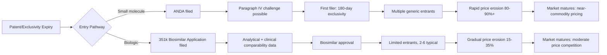

## Generic and Biosimilar Entry and Competition

### Overview

Generic and biosimilar entry represents the mechanism by which pharmaceutical markets transition from monopoly or near-monopoly pricing to competitive pricing following the expiration of patent protection and regulatory exclusivity. The economics of small-molecule generic competition and biologic biosimilar competition differ substantially due to differences in molecular complexity, manufacturing barriers, regulatory pathways, and resulting competitive dynamics. This topic covers the entry pathways, market structure evolution, pricing dynamics, and strategic behaviors that characterize post-exclusivity competition.

### Regulatory Entry Pathways

#### Small-Molecule Generics: Abbreviated New Drug Application (ANDA)

- Generic manufacturers rely on the innovator's existing safety and efficacy data rather than repeating full clinical trials, instead demonstrating **bioequivalence** — that the generic delivers the same active ingredient to the bloodstream at a comparable rate and extent as the reference listed drug (RLD).
- Bioequivalence is typically established through pharmacokinetic studies measuring $C_{max}$ (peak plasma concentration) and $AUC$ (area under the concentration-time curve), with the generic required to fall within a standard **80–125% confidence interval** of the reference product's values.
- Because clinical efficacy trials are not required, ANDA development costs are a small fraction of originator development costs, which is the structural reason generic prices can fall so far below branded prices while remaining commercially viable for manufacturers.
- **Paragraph IV certification**: A generic applicant can certify that a listed patent is invalid, unenforceable, or not infringed by its product, allowing an ANDA filing before patent expiration. A successful challenge permits entry ahead of the nominal patent term.
- **First-filer 180-day exclusivity**: The first generic manufacturer to submit a Paragraph IV certification is awarded 180 days of exclusivity as the only generic competitor, creating a substantial economic incentive to be first, since post-exclusivity entry of additional generics compresses margins rapidly.

#### Biosimilars: Abbreviated Licensure Pathway (BPCIA / EU Biosimilar Pathway)

- Biosimilars are approved via a distinct abbreviated pathway (351(k) applications under the U.S. **Biologics Price Competition and Innovation Act**) that still requires a structured but reduced package of analytical, non-clinical, and often clinical data demonstrating **no clinically meaningful differences** from the reference biologic in safety, purity, and potency.
- Unlike small-molecule generics, biosimilars cannot be established as chemically identical to the reference product due to the size, structural complexity, and manufacturing-process sensitivity of biologic molecules (proteins, monoclonal antibodies, etc.). This is summarized in the field as "the product is the process" — even small manufacturing variations can affect glycosylation patterns, folding, or immunogenicity.
- **Interchangeability designation** is a separate, higher regulatory bar (in the U.S.) that, once achieved, permits pharmacy-level substitution without prescriber authorization in most states; biosimilarity alone does not confer this.
- The EU biosimilar pathway, established earlier than the U.S. pathway (first EU biosimilar approved 2006 vs. first U.S. biosimilar in 2015), does not use a separate interchangeability designation — substitution policy is determined at the member-state level.

### Comparative Entry Barriers

| Dimension | Small-Molecule Generics | Biosimilars |
| --- | --- | --- |
| Molecular complexity | Low (simple, well-defined chemical structures) | High (large proteins, complex tertiary structure) |
| Manufacturing barrier | Relatively low capital intensity | High capital intensity (bioreactors, cell lines) |
| Clinical data required | Bioequivalence studies only | Analytical + comparative clinical data |
| Typical development cost | [Inference] Low tens of millions USD | [Inference] Several hundred million USD, though estimates vary widely by product class |
| Typical number of competitors at maturity | Often 5–15+ | Typically 2–6 |
| Typical price discount vs. brand | 80–90%+ at multiple entrants | Commonly 15–35%, though this varies significantly by market and product |

**Key Points**

- The lower barrier to small-molecule generic entry produces faster, deeper price erosion and a larger number of competing manufacturers.
- The higher barrier to biosimilar entry produces slower uptake, fewer competitors, and shallower price discounts, though biosimilar savings still represent a substantial share of overall drug spending reduction in markets where they are established.

### Market Structure Evolution Post-Exclusivity

#### The Generic Price Erosion Curve

Empirical patterns commonly observed in small-molecule generic markets (documented in health economics literature, notably FDA's own generic competition studies) show a step-function relationship between number of competitors and price:

- **1 generic entrant**: Price typically falls to roughly 60–70% of brand price
- **2–3 entrants**: Price falls further, often to 40–50% of brand price
- **6+ entrants**: Price commonly falls to 10–20% of brand price or lower

[Inference] This pattern reflects diminishing marginal price impact per additional competitor beyond a threshold, though exact percentages vary substantially by therapeutic class, market size, and country, and should be treated as illustrative rather than universally applicable figures.

#### The Biosimilar Uptake Curve

Biosimilar market share growth is typically slower and more gradual than generic uptake, influenced by:

- Physician and patient familiarity/trust in the reference product ("switching hesitancy")
- Payer formulary design and step-therapy requirements
- Absence of automatic pharmacy substitution in many jurisdictions
- Manufacturer rebate and contracting strategies by the originator to retain formulary position even post-biosimilar-entry

### Strategic Behaviors Affecting Entry and Competition

**Key Points**

- **Pay-for-delay (reverse payment) settlements**: Originators settle patent litigation with generic challengers in exchange for delayed market entry. In the U.S., such settlements are subject to antitrust "rule of reason" review following *FTC v. Actavis* (2013), rather than being automatically lawful or automatically unlawful.
- **Authorized generics**: The brand manufacturer (often via a subsidiary) markets its own generic version of its branded product, frequently timed to compete during a first-filer's 180-day exclusivity window, capturing generic-segment revenue while nominally not violating that exclusivity.
- **Citizen petitions**: Originators can file petitions with the FDA raising safety or manufacturing concerns about a pending generic or biosimilar application; critics characterize some filings as tactics to delay approval timelines, though petitions can also raise legitimate scientific issues.
- **Product hopping / evergreening**: Shifting prescribing volume to a reformulated, newly patented version of a drug (e.g., extended-release formulation) shortly before the original formulation loses exclusivity, reducing the addressable market for generic substitution of the original formulation.
- **Rebate contracting (biosimilars)**: Originator biologics often respond to biosimilar entry with aggressive rebate and discount contracts to payers and pharmacy benefit managers, which can slow biosimilar formulary uptake even as list prices remain relatively stable — a dynamic documented in analyses of the U.S. biosimilar market (e.g., filgrastim, infliximab, adalimumab classes).

### Substitution and Interchangeability Policy

- **Generic substitution**: In most jurisdictions, pharmacists may substitute an AB-rated (or equivalent) generic for a prescribed brand-name drug without prescriber authorization, often by default rules under state or national pharmacy law.
- **Biosimilar substitution**: More heterogeneous globally. In the U.S., only biosimilars with an FDA interchangeability designation may be substituted at the pharmacy level without prescriber involvement; non-interchangeable biosimilars require a new prescription. In much of the EU, substitution policy for biosimilars is set at the national or even institutional level rather than centrally by EMA.
- [Unverified] Substitution and interchangeability rules are subject to ongoing legislative and regulatory change in multiple jurisdictions; current rules for a specific drug class or country should be verified against that jurisdiction's current pharmacy and regulatory law.

### Payer and Health System Response

- **Reference pricing / internal reference pricing**: Payers or national health systems often set reimbursement for a therapeutic class at or near the price of the lowest-cost generic/biosimilar, shifting the cost differential for a branded product onto the patient or requiring clinical justification for brand use.
- **Mandatory generic substitution policies**: Some national health systems mandate generic dispensing unless clinically contraindicated, accelerating generic penetration rates.
- **Biosimilar-specific incentive programs**: Some health systems and payers have implemented shared-savings or gain-sharing programs with prescribers to encourage biosimilar adoption, given the historically slower uptake curve relative to small-molecule generics.

### Illustrative Diagram: Price Trajectory Comparison

<svg xmlns="http://www.w3.org/2000/svg" viewBox="0 0 800 420">
<text x="400" y="25" font-size="16" font-weight="bold" text-anchor="middle" fill="#1a1a1a">Post-Exclusivity Price Erosion: Generics vs. Biosimilars (svg_diagram)</text>
<line x1="70" y1="360" x2="750" y2="360" stroke="#333" stroke-width="1.5" />
<line x1="70" y1="60" x2="70" y2="360" stroke="#333" stroke-width="1.5" />
<text x="410" y="395" font-size="12" text-anchor="middle" fill="#333">Time Since Exclusivity Expiry</text>
<text x="30" y="210" font-size="12" text-anchor="middle" fill="#333" transform="rotate(-90 30 210)">Price (% of Brand)</text>

<text x="60" y="65" font-size="10" text-anchor="end" fill="#333">100%</text>

<text x="60" y="215" font-size="10" text-anchor="end" fill="#333">50%</text>

<text x="60" y="355" font-size="10" text-anchor="end" fill="#333">0%</text>

<polyline points="70,65 150,150 250,230 350,290 450,325 550,340 650,345 750,348" fill="none" stroke="#8c3a3a" stroke-width="2.5" />
<text x="600" y="330" font-size="12" fill="#8c3a3a" font-weight="bold">Small-molecule generics</text>
<polyline points="70,65 200,110 350,150 500,185 650,205 750,215" fill="none" stroke="#3a5a8c" stroke-width="2.5" />
<text x="580" y="195" font-size="12" fill="#3a5a8c" font-weight="bold">Biosimilars</text>

<text x="90" y="55" font-size="10" fill="#666">Exclusivity expiry</text>

</svg>

### Global and Access Considerations

**Key Points**

- Generic and biosimilar competition is a primary policy lever used by governments to control aggregate pharmaceutical expenditure, particularly in publicly funded health systems.
- Low- and middle-income countries often rely heavily on generic manufacturing (notably from India and, for certain products, China) to achieve affordable access to essential medicines; the strength and enforcement of local patent law materially shapes this capacity.
- **Compulsory licensing** under TRIPS flexibilities can enable earlier generic production of a patented drug under specific public-health circumstances, subject to WTO rules and often requiring compensation to the patent holder, though usage is selective and often geopolitically contentious.
- [Speculation] Continued growth in the number and share of biologics among top-selling drugs globally suggests biosimilar competition dynamics will become increasingly central to pharmaceutical cost-containment policy relative to small-molecule generics over time, though this trajectory depends on future drug development patterns and is not a certainty.

### Related Topics

- Hatch-Waxman Act framework and Paragraph IV litigation mechanics
- BPCIA and the U.S. biosimilar interchangeability pathway
- Reference pricing and international price referencing systems
- Pharmacy benefit manager (PBM) rebate structures and formulary design
- Compulsory licensing and TRIPS flexibilities
- Patent cliff financial modeling for originator portfolios
- Health technology assessment (HTA) interaction with generic/biosimilar entry
- Manufacturing economics of biologics vs. small molecules
- Antitrust law applied to pharmaceutical settlements (*FTC v. Actavis*)
- Global generic manufacturing capacity and supply chain economics