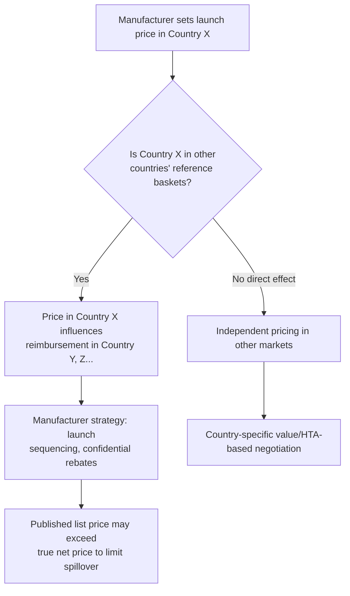

## Pharmaceutical Pricing and Reference Pricing

### Overview

Pharmaceutical pricing determines how much payers, patients, and health systems pay for medicines, and it operates differently from pricing in most consumer markets because the purchaser (payer/insurer), the prescriber (physician), and the end consumer (patient) are typically three distinct parties with different information and incentives. Reference pricing is one of the most widely used policy tools for constraining pharmaceutical expenditure, using either the price of a therapeutic alternative or the price observed in other countries as a benchmark for what a payer will reimburse. This topic covers pricing models, reference pricing mechanisms, and their interaction with market access.

### Why Pharmaceutical Pricing Differs from Standard Market Pricing

**Key Points**

- **Principal-agent separation**: The physician (agent) prescribes, the patient (principal, partially) consumes, and the payer (insurer/government) largely pays — weakening the normal price sensitivity that governs most consumer purchasing decisions.
- **Inelastic demand for essential therapies**: For drugs treating serious or life-threatening conditions with few substitutes, patient demand is often highly inelastic, giving originator manufacturers substantial pricing power during exclusivity periods.
- **Information asymmetry**: Manufacturers possess private information about R&D costs, manufacturing costs, and comparative effectiveness that payers and patients typically cannot fully observe, complicating "fair price" determination.
- **Monopsony and oligopsony power**: In many health systems, a single national payer (monopsony) or a small number of large payers/PBMs (oligopsony) can exert substantial negotiating leverage, in contrast to the fragmented, multi-payer structure of the U.S. market.

### Pricing Models

#### List Price vs. Net Price

- **List price (WAC — Wholesale Acquisition Cost, in the U.S.)**: The manufacturer's published price before rebates, discounts, or fees.
- **Net price**: The price actually retained by the manufacturer after rebates to PBMs, discounts to payers, and other price concessions. In markets with heavy rebating (notably the U.S.), the gap between list and net price can be substantial and has grown as a point of policy contention, since patient cost-sharing is sometimes calculated off list price even when net price is materially lower.

#### Cost-Plus Pricing

- Price is set as manufacturing/development cost plus a margin. Rarely used as the primary basis for branded drug pricing given the difficulty of allocating shared R&D costs across a portfolio, but sometimes proposed in policy debates as an alternative pricing philosophy, and used more directly for some generics and certain government procurement contexts.

#### Value-Based Pricing

- Price is set according to the therapeutic or economic value the drug delivers relative to existing alternatives, often operationalized through **cost-effectiveness analysis** using metrics such as cost per **quality-adjusted life year (QALY)** gained.

$$ICER = \frac{Cost_{new} - Cost_{comparator}}{QALY_{new} - QALY_{comparator}}$$

Where $ICER$ is the incremental cost-effectiveness ratio. Health technology assessment (HTA) bodies (e.g., NICE in the UK) commonly apply an implicit or explicit cost-per-QALY threshold to inform reimbursement and pricing decisions — [Inference] the widely cited UK NICE threshold range of roughly £20,000–£30,000 per QALY is a long-standing reference point in health economics literature, though thresholds and their application vary by country, disease severity, and specific HTA body policy, and should be verified against current guidance for precision.

#### Value-Based / Outcomes-Based Contracting

- Payment is tied partly or wholly to real-world clinical outcomes achieved, with rebates or refunds triggered if pre-specified outcome thresholds are not met. This has grown as a mechanism for managing payer risk on high-cost specialty and cell/gene therapies with substantial outcome uncertainty at launch.

#### Risk-Sharing and Managed Entry Agreements

- **Financial-based agreements**: Discounts, price-volume agreements, or budget caps that limit total payer expenditure regardless of clinical outcome.
- **Outcomes-based agreements**: Payment adjusted based on whether real-world outcomes match those observed in clinical trials, often used when trial evidence carries higher-than-usual uncertainty (e.g., accelerated approvals, surrogate endpoints).
- **Coverage with evidence development (CED)**: Conditional reimbursement paired with a requirement to collect additional real-world evidence post-launch, with pricing/coverage potentially revisited once that evidence matures.

### Reference Pricing: Two Distinct Mechanisms

Reference pricing is used to describe two related but structurally different policy tools, and the distinction matters for economic analysis.

#### 1. Therapeutic (Internal) Reference Pricing

- Groups drugs within a therapeutic class believed to have comparable clinical effect and sets a single reimbursement level (the "reference price") for the entire class, typically anchored to the lowest-cost or a defined benchmark product in that class.
- Patients who choose a higher-priced drug within the reference group typically pay the price difference out-of-pocket, creating a direct financial incentive toward lower-cost options.
- Commonly applied to generic-competitive classes but can also be applied across therapeutically similar branded drugs (e.g., statins, proton pump inhibitors) even absent direct generic competition to a specific product.
- [Inference] The primary economic effect is to shift a portion of price competition pressure from the payer-negotiation stage onto manufacturers directly, since manufacturers must price near the reference level to remain attractive without patient cost-sharing friction, though the magnitude of this effect varies by therapeutic class and market structure.

#### 2. External (International) Reference Pricing

- Sets or benchmarks a country's price for a drug based on prices observed for the same product in a defined "basket" of reference countries.
- Widely used across the EU and in many middle-income countries as a primary or supplementary pricing mechanism; the specific reference country basket, calculation method (e.g., average, lowest, median of basket prices), and update frequency vary considerably by country.
- Creates cross-market interdependence: a price concession granted in one country can, through the reference mechanism, propagate to other countries using that country as part of their reference basket — a dynamic that manufacturers actively manage through **launch sequencing strategies** (e.g., delaying launch in low-price countries, or negotiating confidential rebates so the publicly reported list price used for referencing remains higher than the effective net price).

### External Reference Pricing: Structural Considerations

**Key Points**

- **Reference basket composition** materially affects outcomes: baskets weighted toward lower-income or lower-price countries pull reference prices down; baskets weighted toward high-income countries produce higher reference prices.
- **Confidential managed-entry agreements** have become widespread partly as a direct response to external reference pricing, since manufacturers can grant a payer a substantial net-price discount without that discount becoming visible (and thus referenceable) in the public list price.
- [Inference] This dynamic reduces price transparency across international markets as a byproduct of reference pricing policy itself, an outcome noted in health policy literature as a structural side effect rather than a stated goal of the policy, though the extent of this effect is difficult to quantify precisely given the confidential nature of the agreements involved.
- Some countries exclude or delay referencing certain launch prices specifically to avoid triggering downward referencing pressure on manufacturers, which can itself affect launch sequencing and access timing across markets (sometimes termed "reference pricing-driven launch delay").

### Comparative Table: Reference Pricing Mechanisms

| Dimension | Therapeutic (Internal) Reference Pricing | External (International) Reference Pricing |
| --- | --- | --- |
| Benchmark | Other drugs within the same country/class | Same drug's price in other countries |
| Primary lever | Patient cost-sharing incentive | Cross-border price interdependence |
| Common users | Germany, Netherlands, many EU states (within-class) | Most EU member states, many middle-income countries |
| Manufacturer response | Price near reference level for competitive products | Confidential rebating, launch sequencing |
| Main criticism | May not account for genuine clinical differentiation within class | Can suppress or delay launch in lower-price reference countries |

### Price Negotiation and Government Purchasing Mechanisms

- **Direct price negotiation**: A government or national payer negotiates directly with the manufacturer, sometimes backed by statutory authority (e.g., expanded under the U.S. Inflation Reduction Act for select Medicare Part D and Part B drugs beginning with initial negotiated prices effective 2026).
- **Tendering/procurement auctions**: Used heavily for generics and, in some systems, biosimilars, where multiple qualified suppliers compete on price for a defined supply contract, often producing the steepest observed price reductions of any pricing mechanism.
- **Formulary tiering**: Payers place drugs into cost-sharing tiers (e.g., generic, preferred brand, non-preferred brand, specialty), using patient cost-sharing differentials to steer utilization toward lower-cost/preferred options without directly setting price.

### U.S.-Specific Pricing Structure

**Key Points**

- The U.S. lacks a single national reference pricing or direct-negotiation system comparable to most other high-income countries, historically resulting in list prices for many branded drugs that are materially higher than in comparable OECD countries, a pattern widely documented in cross-national pricing comparisons.
- **Pharmacy Benefit Managers (PBMs)** negotiate formulary placement and rebates with manufacturers on behalf of payers, creating a complex intermediary layer between list price and what patients/payers ultimately experience.
- The **Inflation Reduction Act (2022)** introduced limited government price negotiation authority for Medicare for a defined and expanding list of high-spend drugs, along with inflation-indexed rebate requirements — [Unverified] the specific drugs covered, negotiated prices, and effective dates are subject to ongoing implementation and legal challenge, and should be verified against current CMS guidance for precision.
- 340B Drug Pricing Program and Medicaid Best Price rules create additional layered pricing obligations specific to U.S. market structure, affecting net price calculus for manufacturers differently across payer segments.

### Illustrative Diagram: Price Transmission Through the Supply Chain

<svg xmlns="http://www.w3.org/2000/svg" viewBox="0 0 800 380">
<text x="400" y="25" font-size="16" font-weight="bold" text-anchor="middle" fill="#1a1a1a">List Price to Patient Cost: Supply Chain Layers (svg_diagram)</text>
<rect x="40" y="60" width="140" height="60" fill="#eef3fb" stroke="#3a5a8c" stroke-width="1.5" rx="6" />
<text x="110" y="95" font-size="12" text-anchor="middle" fill="#1a1a1a">Manufacturer List Price (WAC)</text>
<rect x="230" y="60" width="140" height="60" fill="#fdf3e6" stroke="#8c6d1a" stroke-width="1.5" rx="6" />
<text x="300" y="90" font-size="11" text-anchor="middle" fill="#1a1a1a">PBM / Wholesaler</text>
<text x="300" y="105" font-size="11" text-anchor="middle" fill="#1a1a1a">Rebates negotiated</text>
<rect x="420" y="60" width="140" height="60" fill="#fbeeee" stroke="#8c3a3a" stroke-width="1.5" rx="6" />
<text x="490" y="90" font-size="11" text-anchor="middle" fill="#1a1a1a">Payer / Insurer</text>
<text x="490" y="105" font-size="11" text-anchor="middle" fill="#1a1a1a">Net price paid</text>
<rect x="610" y="60" width="140" height="60" fill="#e9f7ee" stroke="#2c7a4b" stroke-width="1.5" rx="6" />
<text x="680" y="90" font-size="11" text-anchor="middle" fill="#1a1a1a">Patient</text>
<text x="680" y="105" font-size="11" text-anchor="middle" fill="#1a1a1a">Copay / coinsurance</text>
<line x1="180" y1="90" x2="230" y2="90" stroke="#333" stroke-width="1.5" marker-end="url(#arrow)" />
<line x1="370" y1="90" x2="420" y2="90" stroke="#333" stroke-width="1.5" marker-end="url(#arrow)" />
<line x1="560" y1="90" x2="610" y2="90" stroke="#333" stroke-width="1.5" marker-end="url(#arrow)" />
<text x="400" y="180" font-size="12" text-anchor="middle" fill="#666">Note: patient cost-sharing is sometimes calculated against list price</text>

<text x="400" y="198" font-size="12" text-anchor="middle" fill="#666">even where net price (after rebates) is substantially lower — a</text>

<text x="400" y="216" font-size="12" text-anchor="middle" fill="#666">structural gap central to U.S. pharmaceutical pricing debate</text>

</svg>

### Policy Trade-offs

**Key Points**

- Reference pricing and negotiated pricing mechanisms generally lower near-term payer expenditure and patient cost-sharing, which is their intended policy goal.
- [Inference] Aggressive reference pricing or negotiated pricing, particularly external reference pricing that suppresses launch price expectations, is argued by industry and some economists to reduce expected returns on R&D investment and could plausibly affect launch sequencing or investment allocation toward certain therapeutic areas, though the magnitude of this effect on actual global innovation output is empirically contested and difficult to isolate from other market factors.
- Conversely, advocates of reference pricing argue that persistently high list prices in unregulated or lightly regulated markets do not proportionally translate into greater innovation output, and that reference pricing is a necessary corrective to information asymmetry and payer/patient inelastic demand.
- This trade-off — access and affordability versus innovation incentive — recurs throughout pharmaceutical economics policy discussion and does not have a single empirically settled resolution; positions vary by stakeholder and underlying assumptions about elasticity of R&D investment to expected returns.

### Related Topics

- Health technology assessment (HTA) methodology and QALY-based decision-making
- Value-based and outcomes-based contracting design
- Pharmacy Benefit Manager (PBM) economics and rebate structures
- Inflation Reduction Act Medicare drug price negotiation mechanics
- Patent protection and market exclusivity (interaction with launch pricing strategy)
- Generic and biosimilar entry and competition
- Cross-national comparative drug pricing studies
- Formulary design and tiered cost-sharing structures
- 340B Drug Pricing Program and Medicaid Best Price rules
- Orphan drug and rare disease pricing economics