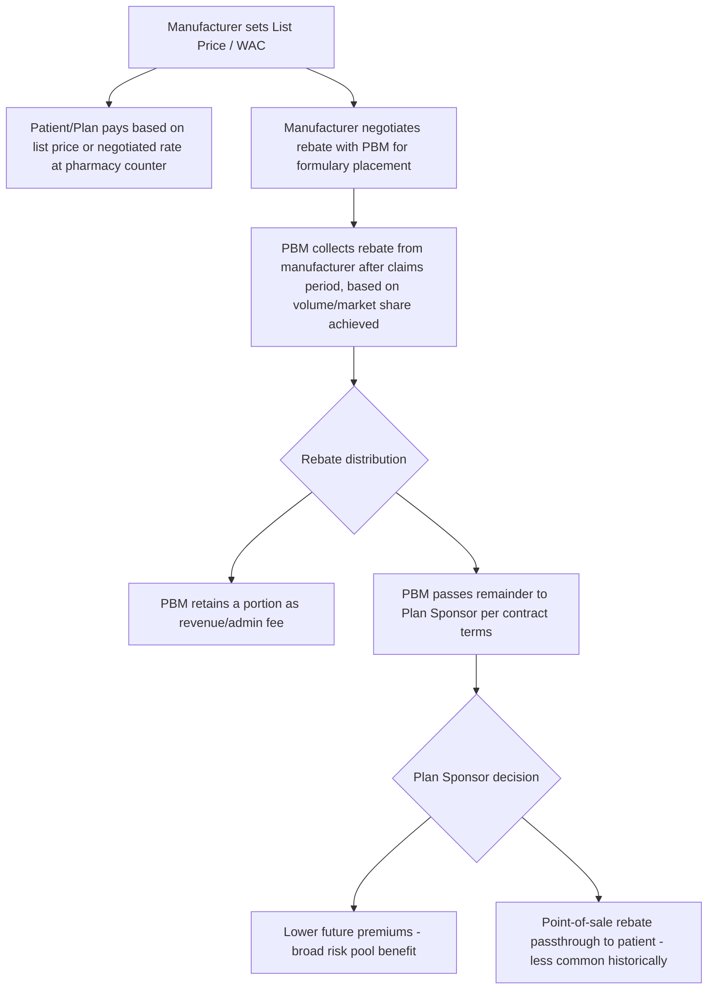
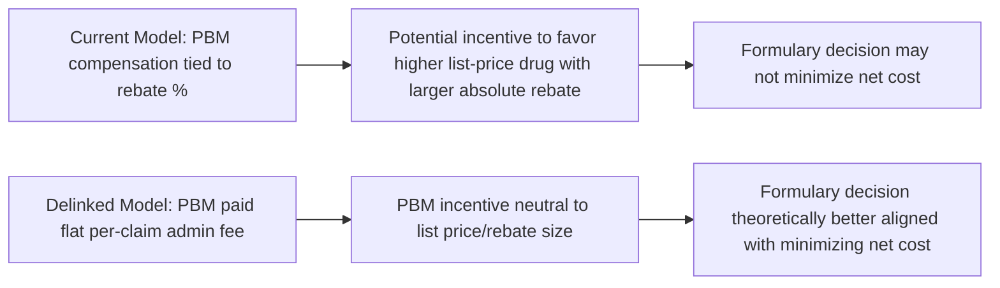

## Pharmacy Benefit Managers and Rebates

### Overview

Pharmacy Benefit Managers (PBMs) are intermediary firms that administer prescription drug benefits on behalf of payers (employers, health plans, Medicare Part D plan sponsors, government programs). They sit between manufacturers, pharmacies, and payers, and their central economic function — negotiating manufacturer rebates in exchange for favorable formulary placement — has become one of the most scrutinized mechanisms in US pharmaceutical pricing due to opacity in how rebate savings flow (or fail to flow) to end payers and patients.

### Key Points

- PBMs perform three core functions: formulary design/management, pharmacy network contracting, and claims processing/adjudication.
- Rebates are retrospective payments from manufacturers to PBMs (and often shared with plan sponsors), distinct from the point-of-sale list price (WAC — Wholesale Acquisition Cost) that determines a drug's sticker price.
- The rebate system creates a **gross-to-net bubble**: the growing gap between list price (rising) and net price after rebates (comparatively flatter), which obscures the drug's true transaction price from patients and analysts.
- The PBM market is highly concentrated, with the three largest PBMs (historically associated with major vertically-integrated health company conglomerates) processing the substantial majority of US prescription claims volume.
- Vertical integration (PBM ownership by/of insurers and specialty/mail-order pharmacies) raises distinct competition and conflict-of-interest concerns beyond the rebate issue alone.
- Policy responses include rebate "pass-through" mandates, the debated removal of rebate safe-harbor protection under anti-kickback law, and state/federal transparency reporting requirements.

### PBM Core Functions

**1. Formulary design and management**

A formulary is a tiered list of covered drugs. PBMs negotiate with manufacturers for placement, typically structured as:

| Tier | Typical Content | Patient Cost-Share |
| --- | --- | --- |
| Tier 1 | Preferred generics | Lowest copay |
| Tier 2 | Preferred brand | Moderate copay |
| Tier 3 | Non-preferred brand | Higher copay/coinsurance |
| Specialty Tier | High-cost biologics/specialty drugs | Highest coinsurance, often percentage-based |

Manufacturers compete for preferred-tier placement (which drives volume via lower patient cost-share) primarily by offering larger rebates — a mechanism sometimes described as a **rebate-driven formulary auction**, where placement is influenced by net cost to the PBM/payer rather than list price alone.

**2. Pharmacy network contracting and reimbursement**

PBMs contract with retail/mail-order/specialty pharmacies, setting reimbursement rates for dispensed drugs. Key mechanisms and associated controversies:

- **Spread pricing**: the PBM charges the health plan more for a drug than it reimburses the dispensing pharmacy, retaining the difference ("spread") as PBM revenue. This has drawn significant regulatory scrutiny (including state Medicaid program audits finding material spread pricing amounts) because it is not always transparent to the paying plan sponsor.
- **DIR fees (Direct and Indirect Remuneration)**: fees assessed on pharmacies retroactively (sometimes months after the point of sale), historically prominent in Medicare Part D; retroactive DIR fees complicated pharmacy reimbursement predictability and were a focus of a CMS rule change (effective 2024 plan year) requiring most price concessions to be reflected at the point of sale rather than clawed back later. [Unverified — confirm current CMS DIR rule implementation status and effective dates against current CMS guidance, as Part D rulemaking is subject to ongoing regulatory adjustment.]

**3. Claims processing and adjudication**

PBMs operate the real-time technical infrastructure (built on NCPDP telecommunication standard transactions) that adjudicates a pharmacy claim at the point of sale — verifying eligibility, applying formulary/prior authorization logic, and calculating patient cost-share, all within a sub-second transaction at the pharmacy counter.

### The Rebate Mechanism in Detail

**Basic transaction flow**

**Why rebates create a gross-to-net divergence**

Manufacturers set list prices with the expectation of offering rebates off that list price. Because rebates are volume/market-share-contingent and negotiated confidentially, and because patient cost-sharing (coinsurance, deductibles) is frequently calculated off the **list price** rather than the **net (post-rebate) price**, a structural misalignment emerges:

$$\text{Net Price} = \text{List Price} - \text{Rebate} - \text{Other Price Concessions}$$

Patients whose cost-sharing is coinsurance-based (a percentage of a price) or who are in a deductible phase often pay based on list price, while the PBM/payer's actual cost is the much lower net price — meaning the patient can effectively subsidize the rebate system without benefiting from the discount it represents. This dynamic is central to the health-economics critique of the current US rebate structure. [Inference — the magnitude of this patient-level cost-shifting effect varies by benefit design, drug, and payer, and is empirically studied on a drug/plan-specific basis rather than as a single universal figure.]

**Illustrative numerical example**

| Component | Value |
| --- | --- |
| List Price (WAC) | $1,000 |
| Manufacturer rebate to PBM | $400 (40%) |
| Net price to plan | $600 |
| Patient coinsurance (30% of list, common design) | $300 |
| Plan's actual net cost after patient share and rebate | $1,000 − $300 (patient paid) − $400 (rebate received) = $300 |

In this stylized example, the patient's $300 payment is calculated against the $1,000 list price even though the plan's true net cost is $300 — illustrating how rebate-blind cost-sharing design can produce patient payments disconnected from the payer's actual economic exposure. [Inference — this is a simplified illustrative construction to demonstrate the mechanism, not a representation of any specific drug's actual contract terms, which are confidential and vary widely.]

### Market Structure and Vertical Integration

**Concentration**

The US PBM market has historically exhibited high concentration, with a small number of firms controlling the large majority of claims volume — several of which are vertically integrated with major health insurers and/or specialty and mail-order pharmacy operations under shared corporate parent structures. [Unverified — exact current market share figures shift with M&A activity and should be checked against current industry reporting (e.g., trade press, FTC reports) rather than treated as fixed.]

**Economic concerns from vertical integration**

1. **Self-dealing incentives**: a PBM owned by the same parent as an insurer and a specialty pharmacy may have incentive to steer volume to affiliated pharmacies or design formularies favoring in-house-preferred products, independent of pure cost/quality optimization for the health plan.
2. **Foreclosure of independent pharmacies**: reimbursement rate-setting power combined with affiliated-pharmacy steering can create competitive disadvantages for unaffiliated retail/independent pharmacies, a concern raised in FTC inquiries into PBM practices.
3. **Reduced price transparency for regulators/researchers**: intercompany transactions within a vertically integrated structure can make it harder to identify true economic margins at each stage (manufacturer, PBM, pharmacy, insurer).

### Policy and Regulatory Responses

| Policy Lever | Mechanism | Status/Notes |
| --- | --- | --- |
| Anti-kickback rebate safe harbor reform | Proposed removal of the safe harbor protecting manufacturer rebates to PBMs under federal anti-kickback statute, replacing with point-of-sale discounts | Proposed federal rule was finalized then later withdrawn/delayed in past rulemaking cycles; current status requires verification |
| State PBM transparency/licensure laws | Require PBM reporting of rebate amounts, spread pricing disclosure, and/or PBM licensure | Enacted in numerous states, with varying scope and enforcement mechanisms |
| CMS DIR/price concession timing rules | Require price concessions to be reflected at point of sale in Medicare Part D rather than retroactively | Rule changes have been implemented affecting Part D DIR fee practices |
| Federal PBM reform legislation | Various proposed bills addressing spread pricing, delinking PBM compensation from drug price/rebate amount ("delinking"), and reporting requirements | Multiple bills introduced across congressional sessions; legislative status changes frequently |

[Unverified — the specific legislative and regulatory status of PBM reform proposals changes frequently across congressional sessions and rulemaking cycles; any claim about current enacted law or pending rule status should be verified against a current primary source (CMS, congress.gov, or FTC) before use in time-sensitive analysis.]

**"Delinking" as a proposed structural fix**

A prominent reform concept is **delinking** PBM compensation from the list price or rebate amount of the drugs they manage, instead paying PBMs a flat administrative fee per claim. The economic rationale: under the current rebate-percentage-linked model, a PBM may have a financial incentive to prefer a higher-list-price drug with a larger absolute rebate over a lower-list-price competitor with a smaller rebate, even if the lower-list-price drug would produce a lower net cost to the plan — delinking is intended to remove this incentive misalignment.

### Illustrative Example: Formulary Placement Decision

A PBM is choosing between two competing brand-name drugs in the same therapeutic class for preferred-tier placement:

- **Drug A**: List price $1,200/month, manufacturer offers 45% rebate → net cost to plan ≈ $660
- **Drug B**: List price $800/month, manufacturer offers 20% rebate → net cost to plan ≈ $640

Under a rebate-percentage-linked PBM compensation model, the PBM (or the plan sponsor relying on rebate revenue) may face a financial incentive favoring Drug A despite Drug B producing a marginally lower net cost, because the PBM's own revenue/administrative fee may be calculated as a percentage of the rebate collected — meaning Drug A generates more PBM revenue even though it is not the lower-net-cost option for the plan. This scenario illustrates the incentive-alignment concern motivating delinking proposals. [Inference — this is a constructed illustrative example, not drawn from specific real contract data, which is confidential.]

### Conclusion

PBMs perform a legitimate and complex intermediary function — negotiating scale-based discounts and managing formulary/network operations that would be difficult for individual employers or smaller payers to replicate. However, the retrospective, confidential, volume-based rebate mechanism at the center of PBM economics has produced a growing list-to-net price gap, cost-sharing structures that can disconnect patient payment from payer net cost, and incentive-alignment concerns heightened by vertical integration. Policy responses (transparency mandates, delinking proposals, safe-harbor reform) are active and evolving areas of health policy, reflecting an unresolved debate about how to preserve negotiating leverage while correcting misaligned incentives.

**Related Topics**

- Gross-to-net bubble measurement and manufacturer rebate reporting requirements
- 340B Drug Pricing Program and its interaction with PBM contracting
- Medicare Part D benefit redesign (Inflation Reduction Act provisions affecting Part D structure)
- Specialty pharmacy economics and limited distribution drug networks
- Anti-kickback statute safe harbors in health care generally
- Value-based/outcomes-based manufacturer contracts as an alternative to volume rebates
- FTC 6(b) study findings on PBM business practices
- Employer self-funded plan PBM contract auditing and fiduciary duty (ERISA) considerations