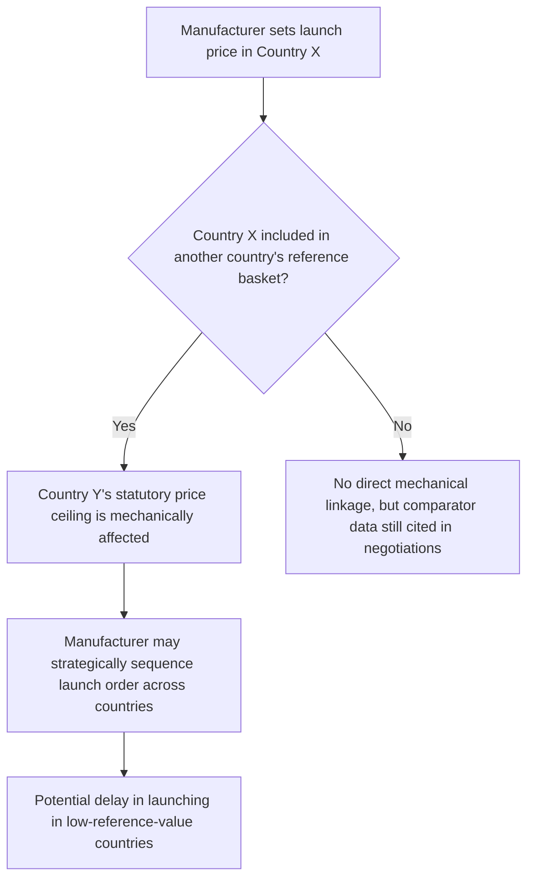

## International Drug Price Comparisons

### Overview

International drug price comparison studies measure how prices for the same or similar pharmaceutical products differ across countries, most prominently contrasting US prices (which rely primarily on manufacturer-set list prices modified by private negotiation) against countries using centralized government price-setting, reference pricing, or health technology assessment (HTA)-linked reimbursement. These comparisons are central to policy debates about US drug pricing reform, "free-rider" arguments regarding global R&D funding, and methodological debates about how to construct valid cross-country price indices for a good with confidential, heterogeneous, and rebate-adjusted transaction prices.

### Key Points

- US list prices for brand-name drugs are consistently found to be higher than in most other high-income countries, though the size of the gap depends heavily on methodology (list vs. net price, drug basket selection, exchange rate/purchasing-power adjustment).
- Most peer countries use some form of centralized negotiation, statutory price regulation, or reference pricing tied to HTA cost-effectiveness thresholds; the US historically has not used a centralized cost-effectiveness threshold to directly cap prices (with the Medicare Drug Price Negotiation Program under the Inflation Reduction Act representing a significant recent partial exception).
- Comparisons are complicated by confidential rebates/discounts (especially acute in the US, per the PBM rebate discussion), meaning list-price comparisons can overstate true relative US net prices, though most studies find the US remains higher even under net-price adjustment.
- Generic and biosimilar prices show a different comparative pattern than brand-name prices, with the US often exhibiting *lower* generic prices than some regulated European markets, reflecting different market dynamics (US generic competition is more price-aggressive; some European systems use administered generic pricing that doesn't fall as steeply).
- The "free-rider"/global R&D funding argument is a genuinely contested empirical and normative claim, not a settled fact, and should be presented as a debate rather than resolved.

### Methodological Challenges in Cross-Country Price Comparison

**1. List price vs. net price**

The single most significant methodological issue: publicly available price data (ex-manufacturer list prices, WAC in the US) does not reflect actual transaction prices after confidential rebates, discounts, and negotiated agreements. This affects the US especially heavily given the prevalence of PBM-negotiated rebates, but confidential managed-entry agreements also exist in many other health systems (though often through different, sometimes more standardized, mechanisms).

$$\text{Reported Gap (list)} \neq \text{True Gap (net)}$$

Studies relying purely on list-price data (which is more readily available across countries) systematically risk overstating the US-to-peer-country price differential, though the direction of this bias (overstatement) is more contested than its existence — i.e., most researchers agree list-price comparisons overstate the gap somewhat, but disagree on by how much, and most net-price-adjusted studies still find a meaningful residual gap favoring lower peer-country prices. [Inference — the precise magnitude of the residual net-price gap after rebate adjustment is an active empirical research question with a range of published estimates rather than one settled number.]

**2. Basket composition and weighting**

Cross-country price index construction requires choosing:

- Which drugs to include (all approved drugs vs. top-selling drugs vs. a fixed representative basket)
- How to weight drugs (US utilization volumes vs. equal weighting vs. comparison-country utilization volumes)
- Whether to include only originator brand products, or blend brand + generic/biosimilar utilization mix (which varies significantly by country's generic substitution policies and market share patterns)

Different reputable studies using different basket/weighting choices have produced different headline price-ratio figures, which is a primary reason "the US pays X times more" claims vary across sources. [Unverified — any specific multiplier figure (e.g., "2.5x" or "3x") should be sourced to a specific named study/report with its stated methodology and publication date, as this is one of the most methodology-sensitive figures in health economics literature and figures from different eras/studies are not interchangeable.]

**3. Purchasing power and currency adjustment**

Raw currency-converted price comparisons can be distorted by exchange rate fluctuations unrelated to underlying purchasing power. Some studies apply purchasing power parity (PPP) adjustments, while others argue nominal exchange-rate comparison is more appropriate for a globally-traded, non-locally-produced good like a branded pharmaceutical (since the relevant comparison is what a national health system actually pays in real currency terms, not adjusted for domestic cost-of-living). This is a genuine methodological choice with reasonable arguments on both sides, not an error to be corrected toward one "right" answer.

### Country-Level Pricing Mechanism Comparison

| Country/System | Primary Pricing Mechanism | Key Feature |
| --- | --- | --- |
| United States | Manufacturer-set list price; private PBM/payer rebate negotiation; Medicare Part D negotiation (select drugs, IRA) | No general statutory price cap historically; most market-based system among peers |
| United Kingdom (NICE) | HTA-based cost-effectiveness threshold (QALY-based, historically cited threshold range around £20,000–£30,000/QALY) | Reimbursement conditioned on demonstrated cost-effectiveness; effectively a price ceiling via the accept/reject decision |
| Germany (AMNOG) | Early benefit assessment (IQWiG/G-BA) followed by price negotiation with statutory health insurance | New drugs launch at manufacturer price for first year, then negotiated based on demonstrated additional benefit |
| France | CEPS (Comité Économique des Produits de Santé) negotiation, informed by HAS clinical benefit rating (ASMR) | Price tied to assessed improvement in medical benefit versus existing treatments |
| Canada (PMPRB) | Statutory price ceiling based on international reference pricing basket | Directly compares proposed price against a defined basket of comparator countries |
| Japan | Government-set pricing with periodic downward price revisions | Prices generally decline over a product's lifecycle via scheduled repricing, distinct from most Western systems |

**International reference pricing (external reference pricing, ERP)**

Many countries (Canada's PMPRB model being a canonical example) explicitly set or cap domestic prices by referencing prices in a defined external basket of comparator countries. This creates an interconnected pricing system: a manufacturer's launch price decision in one country can mechanically affect achievable prices in other countries that reference it, giving manufacturers incentive to consider global reference-pricing effects when sequencing international launches (sometimes delaying launch in lower-price-ceiling countries to avoid depressing the reference basket for higher-value markets).

### US Medicare Drug Price Negotiation Program (Inflation Reduction Act)

A significant recent development altering the US comparative position: the Inflation Reduction Act (IRA) of 2022 established the Medicare Drug Price Negotiation Program, under which CMS negotiates "maximum fair prices" for a specified, expanding list of high-expenditure Medicare Part D (and later Part B) drugs.

- This is a partial, targeted departure from the historical US reliance on unregulated list pricing, applying only to selected drugs meeting eligibility criteria (small-molecule drugs generally eligible starting several years post-approval, biologics with a longer runway) and only within the Medicare program.
- The negotiation process references, among other factors, prices paid in certain other countries as one input, representing a notable convergence toward the international reference pricing logic used elsewhere. [Unverified — specific negotiated price outcomes, the exact list of negotiated drugs by year, and the detailed statutory formula are subject to implementation specifics and legal challenges; verify current negotiated drug lists and prices against current CMS publications rather than treating any given year's list as fixed going forward.]

### The "Free-Rider" / Global R&D Funding Argument — A Contested Debate

**The argument as commonly stated**

A frequently cited position (particularly in US policy debate) holds that higher US drug prices effectively subsidize global pharmaceutical R&D, because:

1. US revenue constitutes a large share of global pharmaceutical company profit
2. R&D investment decisions are made globally by firms weighing total expected returns across all markets
3. If the US reduced prices to levels comparable with reference countries, global aggregate industry revenue would fall, potentially reducing R&D investment

**Points of genuine contention**

- **Empirical uncertainty on R&D elasticity**: how much a given revenue reduction would actually translate into reduced R&D investment (versus reduced profit margins, reduced marketing/sales spending, or share buybacks) is empirically disputed and estimates vary substantially across studies.
- **Counterargument on innovation allocation**: some economists argue that even if aggregate R&D fell somewhat, the composition of R&D investment (e.g., toward incrementally differentiated products with strong commercial potential versus higher-social-value but lower-commercial-return innovation) is a separate and arguably more important question than aggregate spending level.
- **Counterargument on domestic access trade-offs**: critics note the argument, even if partially true, does not by itself resolve whether the domestic access and affordability costs of high US prices are justified by the diffuse, global, uncertain-magnitude R&D benefit — this is fundamentally a normative weighing question, not a purely empirical one.
- **Alternative funding mechanism arguments**: some propose that R&D could be funded through other means (direct public funding, prizes, delinked models) that don't require presenting the R&D-funding burden asymmetrically across countries via price differentials.

[This entire subsection describes a debate with credible economists and empirical evidence on multiple sides; it should not be read as Claude endorsing any single position, and any quantitative claim about R&D funding share or price elasticity cited elsewhere should be sourced and dated rather than treated as consensus.]

### Illustrative Comparative Example (Stylized)

| Country | Illustrative Relative List Price Index (US = 100) | Pricing Mechanism Context |
| --- | --- | --- |
| United States | 100 | Reference point; list price, pre-rebate |
| Germany | ~50–60 | AMNOG negotiated price post-benefit assessment |
| United Kingdom | ~40–50 | NICE-linked pricing |
| Canada | ~40–50 | PMPRB reference-basket ceiling |

[Speculation/Unverified] These illustrative index figures are stylized approximations reflecting the general direction and rough order-of-magnitude found across multiple published international comparison studies; they are not drawn from a single specific named study and should not be cited as precise or current data. For any actual analysis, consult a specific dated source (e.g., RAND Corporation international price comparison reports, or peer-reviewed health economics journal studies) for the specific drug basket and year in question.

### Conclusion

International drug price comparisons reliably show the US paying more than most peer high-income countries for branded pharmaceuticals, though the precise magnitude of that gap is highly sensitive to methodological choices around list-vs-net pricing, drug basket selection, and currency adjustment — meaning single headline multiplier statistics should always be read alongside their source study's methodology. Peer countries achieve lower prices predominantly through centralized HTA-linked negotiation or statutory reference pricing, mechanisms the US has historically avoided in favor of decentralized private negotiation, with the IRA's Medicare negotiation program representing a significant but partial and targeted departure from that historical pattern. The downstream normative question — whether the observed price gap represents inefficient rent extraction, a justified premium for market-based innovation incentives, or some mix — remains a genuinely contested area of health economics and policy debate.

**Related Topics**

- Health Technology Assessment (HTA) methodology and QALY-based cost-effectiveness thresholds
- Medicare Drug Price Negotiation Program (IRA) implementation and legal challenges
- External reference pricing (ERP) basket design and strategic launch sequencing
- RAND Corporation and other international drug price comparison study methodologies
- Value-based pricing frameworks (ICER cost-effectiveness analysis in the US context)
- Pharmaceutical company global launch sequencing strategy
- Parallel trade/parallel importation within the EU single market
- Generic and biosimilar comparative international pricing patterns