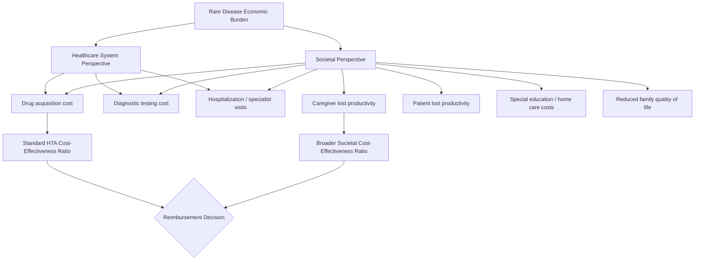

## Orphan Drugs and Rare Disease Economics

### Definition and Regulatory Framework

Orphan drugs are pharmaceutical products developed specifically to treat rare diseases, defined in most jurisdictions by a population prevalence threshold rather than by disease mechanism. The regulatory definitions vary by jurisdiction but share a common structural logic: below a certain patient count, standard commercial development incentives fail, so governments intervene with special designations.

- **United States**: Orphan Drug Act (1983) defines a rare disease as affecting fewer than 200,000 persons in the U.S., or affecting more than 200,000 but with no reasonable expectation of recovering development costs from U.S. sales
- **European Union**: Regulation (EC) No 141/2000 defines prevalence as no more than 5 in 10,000 persons in the EU
- **Japan**: Threshold set at fewer than 50,000 patients nationally (approximately 4 in 10,000)

These thresholds matter economically because they trigger a bundle of incentives designed to correct a specific market failure: fixed development costs (clinical trials, regulatory approval, manufacturing setup) are largely independent of population size, so the average cost per treated patient rises as the addressable population shrinks, eventually breaching typical return-on-investment thresholds.

### Root Economic Problem

Standard pharmaceutical economics depends on amortizing high fixed R&D costs across a large patient volume at moderate per-unit prices. Orphan drug economics inverts this relationship.

$$P = \frac{FC + VC \times Q}{Q} + M$$

Where $P$ is price per patient, $FC$ is fixed development cost, $VC$ is variable cost per patient, $Q$ is the treated population, and $M$ is margin. As $Q$ shrinks toward the thousands or hundreds of patients, $FC/Q$ dominates the equation, forcing extremely high per-patient prices to reach commercial viability — this is the mathematical origin of headline prices exceeding $300,000–$3,000,000 per patient-year for some ultra-rare gene therapies.

This is not a pricing anomaly; it is the direct consequence of fixed-cost recovery over a small denominator, and it is the central tension that all rare disease policy instruments attempt to manage.

### Market Failure Rationale for Intervention

Absent intervention, rational profit-maximizing firms underinvest in rare disease R&D relative to the social value of treatments, because:

- **Cost non-recoupment**: expected revenue from a small population frequently fails to clear the cost of capital for a 10–15 year development cycle
- **High per-program risk**: small trial populations produce statistically weaker efficacy signals, raising regulatory and reimbursement risk
- **Diagnostic uncertainty**: many rare diseases are underdiagnosed or misdiagnosed, further shrinking the addressable, identifiable population at launch
- **Fragmented natural history data**: absence of standardized disease progression data complicates trial design and endpoint selection

This is a textbook public-goods-adjacent market failure: the social value of treating rare diseases (equity, innovation spillovers, diagnostic infrastructure) exceeds the private value captured by a firm operating under standard market pricing, justifying subsidy-like interventions.

### Policy Incentive Instruments

**United States (Orphan Drug Act)**

- 7-year market exclusivity from approval date, independent of patent status
- 25% tax credit for qualified clinical trial expenses (reduced from 50% under the Tax Cuts and Jobs Act of 2017)
- Waiver of Prescription Drug User Fee Act (PDUFA) filing fees
- Eligibility for FDA grants funding natural history studies and trial design assistance

**European Union**

- 10 years of market exclusivity (extendable to 12 years if a Pediatric Investigation Plan is completed)
- Protocol assistance (scientific advice) from the European Medicines Agency at reduced or waived fees
- Fee reductions for marketing authorization applications
- Direct access to the centralized authorization procedure

**Other mechanisms across jurisdictions**

- Accelerated/conditional approval pathways using surrogate endpoints
- Priority review vouchers (U.S.) — a transferable voucher granting priority FDA review on a future, unrelated product, which has developed its own secondary market (historically trading between $70 million and $350 million)
- Extended data/market exclusivity stacking with standard patent protection

### Small Population Trial Design Economics

Rare disease trials cannot rely on the standard randomized controlled trial (RCT) paradigm calibrated for populations in the thousands, because statistical power calculations become infeasible or ethically fraught when the entire global patient pool may number in the hundreds.

**Adapted trial designs and their cost implications:**

- **Single-arm trials with external/historical controls**: eliminates the need for a placebo arm, reducing enrollment burden but increasing regulatory and reimbursement scrutiny over causal attribution
- **Crossover designs**: every patient serves as their own control, maximizing statistical information extraction per enrolled patient (high value when patients are the scarce resource)
- **Bayesian adaptive designs**: incorporate prior information and update continuously, reducing the number of patients needed to reach a decision threshold
- **N-of-1 trials**: repeated-measures designs within a single patient, appropriate for extremely ultra-rare (n<50 globally) conditions
- **Master protocols / basket trials**: pool patients with different diseases sharing a common molecular target, spreading fixed trial infrastructure costs across multiple indications simultaneously

**Economic consequence**: these designs reduce direct trial costs and shorten timelines, but they systematically produce thinner evidence packages, which shifts risk downstream to payers and health technology assessment (HTA) bodies, who must make coverage decisions under higher clinical uncertainty than for conventional drugs.

### Pricing and Reimbursement Mechanics

**Value-based pricing tension**

Standard cost-effectiveness thresholds (e.g., $50,000–$150,000 per quality-adjusted life year (QALY) in the U.S. context, or £20,000–£30,000/QALY under the U.K.'s National Institute for Health and Care Excellence, NICE) are frequently breached by orphan drugs by an order of magnitude or more. This has led most HTA systems to adopt **differentiated evaluation frameworks** for ultra-rare conditions rather than applying a single uniform threshold.

- **NICE Highly Specialised Technologies (HST) programme** (UK): applies a higher implicit threshold (up to £300,000/QALY in some evaluations) specifically for ultra-rare disease technologies, recognizing that a strict $/QALY cutoff would categorically exclude nearly all orphan drugs from reimbursement
- **Modifiers for severity and unmet need**: many HTA bodies apply QALY weighting multipliers when a condition is severe, pediatric-onset, or has no existing treatment alternative
- **Managed entry agreements (MEAs)**: conditional reimbursement contracts that de-risk payer exposure, discussed below

**Managed entry / risk-sharing agreement types**

| Agreement Type | Mechanism | Risk Allocation |
| --- | --- | --- |
| Outcomes-based / pay-for-performance | Payment tied to measured clinical response | Manufacturer bears clinical uncertainty risk |
| Coverage with evidence development (CED) | Conditional coverage while real-world data is collected | Shared: payer accepts interim uncertainty |
| Annuity / installment payments | Cost spread over multiple years instead of one lump sum | Payer bears reduced short-term budget shock |
| Price-volume agreements | Price adjusts as utilization volume changes | Manufacturer bears volume forecasting risk |
| Confidential discounts / rebates | List price high, net price lower via rebate | Enables public "reference price" stability while allowing negotiated flexibility |

These instruments exist because orphan drug economics generates two distinct, difficult-to-reconcile uncertainties: **clinical uncertainty** (does it really work as well as the small trial suggested?) and **budget uncertainty** (can a payer absorb a multi-million-dollar single treatment without destabilizing the broader risk pool?). Annuity and outcomes-based models target these two uncertainties separately.

### Gene Therapy and One-Time Curative Treatment Economics

Gene and cell therapies for rare diseases introduce a distinct economic category: treatments intended to be administered once, with effects (ideally) persisting for a patient's lifetime. This breaks the standard chronic-therapy revenue model (recurring smaller payments over years) and replaces it with a single, very large payment.

$$NPV_{treatment} = \sum_{t=0}^{T} \frac{B_t - C_t}{(1+r)^t}$$

For a curative one-time therapy, essentially all cost $C_t$ is concentrated at $t=0$, while benefit $B_t$ (health gains, avoided chronic treatment costs) accrues over the patient's remaining lifetime $T$. This temporal mismatch between when cost is incurred and when value is realized is precisely what motivates annuity-style and outcomes-based payment structures — they attempt to re-synchronize payer cash outflows with the ongoing realization of clinical benefit.

**[Inference]** Durability of effect for many recently approved gene therapies remains only partially characterized at the population level, since long-term follow-up data (10+ years) is still accumulating for most approved products; pricing models based on assumed lifetime durability carry residual uncertainty that manifests as financial risk for both manufacturers and payers if efficacy attenuates earlier than modeled.

### Diagnostic Odyssey and Indirect Economic Burden

Rare disease economics extends beyond drug pricing to encompass the substantial pre-treatment economic burden borne by patients and health systems.

- **Diagnostic odyssey**: the average time to accurate diagnosis for rare diseases has historically spanned several years and multiple specialist consultations, generating substantial direct costs (repeated testing, misdirected treatments) and indirect costs (caregiver lost productivity, delayed intervention leading to irreversible disease progression)
- **Newborn screening programs**: represent a preventive economic investment — expanding screening panels increases upfront public health spending but can reduce lifetime costs by enabling presymptomatic treatment, which is often clinically and economically more effective than post-symptomatic intervention
- **Caregiver and family economic burden**: often excluded from standard cost-effectiveness analyses (which typically adopt a healthcare-system perspective), even though these represent a substantial share of the true societal cost of rare disease

**Societal perspective vs. healthcare payer perspective in cost-effectiveness analysis:**

Choice of analytic perspective materially changes the calculated cost-effectiveness ratio for a given therapy — a healthcare-system-only perspective tends to make orphan drugs look economically worse, since it excludes the substantial non-medical costs that treatment averts.

### Market Dynamics and Strategic Behavior

**"Salami slicing" / indication narrowing**

**[Inference]** Some critics argue that regulatory incentives structured around population thresholds create an incentive for manufacturers to seek orphan designation for narrowly defined disease subtypes, or to segment a broader disease population into smaller molecularly-defined subgroups, in order to qualify for orphan-status incentives even where an underlying condition might otherwise not meet rarity thresholds if considered as a whole. This remains a debated and jurisdiction-specific characterization rather than a settled, universally quantified phenomenon.

**Orphan drug repositioning and pricing spillover**

- Approval of an orphan indication can enable off-label or subsequent on-label expansion into larger, non-rare populations, at which point exclusivity and pricing dynamics originally justified by small-population economics may persist into a materially larger commercial market
- This has motivated policy debate (particularly in the EU orphan regulation review process) around exclusivity claw-back or tiered exclusivity tied to eventual population size at commercialization

**Portfolio-level cross-subsidization**

Large pharmaceutical firms with diversified portfolios can average orphan drug program risk against blockbuster non-rare disease revenue, whereas smaller biotech firms specializing exclusively in rare disease therapeutics face concentrated risk exposure — this partly explains the prevalence of licensing deals, acquisitions, and partnership structures where a small biotech develops a rare disease asset through early trials and licenses commercialization rights to a larger firm with reimbursement and market access infrastructure.

### Comparative International Reimbursement Approaches

| Country/System | Orphan-Specific Threshold Adjustment | Key Mechanism |
| --- | --- | --- |
| United States | No formal national QALY threshold; payer-specific negotiation | Market-based pricing, PBM formulary negotiation, Medicaid best-price rules |
| United Kingdom | NICE Highly Specialised Technologies programme | Higher implicit £/QALY ceiling, budget impact test |
| Germany | AMNOG early benefit assessment | Added-benefit dossier negotiation, no rigid QALY threshold |
| France | Haute Autorité de Santé (HAS) rating system | Improvement rating (ASMR) drives price negotiation, not QALY cutoff |
| Canada | CADTH / pCPA joint negotiation | Formal review with rare disease-specific evidentiary flexibility |
| Australia | Life Saving Drugs Program (LSDP) | Separate funding pool outside standard Pharmaceutical Benefits Scheme cost-effectiveness gate |

**[Unverified]** Precise current QALY thresholds and programmatic details for HTA bodies are subject to periodic revision; figures cited here reflect commonly documented ranges and should be confirmed against current agency guidance for time-sensitive policy or valuation work.

### Health Technology Assessment Challenges Specific to Rare Disease

- **Surrogate endpoint reliance**: many orphan approvals rely on biomarker or surrogate endpoints (e.g., enzyme levels, biomarker reduction) rather than hard clinical outcomes, since observing hard outcomes (mortality, major morbidity events) may require follow-up durations exceeding feasible trial timelines for rapidly progressive but low-prevalence diseases
- **Natural history data gaps**: absent a well-characterized untreated disease trajectory, establishing counterfactual outcomes for cost-effectiveness modeling requires synthesizing patient registries, retrospective chart review, and expert elicitation — each carrying distinct methodological uncertainty
- **Extrapolation risk**: modeling lifetime cost-effectiveness for a curative gene therapy based on a 2–5 year trial follow-up requires extrapolating decades of assumed benefit duration, which materially amplifies the sensitivity of the cost-effectiveness ratio to modeling assumptions

### Worked Numerical Illustration

Consider a hypothetical ultra-rare enzyme deficiency disorder with a global diagnosed population of 500 patients, fixed development cost of $800 million, and per-patient manufacturing/administration cost of $50,000.

$$P_{\text{breakeven}} = \frac{\$800{,}000{,}000}{500} + \$50{,}000 = \$1{,}650{,}000 \text{ per patient}$$

This illustrates why headline orphan drug prices in the six- to seven-figure range are structurally determined by the fixed-cost/population ratio rather than being arbitrary; a payer or policymaker evaluating "fair" pricing must engage with this underlying cost structure rather than comparing the price to conventional per-patient drug costs in high-prevalence disease categories.

If, post-launch, improved diagnostic screening doubles the identified population to 1,000 patients (holding fixed cost constant, since it was already sunk), the same fixed-cost recovery logic implies substantial room for price reduction over time — a dynamic increasingly incorporated into price-volume managed entry agreements.

### Key Points

- Orphan drug economics is fundamentally a fixed-cost-amortization problem: shrinking population size mechanically drives per-patient price upward, holding total development cost constant
- Regulatory incentive frameworks (exclusivity extensions, tax credits, fee waivers, priority review vouchers) exist specifically to correct the market failure created by this cost structure
- Standard cost-effectiveness thresholds are widely regarded as inapplicable to ultra-rare disease evaluation, prompting differentiated HTA frameworks (e.g., NICE HST) and severity/unmet-need modifiers
- Managed entry agreements (outcomes-based, annuity, price-volume) exist to separately address clinical uncertainty and budget uncertainty, which are distinct risk categories requiring different contractual solutions
- One-time gene/cell therapies introduce a temporal mismatch between concentrated upfront cost and long-duration benefit realization, motivating novel payment structures beyond standard drug reimbursement
- Societal-perspective cost-effectiveness analysis (including caregiver burden, productivity loss) generally yields more favorable value assessments for rare disease treatments than narrow healthcare-system perspectives

### Related Topics

- Health technology assessment (HTA) methodology and QALY-based cost-effectiveness analysis
- Gene therapy and cell therapy commercialization models
- Pharmaceutical patent law and market exclusivity mechanisms
- Value-based and outcomes-based pricing agreements in pharmaceutical markets
- Priority review voucher secondary markets
- Newborn screening program economics and preventive health investment
- Biotech venture financing and licensing deal structures
- Pharmacoeconomic modeling and Markov cohort simulation
- Real-world evidence and patient registry data infrastructure
- Health equity considerations in rare disease resource allocation