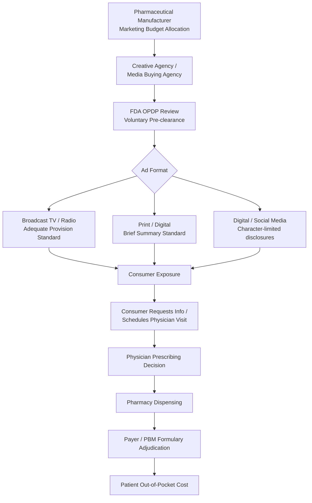

## Direct-to-Consumer Pharmaceutical Advertising

### Definition and Scope

Direct-to-consumer (DTC) pharmaceutical advertising refers to promotional communications from pharmaceutical manufacturers aimed directly at patients/consumers rather than exclusively at prescribing physicians. It encompasses television and radio commercials, print advertisements, digital and social media campaigns, and branded websites for prescription drugs. DTC advertising is distinct from disease-awareness campaigns (which discuss a condition without naming a specific product) and from direct-to-physician (DTP) detailing, which remains the dominant promotional channel in most healthcare systems.

The United States and New Zealand are the only two countries that permit broadcast DTC advertising of prescription drugs; most other jurisdictions, including the European Union, Canada (with some exceptions), and most of Asia, prohibit or heavily restrict it. This regulatory divergence makes DTC advertising a distinctive feature of U.S. pharmaceutical economics.

### Historical and Regulatory Background

**Key Points**

- The U.S. Food and Drug Administration (FDA) has regulated prescription drug promotion since the 1960s, but early rules made broadcast DTC advertising impractical due to disclosure requirements.
- In 1997, the FDA issued draft guidance relaxing the "brief summary" requirement for broadcast ads, permitting the "adequate provision" standard instead (directing consumers to a toll-free number, website, print ad, or pharmacist for full risk information). This 1997 guidance is widely credited with triggering the modern DTC advertising boom.
- The FDA finalized this guidance in 1999.
- DTC spending rose from roughly $220 million in 1997 to over $6 billion by the mid-2010s, and has continued to grow with digital channel expansion.
- The Prescription Drug User Fee Act (PDUFA) and subsequent reauthorizations fund FDA's Office of Prescription Drug Promotion (OPDP), which reviews DTC materials, though pre-clearance is voluntary except for accelerated-approval drugs and REMS-restricted products.

DTC advertising in the U.S. is governed primarily by:

- **Federal Food, Drug, and Cosmetic Act (FD&C Act)**, Section 502(n), requiring "fair balance" between benefit and risk information.
- **FDA regulations (21 CFR 202.1)**, specifying that ads cannot be false or misleading and must present a "true statement" of risks.
- **PhRMA Guiding Principles**, a voluntary industry code (last updated 2018) that member companies commit to, including a requirement to submit new DTC ads to FDA for review before release and to include information encouraging consultation with healthcare providers.

### Economic Rationale and Theoretical Frameworks

**Key Points**

DTC advertising economics center on how it affects the standard principal-agent problem in prescribing: physicians act as agents for patients (principals) who lack full information about treatment options. Two competing economic theories describe DTC's role:

1. **Informative advertising model**: DTC advertising reduces search costs and informs patients about the existence of treatments for conditions they may not know are treatable (e.g., depression, erectile dysfunction, restless leg syndrome). Under this model, DTC advertising expands the pool of patients seeking diagnosis and treatment, correcting under-treatment of certain conditions.
2. **Persuasive/oligopolistic advertising model**: DTC advertising for branded drugs functions primarily to shift market share between therapeutically similar substitutes (brand-switching) rather than to inform, since most advertised conditions are already well-known (e.g., allergies, arthritis). Under this model, DTC advertising raises demand elasticity toward the advertised brand and can support price increases by reducing consumers' price sensitivity through non-price differentiation.

In practice, most health economics literature finds DTC advertising does both: it appears to raise total category utilization (informative effect) for underdiagnosed conditions while also producing brand-share effects (persuasive effect) in categories with multiple similar therapies. This dual effect is formalized in models where advertising enters the demand function as $Q_i = f(P_i, P_j, A_i, A_j, X)$, where $A_i$ and $A_j$ represent own- and cross-brand advertising expenditures, and empirical estimates typically find own-advertising elasticity positive and cross-advertising elasticity negative but small.

### Market Effects

**Key Points**

- **Physician visits**: Studies (e.g., analyses using the National Ambulatory Medical Care Survey) generally find DTC-advertised conditions are associated with increased office visits and new diagnoses, particularly for conditions with high rates of underdiagnosis.
- **Prescription volume**: Research, including studies published by the RAND Corporation and in *Health Affairs*, has found DTC advertising is associated with modest increases in category-level prescription volume, with elasticity estimates commonly in the range of 0.10–0.30 (a 10% increase in DTC spending associated with roughly 1–3% increase in prescriptions), though estimates vary substantially by drug class and study methodology. [Inference: exact elasticity depends heavily on model specification and time period studied, and should be treated as an approximate literature range rather than a fixed parameter.]
- **Drug switching within a class**: DTC advertising for a specific branded drug tends to increase the probability that a patient requests, and a physician prescribes, that specific brand over therapeutic alternatives, an effect documented in "ask your doctor" campaign studies.
- **Price effects**: Because DTC-advertised categories often see increased branded utilization prior to patent expiration, some economists argue DTC advertising delays the substitution toward lower-cost generics or slows uptake of therapeutically equivalent lower-cost alternatives, contributing to higher aggregate drug spending. [Inference: this causal channel is plausible and supported by some studies but is contested; other studies find no significant effect of DTC advertising on generic substitution rates.]
- **Spending concentration**: DTC spending is highly concentrated in a small number of therapeutic categories — historically dermatology, diabetes, autoimmune/biologics, oncology, and CNS/psychiatric conditions have accounted for a disproportionate share of DTC budgets, correlating with high list prices and long treatment durations that justify large marketing investments.

### The DTC Advertising Value Chain

### Regulatory Content Requirements

Under 21 CFR 202.1 and FDA guidance, DTC ads must include:

- **Product claim ads** (name drug + indication + claims): require "fair balance" of risk and benefit information, either as a "brief summary" (print — often reproducing the full FDA-approved label information in small print) or "adequate provision" (broadcast — major statement of risks plus a mechanism to access full information, such as a website, 1-800 number, print ad, or pharmacist referral).
- **Reminder ads**: name the drug without stating indication or making claims; carry minimal risk disclosure requirements (though FDA revoked reminder-ad exemptions for drugs with boxed warnings in some contexts).
- **Help-seeking / disease-awareness ads**: discuss a condition and encourage consulting a doctor without naming a specific drug; not subject to the same risk-disclosure rules since no product claim is made.
- All ads must not be false or misleading and must not omit material facts, per Section 502(n) of the FD&C Act.

**Example**

A televised product-claim ad for an oral anticoagulant might state the drug's name and indication ("reduces risk of stroke in patients with atrial fibrillation"), followed by a "major statement" listing serious risks (e.g., bleeding risk), and close with a directive such as "visit [website] for full prescribing information," satisfying the adequate-provision standard.

### Cost Structure and Spending Patterns

**Key Points**

- DTC advertising is a component of a manufacturer's total Selling, General & Administrative (SG&A) marketing spend, which for many branded pharmaceutical products exceeds R&D spending as a share of revenue in absolute dollar terms industry-wide, though this varies significantly by company. [Unverified: precise company-level ratios vary and are frequently disputed in the literature; industry-wide comparisons depend on which cost categories are included.]
- Total measured U.S. DTC spending has been estimated at approximately $6–7 billion annually in recent years by market-research firms such as Kantar and MediaRadar, though methodologies and figures vary by source and year, so figures should be treated as approximate.
- Digital and social media DTC spend has grown as a share of total DTC budgets, though television remains a major channel due to its reach among older, higher-utilization demographics.
- Marginal cost economics favor DTC advertising for **blockbuster drugs** — those with large addressable patient populations and long expected patent life — since fixed advertising production costs and media buys are amortized over larger prescription volumes; niche/orphan drugs rarely use broadcast DTC due to unfavorable unit economics.

### Criticisms and Welfare Concerns

**Key Points**

- **Information asymmetry concerns**: Critics (including many in the American Medical Association, which has called for a moratorium on DTC ads for new drugs) argue DTC ads oversimplify complex risk-benefit tradeoffs and can pressure physicians into prescribing decisions misaligned with clinical guidelines ("prescribing under patient pressure").
- **Induced demand and moral hazard**: Because most U.S. patients are insured, DTC-induced demand may not reflect a patient's willingness to pay the full cost of a drug, potentially inflating utilization beyond the socially efficient level — a classic third-party-payer moral hazard concern layered onto advertising-induced demand.
- **Newly approved drug risk**: A common criticism is that DTC campaigns for drugs in their first years post-approval (before full post-market safety data accumulate) can amplify exposure to drugs with less-established safety profiles; several high-profile market withdrawals (e.g., rofecoxib/Vioxx in 2004) occurred for heavily DTC-advertised drugs, fueling calls for a moratorium period.
- **Health equity concerns**: Some research suggests DTC advertising may disproportionately reach populations with better healthcare access, potentially widening disparities if induced demand is not evenly translatable into treatment across socioeconomic groups. [Inference: equity effects are an active and mixed area of research rather than a settled finding.]

### International Comparison

| Jurisdiction | DTC Broadcast Advertising Status | Notes |
| --- | --- | --- |
| United States | Permitted | Subject to FDA fair-balance rules; voluntary pre-clearance |
| New Zealand | Permitted | One of only two countries allowing broadcast DTC |
| European Union | Prohibited (prescription drugs) | Disease-awareness/help-seeking ads permitted; OTC advertising permitted |
| Canada | Largely prohibited | "Reminder ads" and help-seeking ads permitted under Health Canada rules |
| Japan, most of Asia | Prohibited | Physician-directed promotion only for prescription drugs |

### Empirical Research Methods

**Key Points**

Health economists studying DTC advertising typically face an identification challenge: advertising spend is not randomly assigned, and manufacturers may increase spending in markets or periods where demand is already rising (reverse causality/endogeneity). Common methodological approaches include:

- **Panel data with fixed effects**: Using cross-market or cross-time variation in advertising exposure (e.g., differing media market ad rates or "spillover" markets that receive ad exposure without matching population, historically used in DTC studies exploiting Canada-U.S. border media spillover) to isolate advertising's causal effect.
- **Instrumental variables (IV)**: Using variables correlated with advertising spend but not directly with demand (e.g., relative advertising costs across media markets) as instruments.
- **Natural experiments**: Studying policy changes such as the 1997 FDA guidance change as a quasi-experimental shock to DTC intensity.
- Behavior in these models may vary considerably depending on drug class, time period, and market structure, so findings from one therapeutic category should not be assumed to generalize to others.

### Illustrative Simplified Demand Model

A simplified advertising-augmented demand equation for a branded drug might be expressed as:

$$Q_i = \alpha + \beta_1 \ln(A_i) + \beta_2 \ln(A_j) + \beta_3 P_i + \beta_4 P_j + \beta_5 X + \varepsilon$$

Where $Q_i$ is quantity demanded of brand $i$, $A_i$ and $A_j$ are own- and rival-brand advertising expenditures, $P_i$ and $P_j$ are own- and rival-brand prices, and $X$ is a vector of demographic/epidemiological controls. Empirical work generally finds $\beta_1 > 0$ (own-advertising raises demand) and $\beta_2$ close to zero or mildly negative (limited business-stealing from rivals' ads), consistent with DTC advertising expanding category demand more than it reallocates share — though this pattern is not universal across drug classes.

### Related Topics

- Physician detailing and promotional spending (DTP) economics
- FDA Office of Prescription Drug Promotion (OPDP) enforcement actions and warning letters
- Pharmaceutical pricing and list-price-to-net-price dynamics
- Patient assistance programs and copay accumulator/maximizer programs
- Biologics and specialty drug marketing economics
- Behavioral economics of health decision-making and advertising-induced demand
- Comparative effectiveness research and its interaction with promotional claims
- Pharmaceutical patent cliffs and generic substitution economics
- Health insurance moral hazard and third-party payer demand effects
- Regulatory comparison: EU pharmacovigilance and promotion rules vs. U.S. FDA framework