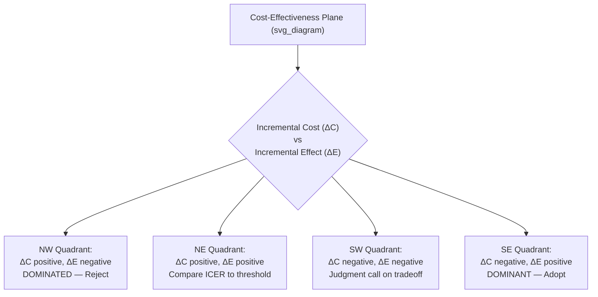

## Cost-Effectiveness Analysis Fundamentals

### Definition and Purpose

Cost-effectiveness analysis (CEA) is a form of economic evaluation that compares the relative costs and health outcomes of two or more courses of action to determine which delivers the greatest health benefit per unit of resource expended. Within health technology assessment (HTA), CEA is the dominant analytic framework used by bodies such as the UK's National Institute for Health and Care Excellence (NICE), Canada's CADTH, and Australia's Pharmaceutical Benefits Advisory Committee (PBAC) to inform reimbursement and coverage decisions. Unlike cost-benefit analysis, which values outcomes in monetary terms, CEA expresses outcomes in natural or health-related units (e.g., life-years gained, cases detected, quality-adjusted life-years), permitting comparison of interventions without requiring a monetary valuation of health itself.

### Core Components

**Key Points**

Every CEA requires four defining elements:

1. **Comparator(s)**: The alternative intervention(s) against which the new intervention is evaluated — often "usual care," a placebo, or the current standard of treatment. Comparator selection critically shapes results; comparing against an inappropriate or outdated comparator is a common source of bias.
2. **Perspective**: The viewpoint from which costs and outcomes are counted — commonly the healthcare payer perspective (direct medical costs only), the healthcare sector perspective, or the societal perspective (including indirect costs such as productivity loss and patient time costs). Perspective determines which cost categories are included and can materially change the incremental cost-effectiveness ratio (ICER).
3. **Time horizon**: The period over which costs and outcomes are measured, which should be long enough to capture all relevant differences between interventions — often a patient's lifetime for chronic diseases, but shorter for acute conditions.
4. **Discount rate**: The rate applied to future costs and outcomes to convert them to present value, reflecting time preference. Common conventions include 3% (used by the U.S. Panel on Cost-Effectiveness in Health and Medicine) and 3.5% (used by NICE), applied to both costs and outcomes, though some jurisdictions apply differential rates to costs versus health outcomes.

### The Incremental Cost-Effectiveness Ratio (ICER)

**Key Points**

The ICER is the central output of CEA, representing the additional cost required to produce one additional unit of health outcome when comparing a new intervention to a comparator:

$$ICER = \frac{C_{new} - C_{comparator}}{E_{new} - E_{comparator}} = \frac{\Delta C}{\Delta E}$$

Where $C$ represents total cost and $E$ represents the health effectiveness measure (e.g., QALYs, life-years gained). The ICER is interpreted as "cost per unit of additional health benefit" — for example, "$50,000 per QALY gained."

**Example**

If a new drug costs $80,000 over a patient's treatment course versus $50,000 for standard care ($\Delta C = \$30{,}000$), and produces 1.2 QALYs versus 1.0 QALYs for standard care ($\Delta E = 0.2$), the ICER is:

$$ICER = \frac{30{,}000}{0.2} = \$150{,}000 \text{ per QALY gained}$$

### Measuring Health Outcomes

**Key Points**

CEA can use several outcome metrics depending on the analytic question and data availability:

- **Natural units**: Disease-specific clinical outcomes such as cases of disease averted, life-years gained, mmHg reduction in blood pressure, or strokes prevented. Useful for narrow comparisons within a single disease area but not comparable across different conditions.
- **Quality-adjusted life-years (QALYs)**: A generic health outcome measure combining length of life and health-related quality of life (utility) into a single index, where 1.0 represents a year in perfect health and 0 represents death. QALYs are calculated as:

$$QALY = \sum_{t} U_t \times L_t$$

Where $U_t$ is the utility weight (typically 0 to 1, though negative values representing health states "worse than death" are permitted in some instruments) at time $t$, and $L_t$ is the duration (in years) spent in that health state.

- **Disability-adjusted life-years (DALYs)**: Used more commonly in global health and by the World Health Organization, DALYs measure the burden of disease as years of life lost to premature mortality plus years lived with disability, and are the outcome metric underpinning "cost per DALY averted" analyses common in low- and middle-income country HTA.
- When outcomes are measured in QALYs specifically, the analysis is often termed **cost-utility analysis (CUA)**, a specific subtype of CEA that health economists distinguish terminologically, though many HTA agencies and much of the literature use "CEA" as an umbrella term that includes CUA.

### Deriving Utility Weights

**Key Points**

Utility weights for QALY calculations are typically derived from one of several standard elicitation methods:

- **Standard gamble**: Respondents choose between a certain health state and a gamble with probability $p$ of perfect health and $(1-p)$ of death; the indifference point yields the utility value.
- **Time trade-off (TTO)**: Respondents indicate how many years of life in a given health state they would trade for fewer years in perfect health; widely used because it is more intuitive for respondents than standard gamble.
- **Preference-based multi-attribute instruments**: Standardized questionnaires such as the EQ-5D (5 dimensions: mobility, self-care, usual activities, pain/discomfort, anxiety/depression), SF-6D, and HUI3, mapped to population-derived value sets (often generated via TTO or discrete choice experiments in a representative sample) to convert questionnaire responses into a single utility index. The EQ-5D is the most widely required instrument by HTA agencies including NICE.

### Types of Economic Evaluation (Comparative Framework)

| Evaluation Type | Cost Measurement | Outcome Measurement | Typical Use Case |
| --- | --- | --- | --- |
| Cost-minimization analysis (CMA) | Monetary | Assumed equivalent between options | Comparing generics/biosimilars to originator |
| Cost-effectiveness analysis (CEA) | Monetary | Natural/clinical units | Comparing treatments within one disease area |
| Cost-utility analysis (CUA) | Monetary | QALYs | Cross-disease comparability for HTA/reimbursement |
| Cost-benefit analysis (CBA) | Monetary | Monetary (health outcomes monetized) | Comparing health investments to non-health investments |
| Cost-consequence analysis (CCA) | Monetary | Disaggregated list of multiple outcomes | When a single summary ratio is inappropriate or contested |

### Decision Rules and the Cost-Effectiveness Plane

**Key Points**

Results of a CEA are often plotted on the **cost-effectiveness plane**, with incremental effectiveness ($\Delta E$) on the horizontal axis and incremental cost ($\Delta C$) on the vertical axis, dividing outcomes into four quadrants:

- **Northeast quadrant** ($\Delta C > 0$, $\Delta E > 0$): New intervention is more costly and more effective — requires an ICER threshold comparison.
- **Southeast quadrant** ($\Delta C < 0$, $\Delta E > 0$): New intervention is less costly and more effective — "dominant," should generally be adopted.
- **Northwest quadrant** ($\Delta C > 0$, $\Delta E < 0$): New intervention is more costly and less effective — "dominated," should generally be rejected.
- **Southwest quadrant** ($\Delta C < 0$, $\Delta E < 0$): New intervention is less costly and less effective — requires judgment on whether cost savings justify the health loss.

For interventions falling in the northeast quadrant, the decision typically hinges on comparing the calculated ICER to a **cost-effectiveness threshold** (denoted $\lambda$), representing the maximum amount a payer is willing to pay per unit of health gain. If $ICER < \lambda$, the intervention is considered cost-effective. Commonly cited (though contested) threshold conventions include NICE's approximate range of £20,000–£30,000 per QALY and the historical (and now widely criticized as outdated) U.S. benchmark of $50,000 per QALY, alongside more recent U.S. value-based benchmarks around $100,000–$150,000 per QALY used by organizations such as the Institute for Clinical and Economic Review (ICER — the organization, not to be confused with the ratio). [Unverified: exact threshold values are periodically revised by HTA bodies and vary by jurisdiction, disease severity weighting, and policy context; figures cited here should be treated as illustrative rather than current authoritative values, and should be checked against the relevant agency's current guidance.]

### Extended Dominance

**Key Points**

When comparing more than two mutually exclusive options ranked by increasing cost, an option is subject to **extended dominance** (or "weak dominance") if it is more costly and less effective than a linear combination of two other options, even though it is not dominated by any single alternative. Such options are removed before calculating ICERs for the remaining efficient frontier, since a combination of the two bracketing strategies could theoretically achieve a better outcome for the same or lower cost. [Inference: this convention assumes divisibility/mixed strategies which is a standard analytic simplification rather than a literal implementation option in most clinical contexts.]

### Sensitivity Analysis

**Key Points**

Because CEA inputs (costs, utilities, probabilities, clinical effectiveness estimates) carry uncertainty, sensitivity analysis is a standard and typically required component of any credible CEA:

- **One-way (deterministic) sensitivity analysis**: Varies a single parameter across a plausible range while holding others constant, often visualized in a **tornado diagram** ranking parameters by their impact on the ICER.
- **Scenario analysis**: Varies several parameters simultaneously to test specific alternative assumptions (e.g., different time horizons or discount rates).
- **Probabilistic sensitivity analysis (PSA)**: Assigns probability distributions to each uncertain input parameter and runs Monte Carlo simulation (typically thousands of iterations) to generate a distribution of possible ICERs, commonly visualized using a **cost-effectiveness acceptability curve (CEAC)**, which plots the probability that an intervention is cost-effective across a range of possible threshold values $\lambda$.

### Modeling Approaches

**Key Points**

CEA is frequently conducted using decision-analytic models rather than solely relying on trial data, particularly for chronic conditions requiring extrapolation beyond trial follow-up periods:

- **Decision trees**: Represent a sequence of chance events and outcomes as branching paths, suitable for conditions with a short time horizon and discrete, non-repeating events.
- **Markov models**: Represent disease progression as movement between a finite set of mutually exclusive health states over discrete time cycles, with transition probabilities governing movement between states; well-suited to chronic, recurring, or progressive conditions. The expected outcome is calculated by summing state-specific costs/utilities weighted by the probability (often called "trace") of occupying each state at each cycle, generally discounted:

$$\text{Total Cost} = \sum_{t=0}^{T} \frac{\sum_s p_{s,t} \cdot c_s}{(1+r)^t}$$

Where $p_{s,t}$ is the probability of being in health state $s$ at cycle $t$, $c_s$ is the cost associated with state $s$, and $r$ is the discount rate.

- **Microsimulation / patient-level simulation**: Simulates individual hypothetical patients through the model rather than cohort proportions, allowing the model to track patient history (important when transition probabilities depend on time already spent in a state or prior events — violating the Markov "memoryless" assumption).
- **Partitioned survival models**: Commonly used in oncology CEAs, deriving health-state occupancy directly from parametric survival curves (e.g., progression-free survival and overall survival curves) rather than from explicit transition probabilities.

### Data Sources for CEA Inputs

**Key Points**

- **Clinical effectiveness data**: Randomized controlled trials (RCTs), meta-analyses, and network meta-analyses (for comparisons where head-to-head trial data are unavailable).
- **Cost data**: Administrative claims databases, hospital costing systems, published unit-cost reference sources (e.g., in the UK, the NHS Reference Costs / National Cost Collection; in the U.S., Medicare fee schedules or the Healthcare Cost and Utilization Project (HCUP)).
- **Utility data**: Trial-collected EQ-5D data mapped to population value sets, or literature-derived utility values from published utility "catalogs" when trial-specific data are unavailable.
- **Epidemiological data**: Disease registries, natural history studies, and population statistics for background mortality and disease incidence/prevalence.

### Common Methodological Critiques and Limitations

**Key Points**

- **Equity concerns**: Standard CEA/QALY frameworks weight a QALY equally regardless of who receives it, which critics argue can systematically disadvantage interventions for elderly patients, disabled patients (who may have a lower attainable maximum utility, sometimes called the "disability paradox" critique), or rare/severe diseases where achievable health gains are small in absolute QALY terms even if highly valued by patients.
- **Threshold arbitrariness**: Cost-effectiveness thresholds are contested; some argue they should reflect the health opportunity cost of displaced spending elsewhere in a fixed healthcare budget (the "opportunity cost" framing used in some UK academic critiques of the NICE threshold), while others treat them as a societal willingness-to-pay benchmark.
- **Perspective narrowness**: Payer-perspective analyses excluding productivity and caregiver burden costs may understate the value of interventions with substantial indirect benefits (e.g., treatments enabling return to work).
- **Structural and parameter uncertainty**: Model results are sensitive to structural choices (e.g., which survival curve extrapolation method is used) that may not be fully captured even by thorough probabilistic sensitivity analysis; behavior of extrapolated model results beyond observed trial follow-up should be treated with particular caution since long-term outcomes are inferred rather than directly observed.
- **Generalizability**: Cost and practice-pattern differences across health systems limit the transferability of a CEA conducted in one country's setting to another's.

### Reporting Standards

**Key Points**

The **Consolidated Health Economic Evaluation Reporting Standards (CHEERS)**, most recently updated as CHEERS 2022, provide a standardized checklist (covering elements such as target population, comparators, perspective, time horizon, discount rate, and sensitivity analysis methods) that peer-reviewed journals commonly require for published economic evaluations, intended to improve transparency and comparability across studies.

### Related Topics

- Markov modeling and microsimulation techniques in health economics
- QALY calculation methods and EQ-5D valuation sets in depth
- Value-based pricing and cost-effectiveness thresholds across HTA jurisdictions
- Budget impact analysis versus cost-effectiveness analysis
- Network meta-analysis for indirect treatment comparisons
- Real-world evidence and its integration into economic models
- Equity-informative economic evaluation (e.g., distributional cost-effectiveness analysis)
- NICE, ICER, CADTH, and PBAC: comparative HTA agency methodologies
- Extrapolation methods for survival data in oncology CEA
- Cost-effectiveness acceptability curves and net monetary benefit framework