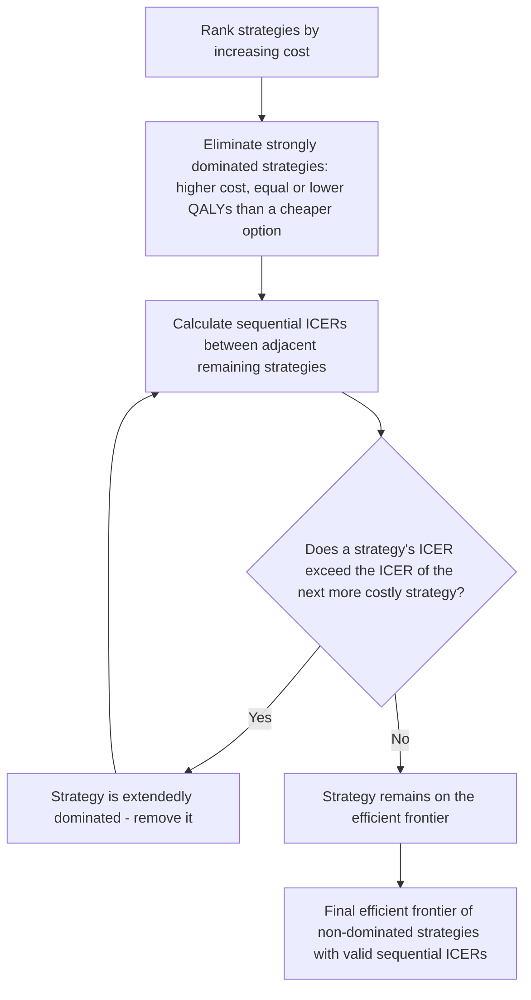

## Cost-Utility Analysis and the Incremental Cost-Effectiveness Ratio

### Overview

Cost-Utility Analysis (CUA) is the specific subtype of economic evaluation that expresses health outcomes in preference-weighted, generic utility units — almost always Quality-Adjusted Life Years (QALYs) — allowing comparison of interventions across entirely different disease areas using a common denominator. The Incremental Cost-Effectiveness Ratio (ICER) is the central decision-relevant statistic CUA produces. While closely related to general cost-effectiveness analysis, CUA's defining feature is its use of a generic (cross-condition-comparable) outcome metric rather than a condition-specific natural unit, making it the dominant analytical form used by most national HTA bodies for formulary and reimbursement decisions.

### Key Points

- CUA is technically a subtype of cost-effectiveness analysis distinguished by its outcome metric (a generic utility-weighted measure, typically the QALY) rather than a condition-specific clinical endpoint.
- The defining advantage of CUA over general CEA is cross-condition comparability: a QALY gained from a cancer treatment and a QALY gained from a cardiovascular treatment are, by construction, treated as equivalent units, enabling resource allocation comparisons across an entire health system's portfolio of possible interventions.
- The ICER formula, decision rule, and cost-effectiveness plane interpretation are structurally identical to general CEA — CUA's distinctiveness lies in what goes into the denominator (QALYs) rather than in a different decision-mathematics.
- Constructing the QALY denominator requires a health-state utility value elicited via a specific method (Standard Gamble, Time Trade-Off, or a standardized multi-attribute instrument like EQ-5D mapped to a population value set), and the choice among these methods can produce different utility values for the same health state.
- Incremental (not average or total) cost and effect differences are essential to correct ICER calculation — comparing an intervention's ICER to its own historical cost/QALY ratio, or to an unrelated intervention's ICER against a different comparator, is a common analytical error.
- When more than two mutually exclusive strategies are compared, correct ICER calculation requires **extended dominance** analysis and sequential (not pairwise-against-a-single-baseline) comparison — a frequently mishandled technical step.

### CUA's Position Within Economic Evaluation Methods

| Feature | General CEA (natural units) | CUA (QALY-based) |
| --- | --- | --- |
| Outcome unit | Condition-specific (e.g., life-years gained, cases averted, mmHg reduction) | Generic, preference-weighted (QALYs) |
| Cross-condition comparability | No — a "cost per case averted" in diabetes cannot be directly compared to "cost per stroke prevented" | Yes — QALYs gained are comparable across entirely different diseases |
| Requires utility elicitation | No | Yes (Standard Gamble, TTO, or standardized instrument like EQ-5D) |
| Typical use case | Single-disease-area clinical trials, program evaluation within one condition | Formulary/reimbursement decisions requiring comparison across a health system's full intervention portfolio |
| HTA body preference | Used situationally | Generally the required or reference-case default method for major national HTA bodies (e.g., NICE, CADTH, PBAC) |

[Note: as previously flagged in general CEA discussion, "cost-effectiveness analysis" is frequently used loosely in practice to include CUA; the technical distinction above reflects textbook/methodological literature convention.]

### The ICER Formula, Restated for CUA

$$ICER = \frac{C_{new} - C_{comparator}}{QALY_{new} - QALY_{comparator}} = \frac{\Delta C}{\Delta QALY}$$

The result is conventionally expressed as "cost per QALY gained" (e.g., "$45,000 per QALY"), which is the figure compared against a jurisdiction's cost-effectiveness threshold to inform (not automatically determine) a coverage/reimbursement decision.

**Why incremental (not average) comparison is required**

A common analytical error is calculating a treatment's **average** cost-effectiveness ratio (total cost divided by total QALYs, without reference to a comparator) rather than the **incremental** ratio against the relevant next-best alternative:

$$\text{Average ratio (incorrect for decision-making)} = \frac{C_{new}}{QALY_{new}}$$

$$\text{Incremental ratio (correct for decision-making)} = \frac{C_{new} - C_{comparator}}{QALY_{new} - QALY_{comparator}}$$

The average ratio ignores the fact that the comparator (standard of care) itself has a cost and produces some baseline QALYs; the decision-relevant question is always "what does the *additional* health gain from switching to the new intervention cost, on top of what we already spend on the current standard of care" — not the absolute cost-per-QALY of the new intervention viewed in isolation. [Inference — this is a standard, well-established point in CUA methodology, not a contested claim.]

### Sequential ICER Calculation with Multiple Comparators (Extended Dominance)

**The problem with pairwise-only comparison**

When more than two mutually exclusive treatment strategies exist for the same condition, correct ICER interpretation requires ranking strategies by increasing cost and effectiveness, then calculating ICERs **sequentially** between adjacent strategies — not simply comparing each new strategy against a single fixed baseline (e.g., "no treatment" or "current standard") in isolation, which can produce misleading conclusions when three or more options exist.

**Step-by-step procedure**

1. Rank all strategies by increasing cost.
2. Eliminate any strategy that is **dominated** — i.e., a more costly strategy that produces equal or fewer QALYs than a less costly alternative (simple/strong dominance).
3. Check for **extended (weak) dominance**: a strategy is extendedly dominated if its ICER (versus the next-less-costly non-dominated strategy) is higher than the ICER of a more costly strategy further up the ranking — meaning a *combination* of two other strategies (conceptually, a mix of patients receiving each) would produce a more favorable cost-effectiveness frontier than including the extendedly dominated strategy on its own.
4. Recalculate sequential ICERs using only the remaining (non-dominated, non-extendedly-dominated) strategies, in ascending cost order, each compared to the next-less-costly remaining strategy.

**Illustrative worked example**

| Strategy | Cost | QALYs | Sequential ICER (vs. next-less-costly remaining strategy) |
| --- | --- | --- | --- |
| A (do nothing) | $5,000 | 4.0 | — (reference) |
| B | $12,000 | 4.3 | ($12,000−$5,000)/(4.3−4.0) = $23,333/QALY |
| C | $18,000 | 4.4 | Check against B: ($18,000−$12,000)/(4.4−4.3) = $60,000/QALY |
| D | $25,000 | 4.7 | Check against B (skipping C): ($25,000−$12,000)/(4.7−4.3) = $32,500/QALY |

In this stylized example, Strategy C's ICER against B ($60,000/QALY) is higher than Strategy D's ICER against B ($32,500/QALY) — meaning C is **extendedly dominated**: a decision-maker would never rationally choose C, because D provides more additional QALYs at a lower incremental cost-per-QALY than C does. C should be removed from the analysis, and D's ICER should be recalculated against B directly (skipping C), as shown. [Inference — this is a constructed illustrative numerical example designed to demonstrate the extended dominance mechanic, not derived from any specific real clinical/cost dataset.]

### Constructing the QALY Denominator: Utility Value Sourcing

Because the ICER's denominator depends entirely on the quality of the underlying utility values, CUA practice places significant emphasis on utility value sourcing methodology:

**Direct elicitation methods**

- **Standard Gamble (SG)**: considered the theoretically purest method (grounded directly in expected utility theory under uncertainty), but cognitively demanding for respondents and less commonly used in routine HTA submissions due to practical elicitation burden
- **Time Trade-Off (TTO)**: more commonly used in practice than SG; asks respondents to trade off life-years for improved health quality, generally easier for respondents to complete reliably

**Indirect (instrument-based) methods**

- **EQ-5D** (3-level or 5-level versions): a standardized descriptive health-state classification system, with responses mapped to a utility value via a country-specific "value set" (derived from population TTO or similar preference-elicitation studies conducted within that country/population) — this country-specific value-set requirement means the same EQ-5D health-state description can map to different utility values depending on which country's value set is applied, a frequently underappreciated methodological detail
- **Other multi-attribute utility instruments** (e.g., SF-6D, HUI3): alternative standardized instruments with different attribute dimensions and scoring algorithms; results are not perfectly interchangeable with EQ-5D-derived values for the same patients, a documented source of cross-study inconsistency

**Mapping/crosswalk algorithms**

When a clinical trial collects a disease-specific (non-utility) quality-of-life instrument rather than a generic preference-based measure, analysts sometimes apply a statistical "mapping" or "crosswalk" algorithm to estimate an equivalent EQ-5D (or similar) utility value from the disease-specific instrument's scores. This is a recognized but methodologically second-best approach compared to directly collecting a preference-based measure within the trial, since mapped values carry additional statistical uncertainty and depend on the quality of the mapping algorithm's derivation dataset. [Inference — this is a standard methodological caveat in the HTA literature regarding mapping studies, not a claim about any specific mapping algorithm's performance.]

### Sensitivity Analysis Specific to CUA

Beyond the general CEA sensitivity analysis practices (deterministic one-way analysis, probabilistic sensitivity analysis, cost-effectiveness acceptability curves), CUA analyses face particular scrutiny on:

1. **Utility value source justification**: reviewers commonly scrutinize whether utility values were drawn from a population directly matching the trial population, from published literature with a different population, or from expert elicitation as a last resort — with a general methodological preference ordering favoring trial-derived, patient-reported, standardized-instrument values over indirect or expert-elicited alternatives.
2. **Utility decrement/increment structural assumptions**: how the model applies utility changes over time (e.g., whether a treatment's benefit is modeled as a one-time utility shift, a gradually accruing benefit, or a hazard-rate-linked survival extension) can materially affect total QALY calculations independent of the underlying utility values themselves.

### Illustrative Example: Full CUA Walkthrough

A new drug for a chronic inflammatory condition is compared to standard-of-care biologic therapy over a lifetime Markov model horizon:

| Component | New Drug | Standard of Care |
| --- | --- | --- |
| Total discounted lifetime cost | $185,000 | $140,000 |
| Total discounted lifetime QALYs | 12.4 | 11.6 |

$$ICER = \frac{185{,}000 - 140{,}000}{12.4 - 11.6} = \frac{45{,}000}{0.8} = \$56{,}250 \text{ per QALY}$$

If the relevant HTA body's cost-effectiveness threshold is $100,000/QALY, this ICER would be considered favorable (below threshold). If the threshold is $50,000/QALY, it would be considered unfavorable, illustrating how the same ICER produces opposite coverage recommendations purely as a function of which threshold is applied — reinforcing that the ICER itself is only half of the decision-relevant information; the threshold context is equally essential. [Inference — illustrative constructed figures, not derived from any specific real drug's submitted HTA dossier.]

### Common Methodological Pitfalls

| Pitfall | Why It's a Problem |
| --- | --- |
| Using average rather than incremental cost/QALY ratios | Ignores comparator's own cost and effect baseline; produces a non-decision-relevant statistic |
| Pairwise comparison against a fixed baseline when 3+ strategies exist | Misses extended dominance; can favor an inefficient strategy over a superior combination-implied alternative |
| Mixing utility values from different elicitation methods/instruments within one model | SG, TTO, and different standardized instruments are not perfectly interchangeable; mixing sources introduces unacknowledged inconsistency |
| Applying a utility value set from a different country/population than the target population | Country-specific value sets can produce materially different utility estimates for the same health-state description |
| Failing to discount both costs and QALYs appropriately over a long time horizon | Understates or overstates the ICER depending on the direction of the omitted discounting |

### Conclusion

Cost-Utility Analysis extends general cost-effectiveness analysis's decision framework by substituting a generic, cross-condition-comparable outcome unit (the QALY) for a condition-specific clinical endpoint, making the ICER it produces broadly comparable across an entire health system's intervention portfolio — the primary reason CUA has become the reference-case default for most major HTA bodies. Correct ICER interpretation requires incremental (not average) comparison against the appropriate next-best comparator, and when more than two strategies are compared, requires the sequential ranking and extended-dominance-elimination procedure rather than simple pairwise comparison against a single fixed baseline. The reliability of any CUA's ICER ultimately depends on the quality and appropriateness of its underlying utility value sourcing — a frequently underscrutinized methodological detail relative to the attention given to cost and clinical efficacy inputs.

**Related Topics**

- QALY construction methods: Standard Gamble, Time Trade-Off, and standardized instrument comparison
- Extended dominance and efficient frontier construction in multi-strategy HTA submissions
- Markov modeling for lifetime horizon cost and QALY projection
- EQ-5D value set variation across countries and its effect on cross-national ICER comparability
- Mapping/crosswalk algorithms from disease-specific instruments to generic utility measures
- Cost-effectiveness acceptability curves and probabilistic sensitivity analysis
- Distributional Cost-Effectiveness Analysis (DCEA) as an equity-adjusted extension of standard CUA
- Budget impact analysis as a complementary decision input alongside the ICER