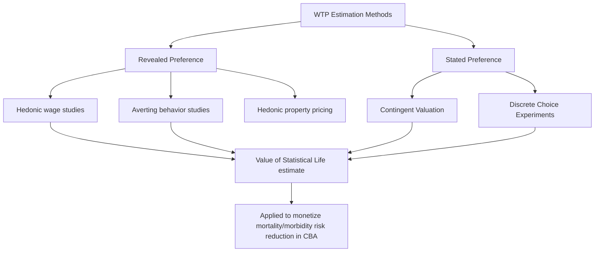

## Cost-Benefit Analysis and Willingness to Pay

### Overview

Cost-Benefit Analysis (CBA) is the economic evaluation method that converts all outcomes — including health outcomes — into a common monetary unit, enabling direct calculation of net social benefit and comparison of health interventions against non-health uses of resources. This distinguishes CBA fundamentally from cost-effectiveness and cost-utility analysis, which express outcomes in natural or utility units (QALYs) that cannot be directly compared to spending in other sectors. The methodological core of CBA in health contexts is deriving a monetary value for health and life itself, most commonly through **Willingness to Pay (WTP)** techniques, a step that is both CBA's key analytical strength (enabling cross-sector comparison) and its most ethically and empirically contested feature.

### Key Points

- CBA's defining feature relative to CEA/CUA is monetization of all outcomes (including health), producing a Net Present Value (NPV) or Benefit-Cost Ratio (BCR) rather than a cost-per-outcome-unit ratio.
- Because outcomes are expressed in a common monetary unit, CBA in principle allows comparison across entirely different policy domains (e.g., comparing a health intervention's net benefit against a transportation safety investment's net benefit) — a capability CEA/CUA do not have.
- Willingness to pay (WTP) is the dominant framework for monetizing health benefits, estimated primarily via **stated preference** methods (contingent valuation, discrete choice experiments) or **revealed preference** methods (hedonic wage studies, averting behavior studies).
- The **Value of a Statistical Life (VSL)** is the key derived parameter used to monetize mortality risk reduction, and is estimated predominantly from labor market studies of wage premiums for risky occupations — a method with well-documented conceptual and empirical limitations.
- CBA in health policy contexts remains less commonly used than CEA/CUA for individual drug/technology reimbursement decisions (most major HTA bodies use QALY-based CUA as their reference case), but CBA principles are more prevalent in broader public health, environmental health, and regulatory impact analysis (e.g., US federal regulatory cost-benefit requirements).
- The monetization step is the central point of ethical and methodological controversy: critics argue that pricing health/life risks either commodifying human life inappropriately or, alternatively, is unavoidable in practice since resource allocation decisions implicitly value life regardless of whether that valuation is made explicit.

### CBA Core Calculation Framework

**Net Present Value (NPV)**

$$NPV = \sum_{t=0}^{T} \frac{B_t - C_t}{(1+r)^t}$$

where $B_t$ is monetized benefits in period $t$, $C_t$ is costs in period $t$, and $r$ is the discount rate. A positive NPV indicates the intervention's monetized benefits exceed its costs; a negative NPV indicates the reverse.

**Benefit-Cost Ratio (BCR)**

$$BCR = \frac{\sum_{t} \frac{B_t}{(1+r)^t}}{\sum_{t} \frac{C_t}{(1+r)^t}}$$

A BCR greater than 1 indicates benefits exceed costs; a BCR below 1 indicates the reverse. BCR is useful for ranking interventions under a constrained budget (highest BCR per dollar spent), though NPV is generally preferred as the primary decision criterion when comparing mutually exclusive alternatives, since BCR can produce misleading rankings when comparing projects of very different scale. [Inference — this preference for NPV over BCR in ranking mutually exclusive projects is a standard point in cost-benefit methodology textbooks, not a contested claim.]

### Distinguishing CBA from CEA/CUA

| Feature | CEA/CUA | CBA |
| --- | --- | --- |
| Outcome unit | Natural units or QALYs | Monetary value |
| Decision statistic | ICER (cost per unit outcome) | NPV or BCR |
| Cross-sector comparability | No — cannot compare a "cost per QALY" to a "cost per commuting-time saved" | Yes — monetized benefits are comparable across any policy domain |
| Requires valuing life/health in currency | No | Yes — this is the central methodological step |
| Typical use in HTA/reimbursement | Dominant method (most major HTA bodies) | Less common for individual technology reimbursement; more common in regulatory impact analysis and broader public health/environmental policy |
| Equity/distributional handling | Standard versions treat outcomes equally regardless of recipient (critiqued, as discussed under CUA) | Similarly treats a dollar of benefit as equivalent regardless of recipient, unless explicitly distributionally weighted |

### Willingness to Pay (WTP) Methodologies

**Revealed preference methods**

These infer WTP from observed real-world behavior/choices, under the assumption that people's actual decisions reveal their implicit valuation of risk or health.

| Method | Mechanism | Key Limitation |
| --- | --- | --- |
| Hedonic wage studies | Estimate the wage premium workers require to accept jobs with higher occupational fatality/injury risk, then infer an implied value per unit of risk reduction | Assumes workers have full information about job risks and freely choose among risk levels — an assumption questioned given labor market frictions, information asymmetry, and limited job choice for some workers |
| Averting behavior/defensive expenditure studies | Estimate WTP for risk reduction from observed spending on risk-reducing goods (e.g., smoke detectors, safety equipment) | Captures only the specific averting behavior studied; may not generalize to broader health/mortality risk contexts |
| Housing/property value (hedonic pricing) studies | Infer WTP for environmental health risk reduction from property price differentials near hazards (e.g., pollution sources) | Confounded by numerous other neighborhood characteristics correlated with the hazard; requires careful econometric control |

**Stated preference methods**

These directly elicit WTP through survey-based hypothetical scenarios.

| Method | Mechanism | Key Limitation |
| --- | --- | --- |
| Contingent Valuation (CV) | Directly asks respondents their maximum WTP for a specified hypothetical good/risk reduction (open-ended, bidding game, or payment card formats) | Subject to hypothetical bias (stated WTP may not match actual willingness to pay real money), strategic response bias, and framing sensitivity |
| Discrete Choice Experiment (DCE) | Presents respondents with repeated choices between hypothetical alternatives varying in attributes (including cost), statistically inferring implicit trade-off rates (including WTP) from choice patterns | Still subject to hypothetical bias, though generally considered to produce more behaviorally robust estimates than single-question CV by revealing trade-offs through repeated relative choices rather than one absolute valuation judgment |

### Value of a Statistical Life (VSL)

**Conceptual definition — a critical clarification**

VSL does **not** represent the value placed on any specific identified individual's life (a common misinterpretation). It represents the aggregate willingness to pay of a *population* for a *small reduction in mortality risk*, scaled to the population size that would statistically correspond to "one life saved."

**Derivation logic**

If a group of 100,000 people are each willing to pay $100 for an intervention that reduces each individual's annual mortality risk by 1-in-100,000 (i.e., the intervention is statistically expected to prevent one death within that population per year), then:

$$VSL = \frac{\text{Aggregate WTP}}{\text{Expected number of statistical lives saved}} = \frac{100{,}000 \times \$100}{1} = \$10{,}000{,}000$$

This is a small-risk-reduction aggregation concept, not a valuation of an identified life — a distinction that is frequently mishandled in public communication of VSL figures and is important to state explicitly whenever VSL is discussed. [Inference — this numerical example is illustrative/pedagogical, constructed to demonstrate the small-risk aggregation logic, not derived from any specific real study's parameters.]

**How VSL is used in health CBA**

Once a VSL estimate is established (typically from labor market hedonic wage studies, since large, real-decision datasets of this type are more readily available than reliable stated-preference mortality-risk data), it can be applied to monetize mortality risk reductions from a health intervention:

$$\text{Monetized Mortality Benefit} = VSL \times \Delta(\text{Expected Statistical Lives Saved})$$

**VSL estimate variation and use in US regulatory practice**

US federal agencies (e.g., EPA, Department of Transportation) maintain and periodically update official VSL estimates used in regulatory impact analyses, and these figures vary somewhat across agencies and over time as underlying labor-market studies are updated. [Unverified — specific current dollar-value VSL figures used by any named federal agency should be verified against that agency's current published guidance, as these figures are periodically revised and vary by agency; do not treat a single VSL figure as a permanently fixed, universally-applicable cross-agency constant.]

### Value of a Statistical Life Year (VSLY)

An alternative, less commonly used derived metric that converts VSL into a per-life-year value, intended to account for the fact that interventions extending life by different amounts (e.g., saving a young person's life versus extending an elderly person's life by a few months) may have different appropriate valuations under a per-life-year framework rather than a flat per-statistical-life framework:

$$VSLY = \frac{VSL}{\text{Expected remaining discounted life expectancy}}$$

VSLY use is more contested than VSL in regulatory practice, partly because it can produce results that assign systematically lower monetized value to interventions primarily benefiting older or disabled populations (a criticism structurally analogous to the disability/severity critique of standard QALY-based CUA discussed in that context) — this has made VSLY controversial enough that some regulatory bodies have explicitly declined to use age-adjusted VSLY in preference to a constant VSL applied regardless of age. [Unverified — specific agency policies on VSLY versus constant VSL use have been debated and revised over time; verify current practice against the specific agency's current published guidance.]

### Illustrative Example: A Health CBA Calculation

A public health intervention (e.g., a workplace safety regulation reducing occupational injury/fatality risk) is evaluated using CBA:

| Component | Value |
| --- | --- |
| Implementation cost (annualized) | $50 million |
| Expected statistical lives saved per year | 8 |
| Applied VSL | $11 million |
| Monetized mortality benefit | 8 × $11M = $88 million |
| Additional monetized morbidity/injury-reduction benefit | $15 million |
| Total monetized benefit | $103 million |

$$NPV = \$103M - \$50M = \$53M \text{ (positive, favorable)}$$

$$BCR = \frac{103}{50} = 2.06$$

This stylized example illustrates the CBA decision output: a positive NPV and BCR above 1 indicate the regulation's monetized benefits exceed its costs, supporting adoption on cost-benefit grounds. [Inference — illustrative constructed figures for pedagogical purposes, not derived from any specific real regulatory impact analysis.]

### Methodological and Ethical Controversies

**1. Monetizing life/health as a category error**

Some ethicists and health economists argue that reducing health and mortality risk to a monetary figure is a category error — treating health as fungible with ordinary consumption goods in a way that misrepresents its distinct moral status. Proponents of CBA respond that resource allocation decisions (in health systems, regulatory policy, and personal behavior) implicitly assign a finite value to risk reduction regardless of whether that valuation is made explicit and analytically consistent; the alternative to explicit monetization is not "infinite value on life" but rather implicit, inconsistent, and unexamined valuation embedded in ad hoc decisions.

**2. Income/wealth bias in WTP-based valuation**

Because WTP is constrained by ability to pay, WTP-based valuations can systematically produce higher monetized values for risks affecting wealthier populations (who can state or reveal higher willingness to pay) than for otherwise-identical risks affecting lower-income populations — a well-documented critique that raises equity concerns if WTP-based CBA is used to allocate health resources or set safety regulations differentially by the income profile of affected populations.

**3. Hypothetical bias in stated-preference methods**

Contingent valuation and (to a lesser extent) discrete choice experiments face persistent methodological concern that hypothetical willingness-to-pay statements may not accurately predict real-money willingness to pay, since survey respondents face no actual budget constraint or enforcement of their stated valuation.

[This subsection summarizes long-standing, genuinely unresolved debates in the CBA and health economics literature; none of these criticisms have a single agreed-upon resolution, and CBA continues to be used in specific policy contexts (particularly US federal regulatory impact analysis) despite these documented controversies.]

### Conclusion

Cost-Benefit Analysis offers a methodologically distinct alternative to CEA/CUA by monetizing all outcomes, including health and mortality risk reduction, enabling cross-sector resource allocation comparisons that QALY-based methods cannot support. Willingness-to-pay methodology, and the Value of a Statistical Life derived from it, form the technical core of health-related monetization, with labor market hedonic wage studies serving as the most commonly used empirical basis for VSL estimation in practice. While CBA remains less prevalent than CUA for individual health technology reimbursement decisions, it plays a significant role in broader public health regulatory impact analysis. The method's core strength — universal monetary comparability — is inseparable from its central controversy: the ethical and empirical challenges inherent in assigning a monetary value to human health and life.

**Related Topics**

- Value of a Statistical Life (VSL) estimation methodology and cross-agency variation
- Discrete Choice Experiments in health preference elicitation
- Contingent valuation methodology and hypothetical bias mitigation techniques
- US federal regulatory impact analysis requirements (OMB Circular A-4 framework)
- Distributional weighting in cost-benefit analysis to address income-based WTP bias
- Comparison of CBA, CEA, and CUA in health technology assessment practice
- Quality-Adjusted Life Years as an alternative to monetized health outcomes
- Behavioral economics critiques of stated-preference valuation methods